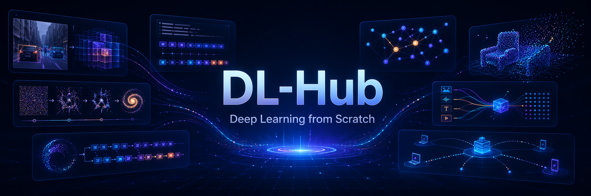

<div align="center">



# DL-Hub

**从零手写，循序渐进 — PyTorch 深度学习统一学习项目**

<br/>

[](https://python.org)
[](https://pytorch.org)
[](https://numpy.org)
[![zread](https://img.shields.io/badge/Ask_Zread-_.svg?style=flat&color=00b0aa&labelColor=000000&logo=data%3Aimage%2Fsvg%2Bxml%3Bbase64%2CPHN2ZyB3aWR0aD0iMTYiIGhlaWdodD0iMTYiIHZpZXdCb3g9IjAgMCAxNiAxNiIgZmlsbD0ibm9uZSIgeG1sbnM9Imh0dHA6Ly93d3cudzMub3JnLzIwMDAvc3ZnIj4KPHBhdGggZD0iTTQuOTYxNTYgMS42MDAxSDIuMjQxNTZDMS44ODgxIDEuNjAwMSAxLjYwMTU2IDEuODg2NjQgMS42MDE1NiAyLjI0MDFWNC45NjAxQzEuNjAxNTYgNS4zMTM1NiAxLjg4ODEgNS42MDAxIDIuMjQxNTYgNS42MDAxSDQuOTYxNTZDNS4zMTUwMiA1LjYwMDEgNS42MDE1NiA1LjMxMzU2IDUuNjAxNTYgNC45NjAxVjIuMjQwMUM1LjYwMTU2IDEuODg2NjQgNS4zMTUwMiAxLjYwMDEgNC45NjE1NiAxLjYwMDFaIiBmaWxsPSIjZmZmIi8%2BCjxwYXRoIGQ9Ik00Ljk2MTU2IDEwLjM5OTlIMi4yNDE1NkMxLjg4ODEgMTAuMzk5OSAxLjYwMTU2IDEwLjY4NjQgMS42MDE1NiAxMS4wMzk5VjEzLjc1OTlDMS42MDE1NiAxNC4xMTM0IDEuODg4MSAxNC4zOTk5IDIuMjQxNTYgMTQuMzk5OUg0Ljk2MTU2QzUuMzE1MDIgMTQuMzk5OSA1LjYwMTU2IDE0LjExMzQgNS42MDE1NiAxMy43NTk5VjExLjAzOTlDNS42MDE1NiAxMC42ODY0IDUuMzE1MDIgMTAuMzk5OSA0Ljk2MTU2IDEwLjM5OTlaIiBmaWxsPSIjZmZmIi8%2BCjxwYXRoIGQ9Ik0xMy43NTg0IDEuNjAwMUgxMS4wMzg0QzEwLjY4NSAxLjYwMDEgMTAuMzk4NCAxLjg4NjY0IDEwLjM5ODQgMi4yNDAxVjQuOTYwMUMxMC4zOTg0IDUuMzEzNTYgMTAuNjg1IDUuNjAwMSAxMS4wMzg0IDUuNjAwMUgxMy43NTg0QzE0LjExMTkgNS42MDAxIDE0LjM5ODQgNS4zMTM1NiAxNC4zOTg0IDQuOTYwMVYyLjI0MDFDMTQuMzk4NCAxLjg4NjY0IDE0LjExMTkgMS42MDAxIDEzLjc1ODQgMS42MDAxWiIgZmlsbD0iI2ZmZiIvPgo8cGF0aCBkPSJNNCAxMkwxMiA0TDQgMTJaIiBmaWxsPSIjZmZmIi8%2BCjxwYXRoIGQ9Ik00IDEyTDEyIDQiIHN0cm9rZT0iI2ZmZiIgc3Ryb2tlLXdpZHRoPSIxLjUiIHN0cm9rZS1saW5lY2FwPSJyb3VuZCIvPgo8L3N2Zz4K&logoColor=ffffff)](https://zread.ai/skygazer42/DL-Hub)
[](LICENSE)

<br/>

<code>339 Lessons</code> · <code>8 Learning Tracks</code> · <code>31 ML Algorithms</code> · <code>8000+ Model Zoo Architectures</code> · <code>393 Test Files</code>

<br/>

统一代码风格、统一训练脚手架、统一运行方式<br/>
让学习者真正能 **"循序渐进跑通 → 改得动 → 能验收"**

[Quick Start](#-quick-start) · [Learning Tracks](#-learning-tracks) · [Model Zoo](#-model-zoo) · [Federated Zoo](#-federated-learning-zoo) · [ML Algorithms](#-numpy-ml-algorithms) · [Docs](#-documentation)

</div>

#### Topic Coverage / 主题覆盖闭环
> The user-provided topic pool is represented by a checked code registry instead of README-only claims. `dlhub/topic_coverage.py` maps every requested topic to concrete artifacts, while `dlhub/research_streams.py`, `dlhub/framework_adapters.py`, and `dlhub/method_kits.py` cover research streams, optional frameworks, and cross-cutting methods.

```bash
python -m pytest tests/test_topic_coverage.py
```

| 闭环层 | 代码入口 |
|------|--------|
| Topic manifest / 主题清单 | `dlhub/topic_coverage.py` |
| Paper/resource/survey streams / 论文资源综述流 | `dlhub/research_streams.py` |
| Framework probes / 框架探测 | `dlhub/framework_adapters.py` |
| NAS/AutoML/pruning/distillation/SLAM kits | `dlhub/method_kits.py` |
| Regression test / 回归测试 | `tests/test_topic_coverage.py` |

## What You'll Build

<table>
<tr>
<td align="center" width="25%">
<br/>
<b>Vision</b><br/>
<sub>从 LeNet 到 ViT，<br/>791 架构 · 图像分类 / 检测 / 分割</sub>
</td>
<td align="center" width="25%">
<br/>
<b>NLP</b><br/>
<sub>从词嵌入到 Transformer，<br/>814 架构 · 分类 / NER / 阅读理解</sub>
</td>
<td align="center" width="25%">
<br/>
<b>GNN</b><br/>
<sub>从 GCN 到 PinSAGE，<br/>图分类 / 节点嵌入 / 推荐</sub>
</td>
<td align="center" width="25%">
<br/>
<b>Point Cloud</b><br/>
<sub>从 PointNet 到 PCT，<br/>64 架构 · 分类 / 部件分割 / 重建 / 15 种自监督</sub>
</td>
</tr>
<tr>
<td align="center" width="25%">
<br/>
<b>Generative</b><br/>
<sub>VAE / GAN / Diffusion / Flow Matching，<br/>重建 / 对抗生成 / 一步一致性 / 向量场传输</sub>
</td>
<td align="center" width="25%">
<br/>
<b>Multimodal</b><br/>
<sub>从 CLIP 到 Audio-Visual Learning，<br/>视觉问答 / 检索 / 音频文本理解 / 跨模态融合</sub>
</td>
<td align="center" width="25%">
<br/>
<b>LLM</b><br/>
<sub>Causal LM / Instruction Tuning / Prefix Tuning / Mamba，<br/>50+ 论文笔记</sub>
</td>
<td align="center" width="25%">
<br/>
<b>Federated</b><br/>
<sub>76 联邦策略<br/>差分隐私 / 安全聚合 / 个性化</sub>
</td>
</tr>
</table>

<p align="center">
  
</p>
<p align="center"><sub>① Vision — CNN / ViT 图像分类 · ② NLP — 文本分类 / NER · ③ GNN — 图神经网络 · ④ Point Cloud — 3D 点云 · ⑤ Generative — VAE / GAN · ⑥ Multimodal — VLM 视觉语言 · ⑦ LLM — 大语言模型 · ⑧ Federated — 联邦学习</sub></p>

---

## Contents

- [What You'll Build](#what-youll-build)
- [Quick Start](#-quick-start)
- [Prerequisites](#-prerequisites)
- [Learning Path](#-learning-path)
- [Learning Tracks](#-learning-tracks)
  - [Foundations](#-foundations--基础) · [Vision](#-vision--视觉) · [NLP](#-nlp--自然语言处理) · [GNN](#-gnn--图神经网络) · [Point Cloud](#-point-cloud--点云) · [Generative](#-generative--生成模型) · [LLM](#-llm--大语言模型) · [Multimodal](#-multimodal--多模态)
- [Model Zoo](#-model-zoo)
  - [Vision Zoo (736 architectures)](#vision-zoo--736-architectures) · [NLP Zoo (813 architectures)](#nlp-zoo--813-architectures) · [Point Cloud Zoo (64 architectures)](#point-cloud-zoo--64-architectures) · [VLM Zoo (70 families)](#vlm-zoo--70-families) · [Generative Zoo (GAN + Diffusion)](#generative-zoo--gan--diffusion)
- [Federated Learning Zoo](#-federated-learning-zoo)
- [NumPy ML Algorithms](#-numpy-ml-algorithms)
- [Optimization Toolkit](#-optimization-toolkit)
- [Documentation](#-documentation)
- [Design Philosophy](#-design-philosophy)
- [Contributing](#-contributing)
- [Citation](#-citation)

---

## Quick Start

> [!TIP]
> 所有 lesson 均支持 `--dataset fake` 离线冒烟 — **无需下载任何数据集，2 分钟即可跑通**。

```bash
# 克隆仓库
git clone https://github.com/skygazer42/DL-Hub.git
cd DL-Hub
pip install -r requirements.txt

# 仓库级冒烟测试（验证环境）
python scripts/smoke_check.py

# 跑通第一个 lesson
python -m tracks.vision.lesson_01_mnist_lenet.train \
  --dataset fake --epochs 1 \
  --max-train-batches 2 --max-eval-batches 2
```

**列出所有可运行的 lesson**：

```bash
python scripts/run_lesson.py --list
```

<details>
<summary><b>统一 CLI 参数（所有 lesson 通用）</b></summary>

| 参数 | 说明 | 示例 |
|------|------|------|
| `--dataset` | 数据模式 | `fake` (离线冒烟) / `toy` / `real` |
| `--epochs` | 训练轮数 | `10` |
| `--batch-size` | 批大小 | `32` |
| `--learning-rate` | 学习率 | `0.001` |
| `--seed` | 随机种子 | `42` |
| `--device` | 计算设备 | `cpu` / `cuda` / `mps` / `auto` |
| `--max-train-batches` | 限制训练 batch 数 | `2` |
| `--max-eval-batches` | 限制评估 batch 数 | `2` |

</details>

---

## Prerequisites

> [!NOTE]
> 本项目适合有一定 Python 基础的学习者。以下是各 track 的先修建议。

| Track | 先修知识 |
|-------|---------|
| Foundations | Python 基础、线性代数入门 |
| Vision | Foundations track + 卷积直觉 |
| NLP | Foundations track + 文本处理基础 |
| GNN | Foundations track + 图论基本概念 |
| Point Cloud | Vision track + 3D 几何直觉 |
| Generative | Vision track + 概率论基础 |
| LLM | NLP track + Transformer 机制 |
| Multimodal | Vision track + NLP track + 注意力机制 |

---

## Learning Path

不知道从哪开始？根据你的时间选择一条学习路线：

<p align="center">
  
</p>
<p align="center"><sub>Step 1–8 对应：Foundations → Vision → NLP → GNN → Point Cloud → Generative → LLM → Multimodal</sub></p>

<table>
<tr>
<th width="20%">路线</th>
<th width="15%">时间</th>
<th width="15%">Lessons</th>
<th width="50%">内容</th>
</tr>
<tr>
<td><b>Weekend Sprint</b></td>
<td>1-2 天</td>
<td>6 lessons</td>
<td>Foundations (2) → Vision lesson 01-02 → Generative lesson 01 → LLM lesson 01<br/><sub>快速建立从张量到生成模型的完整直觉</sub></td>
</tr>
<tr>
<td><b>Two-Week Deep Dive</b></td>
<td>2 周</td>
<td>18 lessons</td>
<td>Foundations (2) → Vision (5) → NLP (4) → GNN (3) → Generative (2) → LLM (1) → Point Cloud (1)<br/><sub>覆盖所有 track 的核心 lesson</sub></td>
</tr>
<tr>
<td><b>Full Curriculum</b></td>
<td>6-8 周</td>
<td>319 lessons</td>
<td>按顺序完成全部 8 个 track 的所有 lesson<br/><sub>系统掌握从经典 ML 到前沿深度学习的完整技能树</sub></td>
</tr>
</table>

> [!TIP]
> 推荐顺序：**Foundations → Vision → NLP → GNN → Point Cloud → Generative → LLM → Multimodal**。每个 lesson 都有独立的 README 说明目标、先修和验收标准。

---

## 课程及代码合集

<table>
<tr>
<td align="center" width="12%"><b>Foundations</b><br/><sub>2 lessons</sub></td>
<td align="center" width="12%"><b>Vision</b><br/><sub>47 lessons</sub></td>
<td align="center" width="12%"><b>NLP</b><br/><sub>27 lessons</sub></td>
<td align="center" width="12%"><b>GNN</b><br/><sub>11 lessons</sub></td>
<td align="center" width="12%"><b>Point Cloud</b><br/><sub>23 lessons</sub></td>
<td align="center" width="12%"><b>Generative</b><br/><sub>22 lessons</sub></td>
<td align="center" width="12%"><b>LLM</b><br/><sub>21 lessons</sub></td>
<td align="center" width="12%"><b>Multimodal</b><br/><sub>36 lessons</sub></td>
</tr>
</table>

---

### ⚡ 1. Foundations / 基础

> 张量、自动求导、训练循环入门 — 所有后续 track 的基石。

| 序号 | 项目 | 代码文档 | 核心概念 |
|------|------|----------|----------|
| 1 | 张量操作 & Autograd 机制 | [lesson_01_tensors](tracks/foundations/lesson_01_tensors/) | `torch.Tensor`, `backward()`, 计算图 |
| 2 | 从零实现线性回归 | [lesson_02_linear_regression](tracks/foundations/lesson_02_linear_regression_autograd/) | 梯度下降, 损失函数, 参数更新 |

---

### 👁️ 2. Vision / 视觉

> 从 MNIST 入门到检测、分割、风格迁移、超分辨率、人群计数、深度估计、车道理解与路面场景建模，并延伸到去雨、图像检索/匹配/拼接、细粒度识别与视觉小样本学习。

| 序号 | 项目 | 代码文档 | 核心概念 |
|------|------|----------|----------|
| 1 | LeNet-5 图像分类 | [mnist_lenet](tracks/vision/lesson_01_mnist_lenet/) | 卷积层, 池化, 全连接 |
| 2 | MLP 图像分类 | [mnist_mlp](tracks/vision/lesson_02_mnist_mlp/) | 多层感知机, Flatten |
| 3 | AlexNet 图像分类 | [mnist_alexnet](tracks/vision/lesson_03_mnist_alexnet/) | 深层卷积网络, Dropout |
| 4 | FCOS 目标检测 | [synthetic_detection_fcos](tracks/vision/lesson_04_synthetic_detection_fcos/) | Anchor-free, FPN, 回归头 |
| 5 | ViT 图像分类 | [vit_toy_classification](tracks/vision/lesson_05_vit_toy_classification/) | Patch Embedding, Self-Attention |
| 6 | Swin Transformer 图像分类 | [swin_toy_classification](tracks/vision/lesson_06_swin_toy_classification/) | Window Attention, Shifted Window |
| 7 | 关键点回归 | [toy_keypoint_regression](tracks/vision/lesson_07_toy_keypoint_regression/) | 坐标回归, Heatmap |
| 8 | UNet 语义分割 | [synthetic_segmentation_unet](tracks/vision/lesson_08_synthetic_segmentation_unet/) | Encoder-Decoder, Skip Connection |
| 9 | 多 Backbone 对比 | [cnn_backbones_toy_classification](tracks/vision/lesson_09_cnn_backbones_toy_classification/) | 统一接口, 特征提取 |
| 10 | 图像去噪（多模型） | [synthetic_denoising](tracks/vision/lesson_10_synthetic_denoising/) | 合成噪声建模, 去噪回归 |
| 11 | YOLACT 实例分割 | [synthetic_instance_segmentation_yolact](tracks/vision/lesson_11_synthetic_instance_segmentation_yolact/) | Prototype + Coefficients |
| 12 | YOLO 风格目标检测 | [synthetic_detection_yolo](tracks/vision/lesson_12_synthetic_detection_yolo/) | Grid/Objectness + BBox |
| 13 | 行人检测（FCOS） | [synthetic_pedestrian_detection_fcos](tracks/vision/lesson_13_synthetic_pedestrian_detection_fcos/) | Anchor-free 检测头 |
| 14 | 视频多目标跟踪（MOT） | [video_mot_basics](tracks/vision/lesson_14_video_mot_basics/) | 多目标轨迹预测, Presence + IoU |
| 15 | Gatys 风格迁移 | [neural_style_transfer_gatys](tracks/vision/lesson_15_neural_style_transfer_gatys/) | 优化式风格损失, 内容/风格分离 |
| 16 | CycleGAN 风格翻译 | [style_transfer_translation_cyclegan](tracks/vision/lesson_16_style_transfer_translation_cyclegan/) | 无配对图像翻译, 循环一致性 |
| 17 | 合成超分辨率 | [synthetic_super_resolution](tracks/vision/lesson_17_synthetic_super_resolution/) | 配对重建, PSNR, 局部细节恢复 |
| 18 | 合成人群计数 | [synthetic_crowd_counting](tracks/vision/lesson_18_synthetic_crowd_counting/) | 密度图回归, 总人数估计 |
| 19 | 合成单目深度估计 | [synthetic_monocular_depth_estimation](tracks/vision/lesson_19_synthetic_monocular_depth_estimation/) | 稠密深度回归, 层次遮挡 |
| 20 | 合成车道线检测 | [synthetic_lane_detection](tracks/vision/lesson_20_synthetic_lane_detection/) | Heatmap 回归, 车道点序列 |
| 21 | 合成车道拓扑估计 | [synthetic_lane_topology_estimation](tracks/vision/lesson_21_synthetic_lane_topology_estimation/) | 车道图连接关系, 邻接矩阵预测 |
| 22 | 合成道路场景理解 | [synthetic_road_scene_understanding](tracks/vision/lesson_22_synthetic_road_scene_understanding/) | 车道槽位, 目标查询, 场景类别融合 |
| 23 | 合成图像去雾 | [synthetic_image_dehazing](tracks/vision/lesson_23_synthetic_image_dehazing/) | 大气散射, Transmission 估计, 配对恢复 |
| 24 | 合成反光去除 | [synthetic_reflection_removal](tracks/vision/lesson_24_synthetic_reflection_removal/) | 反光层混合建模, 透射恢复, 配对重建 |
| 25 | 合成图像融合 | [synthetic_image_fusion](tracks/vision/lesson_25_synthetic_image_fusion/) | 多源图像融合, 权重图预测, 细节保持 |
| 26 | 合成文本检测 | [synthetic_text_detection](tracks/vision/lesson_26_synthetic_text_detection/) | 文本区域热图, 框回归, 可变长度单词合成 |
| 27 | 合成边缘检测 | [synthetic_edge_detection](tracks/vision/lesson_27_synthetic_edge_detection/) | 边缘图监督, 梯度特征融合, 稀疏结构预测 |
| 28 | 合成显著性目标检测 | [synthetic_salient_object_detection](tracks/vision/lesson_28_synthetic_salient_object_detection/) | 显著区域分割, 前景突出建模, clutter 场景抑制 |
| 29 | 合成伪装物体检测 | [synthetic_camouflaged_object_detection](tracks/vision/lesson_29_synthetic_camouflaged_object_detection/) | 低对比隐藏目标恢复, 纹理混淆建模, 细粒度边界分离 |
| 30 | 合成显著性目标框检测 | [synthetic_salient_object_detection_boxes](tracks/vision/lesson_30_synthetic_salient_object_detection_boxes/) | 显著目标框回归, 中心/尺度归一化, IoU 驱动定位 |
| 31 | 合成交互式分割 | [synthetic_interactive_segmentation](tracks/vision/lesson_31_synthetic_interactive_segmentation/) | 点击提示编码, 交互式掩码细化, 用户引导分割 |
| 32 | 合成人脸关键点检测 | [synthetic_face_landmark_detection](tracks/vision/lesson_32_synthetic_face_landmark_detection/) | 五点关键点回归, 合成人脸渲染, 像素 L2 误差 |
| 33 | 合成人脸活体检测 | [synthetic_face_liveness_detection](tracks/vision/lesson_33_synthetic_face_liveness_detection/) | 活体/欺骗二分类, 纹理伪迹建模, 展示攻击模拟 |
| 34 | 合成车牌识别 | [synthetic_license_plate_recognition](tracks/vision/lesson_34_synthetic_license_plate_recognition/) | 固定长度序列识别, 视觉槽位读码, 精确串匹配 |
| 35 | 合成 6D 姿态估计 | [synthetic_6d_pose_estimation](tracks/vision/lesson_35_synthetic_6d_pose_estimation/) | 6D 旋转表示, 平移回归, 合成物体视角建模 |
| 36 | 合成文本识别 | [synthetic_text_recognition](tracks/vision/lesson_36_synthetic_text_recognition/) | OCR 序列识别, 合成字形渲染, 固定长度字符读码 |
| 37 | 合成人脸解析 | [synthetic_face_parsing](tracks/vision/lesson_37_synthetic_face_parsing/) | 粗粒度人脸区域分割, 多类 mask 预测, mIoU 验证 |
| 38 | 合成人脸检测 | [synthetic_face_detection](tracks/vision/lesson_38_synthetic_face_detection/) | 单脸框回归, 目标存在监督, IoU 度量 |
| 39 | 合成人脸对齐 | [synthetic_face_alignment](tracks/vision/lesson_39_synthetic_face_alignment/) | canonical 五点布局回归, 姿态扰动归一化, 像素 L2 误差 |
| 40 | 合成人脸属性识别 | [synthetic_face_attribute_recognition](tracks/vision/lesson_40_synthetic_face_attribute_recognition/) | 笑容/眼镜/胡须多标签识别, 合成人脸属性渲染, exact-match 准确率 |
| 41 | 合成人脸遮挡估计 | [synthetic_face_occlusion_estimation](tracks/vision/lesson_41_synthetic_face_occlusion_estimation/) | 遮挡比例回归, 合成遮挡覆盖建模, MAE 评估 |
| 42 | 合成人脸表情识别 | [synthetic_face_expression_recognition](tracks/vision/lesson_42_synthetic_face_expression_recognition/) | 四类表情分类, 合成人脸肌肉形变, softmax 准确率 |
| 43 | 合成 Deepfake 检测 | [synthetic_deepfake_detection](tracks/vision/lesson_43_synthetic_deepfake_detection/) | 真假脸二分类, 融合缝合与过平滑伪迹, 深度伪造检测 |
| 44 | 合成人脸验证 | [synthetic_face_verification](tracks/vision/lesson_44_synthetic_face_verification/) | 双脸同一人判别, 成对特征差异建模, verification accuracy |
| 45 | 合成人脸识别 | [synthetic_face_identification](tracks/vision/lesson_45_synthetic_face_identification/) | 五类身份分类, 合成人脸身份模板, softmax 准确率 |
| 46 | 合成人脸检索 | [synthetic_face_retrieval](tracks/vision/lesson_46_synthetic_face_retrieval/) | triplet 风格嵌入学习, 最近邻检索, top-1 retrieval |
| 47 | 合成人脸姿态估计 | [synthetic_face_pose_estimation](tracks/vision/lesson_47_synthetic_face_pose_estimation/) | yaw/pitch/roll 回归, 归一化头姿向量, MAE 评估 |
| 48 | 合成视线估计 | [synthetic_gaze_estimation](tracks/vision/lesson_48_synthetic_gaze_estimation/) | 归一化 gaze x/y 回归, 瞳孔位移建模, L1 评估 |
| 49 | 合成人体姿态估计 | [synthetic_human_pose_estimation](tracks/vision/lesson_49_synthetic_human_pose_estimation/) | 关键点坐标回归, 棒人骨架渲染, pose L1 评估 |
| 50 | 合成手部姿态估计 | [synthetic_hand_pose_estimation](tracks/vision/lesson_50_synthetic_hand_pose_estimation/) | 十点手部关键点回归, 手部骨架渲染, pose L2 评估 |
| 51 | 合成手势识别 | [synthetic_gesture_recognition](tracks/vision/lesson_51_synthetic_gesture_recognition/) | 棒人手势分类, 四类姿态模式, softmax 准确率 |
| 52 | 合成手指计数估计 | [synthetic_finger_count_estimation](tracks/vision/lesson_52_synthetic_finger_count_estimation/) | 0-5 手指计数分类, 合成掌心与手指渲染, softmax 准确率 |
| 53 | 合成左右手分类 | [synthetic_handedness_classification](tracks/vision/lesson_53_synthetic_handedness_classification/) | 左右手二分类, 拇指侧显式建模, softmax 准确率 |
| 54 | 合成掌心朝向估计 | [synthetic_palm_orientation_estimation](tracks/vision/lesson_54_synthetic_palm_orientation_estimation/) | 掌心朝向标量回归, 旋转掌形渲染, MAE 评估 |
| 55 | 合成手势数字分类 | [synthetic_sign_digit_classification](tracks/vision/lesson_55_synthetic_sign_digit_classification/) | 0-9 手势数字分类, 合成手部标记渲染, softmax 准确率 |
| 56 | 合成手指张开度估计 | [synthetic_finger_spread_estimation](tracks/vision/lesson_56_synthetic_finger_spread_estimation/) | 手指张开度标量回归, 合成手部轮廓渲染, MAE 评估 |
| 57 | 合成拇指位置分类 | [synthetic_thumb_position_classification](tracks/vision/lesson_57_synthetic_thumb_position_classification/) | 拇指位置分类, 合成手部姿态模式, softmax 准确率 |
| 58 | 合成手指弯曲度估计 | [synthetic_finger_curvature_estimation](tracks/vision/lesson_58_synthetic_finger_curvature_estimation/) | 手指弯曲度标量回归, 合成指尖弯折渲染, MAE 评估 |
| 59 | 合成拇指接触分类 | [synthetic_thumb_contact_classification](tracks/vision/lesson_59_synthetic_thumb_contact_classification/) | 拇指是否接触掌心二分类, 合成接触桥建模, softmax 准确率 |
| 60 | 合成图像去雨 | [synthetic_image_deraining](tracks/vision/lesson_60_synthetic_image_deraining/) | 雨条纹退化建模, 配对清晰恢复, 图像回归 |
| 61 | 合成图像检索 | [synthetic_image_retrieval](tracks/vision/lesson_61_synthetic_image_retrieval/) | 嵌入学习, 最近邻检索, top-1 retrieval |
| 62 | 合成图像匹配 | [synthetic_image_matching](tracks/vision/lesson_62_synthetic_image_matching/) | 成对匹配判别, 共享编码器, 二分类 |
| 63 | 合成图像拼接 | [synthetic_image_stitching](tracks/vision/lesson_63_synthetic_image_stitching/) | 重叠视图融合, 全景重建, 图像回归 |
| 64 | 合成细粒度识别 | [synthetic_fine_grained_recognition](tracks/vision/lesson_64_synthetic_fine_grained_recognition/) | 细微纹理差异建模, 相似类区分, softmax 准确率 |
| 65 | 合成小样本识别 | [synthetic_few_shot_recognition](tracks/vision/lesson_65_synthetic_few_shot_recognition/) | episodic 训练, prototype 分类, support/query 推理 |
| 66 | 合成视频目标检测 | [synthetic_video_object_detection](tracks/vision/lesson_66_synthetic_video_object_detection/) | 时序目标框回归, 目标存在监督, 多头检测损失 |
| 67 | 合成视频稳像 | [synthetic_video_stabilization](tracks/vision/lesson_67_synthetic_video_stabilization/) | 抖动序列到稳像序列恢复, 时序回归, 重建损失 |
| 68 | 合成视频插帧 | [synthetic_video_frame_interpolation](tracks/vision/lesson_68_synthetic_video_frame_interpolation/) | 中间帧重建, 时序连续性建模, L1/L2 回归 |
| 69 | 合成视频修复 | [synthetic_video_restoration](tracks/vision/lesson_69_synthetic_video_restoration/) | 退化序列恢复, 去噪去模糊建模, 配对重建 |
| 70 | 合成视频理解 | [synthetic_video_understanding](tracks/vision/lesson_70_synthetic_video_understanding/) | 时序事件模式分类, 3D 编码, softmax 准确率 |
| 71 | 合成视频摘要 | [synthetic_video_summarization](tracks/vision/lesson_71_synthetic_video_summarization/) | 帧级重要性估计, 时序评分, 关键帧学习 |
| 72 | 合成视频增强 | [synthetic_video_enhancement](tracks/vision/lesson_72_synthetic_video_enhancement/) | 低质序列增强, 时序重建, PSNR 指标 |
| 73 | 合成视频目标分割 | [synthetic_video_object_segmentation](tracks/vision/lesson_73_synthetic_video_object_segmentation/) | 时序前景 mask 预测, 二值分割监督, IoU 评估 |
| 74 | 合成视频实例分割 | [synthetic_video_instance_segmentation](tracks/vision/lesson_74_synthetic_video_instance_segmentation/) | 多实例时序 mask 预测, slot 分离, BCE 优化 |
| 75 | 合成视频抠像 | [synthetic_video_matting](tracks/vision/lesson_75_synthetic_video_matting/) | 时序 alpha matte 估计, 前景边界细化, 回归损失 |
| 76 | 合成图像去天气 | [synthetic_image_deweathering](tracks/vision/lesson_76_synthetic_image_deweathering/) | 混合天气残差恢复, 清晰图/天气层联合监督, 配对重建 |
| 77 | 合成透明体深度估计 | [synthetic_transparent_depth_estimation](tracks/vision/lesson_77_synthetic_transparent_depth_estimation/) | 透明区域深度 + transparency mask 联合预测, 稠密回归 |
| 78 | 合成图像重照明 | [synthetic_image_relighting](tracks/vision/lesson_78_synthetic_image_relighting/) | 光照条件编码, target illumination 重建, 配对 relighting |
| 79 | 合成透明物体分割 | [synthetic_transparent_object_segmentation](tracks/vision/lesson_79_synthetic_transparent_object_segmentation/) | 透明区域 mask 预测, 边界辅助监督, 折射背景建模 |
| 80 | 合成事件相机理解 | [synthetic_event_camera_understanding](tracks/vision/lesson_80_synthetic_event_camera_understanding/) | 事件体素编码, polarity/motion 联合建模, 稠密理解监督 |
| 81 | 合成阴影检测 | [synthetic_shadow_detection](tracks/vision/lesson_81_synthetic_shadow_detection/) | 阴影 mask 预测, illumination-aware 恢复, shadow boundary 建模 |
| 82 | 合成布局生成 | [synthetic_layout_generation](tracks/vision/lesson_82_synthetic_layout_generation/) | 对象集合到布局框生成, relation-aware 编码, 布局回归 |
| 83 | 合成全景分割 | [synthetic_panoptic_segmentation](tracks/vision/lesson_83_synthetic_panoptic_segmentation/) | semantic + instance 联合预测, thing/stuff 一体建模, panoptic supervision |
| 84 | 合成医学图像分割 | [synthetic_medical_segmentation](tracks/vision/lesson_84_synthetic_medical_segmentation/) | 病灶区域 mask 预测, 多尺度编码解码, 医学样式切片监督 |
| 85 | 合成场景文本检测识别一体化 | [synthetic_scene_text_spotting](tracks/vision/lesson_85_synthetic_scene_text_spotting/) | 文本热图定位, 字符序列解码, spotting 联合训练 |
| 86 | 合成协同分割 | [synthetic_co_segmentation](tracks/vision/lesson_86_synthetic_co_segmentation/) | 图组共享前景恢复, group prototype 聚合, mask 监督 |
| 87 | 合成行为识别 | [synthetic_action_recognition](tracks/vision/lesson_87_synthetic_action_recognition/) | 短视频动作分类, 时序卷积聚合, clip 级监督 |
| 88 | 合成 Re-ID | [synthetic_reid](tracks/vision/lesson_88_synthetic_reid/) | 身份嵌入学习, gallery top-1 检索, CE + triplet 联合监督 |
| 89 | 合成异常检测 | [synthetic_anomaly_detection](tracks/vision/lesson_89_synthetic_anomaly_detection/) | 异常得分预测, 正常/异常外观偏差建模, anomaly supervision |

<details>
<summary><b>支持的 Vision Backbones（208 算法族 / 791 架构 ID）</b></summary>

| 类别 | 代表架构 |
|------|---------|
| 经典 CNN | AlexNet, VGG, GoogLeNet, ResNet, DenseNet, SqueezeNet |
| 高效网络 | MobileNet v1-v4, EfficientNet, GhostNet v1/v2, ShuffleNet, MNASNet, FBNet, MicroNet |
| 注意力 CNN | SENet, CBAM, BAM, ECA-Net, SK-Net, CoordAtt, SimAM, Triplet Attention |
| 现代 CNN | ConvNeXt v1/v2, RepVGG, RepLKNet, InceptionNeXt, HorNet, FocalNet, SLaK |
| Vision Transformer | ViT, DeiT, DeiT3, BEiT, EVA, CaiT, CrossViT, Swin v2, CSwin, MAE-ViT |
| 高效 Transformer | EfficientViT, TinyViT, EdgeViT, LightViT, FastViT, FasterViT, SwiftFormer |
| MLP 系列 | MLP-Mixer, gMLP, ResMLP, FNet, CycleMLP, AS-MLP, WaveMLP, MorphMLP |
| Hybrid | CoAtNet, MobileFormer, ConvFormer, Uniformer, CMT, MaxViT, MobileViT v1-v3 |
| 特殊结构 | CapsNet, ScatterNet, FractalNet, HighwayNet, HRNet, NAS 系列 |

> 完整列表见 `python -m dlhub.vision.backbones.catalog --list`，所有 backbone 均为纯 PyTorch 本地实现。

</details>

---

### 📝 3. NLP / 自然语言处理

> 从 toy 文本分类到 Transformer、NER、阅读理解、文本匹配、摘要生成、prompt tuning、few-shot、自监督语言建模，再延伸到 task-oriented dialog 建模。

| 序号 | 项目 | 代码文档 | 核心概念 |
|------|------|----------|----------|
| 1 | Embedding + FC 文本分类 | [toy_text_classification](tracks/nlp/lesson_01_toy_text_classification/) | 词嵌入, 词袋 |
| 2 | Transformer Encoder 文本分类 | [toy_text_classification_transformer](tracks/nlp/lesson_02_toy_text_classification_transformer/) | Self-Attention, 位置编码 |
| 3 | BiLSTM 命名实体识别 | [toy_ner_bilstm](tracks/nlp/lesson_03_toy_ner_bilstm/) | 序列标注, BIO 标签 |
| 4 | Seq2Seq + Attention 序列生成 | [toy_seq2seq_attention_generation](tracks/nlp/lesson_04_toy_seq2seq_attention_generation/) | Encoder-Decoder, Bahdanau Attention |
| 5 | TextCNN 文本分类 | [toy_text_classification_textcnn](tracks/nlp/lesson_05_toy_text_classification_textcnn/) | 多尺度卷积核, 文本特征 |
| 6 | BiLSTM 文本分类 | [toy_text_classification_bilstm](tracks/nlp/lesson_06_toy_text_classification_bilstm/) | 双向 LSTM, 隐藏状态 |
| 7 | Span Prediction 阅读理解 | [reading_comprehension](tracks/nlp/lesson_07_reading_comprehension/) | SQuAD 风格, Start/End Logits |
| 8 | 双塔文本匹配 | [toy_text_matching_biencoder](tracks/nlp/lesson_08_toy_text_matching_biencoder/) | 双塔编码器, 相似度检索 |
| 9 | Transformer 摘要生成 | [toy_transformer_summarization](tracks/nlp/lesson_09_toy_transformer_summarization/) | Encoder-Decoder, Teacher Forcing |
| 10 | Prompt Tuning 文本分类 | [toy_prompt_tuning_classifier](tracks/nlp/lesson_10_toy_prompt_tuning_classifier/) | Soft Prompt, Frozen Encoder |
| 11 | Few-Shot 文本分类 | [toy_few_shot_text_classification](tracks/nlp/lesson_11_toy_few_shot_text_classification/) | Episodic Sampling, Prototype 分类 |
| 12 | In-Context 文本分类 | [toy_in_context_text_classification](tracks/nlp/lesson_12_toy_in_context_text_classification/) | Support Set Prompting, 无梯度适配 |
| 13 | Masked Language Modeling | [toy_masked_language_modeling](tracks/nlp/lesson_13_toy_masked_language_modeling/) | Masked Token 预测, 自监督预训练 |
| 14 | Contrastive Sentence Embedding | [toy_contrastive_sentence_embedding](tracks/nlp/lesson_14_toy_contrastive_sentence_embedding/) | 双视图增强, NT-Xent 对比学习 |
| 15 | Cross-Encoder Reranking | [toy_cross_encoder_reranking](tracks/nlp/lesson_15_toy_cross_encoder_reranking/) | Query-Doc 拼接, 成对排序损失 |
| 16 | Text Clustering | [toy_text_clustering](tracks/nlp/lesson_16_toy_text_clustering/) | 原型聚类, 句向量分组, 无标签结构发现 |
| 17 | Text Anomaly Detection | [toy_text_anomaly_detection](tracks/nlp/lesson_17_toy_text_anomaly_detection/) | 正常模式建模, 距离阈值, 异常得分 |
| 18 | Topic Modeling | [toy_topic_modeling](tracks/nlp/lesson_18_toy_topic_modeling/) | 主题混合, BoW 重建, 潜在主题发现 |
| 19 | Distilled Text Classifier | [toy_distilled_text_classifier](tracks/nlp/lesson_19_toy_distilled_text_classifier/) | Teacher-Student 蒸馏, 软目标迁移, 轻量学生模型 |
| 20 | Adversarial Text Classification | [toy_adversarial_text_classification](tracks/nlp/lesson_20_toy_adversarial_text_classification/) | 对抗替换增强, 干净/扰动双视图分类, 一致性约束 |
| 21 | Adversarial Example Detection | [toy_adversarial_example_detection](tracks/nlp/lesson_21_toy_adversarial_example_detection/) | 扰动检测, 二分类判别, 语义模板对抗样本识别 |
| 22 | Weak-Supervision Text Classification | [toy_weak_supervision_text_classification](tracks/nlp/lesson_22_toy_weak_supervision_text_classification/) | 标注函数投票, 软伪标签, 文本与投票融合 |
| 23 | Sentence Denoising Autoencoder | [toy_sentence_denoising_autoencoder](tracks/nlp/lesson_23_toy_sentence_denoising_autoencoder/) | 句子去噪重建, 序列自编码, 自监督恢复训练 |
| 24 | Meta Few-Shot Text Classification | [toy_meta_few_shot_text_classification](tracks/nlp/lesson_24_toy_meta_few_shot_text_classification/) | Episodic 元学习, Prototype 适配, 任务级泛化 |
| 25 | Low-Shot Intent Detection | [toy_low_shot_intent_detection](tracks/nlp/lesson_25_toy_low_shot_intent_detection/) | 少样本意图分类, 小预算监督, 轻量文本编码器 |
| 26 | Joint Intent + Slot Parsing | [toy_joint_intent_slot_parsing](tracks/nlp/lesson_26_toy_joint_intent_slot_parsing/) | 意图与槽位联合建模, BIO 标注, 任务导向 NLU |
| 27 | Textual Entailment | [toy_textual_entailment](tracks/nlp/lesson_27_toy_textual_entailment/) | 前提-假设关系判别, 双句编码, 蕴含分类 |
| 28 | Semantic Textual Similarity | [toy_semantic_textual_similarity](tracks/nlp/lesson_28_toy_semantic_textual_similarity/) | 双句相似度回归, pooled embedding, MAE 评估 |
| 29 | Dialog State Tracking | [toy_dialog_state_tracking](tracks/nlp/lesson_29_toy_dialog_state_tracking/) | 多轮对话状态维护, 多槽位分类, joint-goal accuracy |
| 30 | Dialog Response Selection | [toy_dialog_response_selection](tracks/nlp/lesson_30_toy_dialog_response_selection/) | 上下文-候选响应匹配, 双塔评分, 排序准确率 |
| 31 | Slot Carryover Prediction | [toy_slot_carryover_prediction](tracks/nlp/lesson_31_toy_slot_carryover_prediction/) | 历史槽位继承判别, 多头二分类, joint carryover accuracy |
| 32 | Dialog Act Prediction | [toy_dialog_act_prediction](tracks/nlp/lesson_32_toy_dialog_act_prediction/) | 对话行为分类, 轮次语气模式, utterance-level softmax |
| 33 | Dialog Intent Prediction | [toy_dialog_intent_prediction](tracks/nlp/lesson_33_toy_dialog_intent_prediction/) | 任务导向意图分类, 餐厅/打车场景, pooled embedding 分类 |
| 34 | Dialog Policy Prediction | [toy_dialog_policy_prediction](tracks/nlp/lesson_34_toy_dialog_policy_prediction/) | 系统动作预测, 状态-动作映射, pooled embedding 策略分类 |
| 35 | Dialog Domain Prediction | [toy_dialog_domain_prediction](tracks/nlp/lesson_35_toy_dialog_domain_prediction/) | 对话域分类, 餐厅/酒店/打车场景, pooled embedding 分类 |
| 36 | Dialog Slot Prediction | [toy_dialog_slot_prediction](tracks/nlp/lesson_36_toy_dialog_slot_prediction/) | 多槽位联合分类, cuisine/area/party 预测, pooled embedding 编码 |
| 37 | Dialog Outcome Prediction | [toy_dialog_outcome_prediction](tracks/nlp/lesson_37_toy_dialog_outcome_prediction/) | resolved/pending/escalated 分类, 对话结果建模, softmax 监督 |
| 38 | Dialog Satisfaction Prediction | [toy_dialog_satisfaction_prediction](tracks/nlp/lesson_38_toy_dialog_satisfaction_prediction/) | dissatisfied/neutral/satisfied 分类, 满意度建模, softmax 监督 |
| 39 | Dialog Escalation Risk Prediction | [toy_dialog_escalation_risk_prediction](tracks/nlp/lesson_39_toy_dialog_escalation_risk_prediction/) | low/medium/high 风险分类, 升级风险建模, softmax 监督 |
| 40 | Dialog Priority Prediction | [toy_dialog_priority_prediction](tracks/nlp/lesson_40_toy_dialog_priority_prediction/) | low/medium/high 优先级分类, 支持工单分流, pooled embedding 监督 |
| 41 | Dialog Transfer Prediction | [toy_dialog_transfer_prediction](tracks/nlp/lesson_41_toy_dialog_transfer_prediction/) | low/medium/high 转接需求分类, specialist transfer 建模, softmax 监督 |
| 42 | Dialog Resolution Time Prediction | [toy_dialog_resolution_time_prediction](tracks/nlp/lesson_42_toy_dialog_resolution_time_prediction/) | 预计处理时长分类, timing cue 建模, pooled embedding 监督 |
| 43 | Dialog Callback Prediction | [toy_dialog_callback_prediction](tracks/nlp/lesson_43_toy_dialog_callback_prediction/) | 是否需要回拨二分类, callback/followup 语义建模, pooled embedding 监督 |
| 44 | Dialog SLA Breach Prediction | [toy_dialog_sla_breach_prediction](tracks/nlp/lesson_44_toy_dialog_sla_breach_prediction/) | 是否 SLA breach 二分类, sla/minutes 语义建模, pooled embedding 监督 |
| 45 | Dialog Followup Channel Prediction | [toy_dialog_followup_channel_prediction](tracks/nlp/lesson_45_toy_dialog_followup_channel_prediction/) | email/sms/call 三分类, followup route 建模, pooled embedding 监督 |
| 46 | Dialog Reopen Prediction | [toy_dialog_reopen_prediction](tracks/nlp/lesson_46_toy_dialog_reopen_prediction/) | 是否 reopen 二分类, unresolved cue 建模, pooled embedding 监督 |
| 47 | Dialog Resolution Owner Prediction | [toy_dialog_resolution_owner_prediction](tracks/nlp/lesson_47_toy_dialog_resolution_owner_prediction/) | billing/support/operations 三分类, owner cue 建模, pooled embedding 监督 |
| 48 | Dialog Resolution Action Prediction | [toy_dialog_resolution_action_prediction](tracks/nlp/lesson_48_toy_dialog_resolution_action_prediction/) | close/handoff/followup/resolve/escalate 五分类, resolution action cue 建模, pooled embedding 监督 |
| 49 | Dialog Owner Handoff Prediction | [toy_dialog_owner_handoff_prediction](tracks/nlp/lesson_49_toy_dialog_owner_handoff_prediction/) | none/billing/support/operations 四分类, owner-queue handoff cue 建模, pooled embedding 监督 |

---

### 🕸️ 4. GNN / 图神经网络

> 最丰富的 track — 从 toy 图分类到 Cora 节点分类、图嵌入、异构图推荐。

**Graph Classification**

| 序号 | 项目 | 代码文档 | 核心概念 |
|------|------|----------|----------|
| 1 | GCN 图分类 | [toy_graph_classification](tracks/gnn/lesson_01_toy_graph_classification/) | 邻接矩阵, 消息传递 |
| 2 | GIN 图分类 | [gin_toy_graph_classification](tracks/gnn/lesson_02_gin_toy_graph_classification/) | WL Test, 图同构 |
| 3 | GAT 图分类 | [gat_toy_graph_classification](tracks/gnn/lesson_03_gat_toy_graph_classification/) | 注意力系数, 多头注意力 |

**Node Classification**

| 序号 | 项目 | 代码文档 | 核心概念 |
|------|------|----------|----------|
| 4 | GCN Cora 节点分类 | [cora_node_classification_gcn](tracks/gnn/lesson_04_cora_node_classification_gcn/) | 半监督学习, 谱方法 |
| 5 | Label Propagation Cora | [label_propagation_cora](tracks/gnn/lesson_05_label_propagation_cora/) | 经典基线, 无参数方法 |
| 6 | GraphSAGE Cora | [graphsage_cora](tracks/gnn/lesson_06_graphsage_cora/) | 采样聚合, 归纳学习 |

**Embedding & Advanced**

| 序号 | 项目 | 代码文档 | 核心概念 |
|------|------|----------|----------|
| 7 | SDNE 节点嵌入 | [sdne_karate_embedding](tracks/gnn/lesson_07_sdne_karate_embedding/) | 自编码器, 一阶/二阶近似 |
| 8 | LINE 节点嵌入 | [line_karate_embedding](tracks/gnn/lesson_08_line_karate_embedding/) | 大规模网络, 边采样 |
| 9 | Metapath2Vec 异构图嵌入 | [metapath2vec_toy_hetero_embedding](tracks/gnn/lesson_09_metapath2vec_toy_hetero_embedding/) | 元路径, 异构随机游走 |
| 10 | PinSAGE 推荐 | [pinsage_toy_recommender](tracks/gnn/lesson_10_pinsage_toy_recommender/) | 随机游走采样, 工业级图推荐 |
| 11 | R-GCN 关系图节点分类 | [rgcn_toy_node_classification](tracks/gnn/lesson_11_rgcn_toy_node_classification/) | 关系特定权重, 知识图谱 |

---

### ☁️ 5. Point Cloud / 点云

> 3D 点云分类：PointNet → DGCNN → PointNet++ → 30+ Backbone Zoo，并扩展到补全、场景流、3D 检测/分割/跟踪、开放词表理解、预测与异常检测。

| 序号 | 项目 | 代码文档 | 核心概念 |
|------|------|----------|----------|
| 1 | PointNet 点云分类 | [pointnet_toy_classification](tracks/pointcloud/lesson_01_pointnet_toy_classification/) | 点集排列不变性, T-Net |
| 2 | DGCNN 点云分类 | [dgcnn_toy_classification](tracks/pointcloud/lesson_02_dgcnn_toy_classification/) | 动态图, EdgeConv |
| 3 | PointNet++ 点云分类 | [pointnet2_toy_classification](tracks/pointcloud/lesson_03_pointnet2_toy_classification/) | 层级采样, Set Abstraction |
| 4 | 30+ Backbone Zoo 对比 | [pointcloud_zoo_toy_classification](tracks/pointcloud/lesson_04_pointcloud_zoo_toy_classification/) | 统一接口, Backbone 对比 |
| 24 | 点云补全 | [toy_pointcloud_completion](tracks/pointcloud/lesson_24_toy_pointcloud_completion/) | partial-to-complete 重建, Chamfer distance, PointNet AE |
| 25 | 点云场景流 | [toy_scene_flow_estimation](tracks/pointcloud/lesson_25_toy_scene_flow_estimation/) | 双帧点云运动回归, per-point flow, 合成形变场 |
| 26 | Toy Gaussian Splatting | [toy_gaussian_splatting](tracks/pointcloud/lesson_26_toy_gaussian_splatting/) | 点到高斯参数映射, 可微 splat 渲染, 图像监督 |
| 27 | 3D 目标检测 | [toy_3d_object_detection](tracks/pointcloud/lesson_27_toy_3d_object_detection/) | 点云到 3D box 回归, 类别预测, 检测损失 |
| 28 | 3D 语义分割 | [toy_3d_semantic_segmentation](tracks/pointcloud/lesson_28_toy_3d_semantic_segmentation/) | per-point 类别预测, PointNet 风格聚合, CE 监督 |
| 29 | 3D 实例分割 | [toy_3d_instance_segmentation](tracks/pointcloud/lesson_29_toy_3d_instance_segmentation/) | 实例 ID 预测, 点级聚类监督, per-point logits |
| 30 | 3D 目标跟踪 | [toy_3d_object_tracking](tracks/pointcloud/lesson_30_toy_3d_object_tracking/) | 跨帧轨迹状态回归, 目标关联, 时序点云监督 |
| 31 | Open-Vocabulary 3D | [toy_open_vocabulary_3d](tracks/pointcloud/lesson_31_toy_open_vocabulary_3d/) | 文本条件 3D 识别/grounding, 对齐损失, 语言引导定位 |
| 32 | 点云预测 | [toy_pointcloud_forecasting](tracks/pointcloud/lesson_32_toy_pointcloud_forecasting/) | 历史点云到未来轨迹预测, 时序建模, 多步回归 |
| 33 | 点云异常检测 | [toy_pointcloud_anomaly_detection](tracks/pointcloud/lesson_33_toy_pointcloud_anomaly_detection/) | 重建残差 + 异常得分, 点级/全局监督, 异常判别 |
| 34 | 点云上采样 | [toy_pointcloud_upsampling](tracks/pointcloud/lesson_34_toy_pointcloud_upsampling/) | sparse-to-dense 点集恢复, 上采样倍率建模, Chamfer 监督 |
| 35 | 三维形状对应 | [toy_shape_correspondence_3d](tracks/pointcloud/lesson_35_toy_shape_correspondence_3d/) | source/target 对应学习, per-point matching, correspondence loss |
| 36 | 点云配准 | [toy_pointcloud_registration](tracks/pointcloud/lesson_36_toy_pointcloud_registration/) | source/target 刚体对齐, pose6d 回归, registration loss |

<details>
<summary><b>支持的 Point Cloud Backbones（30 算法 / 64 架构 ID）</b></summary>

| 类别 | 架构 |
|------|------|
| Set Models | PointNet, PointNet++, DeepSets |
| Graph Models | DGCNN, PointGAT, PointGCN, PointWeb |
| MLP Models | PointMLP, PointMixer, PointNeXt |
| Transformer | PCT, Point Transformer, PointBERT, PointMAE |
| Conv Models | KPConv, PointCNN, PointConv, ShellNet |
| Extra | CurveNet, GDANet, PAConv, PVCNN, RandLANet, RSCNN, SpiderCNN 等 |

</details>

---

### 🎨 6. Generative / 生成模型

> VAE / GAN / Diffusion / Flow / DiT 风格最小实现，并延伸到 reference-guided generation、identity-preserving editing、reference editing、layout-preserving editing，以及视频扩散与图生视频。

| 序号 | 项目 | 代码文档 | 核心概念 |
|------|------|----------|----------|
| 1 | VAE 重建 & 生成 | [vae_mnist](tracks/generative/lesson_01_vae_mnist/) | 重参数化技巧, KL 散度, ELBO |
| 2 | GAN 生成 | [gan_mnist](tracks/generative/lesson_02_gan_mnist/) | 生成器/判别器对抗, 纳什均衡 |
| 3 | DDPM 风格扩散 | [toy_diffusion_mnist](tracks/generative/lesson_03_toy_diffusion_mnist/) | 噪声预测, 时间步条件, 反向采样 |
| 4 | Latent Diffusion | [toy_latent_diffusion](tracks/generative/lesson_04_toy_latent_diffusion/) | 潜空间自编码器, 潜变量去噪 |
| 5 | Consistency Model | [toy_consistency_model](tracks/generative/lesson_05_toy_consistency_model/) | 一步一致性映射, 蒸馏式采样 |
| 6 | Flow Matching | [toy_flow_matching](tracks/generative/lesson_06_toy_flow_matching/) | 向量场回归, 连续时间输运 |
| 7 | Rectified Flow | [toy_rectified_flow](tracks/generative/lesson_07_toy_rectified_flow/) | 直线路径输运, 重参数化流场 |
| 8 | Diffusion Transformer | [toy_diffusion_transformer](tracks/generative/lesson_08_toy_diffusion_transformer/) | Patch Token 去噪, DiT 风格骨干 |
| 9 | Conditional GAN | [toy_conditional_gan](tracks/generative/lesson_09_toy_conditional_gan/) | 标签条件生成, 条件判别器, 对抗训练 |
| 10 | Diffusion Image Editing | [toy_diffusion_image_editing](tracks/generative/lesson_10_toy_diffusion_image_editing/) | 源图条件, 编辑掩码, 噪声残差预测 |
| 11 | ControlNet | [toy_controlnet](tracks/generative/lesson_11_toy_controlnet/) | 结构提示分支, 残差条件控制, 条件去噪 |
| 12 | Layout-to-Image | [toy_layout_to_image](tracks/generative/lesson_12_toy_layout_to_image/) | 布局框编码, 对象组合渲染, 条件生成 |
| 13 | Text-to-Image Diffusion | [toy_text_to_image_diffusion](tracks/generative/lesson_13_toy_text_to_image_diffusion/) | 文本条件去噪, 提示嵌入, 合成场景生成 |
| 14 | Diffusion Inpainting | [toy_diffusion_inpainting](tracks/generative/lesson_14_toy_diffusion_inpainting/) | 掩码条件修复, 上下文重建, 局部内容填充 |
| 15 | Diffusion Super-Resolution | [toy_diffusion_super_resolution](tracks/generative/lesson_15_toy_diffusion_super_resolution/) | 低分辨率条件去噪, 上采样重建, 细节恢复 |
| 16 | Diffusion Deblurring | [toy_diffusion_deblurring](tracks/generative/lesson_16_toy_diffusion_deblurring/) | 模糊图条件去噪, 锐化重建, 配对清晰图恢复 |
| 17 | Diffusion Denoising | [toy_diffusion_denoising](tracks/generative/lesson_17_toy_diffusion_denoising/) | 噪声图条件去噪, 扩散残差预测, 配对干净图恢复 |
| 18 | Diffusion Deraining | [toy_diffusion_deraining](tracks/generative/lesson_18_toy_diffusion_deraining/) | 雨条纹条件去噪, 配对去雨恢复, 扩散式重建 |
| 19 | Diffusion Dehazing | [toy_diffusion_dehazing](tracks/generative/lesson_19_toy_diffusion_dehazing/) | 雾化图条件去噪, 配对清晰图恢复, 大气退化建模 |
| 20 | Diffusion Reflection Removal | [toy_diffusion_reflection_removal](tracks/generative/lesson_20_toy_diffusion_reflection_removal/) | 反光层条件去噪, 透射内容恢复, 配对扩散重建 |
| 21 | Diffusion Image Fusion | [toy_diffusion_image_fusion](tracks/generative/lesson_21_toy_diffusion_image_fusion/) | 配对多源观测融合, 条件扩散去噪, 互补细节重建 |
| 22 | Diffusion Style Transfer | [toy_diffusion_style_transfer](tracks/generative/lesson_22_toy_diffusion_style_transfer/) | 内容/风格双条件去噪, 纹理迁移, 配对重建 |
| 23 | Diffusion Multi-Focus Fusion | [toy_diffusion_multi_focus_fusion](tracks/generative/lesson_23_toy_diffusion_multi_focus_fusion/) | 双焦平面条件去噪, 清晰区域互补融合, 轨迹采样 |
| 24 | Diffusion Image Synthesis | [toy_diffusion_image_synthesis](tracks/generative/lesson_24_toy_diffusion_image_synthesis/) | 条件场景生成, 结构提示编码, 扩散式图像合成 |
| 25 | Diffusion Compositional Generation | [toy_diffusion_compositional_generation](tracks/generative/lesson_25_toy_diffusion_compositional_generation/) | 结构/纹理双条件组合, 扩散式图像合成, 条件轨迹采样 |
| 26 | Diffusion Image Variation | [toy_diffusion_image_variation](tracks/generative/lesson_26_toy_diffusion_image_variation/) | 源图条件变体生成, 风格/布局轻扰动, 扩散重采样 |
| 27 | Diffusion Reference-Guided Generation | [toy_diffusion_reference_guided_generation](tracks/generative/lesson_27_toy_diffusion_reference_guided_generation/) | reference/condition 双条件, 外观参照引导, 轨迹式去噪采样 |
| 28 | Diffusion Subject-Driven Generation | [toy_diffusion_subject_driven_generation](tracks/generative/lesson_28_toy_diffusion_subject_driven_generation/) | 主体外观保持, guidance 条件控制, subject-consistent 生成 |
| 29 | Diffusion Multi-Reference Generation | [toy_diffusion_multi_reference_generation](tracks/generative/lesson_29_toy_diffusion_multi_reference_generation/) | 双 reference + 条件图联合去噪, 外观混合控制, 多条件轨迹采样 |
| 30 | Diffusion Identity-Preserving Editing | [toy_diffusion_identity_preserving_editing](tracks/generative/lesson_30_toy_diffusion_identity_preserving_editing/) | 身份保持编辑, identity/source 双条件, 编辑一致性采样 |
| 31 | Diffusion Reference Editing | [toy_diffusion_reference_editing](tracks/generative/lesson_31_toy_diffusion_reference_editing/) | source/reference 双条件编辑, 外观借用, reference-conditioned 去噪 |
| 32 | Diffusion Layout-Preserving Editing | [toy_diffusion_layout_preserving_editing](tracks/generative/lesson_32_toy_diffusion_layout_preserving_editing/) | layout/edit 双条件编辑, 全局结构保持, 局部条件扩散 |
| 33 | Diffusion Masked Reference Editing | [toy_diffusion_masked_reference_editing](tracks/generative/lesson_33_toy_diffusion_masked_reference_editing/) | source/reference/mask 三条件编辑, 局部外观借用, mask-aware 去噪 |
| 34 | Diffusion Layout-Reference Fusion | [toy_diffusion_layout_reference_fusion](tracks/generative/lesson_34_toy_diffusion_layout_reference_fusion/) | layout/reference 双条件融合, 结构与纹理解耦, 条件去噪生成 |
| 35 | Diffusion Box-Mask Editing | [toy_diffusion_box_mask_editing](tracks/generative/lesson_35_toy_diffusion_box_mask_editing/) | source/box-mask 双条件编辑, 矩形局部重写, mask-aware 去噪 |
| 36 | Diffusion Layout-Subject Fusion | [toy_diffusion_layout_subject_fusion](tracks/generative/lesson_36_toy_diffusion_layout_subject_fusion/) | layout/subject 双条件融合, 结构与主体属性解耦, 条件采样 |
| 37 | Diffusion Polygon-Mask Editing | [toy_diffusion_polygon_mask_editing](tracks/generative/lesson_37_toy_diffusion_polygon_mask_editing/) | source/polygon-mask 双条件编辑, 多边形局部重写, mask-aware 去噪 |
| 38 | Diffusion Layout-Attribute Fusion | [toy_diffusion_layout_attribute_fusion](tracks/generative/lesson_38_toy_diffusion_layout_attribute_fusion/) | layout/attribute 双条件融合, 布局与属性解耦, 条件采样 |
| 39 | Diffusion Scribble-Mask Editing | [toy_diffusion_scribble_mask_editing](tracks/generative/lesson_39_toy_diffusion_scribble_mask_editing/) | source/scribble-mask 双条件编辑, 稀疏涂鸦局部重写, mask-aware 去噪 |
| 40 | Diffusion Layout-Style Fusion | [toy_diffusion_layout_style_fusion](tracks/generative/lesson_40_toy_diffusion_layout_style_fusion/) | layout/style 双条件融合, 结构与风格解耦, 条件采样 |
| 41 | Diffusion Stroke-Mask Editing | [toy_diffusion_stroke_mask_editing](tracks/generative/lesson_41_toy_diffusion_stroke_mask_editing/) | source/stroke-mask 双条件编辑, 画笔轨迹局部重写, mask-aware 去噪 |
| 42 | Diffusion Layout-Palette Fusion | [toy_diffusion_layout_palette_fusion](tracks/generative/lesson_42_toy_diffusion_layout_palette_fusion/) | layout/palette 双条件融合, 结构与配色解耦, 条件采样 |
| 43 | Diffusion Path-Mask Editing | [toy_diffusion_path_mask_editing](tracks/generative/lesson_43_toy_diffusion_path_mask_editing/) | source/path-mask 双条件编辑, 轨迹路径局部重写, mask-aware 去噪 |
| 44 | Diffusion Layout-Lighting Fusion | [toy_diffusion_layout_lighting_fusion](tracks/generative/lesson_44_toy_diffusion_layout_lighting_fusion/) | layout/lighting 双条件融合, 结构与光照解耦, 条件采样 |
| 45 | Toy Video Diffusion | [toy_video_diffusion](tracks/generative/lesson_45_toy_video_diffusion/) | 多帧条件去噪, 时间一致性, keyframe + motion conditioning |
| 46 | Toy Image-to-Video Diffusion | [toy_image_to_video_diffusion](tracks/generative/lesson_46_toy_image_to_video_diffusion/) | 源图条件短视频生成, 首帧约束, motion-conditioned 去噪 |
| 47 | Toy Text-to-3D | [toy_text_to_3d](tracks/generative/lesson_47_toy_text_to_3d/) | 文本条件三维表示生成, triplane/density 联合监督, mesh token 回归 |
| 48 | Toy Image-to-3D | [toy_image_to_3d](tracks/generative/lesson_48_toy_image_to_3d/) | 单图三维提升, density/mesh token 重建, image-conditioned 3D lifting |
| 49 | Toy Text-to-Video | [toy_text_to_video](tracks/generative/lesson_49_toy_text_to_video/) | 文本条件短视频生成, prompt feature 调制, 时序外观变化建模 |
| 50 | Toy Video-to-Video | [toy_video_to_video](tracks/generative/lesson_50_toy_video_to_video/) | 源视频条件变换, residual/mix 建模, 时序一致视频翻译 |
| 51 | Toy World Models | [toy_world_models](tracks/generative/lesson_51_toy_world_models/) | 潜在状态转移建模, 观测重建, 短轨迹 rollout 监督 |

---

### 🤖 7. LLM / 大语言模型

> 从 toy causal LM 到 chat SFT、instruction tuning、prefix tuning，再到偏好优化、奖励建模与 citation/schema 约束 prompting。

| 序号 | 项目 | 代码文档 | 核心概念 |
|------|------|----------|----------|
| 1 | Transformer 文本生成 | [toy_causal_lm_transformer](tracks/llm/lesson_01_toy_causal_lm_transformer/) | Causal Mask, 自回归解码 |
| 2 | Chat 格式监督微调 | [toy_chat_sft](tracks/llm/lesson_02_toy_chat_sft/) | Role Token, Assistant-only Loss |
| 3 | Mamba 风格语言模型 | [toy_mamba_language_model](tracks/llm/lesson_03_toy_mamba_language_model/) | 状态空间混合, 线性时序递推 |
| 4 | 指令微调 | [toy_instruction_tuning](tracks/llm/lesson_04_toy_instruction_tuning/) | 单轮指令模板, Response-only Loss |
| 5 | Prefix Tuning | [toy_prefix_tuning](tracks/llm/lesson_05_toy_prefix_tuning/) | 冻结主干, 可训练前缀向量 |
| 6 | 偏好优化 | [toy_preference_optimization](tracks/llm/lesson_06_toy_preference_optimization/) | Chosen/Rejected 对比, DPO 风格目标 |
| 7 | 奖励建模 | [toy_reward_modeling](tracks/llm/lesson_07_toy_reward_modeling/) | Pairwise Ranking, 标量奖励头 |
| 8 | Span Corruption | [toy_span_corruption](tracks/llm/lesson_08_toy_span_corruption/) | 连续片段掩码, 去噪解码, 目标 token 监督 |
| 9 | RLHF PPO | [toy_rlhf_ppo](tracks/llm/lesson_09_toy_rlhf_ppo/) | 策略比率裁剪, token 奖励, 参考策略约束 |
| 10 | GRPO Alignment | [toy_grpo_alignment](tracks/llm/lesson_10_toy_grpo_alignment/) | 分组相对偏好, 参考基线, 响应级奖励优化 |
| 11 | RAG Language Model | [toy_rag_language_model](tracks/llm/lesson_11_toy_rag_language_model/) | 文档检索, 条件解码, 检索增强生成 |
| 12 | Transformer Interpretability | [toy_transformer_interpretability](tracks/llm/lesson_12_toy_transformer_interpretability/) | 注意力可视化, token saliency, 解释性分析 |
| 13 | Tool-Calling Agent | [toy_tool_calling_agent](tracks/llm/lesson_13_toy_tool_calling_agent/) | 工具选择, 参数生成, 代理式调用闭环 |
| 14 | Replaced-Token Detection Transformer | [toy_replaced_token_detection_transformer](tracks/llm/lesson_14_toy_replaced_token_detection_transformer/) | 替换 token 判别, 编码式自监督, token 级二分类 |
| 15 | LLM Judge | [toy_llm_judge](tracks/llm/lesson_15_toy_llm_judge/) | Prompt-Answer 打分, 候选比较, 标量质量评估 |
| 16 | Multi-Turn Memory Chat SFT | [toy_multi_turn_memory_sft](tracks/llm/lesson_16_toy_multi_turn_memory_sft/) | 多轮对话记忆, 历史拼接监督, assistant-only loss |
| 17 | Self-Refine Prompting | [toy_self_refine_prompting](tracks/llm/lesson_17_toy_self_refine_prompting/) | 草稿-批评-修订链路, 提示式自改写, 响应重写监督 |
| 18 | Reflection Memory Agent | [toy_reflection_memory_agent](tracks/llm/lesson_18_toy_reflection_memory_agent/) | 反思写入记忆, 检索式修订, 记忆增强回答 |
| 19 | Plan-Execute Prompting | [toy_plan_execute_prompting](tracks/llm/lesson_19_toy_plan_execute_prompting/) | 两阶段计划与执行, 提示分解, execute-only 监督 |
| 20 | ReAct Tool Prompting | [toy_react_tool_prompting](tracks/llm/lesson_20_toy_react_tool_prompting/) | 思考-行动交替, 工具决策轨迹, 响应级监督 |
| 21 | Tree-of-Thought Prompting | [toy_tree_of_thought_prompting](tracks/llm/lesson_21_toy_tree_of_thought_prompting/) | 多分支推理候选, 路径选择, 终态答案监督 |
| 22 | Self-Consistency Prompting | [toy_self_consistency_prompting](tracks/llm/lesson_22_toy_self_consistency_prompting/) | 多样候选采样, 投票一致性, 最终答案监督 |
| 23 | Critic-Rerank Prompting | [toy_critic_rerank_prompting](tracks/llm/lesson_23_toy_critic_rerank_prompting/) | 候选打分重排, critique 标记上下文, 最优响应选择 |
| 24 | Debate Prompting | [toy_debate_prompting](tracks/llm/lesson_24_toy_debate_prompting/) | 正反论点提示, judge 标记监督, verdict 生成 |
| 25 | Verifier-Guided Prompting | [toy_verifier_guided_prompting](tracks/llm/lesson_25_toy_verifier_guided_prompting/) | 草稿-验证-修正链路, guide token 监督, 响应纠错 |
| 26 | Process Supervision Prompting | [toy_process_supervision_prompting](tracks/llm/lesson_26_toy_process_supervision_prompting/) | 草稿-检查-流程监督链路, process token 监督, 响应生成 |
| 27 | Self-Correction Prompting | [toy_self_correction_prompting](tracks/llm/lesson_27_toy_self_correction_prompting/) | 草稿-批评-自修正链路, corrected span 监督, 自纠错生成 |
| 28 | Reference-Grounded Prompting | [toy_reference_grounded_prompting](tracks/llm/lesson_28_toy_reference_grounded_prompting/) | 引用证据 span, grounded token 监督, 参考约束生成 |
| 29 | Constraint-Repair Prompting | [toy_constraint_repair_prompting](tracks/llm/lesson_29_toy_constraint_repair_prompting/) | 约束检查与修复链路, repair token 监督, 受限生成 |
| 30 | Citation-Grounded Prompting | [toy_citation_grounded_prompting](tracks/llm/lesson_30_toy_citation_grounded_prompting/) | 引用 span 拷贝监督, cite token 约束, 证据归因生成 |
| 31 | Schema-Constrained Prompting | [toy_schema_constrained_prompting](tracks/llm/lesson_31_toy_schema_constrained_prompting/) | schema marker 监督, 结构化字段续写, 约束输出生成 |
| 32 | JSON-Constrained Prompting | [toy_json_constrained_prompting](tracks/llm/lesson_32_toy_json_constrained_prompting/) | json marker 监督, JSON 字段续写, 约束输出生成 |
| 33 | Function-Signature Prompting | [toy_function_signature_prompting](tracks/llm/lesson_33_toy_function_signature_prompting/) | call marker 监督, 函数签名续写, 参数槽位约束 |
| 34 | XML-Constrained Prompting | [toy_xml_constrained_prompting](tracks/llm/lesson_34_toy_xml_constrained_prompting/) | xml marker 监督, XML 片段续写, 结构化输出约束 |
| 35 | Regex-Constrained Prompting | [toy_regex_constrained_prompting](tracks/llm/lesson_35_toy_regex_constrained_prompting/) | regex marker 监督, 模式匹配字段续写, 约束生成 |
| 36 | EBNF-Constrained Prompting | [toy_ebnf_constrained_prompting](tracks/llm/lesson_36_toy_ebnf_constrained_prompting/) | ebnf marker 监督, 规则续写, 语法约束生成 |
| 37 | SQL-Constrained Prompting | [toy_sql_constrained_prompting](tracks/llm/lesson_37_toy_sql_constrained_prompting/) | sql marker 监督, 查询骨架续写, 结构化约束生成 |
| 38 | YAML-Constrained Prompting | [toy_yaml_constrained_prompting](tracks/llm/lesson_38_toy_yaml_constrained_prompting/) | yaml marker 监督, key-value 行续写, 结构化约束生成 |
| 39 | CSV-Constrained Prompting | [toy_csv_constrained_prompting](tracks/llm/lesson_39_toy_csv_constrained_prompting/) | csv marker 监督, 表头/行续写, 结构化约束生成 |
| 40 | TOML-Constrained Prompting | [toy_toml_constrained_prompting](tracks/llm/lesson_40_toy_toml_constrained_prompting/) | toml marker 监督, key=value 续写, 结构化约束生成 |
| 41 | Markdown-Table Constrained Prompting | [toy_markdown_table_constrained_prompting](tracks/llm/lesson_41_toy_markdown_table_constrained_prompting/) | table marker 监督, header/row 续写, 表格结构约束生成 |
| 42 | INI-Constrained Prompting | [toy_ini_constrained_prompting](tracks/llm/lesson_42_toy_ini_constrained_prompting/) | ini marker 监督, section/key=value 续写, 配置结构约束生成 |
| 43 | TSV-Constrained Prompting | [toy_tsv_constrained_prompting](tracks/llm/lesson_43_toy_tsv_constrained_prompting/) | tsv marker 监督, column/value 行续写, 表格结构约束生成 |

> [!NOTE]
> `resources/pdfs/llms/` 下保留了 50+ 篇 LLM 相关论文与笔记，包括 PaLM、大模型综述等，可作为延伸阅读。

---

### 🌐 8. Multimodal / 多模态

> 从 CLIP 双塔对齐到具身问答、多模态推理、视频检索、音频文本理解、音视融合、HOI、视线估计，再到人物属性识别、动作识别、人脸身份识别与验证推理，并继续延伸到 sign-digit、finger-spread 与 thumb-position reasoning — 58 步走完现代视觉语言建模核心脉络。

| 序号 | 项目 | 代码文档 | 核心概念 |
|------|------|----------|----------|
| 1 | CLIP-Style Retrieval | [lesson_01_clip_toy_retrieval](tracks/multimodal/lesson_01_clip_toy_retrieval/) | 对比学习, 双塔编码器 |
| 2 | BLIP-Lite Captioning + ITM | [lesson_02_blip_toy_captioning](tracks/multimodal/lesson_02_blip_toy_captioning/) | 视觉 token 融合, ITM |
| 3 | LLaVA-Lite Instruction VLM | [lesson_03_llava_toy_instruction_vlm](tracks/multimodal/lesson_03_llava_toy_instruction_vlm/) | 视觉前缀, 指令跟随 |
| 4 | Grounding Referring | [lesson_04_grounding_toy_refexp](tracks/multimodal/lesson_04_grounding_toy_refexp/) | 指代表达, Box 回归 |
| 5 | Mask Grounding | [lesson_05_mask_grounding_toy_refexp](tracks/multimodal/lesson_05_mask_grounding_toy_refexp/) | 文本条件 Mask 预测 |
| 6 | Flamingo Interleaved VLM | [lesson_06_flamingo_toy_interleaved_vlm](tracks/multimodal/lesson_06_flamingo_toy_interleaved_vlm/) | 交错图文, Few-shot |
| 7 | Q-Former Bridge VLM | [lesson_07_qformer_toy_bridge_vlm](tracks/multimodal/lesson_07_qformer_toy_bridge_vlm/) | Cross-attention 瓶颈 |
| 8 | Perceiver Resampler VLM | [lesson_08_perceiver_resampler_toy_vlm](tracks/multimodal/lesson_08_perceiver_resampler_toy_vlm/) | 多视图 token 池化 |
| 9 | PaliGemma Multitask VLM | [lesson_09_paligemma_toy_siglip_decoder_vlm](tracks/multimodal/lesson_09_paligemma_toy_siglip_decoder_vlm/) | 提示式多任务 |
| 10 | OWL-ViT Open-Vocab Detection | [lesson_10_owlvit_toy_open_vocab_detection](tracks/multimodal/lesson_10_owlvit_toy_open_vocab_detection/) | 开放词汇检测 |
| 11 | Grounded-SAM Segmentation | [lesson_11_grounded_sam_toy_open_vocab_segmentation](tracks/multimodal/lesson_11_grounded_sam_toy_open_vocab_segmentation/) | 开放词汇分割 |
| 12 | Key-Value OCR Document VLM | [lesson_12_key_value_ocr_toy_doc_vlm](tracks/multimodal/lesson_12_key_value_ocr_toy_doc_vlm/) | 文档字段提取 |
| 13 | Video VLM Temporal QA | [lesson_13_video_vlm_toy_temporal_qa](tracks/multimodal/lesson_13_video_vlm_toy_temporal_qa/) | 短视频 QA |
| 14 | BMN Temporal Grounding | [lesson_14_bmn_toy_temporal_grounding](tracks/multimodal/lesson_14_bmn_toy_temporal_grounding/) | 时序定位, 边界预测 |
| 15 | 2D-TAN Temporal Grounding | [lesson_15_2dtan_toy_temporal_grounding](tracks/multimodal/lesson_15_2dtan_toy_temporal_grounding/) | 密集时序段图 |
| 16 | Multi-Scale 2D-TAN | [lesson_16_multiscale_2dtan_toy_temporal_grounding](tracks/multimodal/lesson_16_multiscale_2dtan_toy_temporal_grounding/) | 多尺度时序金字塔 |
| 17 | Video-Text Retrieval | [lesson_17_video_text_retrieval](tracks/multimodal/lesson_17_video_text_retrieval/) | 视频-文本对比学习, 时序池化 |
| 18 | Prompt Learning VLM | [lesson_18_prompt_learning_vlm](tracks/multimodal/lesson_18_prompt_learning_vlm/) | Soft Prompt, Frozen Encoder 适配 |
| 19 | Audio-Text Understanding | [lesson_19_audio_text_understanding](tracks/multimodal/lesson_19_audio_text_understanding/) | 音频文本对齐, 事件描述分类 |
| 20 | Audio-Visual Learning | [lesson_20_audio_visual_learning](tracks/multimodal/lesson_20_audio_visual_learning/) | 音视融合, 短片段跨模态检索 |
| 21 | Audio-Grounded Retrieval | [lesson_21_audio_grounded_retrieval](tracks/multimodal/lesson_21_audio_grounded_retrieval/) | 音频查询, 片段检索, 交叉模态对齐 |
| 22 | Audio-Visual Event Localization | [lesson_22_audio_visual_event_localization](tracks/multimodal/lesson_22_audio_visual_event_localization/) | 文本条件事件定位, 时序显著性 |
| 23 | Embodied Question Answering | [lesson_23_embodied_question_answering](tracks/multimodal/lesson_23_embodied_question_answering/) | 具身场景状态, 导航上下文, 问答推理 |
| 24 | Multimodal Reasoning | [lesson_24_multimodal_reasoning](tracks/multimodal/lesson_24_multimodal_reasoning/) | 图像证据 + 事实序列, 多模态判别推理 |
| 25 | Vision-Language Navigation | [lesson_25_vision_language_navigation](tracks/multimodal/lesson_25_vision_language_navigation/) | 视觉观测 + 指令编码, 动作决策, 导航状态融合 |
| 26 | Image-Text Reranking | [lesson_26_image_text_reranking](tracks/multimodal/lesson_26_image_text_reranking/) | 跨编码器融合, 候选重排, 细粒度图文匹配 |
| 27 | Scene-Text VLM Recognition | [lesson_27_scene_text_vlm_recognition](tracks/multimodal/lesson_27_scene_text_vlm_recognition/) | 场景文字读取, 图像文字对齐, 短词识别 |
| 28 | Document VLM Reasoning | [lesson_28_document_vlm_reasoning](tracks/multimodal/lesson_28_document_vlm_reasoning/) | 文档布局理解, OCR 证据聚合, 文档问答 |
| 29 | Human-Object Interaction Reasoning | [lesson_29_human_object_interaction_reasoning](tracks/multimodal/lesson_29_human_object_interaction_reasoning/) | 人-物区域关系建模, 文本关系查询, 交互判别 |
| 30 | Vision-Language Gaze Estimation | [lesson_30_vision_language_gaze_estimation](tracks/multimodal/lesson_30_vision_language_gaze_estimation/) | 头部位置条件, 语言上下文, 视线点/热图回归 |
| 31 | Person Search Attribute Retrieval | [lesson_31_person_search_attribute_retrieval](tracks/multimodal/lesson_31_person_search_attribute_retrieval/) | 人物图像检索, 属性文本查询, 身份感知对齐 |
| 32 | Video-Text Action Localization | [lesson_32_video_text_action_localization](tracks/multimodal/lesson_32_video_text_action_localization/) | 视频动作区间定位, 文本条件时序建模, 起止边界回归 |
| 33 | Pedestrian Attribute Recognition | [lesson_33_pedestrian_attribute_recognition](tracks/multimodal/lesson_33_pedestrian_attribute_recognition/) | 行人属性识别, 图像-属性对齐, 多标签判别 |
| 34 | Video-Text Action Recognition | [lesson_34_video_text_action_recognition](tracks/multimodal/lesson_34_video_text_action_recognition/) | 视频动作识别, 文本标签对齐, clip 级判别 |
| 35 | Face Expression VLM Recognition | [lesson_35_face_expression_vlm_recognition](tracks/multimodal/lesson_35_face_expression_vlm_recognition/) | 人脸表情分类, 情绪标签提示, 轻量图文融合 |
| 36 | Face Anti-Spoof VLM Reasoning | [lesson_36_face_anti_spoof_vlm_reasoning](tracks/multimodal/lesson_36_face_anti_spoof_vlm_reasoning/) | 真假脸判别, 伪迹提示融合, 多模态真实性推理 |
| 37 | Face Identity VLM Recognition | [lesson_37_face_identity_vlm_recognition](tracks/multimodal/lesson_37_face_identity_vlm_recognition/) | 人脸身份匹配, identity prompt 对齐, 轻量视觉语言识别 |
| 38 | Face Verification VLM Reasoning | [lesson_38_face_verification_vlm_reasoning](tracks/multimodal/lesson_38_face_verification_vlm_reasoning/) | 双脸一致性验证, 成对证据融合, 多模态身份推理 |
| 39 | Face Attribute VLM Reasoning | [lesson_39_face_attribute_vlm_reasoning](tracks/multimodal/lesson_39_face_attribute_vlm_reasoning/) | 人脸属性问答, 属性提示融合, 二元视觉语言推理 |
| 40 | Face Caption VLM Grounding | [lesson_40_face_caption_vlm_grounding](tracks/multimodal/lesson_40_face_caption_vlm_grounding/) | 人脸描述匹配, caption-grounded 对齐, 图文一致性判别 |
| 41 | Face Occlusion VLM Reasoning | [lesson_41_face_occlusion_vlm_reasoning](tracks/multimodal/lesson_41_face_occlusion_vlm_reasoning/) | 遮挡轻重判断, 人脸证据与文字提示融合, 比例感知推理 |
| 42 | Face Region Grounding VLM | [lesson_42_face_region_grounding_vlm](tracks/multimodal/lesson_42_face_region_grounding_vlm/) | 面部区域定位, 文字区域查询, 归一化框回归 |
| 43 | Face Landmark VLM Reasoning | [lesson_43_face_landmark_vlm_reasoning](tracks/multimodal/lesson_43_face_landmark_vlm_reasoning/) | 面部关键点问答, 图像证据与 landmark 查询融合, 点位回归 |
| 44 | Face Parsing VLM Reasoning | [lesson_44_face_parsing_vlm_reasoning](tracks/multimodal/lesson_44_face_parsing_vlm_reasoning/) | 面部区域解析推理, 分区提示融合, mask-aware 多模态判别 |
| 45 | Face Alignment VLM Reasoning | [lesson_45_face_alignment_vlm_reasoning](tracks/multimodal/lesson_45_face_alignment_vlm_reasoning/) | 五点关键点布局回归, query-conditioned 对齐, 视觉语言融合 |
| 46 | Face Detection VLM Reasoning | [lesson_46_face_detection_vlm_reasoning](tracks/multimodal/lesson_46_face_detection_vlm_reasoning/) | 归一化人脸框回归, query-conditioned 检测, 视觉语言融合 |
| 47 | Face Retrieval VLM Reasoning | [lesson_47_face_retrieval_vlm_reasoning](tracks/multimodal/lesson_47_face_retrieval_vlm_reasoning/) | 人脸图库检索, identity-aware 图文对齐, top-1 retrieval |
| 48 | Face Pose VLM Reasoning | [lesson_48_face_pose_vlm_reasoning](tracks/multimodal/lesson_48_face_pose_vlm_reasoning/) | yaw/pitch/roll 回归, pose query 融合, 多模态姿态推理 |
| 49 | Face Gaze VLM Reasoning | [lesson_49_face_gaze_vlm_reasoning](tracks/multimodal/lesson_49_face_gaze_vlm_reasoning/) | 人脸 gaze 回归, query-conditioned face reasoning, 多模态视线推理 |
| 50 | Person Pose VLM Reasoning | [lesson_50_person_pose_vlm_reasoning](tracks/multimodal/lesson_50_person_pose_vlm_reasoning/) | 人体 pose 因子回归, pose query 融合, 多模态姿态推理 |
| 51 | Hand Pose VLM Reasoning | [lesson_51_hand_pose_vlm_reasoning](tracks/multimodal/lesson_51_hand_pose_vlm_reasoning/) | 十点手部关键点回归, hand pose query 融合, 多模态手部姿态推理 |
| 52 | Gesture VLM Reasoning | [lesson_52_gesture_vlm_reasoning](tracks/multimodal/lesson_52_gesture_vlm_reasoning/) | 手势类别判别, gesture query 融合, 多模态手势推理 |
| 53 | Finger Count VLM Reasoning | [lesson_53_finger_count_vlm_reasoning](tracks/multimodal/lesson_53_finger_count_vlm_reasoning/) | 0-5 手指数分类, finger-count query 融合, 多模态手部推理 |
| 54 | Handedness VLM Reasoning | [lesson_54_handedness_vlm_reasoning](tracks/multimodal/lesson_54_handedness_vlm_reasoning/) | left/right 分类, handedness query 融合, 多模态手部推理 |
| 55 | Palm Orientation VLM Reasoning | [lesson_55_palm_orientation_vlm_reasoning](tracks/multimodal/lesson_55_palm_orientation_vlm_reasoning/) | 掌心朝向分类, palm-orientation query 融合, 多模态手部推理 |
| 56 | Sign Digit VLM Reasoning | [lesson_56_sign_digit_vlm_reasoning](tracks/multimodal/lesson_56_sign_digit_vlm_reasoning/) | 0-9 手势数字分类, sign-digit query 融合, 多模态手部推理 |
| 57 | Finger Spread VLM Reasoning | [lesson_57_finger_spread_vlm_reasoning](tracks/multimodal/lesson_57_finger_spread_vlm_reasoning/) | 手指张开度标量回归, spread query 融合, 多模态手部推理 |
| 58 | Thumb Position VLM Reasoning | [lesson_58_thumb_position_vlm_reasoning](tracks/multimodal/lesson_58_thumb_position_vlm_reasoning/) | 拇指高低位置三分类, thumb-position query 融合, 多模态手部推理 |

```bash
# 冒烟测试 Multimodal lesson
python -m tracks.multimodal.lesson_01_clip_toy_retrieval.train \
  --device cpu --epochs 1 --max-train-batches 2 --max-eval-batches 1
```

<details>
<summary><b>VLM Zoo — 70 个视觉语言模型族（教学实现 + 时间线）</b></summary>

| Family | 年份 | 核心创新 |
|--------|------|---------|
| CLIP | 2021 | 对比图文预训练 |
| ALIGN | 2021 | 大规模噪声对比学习 |
| ViLT | 2021 | Patch 级视觉语言 Transformer |
| SimVLM | 2021 | 简单视觉语言预训练 |
| ALBEF | 2021 | 先对齐再融合 |
| LiT | 2022 | 锁定图像的文本微调 |
| BLIP | 2022 | 引导式图文预训练 |
| CoCa | 2022 | 对比式描述器 |
| OFA | 2022 | 统一架构、任务、模态 |
| Flamingo | 2022 | 交错图文视觉语言模型 |
| PaLI | 2022 | Pathways 图文模型 |
| BLIP-2 | 2023 | Q-Former 桥接视觉与 LLM |
| InstructBLIP | 2023 | 指令微调 BLIP-2 |
| LLaVA | 2023 | 视觉指令微调 |
| MiniGPT-4 | 2023 | 投影前缀视觉 LLM |
| Kosmos-2 | 2023 | 接地多模态 LLM |
| mPLUG-Owl2 | 2023 | 模态自适应模块 |
| CogVLM | 2023 | LLM 层内视觉专家 |
| PaLI-X | 2023 | 缩放版 Pathways 图文模型 |
| Qwen-VL | 2023 | 通义千问视觉语言模型 |
| Ferret | 2023 | 指点式区域感知视觉语言建模 |
| Emu2 | 2023 | 多模态生成与理解统一 |
| Fuyu | 2023 | 原生 patch 序列视觉输入 |
| IDEFICS2 | 2024 | 开放式多图对话助手 |
| InternVL | 2024 | 多尺度高分辨率视觉编码 |
| Phi-3-Vision | 2024 | 轻量视觉语言推理 |
| Janus | 2024 | 理解与生成统一视觉前端 |
| Ovis | 2024 | 文档/OCR 场景优化的视觉语言助手 |
| Cambrian | 2024 | 多视觉塔融合与蒸馏 |
| Molmo | 2024 | 开放数据配方驱动的多模态助手 |
| Video-LLaVA | 2024 | 视频时序视觉指令跟随 |
| DeepSeek-VL | 2024 | 对话式多模态推理 |
| Qwen2-VL | 2024 | 更强文档与视频理解 |
| VILA | 2024 | 轻量视觉语言助手 |
| Omni-VLM | 2024 | 统一多模态理解接口 |
| SEED-VL | 2024 | 强化检索与生成统一 |
| MiniCPM-V | 2024 | 轻量端侧视觉语言模型 |
| Eagle-VLM | 2024 | Agent 风格多模态响应 |
| Phi-4-MM | 2025 | 轻量多模态推理升级 |
| XComposer2 | 2025 | 细粒度图文编辑与理解 |
| LLaVA-Next | 2025 | 更强多图与视频理解 |
| IDEFICS3 | 2025 | 多图对话新一代接口 |
| Kimi-VL | 2025 | 长上下文多模态助手 |
| Stem-VL | 2025 | 结构化多模态推理原型 |
| Moondream2 | 2025 | 小型端侧视觉问答助手 |
| Granite-Vision | 2025 | 企业文档与图表理解 |
| OLMOCR | 2025 | 文档 OCR 专项视觉语言模型 |
| InternLM-XComposer | 2025 | 多模态写作与编辑助手 |
| MobileVLM | 2025 | 轻量移动端多模态模型 |
| MiniCPM-O | 2025 | 端侧开放式多模态模型 |
| Kosmos-2.5 | 2025 | 文档理解与 OCR 增强 |
| ChartVLM | 2025 | 图表理解与数据问答 |
| DocOwl2 | 2025 | 文档问答与版面理解 |
| Grounded-VLM | 2025 | 定位增强的视觉语言推理 |
| MetaVLM | 2025 | 元学习式视觉语言适配 |
| Evo-VL | 2025 | 进化式多模态推理 |
| Agent-VL | 2025 | 面向工具调用的多模态代理 |
| Video-Qwen-VL | 2025 | 视频增强版通义视觉语言模型 |
| SigLIP-VLM | 2025 | SigLIP 风格对齐与生成统一 |
| OCRVLM | 2025 | 文档 OCR 专项多模态助手 |
| Science-VLM | 2025 | 科学图表与实验图像理解 |
| WebVLM | 2025 | 网页截图与界面理解 |
| MixVLM | 2025 | 多路视觉编码混合融合 |
| EdgeVLM | 2025 | 端侧轻量多模态推理 |
| InternVL2 | 2024 | 多尺度多模态升级版 |
| XGen-MM | 2024 | 指令跟随多模态模型 |
| Aria | 2024 | 端到端视觉对话助手 |
| LLaMA-Vision | 2024 | LLaMA 系视觉扩展 |
| Bunny | 2024 | 小型视觉指令模型 |
| Rabbit-VLM | 2025 | Agent 风格多模态交互 |

> 完整列表与变体见 `python scripts/vlm_zoo.py --list`

</details>

---

## Model Zoo

> 全领域统一模型动物园 — 纯 PyTorch 本地实现，无需下载预训练权重，8000+ 架构 ID 一行切换

### Zoo 子系统总览（21 个子系统）

| 领域 | 子系统 | 算法族 | CLI 脚本 |
|------|--------|--------|---------|
| Vision | Backbones | 208 族 / 791 IDs | `scripts/vision_zoo.py` |
| Vision | Detection (2D) | ~140 | `scripts/detection_zoo.py` |
| Vision | Instance Segmentation | 60 | `scripts/instance_segmentation_zoo.py` |
| Vision | Panoptic Segmentation | 60 | `scripts/panoptic_segmentation_zoo.py` |
| Vision | Lane Detection | 44 | `scripts/lane_detection_zoo.py` |
| Vision | Co-segmentation | 26 | `scripts/co_segmentation_zoo.py` |
| Vision | Fine-Grained Recognition | 112 | `scripts/fine_grained_recognition_zoo.py` |
| Vision | Action Recognition | 62 | `scripts/action_recognition_zoo.py` |
| Vision | MOT (2D) | 100 | `scripts/mot_zoo.py` |
| NLP | Text Encoders | 49 族 / 814 IDs | `scripts/nlp_zoo.py` |
| Point Cloud | Backbones | 30 族 / 64 IDs | `scripts/pointcloud_zoo.py` |
| Point Cloud | 3D Detection | 60 | `scripts/detection3d_zoo.py` |
| Point Cloud | 3D Segmentation | 60 | `scripts/segmentation3d_zoo.py` |
| Point Cloud | 3D Instance Seg | 50 | `scripts/instance_segmentation3d_zoo.py` |
| Point Cloud | 3D Tracking | 140 | `scripts/tracking3d_zoo.py` |
| Point Cloud | Gaussian Splatting | 10 | `dlhub/pointcloud/gaussian_splatting_zoo.py` |
| Multimodal | VLM | 70 | `scripts/vlm_zoo.py` |
| Multimodal | Prompt Learning | 10 | `dlhub/multimodal/prompt_learning_zoo.py` |
| Vision | New Directions Batch XIII | 80 | `dlhub/vision/*_zoo.py` |
| Generative | GAN | 44 | `scripts/gan_zoo.py` |
| Generative | Diffusion | 32 | `scripts/diffusion_zoo.py` |
| Federated | FL Strategies | 76 | `scripts/federated_zoo.py` |

所有 Zoo 遵循相同的设计模式：

- **一文件一算法族** — 如 `resnet.py` 包含 ResNet-18/34/50/101 所有变体
- **Lazy Import** — 仅在使用时加载，启动零开销
- **统一接口** — `build(arch_id, num_classes=...)` 即可构建任意模型
- **CLI 工具** — `--list` 列表、`--search` 搜索、`--smoke` 冒烟测试

#### Research Directions / 研究方向（一）

| 方向 | 当前家族数 | 包路径 |
|------|-----------|--------|
| ReID / 行人重识别 | 10 | `dlhub/vision/reid/` |
| OCR / 文字识别 | 10 | `dlhub/vision/ocr/` |
| Depth Estimation / 深度估计 | 10 | `dlhub/vision/depth_estimation/` |
| Dehazing / 去雾 | 10 | `dlhub/vision/dehazing/` |
| Deblurring / 去模糊 | 10 | `dlhub/vision/deblurring/` |
| Saliency Detection / 显著性检测 | 10 | `dlhub/vision/saliency_detection/` |
| Anomaly Detection / 异常检测 | 10 | `dlhub/vision/anomaly_detection/` |
| Image Retrieval / 图像检索 | 10 | `dlhub/vision/image_retrieval/` |
| Medical Segmentation / 医学分割 | 10 | `dlhub/vision/medical_segmentation/` |
| Remote Sensing Detection / 遥感检测 | 10 | `dlhub/vision/remote_sensing_detection/` |

#### Research Directions / 研究方向（二）

| 方向 | 当前家族数 | 包路径 |
|------|-----------|--------|
| HOI Detection / 人物交互检测 | 10 | `dlhub/vision/hoi_detection/` |
| Weakly Supervised Detection / 弱监督检测 | 10 | `dlhub/vision/weakly_supervised_detection/` |
| Weakly Supervised Segmentation / 弱监督分割 | 10 | `dlhub/vision/weakly_supervised_segmentation/` |
| Video Object Segmentation / 视频目标分割 | 10 | `dlhub/vision/video_object_segmentation/` |
| Crowd Counting / 人群计数 | 10 | `dlhub/vision/crowd_counting/` |
| Face Detection / 人脸检测 | 10 | `dlhub/vision/face_detection/` |
| Face Alignment / 人脸对齐 | 10 | `dlhub/vision/face_alignment/` |
| Human Pose Estimation / 人体姿态估计 | 10 | `dlhub/vision/human_pose_estimation/` |
| Video Restoration / 视频修复 | 10 | `dlhub/vision/video_restoration/` |
| Geo-localization / 地理定位 | 10 | `dlhub/vision/geo_localization/` |

#### Research Directions / 研究方向（三）

| 方向 | 当前家族数 | 包路径 |
|------|-----------|--------|
| Text Detection / 文本检测 | 10 | `dlhub/vision/text_detection/` |
| Text Recognition / 文本识别 | 10 | `dlhub/vision/text_recognition/` |
| Video Instance Segmentation / 视频实例分割 | 10 | `dlhub/vision/video_instance_segmentation/` |
| 3D Pose Estimation / 3D 姿态估计 | 10 | `dlhub/vision/pose_estimation_3d/` |
| 6D Pose Estimation / 6D 姿态估计 | 10 | `dlhub/vision/sixd_pose_estimation/` |
| Face Anti-Spoofing / 活体检测 | 10 | `dlhub/vision/face_anti_spoofing/` |
| Facial Expression Recognition / 表情识别 | 10 | `dlhub/vision/facial_expression_recognition/` |
| Person Attribute Recognition / 行人属性识别 | 10 | `dlhub/vision/person_attribute_recognition/` |
| License Plate Recognition / 车牌识别 | 10 | `dlhub/vision/license_plate_recognition/` |
| Sketch Retrieval / 草图检索 | 10 | `dlhub/vision/sketch_retrieval/` |

#### Research Directions / 研究方向（四）

| 方向 | 当前家族数 | 包路径 |
|------|-----------|--------|
| Image Matting / 图像抠图 | 10 | `dlhub/vision/image_matting/` |
| Image Harmonization / 图像协调 | 10 | `dlhub/vision/image_harmonization/` |
| Image Inpainting / 图像修复 | 10 | `dlhub/vision/image_inpainting/` |
| Image Fusion / 图像融合 | 10 | `dlhub/vision/image_fusion/` |
| Image Stitching / 图像拼接 | 10 | `dlhub/vision/image_stitching/` |
| Temporal Action Localization / 时序动作定位 | 10 | `dlhub/vision/temporal_action_localization/` |
| Gaze Estimation / 视线估计 | 10 | `dlhub/vision/gaze_estimation/` |
| Trajectory Prediction / 轨迹预测 | 10 | `dlhub/vision/trajectory_prediction/` |
| Scene Graph Generation / 场景图生成 | 10 | `dlhub/vision/scene_graph_generation/` |
| Camouflaged Object Detection / 伪装物体检测 | 10 | `dlhub/vision/camouflaged_object_detection/` |

#### Research Directions / 研究方向（五）

| 方向 | 当前家族数 | 包路径 |
|------|-----------|--------|
| Image Editing / 图像编辑 | 10 | `dlhub/vision/image_editing/` |
| Multi-focus Fusion / 多焦点图像融合 | 10 | `dlhub/vision/multi_focus_fusion/` |
| Online Handwriting Recognition / 联机手写汉字识别 | 10 | `dlhub/vision/online_handwriting_recognition/` |
| Lane Topology Estimation / 车道图估计 | 10 | `dlhub/vision/lane_topology_estimation/` |
| Remote Sensing Change Detection / 遥感变化检测 | 10 | `dlhub/vision/remote_sensing_change_detection/` |
| Cross-view Geo-localization / 跨视图地理定位 | 10 | `dlhub/vision/cross_view_geo_localization/` |
| Video Understanding / 视频理解 | 10 | `dlhub/vision/video_understanding/` |
| Video Enhancement / 视频增强 | 10 | `dlhub/vision/video_enhancement/` |
| Image Matching / 图像匹配 | 10 | `dlhub/vision/image_matching/` |
| Feature Matching / 特征匹配 | 10 | `dlhub/vision/feature_matching/` |

#### Research Directions / 研究方向（六）

| 方向 | 当前家族数 | 包路径 |
|------|-----------|--------|
| Low-light Enhancement / 低光增强 | 10 | `dlhub/vision/low_light_enhancement/` |
| Image Colorization / 图像上色 | 10 | `dlhub/vision/image_colorization/` |
| Referring Expression Comprehension / 指代表达理解 | 10 | `dlhub/vision/referring_expression_comprehension/` |
| Referring Expression Segmentation / 指代表达分割 | 10 | `dlhub/vision/referring_expression_segmentation/` |
| Open-vocabulary Segmentation / 开放词汇分割 | 10 | `dlhub/vision/open_vocabulary_segmentation/` |
| Video Temporal Grounding / 视频时序定位 | 10 | `dlhub/vision/video_temporal_grounding/` |
| Document Understanding / 文档理解 | 10 | `dlhub/vision/document_understanding/` |
| Shadow Removal / 阴影去除 | 10 | `dlhub/vision/shadow_removal/` |
| Reflection Removal / 反光去除 | 10 | `dlhub/vision/reflection_removal/` |
| Novel View Synthesis / 新视角合成 | 10 | `dlhub/vision/novel_view_synthesis/` |

#### Research Directions / 研究方向（七）

| 方向 | 当前家族数 | 包路径 |
|------|-----------|--------|
| Optical Flow / 光流估计 | 10 | `dlhub/vision/optical_flow/` |
| Person Search / 行人搜索 | 10 | `dlhub/vision/person_search/` |
| Human Parsing / 人体解析 | 10 | `dlhub/vision/human_parsing/` |
| Scene Text Spotting / 场景文本检测识别一体化 | 10 | `dlhub/vision/scene_text_spotting/` |
| Stereo Matching / 双目匹配 | 10 | `dlhub/vision/stereo_matching/` |
| Video Captioning / 视频描述 | 10 | `dlhub/vision/video_captioning/` |
| Video Question Answering / 视频问答 | 10 | `dlhub/vision/video_question_answering/` |
| Few-shot Recognition / 小样本识别 | 10 | `dlhub/vision/few_shot_recognition/` |
| Interactive Segmentation / 交互式分割 | 10 | `dlhub/vision/interactive_segmentation/` |
| Human Mesh Recovery / 人体网格恢复 | 10 | `dlhub/vision/human_mesh_recovery/` |

#### Research Directions / 研究方向（八）

| 方向 | 当前家族数 | 包路径 |
|------|-----------|--------|
| Image Quality Assessment / 图像质量评估 | 10 | `dlhub/vision/image_quality_assessment/` |
| Aesthetic Assessment / 美学评分 | 10 | `dlhub/vision/aesthetic_assessment/` |
| Video Quality Assessment / 视频质量评估 | 10 | `dlhub/vision/video_quality_assessment/` |
| Visual Dialog / 视觉对话 | 10 | `dlhub/vision/visual_dialog/` |
| Visual Entailment / 视觉蕴含 | 10 | `dlhub/vision/visual_entailment/` |
| Image Captioning / 图像描述 | 10 | `dlhub/vision/image_captioning/` |
| Phrase Grounding / 短语定位 | 10 | `dlhub/vision/phrase_grounding/` |
| Depth Completion / 深度补全 | 10 | `dlhub/vision/depth_completion/` |
| Surface Normal Estimation / 法线估计 | 10 | `dlhub/vision/surface_normal_estimation/` |
| Point Cloud Registration / 点云配准 | 10 | `dlhub/pointcloud/registration/` |

#### Research Directions / 研究方向（九）

| 方向 | 当前家族数 | 包路径 |
|------|-----------|--------|
| Image Quality Assessment / 图像质量评估 | 10 | `dlhub/vision/image_quality_assessment/` |
| Aesthetic Assessment / 美学评分 | 10 | `dlhub/vision/aesthetic_assessment/` |
| Video Quality Assessment / 视频质量评估 | 10 | `dlhub/vision/video_quality_assessment/` |
| Visual Dialog / 视觉对话 | 10 | `dlhub/vision/visual_dialog/` |
| Visual Entailment / 视觉蕴含 | 10 | `dlhub/vision/visual_entailment/` |
| Image Captioning / 图像描述 | 10 | `dlhub/vision/image_captioning/` |
| Phrase Grounding / 短语定位 | 10 | `dlhub/vision/phrase_grounding/` |
| Depth Completion / 深度补全 | 10 | `dlhub/vision/depth_completion/` |
| Surface Normal Estimation / 法线估计 | 10 | `dlhub/vision/surface_normal_estimation/` |
| Point Cloud Registration / 点云配准 | 10 | `dlhub/pointcloud/registration/` |

#### Research Directions / 研究方向（十）

| 方向 | 当前家族数 | 包路径 |
|------|-----------|--------|
| Edge Detection / 边缘检测 | 10 | `dlhub/vision/edge_detection/` |
| Line Segment Detection / 线段检测 | 10 | `dlhub/vision/line_segment_detection/` |
| Contour Detection / 轮廓检测 | 10 | `dlhub/vision/contour_detection/` |
| Defect Detection / 缺陷检测 | 10 | `dlhub/vision/defect_detection/` |
| Document Layout Analysis / 文档版面分析 | 10 | `dlhub/vision/document_layout_analysis/` |
| Table Structure Recognition / 表格结构识别 | 10 | `dlhub/vision/table_structure_recognition/` |
| Chart Understanding / 图表理解 | 10 | `dlhub/vision/chart_understanding/` |
| Fashion Compatibility / 时尚搭配预测 | 10 | `dlhub/vision/fashion_compatibility/` |
| Food Recognition / 食物识别 | 10 | `dlhub/vision/food_recognition/` |
| Symbol Recognition / 符号识别 | 10 | `dlhub/vision/symbol_recognition/` |

#### Research Directions / 研究方向（十一）

| 方向 | 当前家族数 | 包路径 |
|------|-----------|--------|
| Edge Detection / 边缘检测 | 10 | `dlhub/vision/edge_detection/` |
| Line Segment Detection / 线段检测 | 10 | `dlhub/vision/line_segment_detection/` |
| Contour Detection / 轮廓检测 | 10 | `dlhub/vision/contour_detection/` |
| Defect Detection / 缺陷检测 | 10 | `dlhub/vision/defect_detection/` |
| Document Layout Analysis / 文档版面分析 | 10 | `dlhub/vision/document_layout_analysis/` |
| Table Structure Recognition / 表格结构识别 | 10 | `dlhub/vision/table_structure_recognition/` |
| Chart Understanding / 图表理解 | 10 | `dlhub/vision/chart_understanding/` |
| Fashion Compatibility / 时尚搭配预测 | 10 | `dlhub/vision/fashion_compatibility/` |
| Food Recognition / 食物识别 | 10 | `dlhub/vision/food_recognition/` |
| Symbol Recognition / 符号识别 | 10 | `dlhub/vision/symbol_recognition/` |

#### Research Directions / 研究方向（十二）

| 方向 | 当前家族数 | 包路径 |
|------|-----------|--------|
| Visual Prompting / 视觉提示建模 | 10 | `dlhub/vision/visual_prompting/` |
| Visual Place Recognition / 视觉地点识别 | 10 | `dlhub/vision/visual_place_recognition/` |
| Video Prediction / 视频预测 | 10 | `dlhub/vision/video_prediction/` |
| Pose Tracking / 姿态跟踪 | 10 | `dlhub/vision/pose_tracking/` |
| Pedestrian Attribute Analysis / 行人属性分析 | 10 | `dlhub/vision/pedestrian_attribute_analysis/` |
| Object Counting / 目标计数 | 10 | `dlhub/vision/object_counting/` |
| Multimodal Fusion / 多模态融合 | 10 | `dlhub/vision/multimodal_fusion/` |
| Image Forensics / 图像取证 | 10 | `dlhub/vision/image_forensics/` |
| Graphical Document Parsing / 图形文档解析 | 10 | `dlhub/vision/graphical_document_parsing/` |
| Fine-Grained Retrieval / 细粒度检索 | 10 | `dlhub/vision/fine_grained_retrieval/` |

#### Research Directions / 研究方向（十三）

| 方向 | 当前家族数 | 包路径 |
|------|-----------|--------|
| Video Frame Interpolation / 视频插帧 | 10 | `dlhub/vision/video_frame_interpolation/` |
| Video Stabilization / 视频稳像 | 10 | `dlhub/vision/video_stabilization/` |
| Video Object Detection / 视频目标检测 | 10 | `dlhub/vision/video_object_detection/` |
| Document Dewarping / 文档矫正 | 10 | `dlhub/vision/document_dewarping/` |
| Layout Generation / 布局生成 | 10 | `dlhub/vision/layout_generation/` |
| Adversarial Robustness / 对抗鲁棒性 | 10 | `dlhub/vision/adversarial_robustness/` |
| Data Augmentation / 数据增广 | 10 | `dlhub/vision/data_augmentation/` |
| Image Synthesis / 图像合成 | 10 | `dlhub/vision/image_synthesis/` |
| Prompt Learning / 多模态 Prompt Learning | 10 | `dlhub/multimodal/prompt_learning/` |
| Gaussian Splatting / 3DGS | 10 | `dlhub/pointcloud/gaussian_splatting/` |

#### Research Directions / 研究方向（十四）

| 方向 | 当前家族数 | 包路径 |
|------|-----------|--------|
| Image Relighting / 图像重照明 | 10 | `dlhub/vision/image_relighting/` |
| Transparent Object Segmentation / 透明物体分割 | 10 | `dlhub/vision/transparent_object_segmentation/` |
| Video Matting / 视频抠像 | 10 | `dlhub/vision/video_matting/` |
| Event Camera Understanding / 事件相机理解 | 10 | `dlhub/vision/event_camera_understanding/` |
| Scene Flow / 场景流 | 10 | `dlhub/pointcloud/scene_flow/` |
| Point Cloud Completion / 点云补全 | 10 | `dlhub/pointcloud/pointcloud_completion/` |
| Audio-Visual Learning / 音视学习 | 10 | `dlhub/multimodal/audio_visual_learning/` |
| Multimodal Reasoning / 多模态推理 | 10 | `dlhub/multimodal/multimodal_reasoning/` |
| Video Diffusion / 视频扩散 | 10 | `dlhub/generative/video_diffusion/` |
| Text-to-3D / 文本生成三维 | 10 | `dlhub/generative/text_to_3d/` |

#### Research Directions / 研究方向（十五）

| 方向 | 当前家族数 | 包路径 |
|------|-----------|--------|
| Image Deraining / 图像去雨 | 10 | `dlhub/vision/image_deraining/` |
| Shadow Detection / 阴影检测 | 10 | `dlhub/vision/shadow_detection/` |
| Point Cloud Upsampling / 点云上采样 | 10 | `dlhub/pointcloud/pointcloud_upsampling/` |
| Shape Correspondence 3D / 三维形状对应 | 10 | `dlhub/pointcloud/shape_correspondence_3d/` |
| Open Vocabulary 3D / 开放词表三维 | 10 | `dlhub/pointcloud/open_vocabulary_3d/` |
| Image-Text Retrieval / 图文检索 | 10 | `dlhub/multimodal/image_text_retrieval/` |
| Vision-Language Navigation / 视觉语言导航 | 10 | `dlhub/multimodal/vision_language_navigation/` |
| Document VLM / 文档 VLM | 10 | `dlhub/multimodal/document_vlm/` |
| Image-to-Video / 图生视频 | 10 | `dlhub/generative/image_to_video/` |
| Image-to-3D / 图生三维 | 10 | `dlhub/generative/image_to_3d/` |

#### Research Directions / 研究方向（十六）

| 方向 | 当前家族数 | 包路径 |
|------|-----------|--------|
| Image Deweathering / 图像去天气 | 10 | `dlhub/vision/image_deweathering/` |
| Transparent Depth Estimation / 透明体深度估计 | 10 | `dlhub/vision/transparent_depth_estimation/` |
| Point Cloud Forecasting / 点云预测 | 10 | `dlhub/pointcloud/pointcloud_forecasting/` |
| Point Cloud Anomaly Detection / 点云异常检测 | 10 | `dlhub/pointcloud/pointcloud_anomaly_detection/` |
| Video-Text Retrieval / 视频文本检索 | 10 | `dlhub/multimodal/video_text_retrieval/` |
| Embodied Question Answering / 具身问答 | 10 | `dlhub/multimodal/embodied_question_answering/` |
| Audio-Text Understanding / 音频文本理解 | 10 | `dlhub/multimodal/audio_text_understanding/` |
| Text-to-Video / 文本生成视频 | 10 | `dlhub/generative/text_to_video/` |
| Video-to-Video / 视频生成视频 | 10 | `dlhub/generative/video_to_video/` |
| World Models / 世界模型 | 10 | `dlhub/generative/world_models/` |

#### Research Directions / 研究方向（十七）

| 方向 | 当前家族数 | 包路径 |
|------|-----------|--------|
| Pedestrian Detection / 行人检测 | 10 | `dlhub/vision/pedestrian_detection/` |
| Road Scene Understanding / 道路场景理解 | 10 | `dlhub/vision/road_scene_understanding/` |
| Salient Object Detection / 显著性目标检测 | 10 | `dlhub/vision/salient_object_detection/` |
| Face Attribute Recognition / 人脸属性识别 | 10 | `dlhub/vision/face_attribute_recognition/` |
| Face Occlusion Estimation / 人脸遮挡估计 | 10 | `dlhub/vision/face_occlusion_estimation/` |
| Deepfake Detection / 假脸检测 | 10 | `dlhub/vision/deepfake_detection/` |
| Face Verification / 人脸验证 | 10 | `dlhub/vision/face_verification/` |
| Face Identification / 人脸识别 | 10 | `dlhub/vision/face_identification/` |
| Face Retrieval / 人脸检索 | 10 | `dlhub/vision/face_retrieval/` |
| Face Pose Estimation / 人脸姿态估计 | 10 | `dlhub/vision/face_pose_estimation/` |

#### Research Directions / 研究方向（十八）

| 方向 | 当前家族数 | 包路径 |
|------|-----------|--------|
| Hand Pose Estimation / 手部姿态估计 | 10 | `dlhub/vision/hand_pose_estimation/` |
| Gesture Recognition / 手势识别 | 10 | `dlhub/vision/gesture_recognition/` |
| Finger Count Estimation / 手指计数估计 | 10 | `dlhub/vision/finger_count_estimation/` |
| Handedness Classification / 左右手分类 | 10 | `dlhub/vision/handedness_classification/` |
| Palm Orientation Estimation / 掌心朝向估计 | 10 | `dlhub/vision/palm_orientation_estimation/` |
| Sign Digit Classification / 手势数字分类 | 10 | `dlhub/vision/sign_digit_classification/` |
| Finger Spread Estimation / 手指张开度估计 | 10 | `dlhub/vision/finger_spread_estimation/` |
| Thumb Position Classification / 拇指位置分类 | 10 | `dlhub/vision/thumb_position_classification/` |
| Finger Curvature Estimation / 手指弯曲度估计 | 10 | `dlhub/vision/finger_curvature_estimation/` |
| Thumb Contact Classification / 拇指接触分类 | 10 | `dlhub/vision/thumb_contact_classification/` |

#### Research Directions / 研究方向（十九）

| 方向 | 当前家族数 | 包路径 |
|------|-----------|--------|
| Anchor-Free Detection / Anchor-Free 检测 | 10 | `dlhub/vision/anchor_free_detection/` |
| Keypoint Regression / 关键点回归 | 10 | `dlhub/vision/keypoint_regression/` |
| UNet Segmentation / UNet 分割 | 10 | `dlhub/vision/unet_segmentation/` |
| YOLACT Instance Segmentation / YOLACT 实例分割 | 10 | `dlhub/vision/yolact_instance_segmentation/` |
| Neural Style Transfer / 神经风格迁移 | 10 | `dlhub/vision/neural_style_transfer/` |
| Image Translation / 图像翻译 | 10 | `dlhub/vision/image_translation/` |
| Monocular Depth Estimation / 单目深度估计 | 10 | `dlhub/vision/monocular_depth_estimation/` |
| Salient Object Detection Boxes / 显著性目标框检测 | 10 | `dlhub/vision/salient_object_detection_boxes/` |
| Face Landmark Detection / 人脸关键点检测 | 10 | `dlhub/vision/face_landmark_detection/` |
| Face Liveness Detection / 人脸活体检测 | 10 | `dlhub/vision/face_liveness_detection/` |

#### Research Directions / 研究方向（二十）

| 方向 | 当前家族数 | 包路径 |
|------|-----------|--------|
| Open Vocabulary Detection / 开放词表检测 | 10 | `dlhub/vision/open_vocabulary_detection/` |
| Few-Shot Segmentation / 小样本分割 | 10 | `dlhub/vision/few_shot_segmentation/` |
| Object Proposal Generation / 目标候选框生成 | 10 | `dlhub/vision/object_proposal_generation/` |
| Image Moire Removal / 图像去摩尔纹 | 10 | `dlhub/vision/image_moire_removal/` |
| Raindrop Removal / 雨滴去除 | 10 | `dlhub/vision/raindrop_removal/` |
| Compression Artifact Reduction / 压缩伪影去除 | 10 | `dlhub/vision/compression_artifact_reduction/` |
| Document Binarization / 文档二值化 | 10 | `dlhub/vision/document_binarization/` |
| Crowd Localization / 人群定位 | 10 | `dlhub/vision/crowd_localization/` |
| Homography Estimation / 单应性估计 | 10 | `dlhub/vision/homography_estimation/` |
| Camera Pose Estimation / 相机位姿估计 | 10 | `dlhub/vision/camera_pose_estimation/` |

#### Research Directions / 研究方向（二十一）

| 方向 | 当前家族数 | 包路径 |
|------|-----------|--------|
| Infrared Small Target Detection / 红外小目标检测 | 10 | `dlhub/vision/infrared_small_target_detection/` |
| Blur Detection / 模糊检测 | 10 | `dlhub/vision/blur_detection/` |
| Camera Calibration / 相机标定 | 10 | `dlhub/vision/camera_calibration/` |
| Vanishing Point Detection / 消失点检测 | 10 | `dlhub/vision/vanishing_point_detection/` |
| Image Outpainting / 图像外延生成 | 10 | `dlhub/vision/image_outpainting/` |
| Underwater Image Enhancement / 水下图像增强 | 10 | `dlhub/vision/underwater_image_enhancement/` |
| Gaze Following / 视线跟随 | 10 | `dlhub/vision/gaze_following/` |
| Object Discovery / 目标发现 | 10 | `dlhub/vision/object_discovery/` |
| Motion Segmentation / 运动分割 | 10 | `dlhub/vision/motion_segmentation/` |
| Salient Instance Segmentation / 显著性实例分割 | 10 | `dlhub/vision/salient_instance_segmentation/` |

#### Research Directions / 研究方向（二十二）

| 方向 | 当前家族数 | 包路径 |
|------|-----------|--------|
| Mirror Segmentation / 镜面分割 | 10 | `dlhub/vision/mirror_segmentation/` |
| Hand Segmentation / 手部分割 | 10 | `dlhub/vision/hand_segmentation/` |
| Iris Segmentation / 虹膜分割 | 10 | `dlhub/vision/iris_segmentation/` |
| Pupil Detection / 瞳孔检测 | 10 | `dlhub/vision/pupil_detection/` |
| Crack Detection / 裂缝检测 | 10 | `dlhub/vision/crack_detection/` |
| Glare Detection / 眩光检测 | 10 | `dlhub/vision/glare_detection/` |
| Lens Flare Removal / 镜头光斑去除 | 10 | `dlhub/vision/lens_flare_removal/` |
| Illumination Estimation / 光照估计 | 10 | `dlhub/vision/illumination_estimation/` |
| Exposure Correction / 曝光校正 | 10 | `dlhub/vision/exposure_correction/` |
| Reflection Detection / 反射检测 | 10 | `dlhub/vision/reflection_detection/` |


---

### Vision Zoo / 736 Architectures

```bash
# 列出所有可用架构
python scripts/vision_zoo.py --list

# 搜索特定架构
python scripts/vision_zoo.py --search convnext

# 冒烟测试
python scripts/vision_zoo.py --smoke resnet50
```

#### Fine-Grained Recognition (FGVC) Local Zoo

> 细粒度视觉识别（FGVC）模型族补充：Bilinear / Part-based / Transformer / Prompt / CLIP / MLLM reasoning（toy-first, no downloads）

```bash
python scripts/fine_grained_recognition_zoo.py --list
python scripts/fine_grained_recognition_zoo.py --search transfg
python scripts/fine_grained_recognition_zoo.py --smoke dlfgvc:fine_r1_tiny
```

> 时间线与方法说明见 `dlhub/vision/fine_grained_recognition/README.md`

#### Action Recognition (Video + Skeleton) Local Zoo

> 行为识别（动作识别）模型族补充：Video (NCTHW) + Skeleton (NCTV)，toy-first, no downloads

```bash
python scripts/action_recognition_zoo.py --list
python scripts/action_recognition_zoo.py --search stgcn
python scripts/action_recognition_zoo.py --smoke dlactv:c3d_tiny
python scripts/action_recognition_zoo.py --smoke dlacts:stgcn_tiny
```

> 时间线与方法说明见 `dlhub/vision/action_recognition/README.md`

#### Multi-Object Tracking (MOT) Local Zoo

> 多目标跟踪模型族补充：2D 单相机 MOT，100 算法族（每族 `tiny/small/base`），toy-first, no downloads

```bash
python scripts/mot_zoo.py --list
python scripts/mot_zoo.py --search bytetrack
python scripts/mot_zoo.py --timeline
python scripts/mot_zoo.py --recommend realtime --top-k 8 --variant tiny
python scripts/mot_zoo.py --recommend occlusion --top-k 8 --variant tiny --emit-train-cmds
python scripts/mot_zoo.py --recommend realtime --top-k 3 --variant tiny --run-train-cmds
python scripts/mot_zoo.py --recommend realtime --top-k 3 --variant tiny --run-train-cmds --skip-existing
python scripts/mot_zoo.py --recommend realtime --top-k 3 --variant tiny --run-train-cmds --summary-only
python scripts/mot_zoo.py --recommend realtime --top-k 3 --variant tiny --run-train-cmds --rank-by loss
python scripts/mot_zoo.py --recommend realtime --top-k 3 --variant tiny --run-train-cmds --save-leaderboard outputs/vision/mot_leaderboard.json
python scripts/mot_zoo.py --recommend realtime --top-k 3 --variant tiny --run-train-cmds --save-artifacts-dir outputs/vision/mot_artifacts
python scripts/mot_zoo.py --recommend realtime --top-k 3 --variant tiny --run-train-cmds --save-artifacts-dir auto
python scripts/mot_zoo.py --smoke mot2d:sort_tiny
```

> 组别、选型建议与 80 族列表见 `dlhub/vision/mot/README.md`

#### Detection Zoo (2D)

> 2D 目标检测模型族：Anchor-based / Anchor-free / Transformer-based / 轻量级检测器，~140 算法

```bash
python scripts/detection_zoo.py --list
python scripts/detection_zoo.py --search fcos
python scripts/detection_zoo.py --smoke dldet:fcos_r50_tiny
```

#### Instance & Panoptic Segmentation Zoo

> 实例分割 + 全景分割：Mask R-CNN / YOLACT / Panoptic FPN 等

```bash
# 实例分割
python scripts/instance_segmentation_zoo.py --list
python scripts/instance_segmentation_zoo.py --smoke dlinsseg:maskrcnn_r50_tiny

# 全景分割
python scripts/panoptic_segmentation_zoo.py --list
python scripts/panoptic_segmentation_zoo.py --smoke dlpanseg:panfpn_r50_tiny
```

#### Lane Detection Zoo

> 车道线检测模型族：44 算法族，Anchor / Parametric / Segmentation / Keypoint / Transformer 五大范式

```bash
python scripts/lane_detection_zoo.py --list
python scripts/lane_detection_zoo.py --search laneatt
python scripts/lane_detection_zoo.py --smoke dllane:laneatt_r18_tiny
```

#### Co-segmentation Zoo

> 协同分割模型族：26 算法族，Group / Pair 级别图像共分割

```bash
python scripts/co_segmentation_zoo.py --list
python scripts/co_segmentation_zoo.py --smoke dlcoseg:coatt_tiny
```

<details>
<summary><b>主要架构分类</b></summary>

| 类别 | 代表架构 | 数量 |
|------|---------|------|
| 经典 CNN | AlexNet, VGG, GoogLeNet, ResNet, DenseNet | ~60 |
| 高效网络 | MobileNet v1-v4, EfficientNet v1/v2, GhostNet, ShuffleNet | ~80 |
| 注意力 CNN | SENet, CBAM, BAM, ECA-Net, SK-Net, CoordAtt | ~50 |
| 现代 CNN | ConvNeXt v1/v2, RepVGG, RepLKNet, HorNet, FocalNet | ~40 |
| Vision Transformer | ViT, DeiT, BEiT, Swin v2, CSwin, CaiT, CrossViT | ~120 |
| 高效 Transformer | EfficientViT, TinyViT, EdgeViT, FastViT, SwiftFormer | ~60 |
| MLP 系列 | MLP-Mixer, gMLP, ResMLP, FNet, CycleMLP, WaveMLP | ~50 |
| Hybrid | CoAtNet, MobileFormer, Uniformer, MaxViT, MobileViT | ~60 |
| 特殊结构 | CapsNet, FractalNet, HRNet, NAS 系列, Mamba | ~50 |

</details>

---

### NLP Zoo / 813 Architectures

```bash
# 列出所有可用架构
python scripts/nlp_zoo.py --list

# 搜索特定架构
python scripts/nlp_zoo.py --search bert

# 冒烟测试
python scripts/nlp_zoo.py --smoke bert_base
```

<details>
<summary><b>主要架构分类</b></summary>

| 类别 | 代表架构 |
|------|---------|
| Transformer | BERT, GPT, T5, ALBERT, DistilBERT, Longformer, BigBird |
| 高效 Transformer | Performer, Nystromformer, FNet, Synthesizer, Linformer |
| RNN 系列 | LSTM, GRU, BiLSTM, BiGRU, IndRNN, SRU, QRNN |
| CNN 系列 | TextCNN, InceptionCNN, DPCNN, VDCNN, ResConv |
| MLP 系列 | gMLP, ResMLP, MLP-Mixer |
| 轻量级 | FastText, WaveNet, TCN |

</details>

---

### Point Cloud Zoo / 64 Architectures

```bash
# 在 lesson_04 中切换 backbone
python -m tracks.pointcloud.lesson_04_pointcloud_zoo_toy_classification.train \
  --arch pointnet --dataset fake --epochs 1
```

> 详细列表见 [Point Cloud Track](#-point-cloud--点云) 的 Backbone 表格。

#### 3D Detection Zoo

> 3D 目标检测模型族：60 算法族，Point-based / Voxel-based / Pillar-based / Multi-modal

```bash
python scripts/detection3d_zoo.py --list
python scripts/detection3d_zoo.py --search pointpillars
python scripts/detection3d_zoo.py --smoke dldet3d:pointpillars_tiny
```

#### 3D Segmentation Zoo

> 3D 语义分割模型族：60 算法族，Point / Voxel / Range-view / Fusion

```bash
python scripts/segmentation3d_zoo.py --list
python scripts/segmentation3d_zoo.py --search randlanet
python scripts/segmentation3d_zoo.py --smoke dlseg3d:randlanet_tiny
```

#### 3D Instance Segmentation Zoo

> 3D 实例分割模型族：40 算法族，Proposal-based / Grouping-based / Panoptic

```bash
python scripts/instance_segmentation3d_zoo.py --list
python scripts/instance_segmentation3d_zoo.py --smoke dlinsseg3d:pointgroup_tiny
```

#### 3D Tracking Zoo

> 3D 多目标跟踪模型族：131 算法族，LiDAR / Camera-LiDAR / Radar-LiDAR

```bash
python scripts/tracking3d_zoo.py --list
python scripts/tracking3d_zoo.py --search centerpoint
python scripts/tracking3d_zoo.py --smoke dltrk3d:centerpoint_tiny
```

---

### VLM Zoo / 70 Families

> 视觉语言模型族：70 个 Family，从 CLIP 到 EdgeVLM，纯 PyTorch 教学实现

```bash
python scripts/vlm_zoo.py --list
python scripts/vlm_zoo.py --search llava
python scripts/vlm_zoo.py --timeline
python scripts/vlm_zoo.py --smoke dlvlm:clip_tiny
```

> 详细 Family 列表见 [Multimodal Track](#-multimodal--多模态) 的 VLM Zoo 表格。

---

### Generative Zoo / GAN + Diffusion

> 生成模型族：GAN（44 算法族）+ Diffusion（32 算法族），纯 PyTorch toy 实现

```bash
# GAN Zoo
python scripts/gan_zoo.py --list
python scripts/gan_zoo.py --search stylegan
python scripts/gan_zoo.py --smoke dlgan:dcgan_tiny

# Diffusion Zoo
python scripts/diffusion_zoo.py --list
python scripts/diffusion_zoo.py --search ddpm
python scripts/diffusion_zoo.py --smoke dldiff:ddpm_tiny
```

<details>
<summary><b>GAN 主要架构</b></summary>

| 类别 | 代表架构 |
|------|---------|
| 无条件 GAN | DCGAN, WGAN, WGAN-GP, LSGAN, SNGAN |
| 条件 GAN | cGAN, ACGAN, InfoGAN, Pix2Pix |
| 图像翻译 | CycleGAN, StarGAN, UNIT, MUNIT |
| 高分辨率 | ProGAN, StyleGAN, StyleGAN2, StyleGAN3 |
| 轻量级 | LightGAN, FastGAN |

</details>

<details>
<summary><b>Diffusion 主要架构</b></summary>

| 类别 | 代表架构 |
|------|---------|
| 基础扩散 | DDPM, DDIM, Score-SDE |
| 条件扩散 | Classifier-Guided, Classifier-Free |
| 隐空间扩散 | Latent Diffusion, Stable Diffusion |
| 快速采样 | DPM-Solver, Consistency Models |

</details>

---

## Federated Learning Zoo

> 联邦学习策略库 — 76 种联邦优化 / 个性化 / 隐私策略，纯 PyTorch 教学实现

```bash
python scripts/federated_zoo.py --list
python scripts/federated_zoo.py --search fedavg
python scripts/federated_zoo.py --timeline
```

<details>
<summary><b>全部 76 种策略（按 13 个分组）</b></summary>

| 分组 | 策略 | 说明 |
|------|------|------|
| **Optimization** | FedAvg | 迭代式模型平均 |
| | FedProx | 近端正则化 FedAvg |
| | FedNova | 归一化平均 |
| | FedDyn | 动态正则化联邦优化 |
| **Server Optimizer** | FedAdam | 服务端 Adam |
| | FedYogi | 服务端 Yogi |
| **Control Variate** | SCAFFOLD | 控制变量修正客户端漂移 |
| **Feature Normalization** | FedBN | 本地 Batch Normalization |
| **Personalization** | FedPer | Base/Head 分割个性化 |
| | APFL | 自适应个性化联邦学习 |
| | Ditto | 近端本地头个性化 |
| | pFedMe | 元正则化个性化 |
| | MOON | 模型对比个性化 |
| | Per-FedAvg | 元学习个性化 |
| | FedRep | 共享表示 + 个性化头 |
| | FedAMP | 注意力消息传递个性化 |
| | FedProto | 原型化联邦学习 |
| | IFCA | 聚类个性化联邦学习 |
| **Fairness** | q-FedAvg | 公平资源分配 |
| | AFL | 不可知联邦学习 |
| | TERM | 倾斜经验风险最小化 |
| **Long-tail Robustness** | FedRS | 类不平衡重平衡 Softmax |
| | FedLC | 长尾 Logit 校准 |
| | FedRoD | 鲁棒蒸馏 |
| **Split Learning** | SplitFed | 联邦分割学习 |
| | SplitFedV2 | 增强分割联邦混合训练 |
| **Heterogeneous Width** | HeteroFL | 异构宽度联邦学习 |
| | FjORD | 联邦 Dropout |
| **Distillation** | FedGKT | 联邦组知识转移 |
| | FedDF | 集成蒸馏联邦学习 |
| **Privacy** | DP-FedAvg | 差分隐私联邦平均 |
| | DP-FedProx | 差分隐私近端联邦学习 |
| **Compression** | FedPAQ | 周期平均 + 量化 |
| | STC | 稀疏三值压缩 |
| **Secure Aggregation** | SecureAgg | 隐私保护安全求和 |
| | LightSecAgg | 轻量安全聚合 |

</details>

---

## NumPy ML Algorithms

> 纯 NumPy 手写经典机器学习算法 — 零深度学习依赖，理解算法本质

| 类别 | 算法 | 文件 | 核心原理 |
|------|------|------|---------|
| **线性模型** | Linear Regression | `linear_models.py` | 最小二乘, 梯度下降 |
| **线性模型** | Ridge Regression | `linear_models.py` | L2 正则化, 闭式解 |
| **线性模型** | Logistic Regression | `linear_models.py` | Sigmoid, 交叉熵 |
| **线性模型** | Softmax Regression | `linear_models.py` | Softmax, 多分类交叉熵 |
| **核方法** | Linear SVM | `svm.py` | Hinge Loss, 最大间隔 |
| **树模型** | Decision Tree | `decision_tree.py` | Gini 不纯度, 递归分裂 |
| **集成方法** | Random Forest | `random_forest.py` | Bagging, 特征随机采样 |
| **集成方法** | AdaBoost (Classification) | `adaboost.py` | Boosting, Decision Stumps |
| **集成方法** | Gradient Boosting (Regression) | `gradient_boosting.py` | Boosting, 残差拟合 |
| **概率模型** | Naive Bayes | `naive_bayes.py` | 条件独立, 平滑 |
| **概率模型** | GMM | `gmm.py` | EM 算法, 高斯混合 |
| **生成模型** | LDA / QDA | `discriminant_analysis.py` | 高斯假设, 判别函数 |
| **近邻** | KNN | `knn.py` | 距离度量, 多数投票 |
| **聚类** | K-Means | `kmeans.py` | 质心迭代, Lloyd 算法 |
| **聚类** | K-Medoids | `kmedoids.py` | Medoid, PAM |
| **聚类** | Agglomerative Clustering | `clustering.py` | 层次聚类, Linkage |
| **聚类** | DBSCAN | `clustering.py` | 密度聚类, 邻域扩展 |
| **聚类** | Spectral Clustering | `spectral_clustering.py` | 图拉普拉斯, 特征向量 |
| **降维** | PCA | `pca.py` | 特征值分解, 方差最大化 |
| **降维** | NMF | `nmf.py` | 非负分解, 乘法更新 |
| **降维** | FastICA | `ica.py` | 独立成分, Fixed-point |
| **降维** | Isomap | `isomap.py` | 测地距离, MDS |
| **序列模型** | Markov Chain | `markov_chain.py` | 转移矩阵, 平滑 |
| **序列模型** | N-gram LM | `ngram.py` | 计数, Laplace 平滑 |
| **序列模型** | Categorical HMM | `hmm.py` | Forward / Viterbi, log-space |
| **神经网络** | Perceptron | `perceptron.py` | 感知机学习规则 |
| **神经网络** | MLP | `mlp.py` | 反向传播, 链式法则 |

<sub>所有文件位于 `ml_algorithms/python/`，使用 `@dataclass` 模式实现。</sub>

---

## Optimization Toolkit

> 纯 NumPy 实现 — 理解优化器和调度器的数学本质

<table>
<tr>
<td valign="top" width="25%">

**Optimizers**
| 算法 | 特点 |
|------|------|
| SGD | 基础随机梯度下降 |
| Momentum | 动量加速 |
| RMSProp | 自适应学习率 |
| Adagrad | 稀疏梯度友好 |
| Adam | Momentum + RMSProp |

</td>
<td valign="top" width="25%">

**LR Schedulers**
| 策略 | 特点 |
|------|------|
| StepDecay | 阶梯式衰减 |
| ExponentialDecay | 指数衰减 |
| CosineAnnealing | 余弦退火 |
| WarmupCosine | 预热 + 余弦 |

</td>
<td valign="top" width="25%">

**Losses**
| 函数 | 用途 |
|------|------|
| MSE | 回归 |
| MAE | 鲁棒回归 |
| Binary CE | 二分类 |
| Categorical CE | 多分类 |

</td>
<td valign="top" width="25%">

**Metrics**
| 指标 | 用途 |
|------|------|
| Accuracy | 分类准确率 |
| Precision | 精确率 |
| Recall / F1 | 召回率 / F1 |
| R² Score | 回归拟合度 |

</td>
</tr>
</table>

<details>
<summary><b>更多优化算法</b></summary>

| 算法 | 目录 | 说明 |
|------|------|------|
| 蚁群优化 (ACO) | `optimization/ACO/` | 旅行商问题求解，含原理图 |
| 遗传算法 (GA) | `optimization/GA/` | 进化搜索，含流程图 |
| 粒子群优化 (PSO) | `optimization/PSO/` | 群体智能优化 |
| 层次分析法 (AHP) | `optimization/AHP/` | 多准则决策 |
| Lasso 优化 | `optimization/Lasso/` | L1 正则化路径，含可视化 |

</details>

---

## Documentation

| 文档 | 说明 | 适合谁 |
|------|------|--------|
| [`ROADMAP.md`](docs/ROADMAP.md) | 学习路线图与推荐顺序 | 初学者 |
| [`INSTALL.md`](docs/INSTALL.md) | 安装指南 | 所有人 |
| [`RUNNING.md`](docs/RUNNING.md) | 如何运行 Lesson | 所有人 |
| [`STRUCTURE.md`](docs/STRUCTURE.md) | 仓库结构详解 | 想深入了解的人 |
| [`CONVENTIONS.md`](docs/CONVENTIONS.md) | 运行 & 实验约定 | 贡献者 |
| [`STYLEGUIDE.md`](docs/STYLEGUIDE.md) | 代码规范 | 贡献者 |
| [`faq.md`](docs/faq.md) | 常见问题 | 遇到问题时 |

---

## Design Philosophy

```
              ┌───────────────────────────────────────────────────────┐
              │                   DL-Hub 设计理念                      │
              ├──────────────┬──────────────┬─────────────────────────┤
              │ Offline-first │  统一脚手架   │     可复现              │
              │ 所有 lesson   │ 共享 dlhub/  │ 种子 + 配置 + 日志      │
              │ 支持离线冒烟   │ 训练框架      │ 每次实验可追溯          │
              ├──────────────┼──────────────┼─────────────────────────┤
              │   渐进式      │  测试覆盖     │  Model Zoo             │
              │ 由浅入深       │ 393 pytest  │ 8000+ 架构 ID          │
              │ 8 track 递进  │ CI 可集成    │ 全领域统一接口           │
              └──────────────┴──────────────┴─────────────────────────┘
```

<details>
<summary><b>详细说明</b></summary>

- **Offline-first** — 所有 lesson 支持 `--dataset fake` 离线冒烟，无需下载任何数据集，10 秒内验证环境
- **统一脚手架** — 所有 lesson 共享 `dlhub/` 框架：训练循环、设备管理、种子、检查点、JSONL 指标记录
- **可复现** — 种子管理 + 配置自动保存 + 指标日志，每次实验完整可追溯
- **渐进式** — 从基础张量操作到 Vision Transformer、GraphSAGE、PointNet++、LLaVA，由浅入深，8 个 track 层层递进
- **测试覆盖** — 393 pytest 测试文件覆盖框架核心与所有 track，支持 CI 集成
- **Model Zoo** — 全领域（Vision / NLP / Point Cloud / Multimodal / Generative / Federated）共 8000+ 架构 ID，纯 PyTorch 本地实现，统一接口一行切换

</details>

---

## Contributing

欢迎贡献！无论是修复 typo、补充 lesson 还是提出新的 track 想法。

1. Fork 本仓库
2. 创建你的分支 (`git checkout -b feature/amazing-lesson`)
3. 遵循 [`docs/STYLEGUIDE.md`](docs/STYLEGUIDE.md) 代码规范
4. 确保 `python scripts/smoke_check.py` 通过
5. 提交 PR

> [!NOTE]
> 每个新 lesson 应包含：`model.py` / `data.py` / `train.py` / `README.md`，并支持 `--dataset fake` 冒烟模式。详见 [`docs/CONVENTIONS.md`](docs/CONVENTIONS.md)。

---

## Citation

如果本项目对你的学习或研究有帮助，欢迎引用：

```bibtex
@misc{dlhub2026,
  title  = {DL-Hub: A Unified PyTorch Deep Learning Learning Project},
  author = {DL-Hub Contributors},
  year   = {2026},
  url    = {https://github.com/your-username/DL-Hub}
}
```

---

## License

本项目采用 [MIT License](LICENSE) 开源。代码自由使用，`resources/pdfs/` 下的论文版权归原作者所有。

---

<div align="center">

**Built for learning. Built to run.**

<sub>如果觉得有帮助，欢迎 Star 支持 ⭐</sub>

</div>
