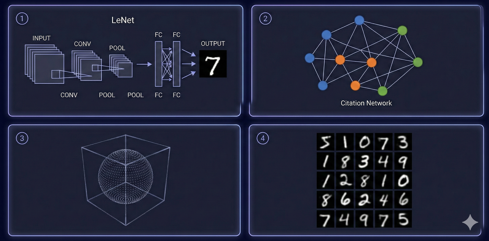

<div align="center">


# DL-Hub

**从零手写，循序渐进 — PyTorch 深度学习统一学习项目**

<br/>

[](https://python.org)
[](https://pytorch.org)
[](https://numpy.org)
[](LICENSE)

<br/>

<code>54 Lessons</code> · <code>7 Learning Tracks</code> · <code>13 ML Algorithms</code> · <code>1600+ Model Zoo Architectures</code> · <code>40+ Tests</code>

<br/>

统一代码风格、统一训练脚手架、统一运行方式<br/>
让学习者真正能 **"循序渐进跑通 → 改得动 → 能验收"**

[Quick Start](#-quick-start) · [Learning Tracks](#-learning-tracks) · [Model Zoo](#-model-zoo) · [ML Algorithms](#-numpy-ml-algorithms) · [Docs](#-documentation)

</div>

---

## What You'll Build

<table>
<tr>
<td align="center" width="20%">
<br/>
<b>Vision</b><br/>
<sub>从 LeNet 到 ViT，<br/>736 架构 · 图像分类 / 检测 / 分割</sub>
</td>
<td align="center" width="20%">
<br/>
<b>NLP</b><br/>
<sub>从词嵌入到 Transformer，<br/>813 架构 · 分类 / NER / 阅读理解</sub>
</td>
<td align="center" width="20%">
<br/>
<b>GNN</b><br/>
<sub>从 GCN 到 PinSAGE，<br/>图分类 / 节点嵌入 / 推荐</sub>
</td>
<td align="center" width="20%">
<br/>
<b>Point Cloud</b><br/>
<sub>从 PointNet 到 PCT，<br/>64 架构 · 3D 点云分类 / 分割 / 重建</sub>
</td>
<td align="center" width="20%">
<br/>
<b>Generative</b><br/>
<sub>VAE & GAN，<br/>手写数字重建与生成</sub>
</td>
</tr>
</table>

<p align="center">
  
</p>
<p align="center"><sub>① Vision — CNN / ViT 图像分类 · ② GNN — 图神经网络 · ③ Point Cloud — 3D 点云 · ④ Generative — VAE / GAN 生成</sub></p>

---

## Contents

- [What You'll Build](#what-youll-build)
- [Quick Start](#-quick-start)
- [Prerequisites](#-prerequisites)
- [Learning Path](#-learning-path)
- [Learning Tracks](#-learning-tracks)
  - [Foundations](#-foundations--基础) · [Vision](#-vision--视觉) · [NLP](#-nlp--自然语言处理) · [GNN](#-gnn--图神经网络) · [Point Cloud](#-point-cloud--点云) · [Generative](#-generative--生成模型) · [LLM](#-llm--大语言模型)
- [Model Zoo](#-model-zoo)
  - [Vision Zoo (736 architectures)](#vision-zoo--736-architectures) · [NLP Zoo (813 architectures)](#nlp-zoo--813-architectures) · [Point Cloud Zoo (64 architectures)](#point-cloud-zoo--64-architectures)
- [NumPy ML Algorithms](#-numpy-ml-algorithms)
- [Optimization Toolkit](#-optimization-toolkit)
- [Documentation](#-documentation)
- [Design Philosophy](#-design-philosophy)
- [Contributing](#-contributing)
- [Citation](#-citation)

---

## Quick Start

> [!TIP]
> 所有 lesson 均支持 `--dataset fake` 离线冒烟 — **无需下载任何数据集，2 分钟即可跑通**。

```bash
# 克隆仓库
git clone https://github.com/skygazer42/DL-Hub.git
cd DL-Hub
pip install -r requirements.txt

# 仓库级冒烟测试（验证环境）
python scripts/smoke_check.py

# 跑通第一个 lesson
python -m tracks.vision.lesson_01_mnist_lenet.train \
  --dataset fake --epochs 1 \
  --max-train-batches 2 --max-eval-batches 2
```

**列出所有可运行的 lesson**：

```bash
python scripts/run_lesson.py --list
```

<details>
<summary><b>统一 CLI 参数（所有 lesson 通用）</b></summary>

| 参数 | 说明 | 示例 |
|------|------|------|
| `--dataset` | 数据模式 | `fake` (离线冒烟) / `toy` / `real` |
| `--epochs` | 训练轮数 | `10` |
| `--batch-size` | 批大小 | `32` |
| `--learning-rate` | 学习率 | `0.001` |
| `--seed` | 随机种子 | `42` |
| `--device` | 计算设备 | `cpu` / `cuda` / `mps` / `auto` |
| `--max-train-batches` | 限制训练 batch 数 | `2` |
| `--max-eval-batches` | 限制评估 batch 数 | `2` |

</details>

---

## Prerequisites

> [!NOTE]
> 本项目适合有一定 Python 基础的学习者。以下是各 track 的先修建议。

| Track | 先修知识 |
|-------|---------|
| Foundations | Python 基础、线性代数入门 |
| Vision | Foundations track + 卷积直觉 |
| NLP | Foundations track + 文本处理基础 |
| GNN | Foundations track + 图论基本概念 |
| Point Cloud | Vision track + 3D 几何直觉 |
| Generative | Vision track + 概率论基础 |
| LLM | NLP track + Transformer 机制 |

---

## Learning Path

不知道从哪开始？根据你的时间选择一条学习路线：

<p align="center">
  
</p>
<p align="center"><sub>Step 1–7 对应：Foundations → Vision → NLP → GNN → Point Cloud → Generative → LLM</sub></p>

<table>
<tr>
<th width="20%">路线</th>
<th width="15%">时间</th>
<th width="15%">Lessons</th>
<th width="50%">内容</th>
</tr>
<tr>
<td><b>Weekend Sprint</b></td>
<td>1-2 天</td>
<td>6 lessons</td>
<td>Foundations (2) → Vision lesson 01-02 → Generative lesson 01 → LLM lesson 01<br/><sub>快速建立从张量到生成模型的完整直觉</sub></td>
</tr>
<tr>
<td><b>Two-Week Deep Dive</b></td>
<td>2 周</td>
<td>18 lessons</td>
<td>Foundations (2) → Vision (5) → NLP (4) → GNN (3) → Generative (2) → LLM (1) → Point Cloud (1)<br/><sub>覆盖所有 track 的核心 lesson</sub></td>
</tr>
<tr>
<td><b>Full Curriculum</b></td>
<td>4-6 周</td>
<td>54 lessons</td>
<td>按顺序完成全部 7 个 track 的所有 lesson<br/><sub>系统掌握从经典 ML 到前沿深度学习的完整技能树</sub></td>
</tr>
</table>

> [!TIP]
> 推荐顺序：**Foundations → Vision → NLP → GNN → Point Cloud → Generative → LLM**。每个 lesson 都有独立的 README 说明目标、先修和验收标准。

---

## 课程及代码合集

<table>
<tr>
<td align="center" width="14%"><b>Foundations</b><br/><sub>2 lessons</sub></td>
<td align="center" width="14%"><b>Vision</b><br/><sub>11 lessons</sub></td>
<td align="center" width="14%"><b>NLP</b><br/><sub>7 lessons</sub></td>
<td align="center" width="14%"><b>GNN</b><br/><sub>11 lessons</sub></td>
<td align="center" width="14%"><b>Point Cloud</b><br/><sub>20 lessons</sub></td>
<td align="center" width="14%"><b>Generative</b><br/><sub>2 lessons</sub></td>
<td align="center" width="14%"><b>LLM</b><br/><sub>1 lesson</sub></td>
</tr>
</table>

---

### ⚡ 1. Foundations / 基础

> 张量、自动求导、训练循环入门 — 所有后续 track 的基石。

| 序号 | 项目 | 代码文档 | 核心概念 |
|------|------|----------|----------|
| 1 | 张量操作 & Autograd 机制 | [lesson_01_tensors](tracks/foundations/lesson_01_tensors/) | `torch.Tensor`, `backward()`, 计算图 |
| 2 | 从零实现线性回归 | [lesson_02_linear_regression](tracks/foundations/lesson_02_linear_regression_autograd/) | 梯度下降, 损失函数, 参数更新 |

---

### 👁️ 2. Vision / 视觉

> 从 MNIST 入门到目标检测、语义分割、Vision Transformer。

| 序号 | 项目 | 代码文档 | 核心概念 |
|------|------|----------|----------|
| 1 | LeNet-5 图像分类 | [mnist_lenet](tracks/vision/lesson_01_mnist_lenet/) | 卷积层, 池化, 全连接 |
| 2 | MLP 图像分类 | [mnist_mlp](tracks/vision/lesson_02_mnist_mlp/) | 多层感知机, Flatten |
| 3 | AlexNet 图像分类 | [mnist_alexnet](tracks/vision/lesson_03_mnist_alexnet/) | 深层卷积网络, Dropout |
| 4 | FCOS 目标检测 | [synthetic_detection_fcos](tracks/vision/lesson_04_synthetic_detection_fcos/) | Anchor-free, FPN, 回归头 |
| 5 | ViT 图像分类 | [vit_toy_classification](tracks/vision/lesson_05_vit_toy_classification/) | Patch Embedding, Self-Attention |
| 6 | Swin Transformer 图像分类 | [swin_toy_classification](tracks/vision/lesson_06_swin_toy_classification/) | Window Attention, Shifted Window |
| 7 | 关键点回归 | [toy_keypoint_regression](tracks/vision/lesson_07_toy_keypoint_regression/) | 坐标回归, Heatmap |
| 8 | UNet 语义分割 | [synthetic_segmentation_unet](tracks/vision/lesson_08_synthetic_segmentation_unet/) | Encoder-Decoder, Skip Connection |
| 9 | 多 Backbone 对比 | [cnn_backbones_toy_classification](tracks/vision/lesson_09_cnn_backbones_toy_classification/) | 统一接口, 特征提取 |

<details>
<summary><b>支持的 Vision Backbones（208 算法族 / 736 架构 ID）</b></summary>

| 类别 | 代表架构 |
|------|---------|
| 经典 CNN | AlexNet, VGG, GoogLeNet, ResNet, DenseNet, SqueezeNet |
| 高效网络 | MobileNet v1-v4, EfficientNet, GhostNet v1/v2, ShuffleNet, MNASNet, FBNet, MicroNet |
| 注意力 CNN | SENet, CBAM, BAM, ECA-Net, SK-Net, CoordAtt, SimAM, Triplet Attention |
| 现代 CNN | ConvNeXt v1/v2, RepVGG, RepLKNet, InceptionNeXt, HorNet, FocalNet, SLaK |
| Vision Transformer | ViT, DeiT, DeiT3, BEiT, EVA, CaiT, CrossViT, Swin v2, CSwin, MAE-ViT |
| 高效 Transformer | EfficientViT, TinyViT, EdgeViT, LightViT, FastViT, FasterViT, SwiftFormer |
| MLP 系列 | MLP-Mixer, gMLP, ResMLP, FNet, CycleMLP, AS-MLP, WaveMLP, MorphMLP |
| Hybrid | CoAtNet, MobileFormer, ConvFormer, Uniformer, CMT, MaxViT, MobileViT v1-v3 |
| 特殊结构 | CapsNet, ScatterNet, FractalNet, HighwayNet, HRNet, NAS 系列 |

> 完整列表见 `python -m dlhub.vision.backbones.catalog --list`，所有 backbone 均为纯 PyTorch 本地实现。

</details>

---

### 📝 3. NLP / 自然语言处理

> 从 toy 文本分类到 Transformer、NER、阅读理解。

| 序号 | 项目 | 代码文档 | 核心概念 |
|------|------|----------|----------|
| 1 | Embedding + FC 文本分类 | [toy_text_classification](tracks/nlp/lesson_01_toy_text_classification/) | 词嵌入, 词袋 |
| 2 | Transformer Encoder 文本分类 | [toy_text_classification_transformer](tracks/nlp/lesson_02_toy_text_classification_transformer/) | Self-Attention, 位置编码 |
| 3 | BiLSTM 命名实体识别 | [toy_ner_bilstm](tracks/nlp/lesson_03_toy_ner_bilstm/) | 序列标注, BIO 标签 |
| 4 | Seq2Seq + Attention 序列生成 | [toy_seq2seq_attention_generation](tracks/nlp/lesson_04_toy_seq2seq_attention_generation/) | Encoder-Decoder, Bahdanau Attention |
| 5 | TextCNN 文本分类 | [toy_text_classification_textcnn](tracks/nlp/lesson_05_toy_text_classification_textcnn/) | 多尺度卷积核, 文本特征 |
| 6 | BiLSTM 文本分类 | [toy_text_classification_bilstm](tracks/nlp/lesson_06_toy_text_classification_bilstm/) | 双向 LSTM, 隐藏状态 |
| 7 | Span Prediction 阅读理解 | [reading_comprehension](tracks/nlp/lesson_07_reading_comprehension/) | SQuAD 风格, Start/End Logits |

---

### 🕸️ 4. GNN / 图神经网络

> 最丰富的 track — 从 toy 图分类到 Cora 节点分类、图嵌入、异构图推荐。

**Graph Classification**

| 序号 | 项目 | 代码文档 | 核心概念 |
|------|------|----------|----------|
| 1 | GCN 图分类 | [toy_graph_classification](tracks/gnn/lesson_01_toy_graph_classification/) | 邻接矩阵, 消息传递 |
| 2 | GIN 图分类 | [gin_toy_graph_classification](tracks/gnn/lesson_02_gin_toy_graph_classification/) | WL Test, 图同构 |
| 3 | GAT 图分类 | [gat_toy_graph_classification](tracks/gnn/lesson_03_gat_toy_graph_classification/) | 注意力系数, 多头注意力 |

**Node Classification**

| 序号 | 项目 | 代码文档 | 核心概念 |
|------|------|----------|----------|
| 4 | GCN Cora 节点分类 | [cora_node_classification_gcn](tracks/gnn/lesson_04_cora_node_classification_gcn/) | 半监督学习, 谱方法 |
| 5 | Label Propagation Cora | [label_propagation_cora](tracks/gnn/lesson_05_label_propagation_cora/) | 经典基线, 无参数方法 |
| 6 | GraphSAGE Cora | [graphsage_cora](tracks/gnn/lesson_06_graphsage_cora/) | 采样聚合, 归纳学习 |

**Embedding & Advanced**

| 序号 | 项目 | 代码文档 | 核心概念 |
|------|------|----------|----------|
| 7 | SDNE 节点嵌入 | [sdne_karate_embedding](tracks/gnn/lesson_07_sdne_karate_embedding/) | 自编码器, 一阶/二阶近似 |
| 8 | LINE 节点嵌入 | [line_karate_embedding](tracks/gnn/lesson_08_line_karate_embedding/) | 大规模网络, 边采样 |
| 9 | Metapath2Vec 异构图嵌入 | [metapath2vec_toy_hetero_embedding](tracks/gnn/lesson_09_metapath2vec_toy_hetero_embedding/) | 元路径, 异构随机游走 |
| 10 | PinSAGE 推荐 | [pinsage_toy_recommender](tracks/gnn/lesson_10_pinsage_toy_recommender/) | 随机游走采样, 工业级图推荐 |
| 11 | R-GCN 关系图节点分类 | [rgcn_toy_node_classification](tracks/gnn/lesson_11_rgcn_toy_node_classification/) | 关系特定权重, 知识图谱 |

---

### ☁️ 5. Point Cloud / 点云

> 3D 点云分类：PointNet → DGCNN → PointNet++ → 30+ Backbone Zoo。

| 序号 | 项目 | 代码文档 | 核心概念 |
|------|------|----------|----------|
| 1 | PointNet 点云分类 | [pointnet_toy_classification](tracks/pointcloud/lesson_01_pointnet_toy_classification/) | 点集排列不变性, T-Net |
| 2 | DGCNN 点云分类 | [dgcnn_toy_classification](tracks/pointcloud/lesson_02_dgcnn_toy_classification/) | 动态图, EdgeConv |
| 3 | PointNet++ 点云分类 | [pointnet2_toy_classification](tracks/pointcloud/lesson_03_pointnet2_toy_classification/) | 层级采样, Set Abstraction |
| 4 | 30+ Backbone Zoo 对比 | [pointcloud_zoo_toy_classification](tracks/pointcloud/lesson_04_pointcloud_zoo_toy_classification/) | 统一接口, Backbone 对比 |

<details>
<summary><b>支持的 Point Cloud Backbones（30 算法 / 64 架构 ID）</b></summary>

| 类别 | 架构 |
|------|------|
| Set Models | PointNet, PointNet++, DeepSets |
| Graph Models | DGCNN, PointGAT, PointGCN, PointWeb |
| MLP Models | PointMLP, PointMixer, PointNeXt |
| Transformer | PCT, Point Transformer, PointBERT, PointMAE |
| Conv Models | KPConv, PointCNN, PointConv, ShellNet |
| Extra | CurveNet, GDANet, PAConv, PVCNN, RandLANet, RSCNN, SpiderCNN 等 |

</details>

---

### 🎨 6. Generative / 生成模型

> VAE & GAN 最小实现 — 支持 `--dataset fake` 离线冒烟。

| 序号 | 项目 | 代码文档 | 核心概念 |
|------|------|----------|----------|
| 1 | VAE 重建 & 生成 | [vae_mnist](tracks/generative/lesson_01_vae_mnist/) | 重参数化技巧, KL 散度, ELBO |
| 2 | GAN 生成 | [gan_mnist](tracks/generative/lesson_02_gan_mnist/) | 生成器/判别器对抗, 纳什均衡 |

---

### 🤖 7. LLM / 大语言模型

> Toy Causal Language Model — 从零搭建 Transformer 生成模型。

| 序号 | 项目 | 代码文档 | 核心概念 |
|------|------|----------|----------|
| 1 | Transformer 文本生成 | [toy_causal_lm_transformer](tracks/llm/lesson_01_toy_causal_lm_transformer/) | Causal Mask, 自回归解码 |

> [!NOTE]
> `resources/pdfs/llms/` 下保留了 50+ 篇 LLM 相关论文与笔记，包括 PaLM、大模型综述等，可作为延伸阅读。

---

## Model Zoo

> 三大领域统一模型动物园 — 纯 PyTorch 本地实现，无需下载预训练权重，1600+ 架构 ID 一行切换

<table>
<tr>
<td align="center" width="33%"><b>Vision Zoo</b><br/><sub>208 算法族 · 736 架构 ID</sub></td>
<td align="center" width="33%"><b>NLP Zoo</b><br/><sub>49 算法族 · 813 架构 ID</sub></td>
<td align="center" width="33%"><b>Point Cloud Zoo</b><br/><sub>30 算法族 · 64 架构 ID</sub></td>
</tr>
</table>

所有 Zoo 遵循相同的设计模式：

- **一文件一算法族** — 如 `resnet.py` 包含 ResNet-18/34/50/101 所有变体
- **Lazy Import** — 仅在使用时加载，启动零开销
- **统一接口** — `build(arch_id, num_classes=...)` 即可构建任意模型
- **CLI 工具** — `--list` 列表、`--search` 搜索、`--smoke` 冒烟测试

---

### Vision Zoo / 736 Architectures

```bash
# 列出所有可用架构
python scripts/vision_zoo.py --list

# 搜索特定架构
python scripts/vision_zoo.py --search convnext

# 冒烟测试
python scripts/vision_zoo.py --smoke resnet50
```

<details>
<summary><b>主要架构分类</b></summary>

| 类别 | 代表架构 | 数量 |
|------|---------|------|
| 经典 CNN | AlexNet, VGG, GoogLeNet, ResNet, DenseNet | ~60 |
| 高效网络 | MobileNet v1-v4, EfficientNet v1/v2, GhostNet, ShuffleNet | ~80 |
| 注意力 CNN | SENet, CBAM, BAM, ECA-Net, SK-Net, CoordAtt | ~50 |
| 现代 CNN | ConvNeXt v1/v2, RepVGG, RepLKNet, HorNet, FocalNet | ~40 |
| Vision Transformer | ViT, DeiT, BEiT, Swin v2, CSwin, CaiT, CrossViT | ~120 |
| 高效 Transformer | EfficientViT, TinyViT, EdgeViT, FastViT, SwiftFormer | ~60 |
| MLP 系列 | MLP-Mixer, gMLP, ResMLP, FNet, CycleMLP, WaveMLP | ~50 |
| Hybrid | CoAtNet, MobileFormer, Uniformer, MaxViT, MobileViT | ~60 |
| 特殊结构 | CapsNet, FractalNet, HRNet, NAS 系列, Mamba | ~50 |

</details>

---

### NLP Zoo / 813 Architectures

```bash
# 列出所有可用架构
python scripts/nlp_zoo.py --list

# 搜索特定架构
python scripts/nlp_zoo.py --search bert

# 冒烟测试
python scripts/nlp_zoo.py --smoke bert_base
```

<details>
<summary><b>主要架构分类</b></summary>

| 类别 | 代表架构 |
|------|---------|
| Transformer | BERT, GPT, T5, ALBERT, DistilBERT, Longformer, BigBird |
| 高效 Transformer | Performer, Nystromformer, FNet, Synthesizer, Linformer |
| RNN 系列 | LSTM, GRU, BiLSTM, BiGRU, IndRNN, SRU, QRNN |
| CNN 系列 | TextCNN, InceptionCNN, DPCNN, VDCNN, ResConv |
| MLP 系列 | gMLP, ResMLP, MLP-Mixer |
| 轻量级 | FastText, WaveNet, TCN |

</details>

---

### Point Cloud Zoo / 64 Architectures

```bash
# 在 lesson_04 中切换 backbone
python -m tracks.pointcloud.lesson_04_pointcloud_zoo_toy_classification.train \
  --arch pointnet --dataset fake --epochs 1
```

> 详细列表见 [Point Cloud Track](#-point-cloud--点云) 的 Backbone 表格。

---

## NumPy ML Algorithms

> 纯 NumPy 手写经典机器学习算法 — 零深度学习依赖，理解算法本质

| 类别 | 算法 | 文件 | 核心原理 |
|------|------|------|---------|
| **线性模型** | Linear Regression | `linear_models.py` | 最小二乘, 梯度下降 |
| **线性模型** | Logistic Regression | `linear_models.py` | Sigmoid, 交叉熵 |
| **核方法** | Linear SVM | `svm.py` | Hinge Loss, 最大间隔 |
| **树模型** | Decision Tree | `decision_tree.py` | Gini 不纯度, 递归分裂 |
| **集成方法** | Random Forest | `random_forest.py` | Bagging, 特征随机采样 |
| **概率模型** | Naive Bayes | `naive_bayes.py` | 贝叶斯定理, 条件独立 |
| **概率模型** | GMM | `gmm.py` | EM 算法, 高斯混合 |
| **近邻** | KNN | `knn.py` | 距离度量, 多数投票 |
| **聚类** | K-Means | `kmeans.py` | 质心迭代, Lloyd 算法 |
| **降维** | PCA | `pca.py` | 特征值分解, 方差最大化 |
| **神经网络** | Perceptron | `perceptron.py` | 感知机学习规则 |
| **神经网络** | MLP | `mlp.py` | 反向传播, 链式法则 |

<sub>所有文件位于 `ml_algorithms/python/`，使用 `@dataclass` 模式实现。</sub>

---

## Optimization Toolkit

> 纯 NumPy 实现 — 理解优化器和调度器的数学本质

<table>
<tr>
<td valign="top" width="25%">

**Optimizers**
| 算法 | 特点 |
|------|------|
| SGD | 基础随机梯度下降 |
| Momentum | 动量加速 |
| RMSProp | 自适应学习率 |
| Adagrad | 稀疏梯度友好 |
| Adam | Momentum + RMSProp |

</td>
<td valign="top" width="25%">

**LR Schedulers**
| 策略 | 特点 |
|------|------|
| StepDecay | 阶梯式衰减 |
| ExponentialDecay | 指数衰减 |
| CosineAnnealing | 余弦退火 |
| WarmupCosine | 预热 + 余弦 |

</td>
<td valign="top" width="25%">

**Losses**
| 函数 | 用途 |
|------|------|
| MSE | 回归 |
| MAE | 鲁棒回归 |
| Binary CE | 二分类 |
| Categorical CE | 多分类 |

</td>
<td valign="top" width="25%">

**Metrics**
| 指标 | 用途 |
|------|------|
| Accuracy | 分类准确率 |
| Precision | 精确率 |
| Recall / F1 | 召回率 / F1 |
| R² Score | 回归拟合度 |

</td>
</tr>
</table>

<details>
<summary><b>更多优化算法</b></summary>

| 算法 | 目录 | 说明 |
|------|------|------|
| 蚁群优化 (ACO) | `optimization/ACO/` | 旅行商问题求解，含原理图 |
| 遗传算法 (GA) | `optimization/GA/` | 进化搜索，含流程图 |
| 粒子群优化 (PSO) | `optimization/PSO/` | 群体智能优化 |
| 层次分析法 (AHP) | `optimization/AHP/` | 多准则决策 |
| Lasso 优化 | `optimization/Lasso/` | L1 正则化路径，含可视化 |

</details>

---

## Documentation

| 文档 | 说明 | 适合谁 |
|------|------|--------|
| [`ROADMAP.md`](docs/ROADMAP.md) | 学习路线图与推荐顺序 | 初学者 |
| [`INSTALL.md`](docs/INSTALL.md) | 安装指南 | 所有人 |
| [`RUNNING.md`](docs/RUNNING.md) | 如何运行 Lesson | 所有人 |
| [`STRUCTURE.md`](docs/STRUCTURE.md) | 仓库结构详解 | 想深入了解的人 |
| [`CONVENTIONS.md`](docs/CONVENTIONS.md) | 运行 & 实验约定 | 贡献者 |
| [`STYLEGUIDE.md`](docs/STYLEGUIDE.md) | 代码规范 | 贡献者 |
| [`FAQ.md`](docs/FAQ.md) | 常见问题 | 遇到问题时 |

---

## Design Philosophy

```
              ┌───────────────────────────────────────────────────────┐
              │                   DL-Hub 设计理念                      │
              ├──────────────┬──────────────┬─────────────────────────┤
              │ Offline-first │  统一脚手架   │     可复现              │
              │ 所有 lesson   │ 共享 dlhub/  │ 种子 + 配置 + 日志      │
              │ 支持离线冒烟   │ 训练框架      │ 每次实验可追溯          │
              ├──────────────┼──────────────┼─────────────────────────┤
              │   渐进式      │  测试覆盖     │  Model Zoo             │
              │ 由浅入深       │ 40+ pytest  │ 1600+ 架构 ID          │
              │ 7 track 递进  │ CI 可集成    │ 三大领域统一接口         │
              └──────────────┴──────────────┴─────────────────────────┘
```

<details>
<summary><b>详细说明</b></summary>

- **Offline-first** — 所有 lesson 支持 `--dataset fake` 离线冒烟，无需下载任何数据集，10 秒内验证环境
- **统一脚手架** — 所有 lesson 共享 `dlhub/` 框架：训练循环、设备管理、种子、检查点、JSONL 指标记录
- **可复现** — 种子管理 + 配置自动保存 + 指标日志，每次实验完整可追溯
- **渐进式** — 从基础张量操作到 Vision Transformer、GraphSAGE、PointNet++，由浅入深，7 个 track 层层递进
- **测试覆盖** — 40+ pytest 测试文件覆盖框架核心与所有 track，支持 CI 集成
- **Model Zoo** — 三大领域（Vision / NLP / Point Cloud）共 1600+ 架构 ID，纯 PyTorch 本地实现，统一接口一行切换

</details>

---

## Contributing

欢迎贡献！无论是修复 typo、补充 lesson 还是提出新的 track 想法。

1. Fork 本仓库
2. 创建你的分支 (`git checkout -b feature/amazing-lesson`)
3. 遵循 [`docs/STYLEGUIDE.md`](docs/STYLEGUIDE.md) 代码规范
4. 确保 `python scripts/smoke_check.py` 通过
5. 提交 PR

> [!NOTE]
> 每个新 lesson 应包含：`model.py` / `data.py` / `train.py` / `README.md`，并支持 `--dataset fake` 冒烟模式。详见 [`docs/CONVENTIONS.md`](docs/CONVENTIONS.md)。

---

## Citation

如果本项目对你的学习或研究有帮助，欢迎引用：

```bibtex
@misc{dlhub2026,
  title  = {DL-Hub: A Unified PyTorch Deep Learning Learning Project},
  author = {DL-Hub Contributors},
  year   = {2026},
  url    = {https://github.com/your-username/DL-Hub}
}
```

---

## License

本项目采用 [MIT License](LICENSE) 开源。代码自由使用，`resources/pdfs/` 下的论文版权归原作者所有。

---

<div align="center">

**Built for learning. Built to run.**

<sub>如果觉得有帮助，欢迎 Star 支持 ⭐</sub>

</div>
