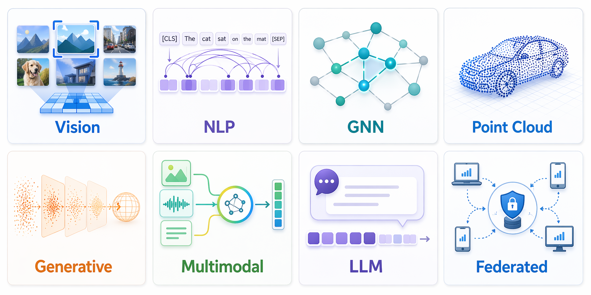
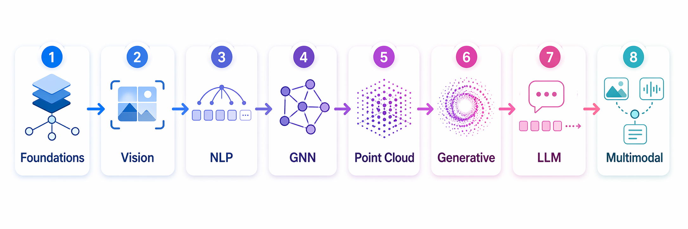

<div align="center">


**从原理到实现 — 一站式 PyTorch 深度学习实践库**

<br/>

[](https://python.org)
[](https://pytorch.org)
[](https://numpy.org)
[![zread](https://img.shields.io/badge/Ask_Zread-_.svg?style=for-the-badge&color=00b0aa&labelColor=000000&logo=data%3Aimage%2Fsvg%2Bxml%3Bbase64%2CPHN2ZyB3aWR0aD0iMTYiIGhlaWdodD0iMTYiIHZpZXdCb3g9IjAgMCAxNiAxNiIgZmlsbD0ibm9uZSIgeG1sbnM9Imh0dHA6Ly93d3cudzMub3JnLzIwMDAvc3ZnIj4KPHBhdGggZD0iTTQuOTYxNTYgMS42MDAxSDIuMjQxNTZDMS44ODgxIDEuNjAwMSAxLjYwMTU2IDEuODg2NjQgMS42MDE1NiAyLjI0MDFWNC45NjAxQzEuNjAxNTYgNS4zMTM1NiAxLjg4ODEgNS42MDAxIDIuMjQxNTYgNS42MDAxSDQuOTYxNTZDNS4zMTUwMiA1LjYwMDEgNS42MDE1NiA1LjMxMzU2IDUuNjAxNTYgNC45NjAxVjIuMjQwMUM1LjYwMTU2IDEuODg2NjQgNS4zMTUwMiAxLjYwMDEgNC45NjE1NiAxLjYwMDFaIiBmaWxsPSIjZmZmIi8%2BCjxwYXRoIGQ9Ik00Ljk2MTU2IDEwLjM5OTlIMi4yNDE1NkMxLjg4ODEgMTAuMzk5OSAxLjYwMTU2IDEwLjY4NjQgMS42MDE1NiAxMS4wMzk5VjEzLjc1OTlDMS42MDE1NiAxNC4xMTM0IDEuODg4MSAxNC4zOTk5IDIuMjQxNTYgMTQuMzk5OUg0Ljk2MTU2QzUuMzE1MDIgMTQuMzk5OSA1LjYwMTU2IDE0LjExMzQgNS42MDE1NiAxMy43NTk5VjExLjAzOTlDNS42MDE1NiAxMC42ODY0IDUuMzE1MDIgMTAuMzk5OSA0Ljk2MTU2IDEwLjM5OTlaIiBmaWxsPSIjZmZmIi8%2BCjxwYXRoIGQ9Ik0xMy43NTg0IDEuNjAwMUgxMS4wMzg0QzEwLjY4NSAxLjYwMDEgMTAuMzk4NCAxLjg4NjY0IDEwLjM5ODQgMi4yNDAxVjQuOTYwMUMxMC4zOTg0IDUuMzEzNTYgMTAuNjg1IDUuNjAwMSAxMS4wMzg0IDUuNjAwMUgxMy43NTg0QzE0LjExMTkgNS42MDAxIDE0LjM5ODQgNS4zMTM1NiAxNC4zOTg0IDQuOTYwMVYyLjI0MDFDMTQuMzk4NCAxLjg4NjY0IDE0LjExMTkgMS42MDAxIDEzLjc1ODQgMS42MDAxWiIgZmlsbD0iI2ZmZiIvPgo8cGF0aCBkPSJNNCAxMkwxMiA0TDQgMTJaIiBmaWxsPSIjZmZmIi8%2BCjxwYXRoIGQ9Ik00IDEyTDEyIDQiIHN0cm9rZT0iI2ZmZiIgc3Ryb2tlLXdpZHRoPSIxLjUiIHN0cm9rZS1saW5lY2FwPSJyb3VuZCIvPgo8L3N2Zz4K&logoColor=ffffff)](https://zread.ai/skygazer42/DL-Hub)
[](LICENSE)

<br/>

<!-- stats:hero-badges -->
**339 Lessons** · **8611 Model Zoo Registrations** · **80 Audited Zoo Sources** · **31 NumPy ML Algorithms**
<!-- /stats:hero-badges -->

<br/>

统一代码风格、统一训练脚手架、统一运行方式<br/>
让学习者真正能 **"循序渐进跑通 → 改得动 → 能验收"**

[Quick Start](#quick-start) · [Learning Tracks](#learning-tracks) · [Model Zoo](#model-zoo) · [Docs](#documentation)

</div>

## What You'll Build

<table>
<tr>
<td align="center" width="25%">
<br/>
<b>Vision</b><br/>
<sub>从 LeNet 到 ViT，<br/>791 注册 ID · 图像分类 / 检测 / 分割</sub>
</td>
<td align="center" width="25%">
<br/>
<b>NLP</b><br/>
<sub>从词嵌入到 Transformer，<br/>814 注册 ID · 分类 / NER / 阅读理解</sub>
</td>
<td align="center" width="25%">
<br/>
<b>GNN</b><br/>
<sub>从 GCN 到 PinSAGE，<br/>图分类 / 节点嵌入 / 推荐</sub>
</td>
<td align="center" width="25%">
<br/>
<b>Point Cloud</b><br/>
<sub>从 PointNet 到 PCT，<br/>64 注册 ID · 分类 / 部件分割 / 重建 / 15 种自监督</sub>
</td>
</tr>
<tr>
<td align="center" width="25%">
<br/>
<b>Generative</b><br/>
<sub>VAE / GAN / Diffusion / Flow Matching，<br/>重建 / 对抗生成 / 一步一致性 / 向量场传输</sub>
</td>
<td align="center" width="25%">
<br/>
<b>Multimodal</b><br/>
<sub>从 CLIP 到 Audio-Visual Learning，<br/>视觉问答 / 检索 / 音频文本理解 / 跨模态融合</sub>
</td>
<td align="center" width="25%">
<br/>
<b>LLM</b><br/>
<sub>Causal LM / Instruction Tuning / Prefix Tuning / Mamba，<br/>50+ 论文笔记</sub>
</td>
<td align="center" width="25%">
<br/>
<b>Federated</b><br/>
<sub>76 联邦策略<br/>差分隐私 / 安全聚合 / 个性化</sub>
</td>
</tr>
</table>

<p align="center">
  
</p>
<p align="center"><sub>① Vision — CNN / ViT 图像分类 · ② NLP — 文本分类 / NER · ③ GNN — 图神经网络 · ④ Point Cloud — 3D 点云 · ⑤ Generative — VAE / GAN · ⑥ Multimodal — VLM 视觉语言 · ⑦ LLM — 大语言模型 · ⑧ Federated — 联邦学习</sub></p>

---

## Contents

- [What You'll Build](#what-youll-build)
- [Quick Start](#quick-start)
- [One Repository, One Contract](#one-repository-one-contract)
- [Learning Path](#learning-path)
- [Learning Tracks](#learning-tracks)
- [Model Zoo](#model-zoo)
- [ML Algorithms & Optimization](#ml-algorithms--optimization)
- [Documentation](#documentation)
- [Design Philosophy](#design-philosophy)
- [Contributing](#contributing)
- [Citation](#citation)

---

## Quick Start

> [!TIP]
> 所有 lesson 都提供离线运行路径：真实数据课程可传 `--dataset fake`，其余课程默认使用内置 synthetic 数据，无需下载数据集。

```bash
# 克隆仓库
git clone https://github.com/skygazer42/DL-Hub.git
cd DL-Hub
# PyTorch 的 CPU/CUDA 安装命令见下方安装指南；随后安装 Vision 赛道依赖
pip install -e ".[vision]"

# 精选冒烟测试（覆盖 8 个 track，用于验证环境）
python scripts/smoke_check.py

# 跑通第一个 lesson
python -m tracks.vision.lesson_01_mnist_lenet.train \
  --dataset fake --epochs 1 \
  --max-train-batches 2 --max-eval-batches 2

# 列出所有可运行的 lesson
python scripts/run_lesson.py --list
```

<details>
<summary><b>常见 CLI 参数（以具体 lesson 能力为准）</b></summary>

所有训练入口统一提供 `--seed`、`--device` 和 `--run-name`；训练轮数、批大小、
快速截断等参数按任务提供。运行
`python scripts/run_lesson.py <track> <lesson> --describe` 可查看准确参数列表。

| 参数 | 说明 | 示例 |
|------|------|------|
| `--dataset` | 可选数据模式；仅部分真实数据课程提供 | `fake` / `mnist` |
| `--epochs` | 训练轮数 | `10` |
| `--batch-size` | 批大小 | `32` |
| `--learning-rate` | 学习率 | `0.001` |
| `--seed` | 随机种子 | `42` |
| `--device` | 计算设备 | `cpu` / `cuda` / `mps` / `auto` |
| `--max-train-batches` | 限制训练 batch 数 | `2` |
| `--max-eval-batches` | 限制评估 batch 数 | `2` |

</details>

PyTorch 平台选择、最小安装和各赛道 extras 见
[安装指南](docs/getting-started/installation.md)。

---

## One Repository, One Contract

DL-Hub 用一条完整链路组织每个主题：**问题定义 → 数据 → 模型机制 → 训练与评估 →
运行产物 → 审计证据**。为了让名称和代码能力对齐，仓库把三个维度严格分开：

| 维度 | 仓库语义 |
|------|----------|
| 实现规模与保真度 | `compact` 表示保留关键机制的缩放实现；论文名只委托公共基线时标为 `baseline-alias` |
| 数据来源 | `synthetic` 只表示程序生成的数据或标注，不再用于给模型能力命名 |
| 验证范围 | `contract` / `smoke` / targeted test / benchmark 分别证明不同强度的结论 |

因此，目录改名不是把旧标签换个外壳：课程需要连接真实的任务输入、损失、指标和输出；
Model Zoo 注册 ID 也不会被描述成同等数量的论文复现。完整规则、升级路径和维护命令见
[实现契约：从课程到可验证系统](docs/implementation-contract.md)。

---

## Learning Path

不知道从哪开始？根据你的时间选择一条学习路线：

<p align="center">
  
</p>
<p align="center"><sub>Step 1–8 对应：Foundations → Vision → NLP → GNN → Point Cloud → Generative → LLM → Multimodal</sub></p>

| 路线 | 时间 | Lessons | 内容 |
|------|------|---------|------|
| **Weekend Sprint** | 1-2 天 | 6 lessons | Foundations (2) → Vision lesson 01-02 → Generative lesson 01 → LLM lesson 01 |
| **Two-Week Deep Dive** | 2 周 | 18 lessons | Foundations (2) → Vision (5) → NLP (4) → GNN (3) → Generative (2) → LLM (1) → Point Cloud (1) |
| **Full Curriculum** | 6-8 周 | 全部 lesson | 按顺序完成全部 8 个 track（合计见下表） |

> [!TIP]
> 推荐顺序：**Foundations → Vision → NLP → GNN → Point Cloud → Generative → LLM → Multimodal**。每个 lesson 都有独立的目标、先修和验收标准。

---

## Learning Tracks

每个 track 的完整 lesson 清单、CLI 示例和验收标准都在对应文档页：

<!-- stats:track-overview -->
| Track | Lessons | 文档 |
|---|---:|---|
| ⚡ Foundations / 基础 | 2 | [docs/tracks/foundations.md](docs/tracks/foundations.md) |
| 👁️ Vision / 视觉 | 89 | [docs/tracks/vision.md](docs/tracks/vision.md) |
| 📝 NLP / 自然语言处理 | 49 | [docs/tracks/nlp.md](docs/tracks/nlp.md) |
| 🕸️ GNN / 图神经网络 | 11 | [docs/tracks/gnn.md](docs/tracks/gnn.md) |
| ☁️ Point Cloud / 点云 | 36 | [docs/tracks/pointcloud.md](docs/tracks/pointcloud.md) |
| 🎨 Generative / 生成模型 | 51 | [docs/tracks/generative.md](docs/tracks/generative.md) |
| 🤖 LLM / 大语言模型 | 43 | [docs/tracks/llm.md](docs/tracks/llm.md) |
| 🌐 Multimodal / 多模态 | 58 | [docs/tracks/multimodal.md](docs/tracks/multimodal.md) |
| **合计** | **339** | [docs/tracks/](docs/tracks/index.md) |
<!-- /stats:track-overview -->

所有训练 lesson 遵循统一的入口、seed、设备和 `outputs/<track>/<lesson>/<run>/` 输出约定；
`model.py`、`data.py` 与任务参数按课程形态组织，详见 [docs/CONVENTIONS.md](docs/CONVENTIONS.md)。

---

## Model Zoo

纯 PyTorch 本地实现的模型注册表，统一接口一行切换架构。完整的子系统总览、
研究方向清单和逐架构明细见 [docs/zoo/](docs/zoo/index.md)：

<!-- stats:zoo-overview -->
| Zoo | 规模 | 文档 |
|---|---|---|
| Vision Zoo | 791 注册 ID / 220 模块 | [docs/zoo/vision-zoo.md](docs/zoo/vision-zoo.md) |
| NLP Zoo | 814 注册 ID | [docs/zoo/nlp-zoo.md](docs/zoo/nlp-zoo.md) |
| Point Cloud Zoo | 64 注册 ID | [docs/zoo/pointcloud-zoo.md](docs/zoo/pointcloud-zoo.md) |
| VLM Zoo | 210 注册 ID / 70 架构族 | [docs/zoo/vlm-zoo.md](docs/zoo/vlm-zoo.md) |
| GAN Zoo | 44 架构族 | [docs/zoo/generative-zoo.md](docs/zoo/generative-zoo.md) |
| Diffusion Zoo | 32 架构族 | [docs/zoo/generative-zoo.md](docs/zoo/generative-zoo.md) |
| Federated Zoo | 76 联邦策略族 | [docs/zoo/federated-zoo.md](docs/zoo/federated-zoo.md) |
| **全部 123 个 zoo 模块合计** | **8611 注册 ID / 80 已审计源码入口** | [docs/zoo/](docs/zoo/index.md) |
<!-- /stats:zoo-overview -->

> [!IMPORTANT]
> “注册 ID”表示可寻址的构建配置，不等于同等数量的独立论文复现，也不自动代表论文机制完整。
> 首批源码对齐结果、分级标准与缺失机制见
> [Model Zoo 保真度审计](docs/zoo/fidelity.md)，并可用
> `python scripts/model_fidelity.py --check` 复核元数据。

```bash
# 列出某个 zoo 的全部架构
python scripts/vision_zoo.py --list
python scripts/nlp_zoo.py --list

# 检查模型构建与前向接口
python scripts/pointcloud_zoo.py --smoke pc:pointnet2_ssg
```

主题覆盖闭环（每个承诺的主题都映射到可验证的代码工件）由
[`dlhub/topic_coverage.py`](dlhub/topic_coverage.py) 维护，
`python -m pytest tests/test_topic_coverage.py` 可回归校验，
明细见 [docs/topic-coverage.md](docs/topic-coverage.md)。

---

## ML Algorithms & Optimization

- **NumPy ML Algorithms** — 31 个从零手写的经典 ML 算法（线性模型 / 树 / 聚类 / 降维 / 集成），
  纯 NumPy 无框架依赖：[docs/ml-algorithms/](docs/ml-algorithms/index.md)
- **Optimization Toolkit** — 手写优化器 / 学习率调度 / 损失函数 / 指标，
  与 lesson 脚手架同一接口：[docs/optimization/](docs/optimization/index.md)

---

## Documentation

完整文档站：**<https://skygazer42.github.io/DL-Hub>**（`mkdocs serve` 可本地预览）

| 文档 | 说明 | 适合谁 |
|------|------|--------|
| [快速开始](docs/getting-started/index.md) | 安装、环境要求、第一个 lesson | 初学者 |
| [学习赛道](docs/tracks/index.md) | 8 个 track 的全部 lesson 明细 | 所有人 |
| [Model Zoo](docs/zoo/index.md) | 各领域架构注册表与研究方向 | 所有人 |
| [实现契约](docs/implementation-contract.md) | 命名语义、完整运行链路与保真度升级规则 | 所有人 |
| [仓库结构](docs/developer/structure.md) | 目录与模块职责详解 | 想深入了解的人 |
| [运行 & 实验约定](docs/CONVENTIONS.md) | seed / 设备 / 输出目录约定 | 贡献者 |
| [代码规范](docs/STYLEGUIDE.md) | 风格与命名 | 贡献者 |
| [FAQ](docs/faq.md) | 常见问题 | 遇到问题时 |

---

## Design Philosophy

```
              ┌───────────────────────────────────────────────────────┐
              │                   DL-Hub 设计理念                      │
              ├──────────────┬──────────────┬─────────────────────────┤
              │ Offline-first │  统一脚手架   │     可复现              │
              │ 所有 lesson   │ 共享 dlhub/  │ 种子 + 配置 + 日志      │
              │ 支持离线冒烟   │ 训练框架      │ 每次实验可追溯          │
              ├──────────────┼──────────────┼─────────────────────────┤
              │   渐进式      │  分层验证     │  Model Zoo             │
              │ 由浅入深       │ 契约 + Smoke │ 全领域统一接口          │
              │ 8 track 递进  │ 按改动精确测  │ 一行切换架构            │
              └──────────────┴──────────────┴─────────────────────────┘
```

<details>
<summary><b>详细说明</b></summary>

- **Offline-first** — 真实数据课程提供 `--dataset fake`，其余课程默认使用内置 synthetic 数据
- **统一脚手架** — 所有训练 lesson 共享 `dlhub/` 的设备、种子、输出路径、检查点与指标工具
- **可复现** — 种子管理 + 配置自动保存 + 指标日志，每次实验完整可追溯
- **渐进式** — 从基础张量操作到 Vision Transformer、GraphSAGE、PointNet++、LLaVA，由浅入深，8 个 track 层层递进
- **分层验证** — 静态契约、精选 Smoke 与针对性测试各自回答不同问题；按改动范围选择最小必要验证
- **Model Zoo** — 全领域（Vision / NLP / Point Cloud / Multimodal / Generative / Federated）架构注册表，纯 PyTorch 本地实现，统一接口一行切换

</details>

> 页首与本页各处的统计数字由 `python scripts/project_stats.py --write` 自动生成，
> `tests/test_project_stats.py` 保证其与仓库实际内容一致。

---

## Contributing

欢迎贡献！无论是修复 typo、补充 lesson 还是提出新的 track 想法。

1. Fork 本仓库
2. 创建你的分支 (`git checkout -b feature/amazing-lesson`)
3. 遵循 [`docs/STYLEGUIDE.md`](docs/STYLEGUIDE.md) 代码规范
4. 先运行 `make verify`，再为本次改动选择最小必要 pytest；涉及训练链路时才运行对应 smoke
5. 提交 PR

> [!NOTE]
> 每个新训练 lesson 应包含 `model.py` / `data.py` / `train.py`，并提供一种无需联网的运行方式；只有可切换真实数据集时才需要 `--dataset fake`。详见 [`docs/CONVENTIONS.md`](docs/CONVENTIONS.md)。

---

## Citation

如果本项目对你的学习或研究有帮助，欢迎引用：

项目作者与维护者：**skygazer42** &lt;207829897@qq.com&gt;

```bibtex
@misc{dlhub2026,
  title  = {DL-Hub: A Unified PyTorch Deep Learning Practice Hub},
  author = {skygazer42},
  year   = {2026},
  url    = {https://github.com/skygazer42/DL-Hub}
}
```

---

## License

本项目采用 [MIT License](LICENSE) 开源。代码自由使用，`resources/pdfs/` 下的论文版权归原作者所有。

---

<div align="center">

**Built for learning. Built to run.**

<sub>如果觉得有帮助，欢迎 Star 支持 ⭐</sub>

</div>
