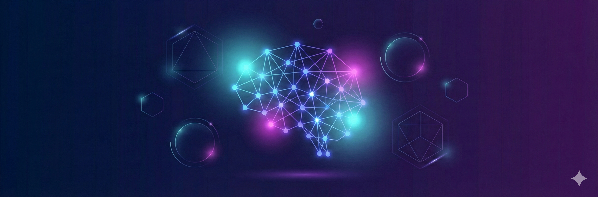
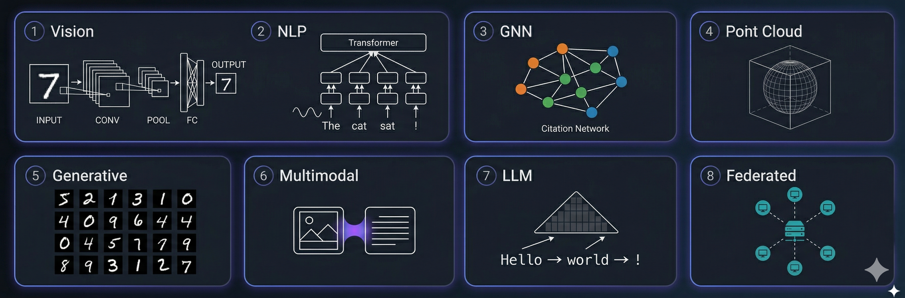
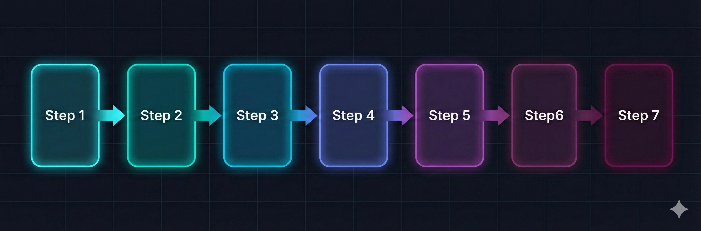

<div align="center">



# DL-Hub

**从零手写，循序渐进 — PyTorch 深度学习统一学习项目**

<br/>

[](https://python.org)
[](https://pytorch.org)
[](https://numpy.org)
[](LICENSE)

<br/>

<code>76 Lessons</code> · <code>8 Learning Tracks</code> · <code>27 ML Algorithms</code> · <code>2500+ Model Zoo Architectures</code> · <code>126 Test Files</code>

<br/>

统一代码风格、统一训练脚手架、统一运行方式<br/>
让学习者真正能 **"循序渐进跑通 → 改得动 → 能验收"**

[Quick Start](#-quick-start) · [Learning Tracks](#-learning-tracks) · [Model Zoo](#-model-zoo) · [Federated Zoo](#-federated-learning-zoo) · [ML Algorithms](#-numpy-ml-algorithms) · [Docs](#-documentation)

</div>

---

## What You'll Build

<table>
<tr>
<td align="center" width="25%">
<br/>
<b>Vision</b><br/>
<sub>从 LeNet 到 ViT，<br/>736 架构 · 图像分类 / 检测 / 分割</sub>
</td>
<td align="center" width="25%">
<br/>
<b>NLP</b><br/>
<sub>从词嵌入到 Transformer，<br/>813 架构 · 分类 / NER / 阅读理解</sub>
</td>
<td align="center" width="25%">
<br/>
<b>GNN</b><br/>
<sub>从 GCN 到 PinSAGE，<br/>图分类 / 节点嵌入 / 推荐</sub>
</td>
<td align="center" width="25%">
<br/>
<b>Point Cloud</b><br/>
<sub>从 PointNet 到 PCT，<br/>64 架构 · 分类 / 部件分割 / 重建 / 15 种自监督</sub>
</td>
</tr>
<tr>
<td align="center" width="25%">
<br/>
<b>Generative</b><br/>
<sub>VAE & GAN，<br/>手写数字重建与生成</sub>
</td>
<td align="center" width="25%">
<br/>
<b>Multimodal</b><br/>
<sub>从 CLIP 到 LLaVA，20 VLM 架构<br/>视觉问答 / 目标检测 / 时序定位</sub>
</td>
<td align="center" width="25%">
<br/>
<b>LLM</b><br/>
<sub>Causal LM + 资源库，<br/>50+ 论文笔记</sub>
</td>
<td align="center" width="25%">
<br/>
<b>Federated</b><br/>
<sub>76 联邦策略<br/>差分隐私 / 安全聚合 / 个性化</sub>
</td>
</tr>
</table>

<p align="center">
  
</p>
<p align="center"><sub>① Vision — CNN / ViT 图像分类 · ② NLP — 文本分类 / NER · ③ GNN — 图神经网络 · ④ Point Cloud — 3D 点云 · ⑤ Generative — VAE / GAN · ⑥ Multimodal — VLM 视觉语言 · ⑦ LLM — 大语言模型 · ⑧ Federated — 联邦学习</sub></p>

---

## Contents

- [What You'll Build](#what-youll-build)
- [Quick Start](#-quick-start)
- [Prerequisites](#-prerequisites)
- [Learning Path](#-learning-path)
- [Learning Tracks](#-learning-tracks)
  - [Foundations](#-foundations--基础) · [Vision](#-vision--视觉) · [NLP](#-nlp--自然语言处理) · [GNN](#-gnn--图神经网络) · [Point Cloud](#-point-cloud--点云) · [Generative](#-generative--生成模型) · [LLM](#-llm--大语言模型) · [Multimodal](#-multimodal--多模态)
- [Model Zoo](#-model-zoo)
  - [Vision Zoo (736 architectures)](#vision-zoo--736-architectures) · [NLP Zoo (813 architectures)](#nlp-zoo--813-architectures) · [Point Cloud Zoo (64 architectures)](#point-cloud-zoo--64-architectures) · [VLM Zoo (70 families)](#vlm-zoo--70-families) · [Generative Zoo (GAN + Diffusion)](#generative-zoo--gan--diffusion)
- [Federated Learning Zoo](#-federated-learning-zoo)
- [NumPy ML Algorithms](#-numpy-ml-algorithms)
- [Optimization Toolkit](#-optimization-toolkit)
- [Documentation](#-documentation)
- [Design Philosophy](#-design-philosophy)
- [Contributing](#-contributing)
- [Citation](#-citation)

---

## Quick Start

> [!TIP]
> 所有 lesson 均支持 `--dataset fake` 离线冒烟 — **无需下载任何数据集，2 分钟即可跑通**。

```bash
# 克隆仓库
git clone https://github.com/skygazer42/DL-Hub.git
cd DL-Hub
pip install -r requirements.txt

# 仓库级冒烟测试（验证环境）
python scripts/smoke_check.py

# 跑通第一个 lesson
python -m tracks.vision.lesson_01_mnist_lenet.train \
  --dataset fake --epochs 1 \
  --max-train-batches 2 --max-eval-batches 2
```

**列出所有可运行的 lesson**：

```bash
python scripts/run_lesson.py --list
```

<details>
<summary><b>统一 CLI 参数（所有 lesson 通用）</b></summary>

| 参数 | 说明 | 示例 |
|------|------|------|
| `--dataset` | 数据模式 | `fake` (离线冒烟) / `toy` / `real` |
| `--epochs` | 训练轮数 | `10` |
| `--batch-size` | 批大小 | `32` |
| `--learning-rate` | 学习率 | `0.001` |
| `--seed` | 随机种子 | `42` |
| `--device` | 计算设备 | `cpu` / `cuda` / `mps` / `auto` |
| `--max-train-batches` | 限制训练 batch 数 | `2` |
| `--max-eval-batches` | 限制评估 batch 数 | `2` |

</details>

---

## Prerequisites

> [!NOTE]
> 本项目适合有一定 Python 基础的学习者。以下是各 track 的先修建议。

| Track | 先修知识 |
|-------|---------|
| Foundations | Python 基础、线性代数入门 |
| Vision | Foundations track + 卷积直觉 |
| NLP | Foundations track + 文本处理基础 |
| GNN | Foundations track + 图论基本概念 |
| Point Cloud | Vision track + 3D 几何直觉 |
| Generative | Vision track + 概率论基础 |
| LLM | NLP track + Transformer 机制 |
| Multimodal | Vision track + NLP track + 注意力机制 |

---

## Learning Path

不知道从哪开始？根据你的时间选择一条学习路线：

<p align="center">
  
</p>
<p align="center"><sub>Step 1–8 对应：Foundations → Vision → NLP → GNN → Point Cloud → Generative → LLM → Multimodal</sub></p>

<table>
<tr>
<th width="20%">路线</th>
<th width="15%">时间</th>
<th width="15%">Lessons</th>
<th width="50%">内容</th>
</tr>
<tr>
<td><b>Weekend Sprint</b></td>
<td>1-2 天</td>
<td>6 lessons</td>
<td>Foundations (2) → Vision lesson 01-02 → Generative lesson 01 → LLM lesson 01<br/><sub>快速建立从张量到生成模型的完整直觉</sub></td>
</tr>
<tr>
<td><b>Two-Week Deep Dive</b></td>
<td>2 周</td>
<td>18 lessons</td>
<td>Foundations (2) → Vision (5) → NLP (4) → GNN (3) → Generative (2) → LLM (1) → Point Cloud (1)<br/><sub>覆盖所有 track 的核心 lesson</sub></td>
</tr>
<tr>
<td><b>Full Curriculum</b></td>
<td>6-8 周</td>
<td>76 lessons</td>
<td>按顺序完成全部 8 个 track 的所有 lesson<br/><sub>系统掌握从经典 ML 到前沿深度学习的完整技能树</sub></td>
</tr>
</table>

> [!TIP]
> 推荐顺序：**Foundations → Vision → NLP → GNN → Point Cloud → Generative → LLM → Multimodal**。每个 lesson 都有独立的 README 说明目标、先修和验收标准。

---

## 课程及代码合集

<table>
<tr>
<td align="center" width="12%"><b>Foundations</b><br/><sub>2 lessons</sub></td>
<td align="center" width="12%"><b>Vision</b><br/><sub>14 lessons</sub></td>
<td align="center" width="12%"><b>NLP</b><br/><sub>7 lessons</sub></td>
<td align="center" width="12%"><b>GNN</b><br/><sub>11 lessons</sub></td>
<td align="center" width="12%"><b>Point Cloud</b><br/><sub>23 lessons</sub></td>
<td align="center" width="12%"><b>Generative</b><br/><sub>2 lessons</sub></td>
<td align="center" width="12%"><b>LLM</b><br/><sub>1 lesson</sub></td>
<td align="center" width="12%"><b>Multimodal</b><br/><sub>16 lessons</sub></td>
</tr>
</table>

---

### ⚡ 1. Foundations / 基础

> 张量、自动求导、训练循环入门 — 所有后续 track 的基石。

| 序号 | 项目 | 代码文档 | 核心概念 |
|------|------|----------|----------|
| 1 | 张量操作 & Autograd 机制 | [lesson_01_tensors](tracks/foundations/lesson_01_tensors/) | `torch.Tensor`, `backward()`, 计算图 |
| 2 | 从零实现线性回归 | [lesson_02_linear_regression](tracks/foundations/lesson_02_linear_regression_autograd/) | 梯度下降, 损失函数, 参数更新 |

---

### 👁️ 2. Vision / 视觉

> 从 MNIST 入门到目标检测、语义分割、Vision Transformer。

| 序号 | 项目 | 代码文档 | 核心概念 |
|------|------|----------|----------|
| 1 | LeNet-5 图像分类 | [mnist_lenet](tracks/vision/lesson_01_mnist_lenet/) | 卷积层, 池化, 全连接 |
| 2 | MLP 图像分类 | [mnist_mlp](tracks/vision/lesson_02_mnist_mlp/) | 多层感知机, Flatten |
| 3 | AlexNet 图像分类 | [mnist_alexnet](tracks/vision/lesson_03_mnist_alexnet/) | 深层卷积网络, Dropout |
| 4 | FCOS 目标检测 | [synthetic_detection_fcos](tracks/vision/lesson_04_synthetic_detection_fcos/) | Anchor-free, FPN, 回归头 |
| 5 | ViT 图像分类 | [vit_toy_classification](tracks/vision/lesson_05_vit_toy_classification/) | Patch Embedding, Self-Attention |
| 6 | Swin Transformer 图像分类 | [swin_toy_classification](tracks/vision/lesson_06_swin_toy_classification/) | Window Attention, Shifted Window |
| 7 | 关键点回归 | [toy_keypoint_regression](tracks/vision/lesson_07_toy_keypoint_regression/) | 坐标回归, Heatmap |
| 8 | UNet 语义分割 | [synthetic_segmentation_unet](tracks/vision/lesson_08_synthetic_segmentation_unet/) | Encoder-Decoder, Skip Connection |
| 9 | 多 Backbone 对比 | [cnn_backbones_toy_classification](tracks/vision/lesson_09_cnn_backbones_toy_classification/) | 统一接口, 特征提取 |
| 10 | 图像去噪（多模型） | [synthetic_denoising](tracks/vision/lesson_10_synthetic_denoising/) | 合成噪声建模, 去噪回归 |
| 11 | YOLACT 实例分割 | [synthetic_instance_segmentation_yolact](tracks/vision/lesson_11_synthetic_instance_segmentation_yolact/) | Prototype + Coefficients |
| 12 | YOLO 风格目标检测 | [synthetic_detection_yolo](tracks/vision/lesson_12_synthetic_detection_yolo/) | Grid/Objectness + BBox |
| 13 | 行人检测（FCOS） | [synthetic_pedestrian_detection_fcos](tracks/vision/lesson_13_synthetic_pedestrian_detection_fcos/) | Anchor-free 检测头 |
| 14 | 视频多目标跟踪（MOT） | [video_mot_basics](tracks/vision/lesson_14_video_mot_basics/) | 多目标轨迹预测, Presence + IoU |

<details>
<summary><b>支持的 Vision Backbones（208 算法族 / 736 架构 ID）</b></summary>

| 类别 | 代表架构 |
|------|---------|
| 经典 CNN | AlexNet, VGG, GoogLeNet, ResNet, DenseNet, SqueezeNet |
| 高效网络 | MobileNet v1-v4, EfficientNet, GhostNet v1/v2, ShuffleNet, MNASNet, FBNet, MicroNet |
| 注意力 CNN | SENet, CBAM, BAM, ECA-Net, SK-Net, CoordAtt, SimAM, Triplet Attention |
| 现代 CNN | ConvNeXt v1/v2, RepVGG, RepLKNet, InceptionNeXt, HorNet, FocalNet, SLaK |
| Vision Transformer | ViT, DeiT, DeiT3, BEiT, EVA, CaiT, CrossViT, Swin v2, CSwin, MAE-ViT |
| 高效 Transformer | EfficientViT, TinyViT, EdgeViT, LightViT, FastViT, FasterViT, SwiftFormer |
| MLP 系列 | MLP-Mixer, gMLP, ResMLP, FNet, CycleMLP, AS-MLP, WaveMLP, MorphMLP |
| Hybrid | CoAtNet, MobileFormer, ConvFormer, Uniformer, CMT, MaxViT, MobileViT v1-v3 |
| 特殊结构 | CapsNet, ScatterNet, FractalNet, HighwayNet, HRNet, NAS 系列 |

> 完整列表见 `python -m dlhub.vision.backbones.catalog --list`，所有 backbone 均为纯 PyTorch 本地实现。

</details>

---

### 📝 3. NLP / 自然语言处理

> 从 toy 文本分类到 Transformer、NER、阅读理解。

| 序号 | 项目 | 代码文档 | 核心概念 |
|------|------|----------|----------|
| 1 | Embedding + FC 文本分类 | [toy_text_classification](tracks/nlp/lesson_01_toy_text_classification/) | 词嵌入, 词袋 |
| 2 | Transformer Encoder 文本分类 | [toy_text_classification_transformer](tracks/nlp/lesson_02_toy_text_classification_transformer/) | Self-Attention, 位置编码 |
| 3 | BiLSTM 命名实体识别 | [toy_ner_bilstm](tracks/nlp/lesson_03_toy_ner_bilstm/) | 序列标注, BIO 标签 |
| 4 | Seq2Seq + Attention 序列生成 | [toy_seq2seq_attention_generation](tracks/nlp/lesson_04_toy_seq2seq_attention_generation/) | Encoder-Decoder, Bahdanau Attention |
| 5 | TextCNN 文本分类 | [toy_text_classification_textcnn](tracks/nlp/lesson_05_toy_text_classification_textcnn/) | 多尺度卷积核, 文本特征 |
| 6 | BiLSTM 文本分类 | [toy_text_classification_bilstm](tracks/nlp/lesson_06_toy_text_classification_bilstm/) | 双向 LSTM, 隐藏状态 |
| 7 | Span Prediction 阅读理解 | [reading_comprehension](tracks/nlp/lesson_07_reading_comprehension/) | SQuAD 风格, Start/End Logits |

---

### 🕸️ 4. GNN / 图神经网络

> 最丰富的 track — 从 toy 图分类到 Cora 节点分类、图嵌入、异构图推荐。

**Graph Classification**

| 序号 | 项目 | 代码文档 | 核心概念 |
|------|------|----------|----------|
| 1 | GCN 图分类 | [toy_graph_classification](tracks/gnn/lesson_01_toy_graph_classification/) | 邻接矩阵, 消息传递 |
| 2 | GIN 图分类 | [gin_toy_graph_classification](tracks/gnn/lesson_02_gin_toy_graph_classification/) | WL Test, 图同构 |
| 3 | GAT 图分类 | [gat_toy_graph_classification](tracks/gnn/lesson_03_gat_toy_graph_classification/) | 注意力系数, 多头注意力 |

**Node Classification**

| 序号 | 项目 | 代码文档 | 核心概念 |
|------|------|----------|----------|
| 4 | GCN Cora 节点分类 | [cora_node_classification_gcn](tracks/gnn/lesson_04_cora_node_classification_gcn/) | 半监督学习, 谱方法 |
| 5 | Label Propagation Cora | [label_propagation_cora](tracks/gnn/lesson_05_label_propagation_cora/) | 经典基线, 无参数方法 |
| 6 | GraphSAGE Cora | [graphsage_cora](tracks/gnn/lesson_06_graphsage_cora/) | 采样聚合, 归纳学习 |

**Embedding & Advanced**

| 序号 | 项目 | 代码文档 | 核心概念 |
|------|------|----------|----------|
| 7 | SDNE 节点嵌入 | [sdne_karate_embedding](tracks/gnn/lesson_07_sdne_karate_embedding/) | 自编码器, 一阶/二阶近似 |
| 8 | LINE 节点嵌入 | [line_karate_embedding](tracks/gnn/lesson_08_line_karate_embedding/) | 大规模网络, 边采样 |
| 9 | Metapath2Vec 异构图嵌入 | [metapath2vec_toy_hetero_embedding](tracks/gnn/lesson_09_metapath2vec_toy_hetero_embedding/) | 元路径, 异构随机游走 |
| 10 | PinSAGE 推荐 | [pinsage_toy_recommender](tracks/gnn/lesson_10_pinsage_toy_recommender/) | 随机游走采样, 工业级图推荐 |
| 11 | R-GCN 关系图节点分类 | [rgcn_toy_node_classification](tracks/gnn/lesson_11_rgcn_toy_node_classification/) | 关系特定权重, 知识图谱 |

---

### ☁️ 5. Point Cloud / 点云

> 3D 点云分类：PointNet → DGCNN → PointNet++ → 30+ Backbone Zoo。

| 序号 | 项目 | 代码文档 | 核心概念 |
|------|------|----------|----------|
| 1 | PointNet 点云分类 | [pointnet_toy_classification](tracks/pointcloud/lesson_01_pointnet_toy_classification/) | 点集排列不变性, T-Net |
| 2 | DGCNN 点云分类 | [dgcnn_toy_classification](tracks/pointcloud/lesson_02_dgcnn_toy_classification/) | 动态图, EdgeConv |
| 3 | PointNet++ 点云分类 | [pointnet2_toy_classification](tracks/pointcloud/lesson_03_pointnet2_toy_classification/) | 层级采样, Set Abstraction |
| 4 | 30+ Backbone Zoo 对比 | [pointcloud_zoo_toy_classification](tracks/pointcloud/lesson_04_pointcloud_zoo_toy_classification/) | 统一接口, Backbone 对比 |

<details>
<summary><b>支持的 Point Cloud Backbones（30 算法 / 64 架构 ID）</b></summary>

| 类别 | 架构 |
|------|------|
| Set Models | PointNet, PointNet++, DeepSets |
| Graph Models | DGCNN, PointGAT, PointGCN, PointWeb |
| MLP Models | PointMLP, PointMixer, PointNeXt |
| Transformer | PCT, Point Transformer, PointBERT, PointMAE |
| Conv Models | KPConv, PointCNN, PointConv, ShellNet |
| Extra | CurveNet, GDANet, PAConv, PVCNN, RandLANet, RSCNN, SpiderCNN 等 |

</details>

---

### 🎨 6. Generative / 生成模型

> VAE & GAN 最小实现 — 支持 `--dataset fake` 离线冒烟。

| 序号 | 项目 | 代码文档 | 核心概念 |
|------|------|----------|----------|
| 1 | VAE 重建 & 生成 | [vae_mnist](tracks/generative/lesson_01_vae_mnist/) | 重参数化技巧, KL 散度, ELBO |
| 2 | GAN 生成 | [gan_mnist](tracks/generative/lesson_02_gan_mnist/) | 生成器/判别器对抗, 纳什均衡 |

---

### 🤖 7. LLM / 大语言模型

> Toy Causal Language Model — 从零搭建 Transformer 生成模型。

| 序号 | 项目 | 代码文档 | 核心概念 |
|------|------|----------|----------|
| 1 | Transformer 文本生成 | [toy_causal_lm_transformer](tracks/llm/lesson_01_toy_causal_lm_transformer/) | Causal Mask, 自回归解码 |

> [!NOTE]
> `resources/pdfs/llms/` 下保留了 50+ 篇 LLM 相关论文与笔记，包括 PaLM、大模型综述等，可作为延伸阅读。

---

### 🌐 8. Multimodal / 多模态

> 从 CLIP 双塔对齐到 LLaVA 指令跟随，再到开放词汇检测、时序定位 — 16 步走完现代视觉语言建模核心脉络。

| 序号 | 项目 | 代码文档 | 核心概念 |
|------|------|----------|----------|
| 1 | CLIP-Style Retrieval | [lesson_01_clip_toy_retrieval](tracks/multimodal/lesson_01_clip_toy_retrieval/) | 对比学习, 双塔编码器 |
| 2 | BLIP-Lite Captioning + ITM | [lesson_02_blip_toy_captioning](tracks/multimodal/lesson_02_blip_toy_captioning/) | 视觉 token 融合, ITM |
| 3 | LLaVA-Lite Instruction VLM | [lesson_03_llava_toy_instruction_vlm](tracks/multimodal/lesson_03_llava_toy_instruction_vlm/) | 视觉前缀, 指令跟随 |
| 4 | Grounding Referring | [lesson_04_grounding_toy_refexp](tracks/multimodal/lesson_04_grounding_toy_refexp/) | 指代表达, Box 回归 |
| 5 | Mask Grounding | [lesson_05_mask_grounding_toy_refexp](tracks/multimodal/lesson_05_mask_grounding_toy_refexp/) | 文本条件 Mask 预测 |
| 6 | Flamingo Interleaved VLM | [lesson_06_flamingo_toy_interleaved_vlm](tracks/multimodal/lesson_06_flamingo_toy_interleaved_vlm/) | 交错图文, Few-shot |
| 7 | Q-Former Bridge VLM | [lesson_07_qformer_toy_bridge_vlm](tracks/multimodal/lesson_07_qformer_toy_bridge_vlm/) | Cross-attention 瓶颈 |
| 8 | Perceiver Resampler VLM | [lesson_08_perceiver_resampler_toy_vlm](tracks/multimodal/lesson_08_perceiver_resampler_toy_vlm/) | 多视图 token 池化 |
| 9 | PaliGemma Multitask VLM | [lesson_09_paligemma_toy_siglip_decoder_vlm](tracks/multimodal/lesson_09_paligemma_toy_siglip_decoder_vlm/) | 提示式多任务 |
| 10 | OWL-ViT Open-Vocab Detection | [lesson_10_owlvit_toy_open_vocab_detection](tracks/multimodal/lesson_10_owlvit_toy_open_vocab_detection/) | 开放词汇检测 |
| 11 | Grounded-SAM Segmentation | [lesson_11_grounded_sam_toy_open_vocab_segmentation](tracks/multimodal/lesson_11_grounded_sam_toy_open_vocab_segmentation/) | 开放词汇分割 |
| 12 | Key-Value OCR Document VLM | [lesson_12_key_value_ocr_toy_doc_vlm](tracks/multimodal/lesson_12_key_value_ocr_toy_doc_vlm/) | 文档字段提取 |
| 13 | Video VLM Temporal QA | [lesson_13_video_vlm_toy_temporal_qa](tracks/multimodal/lesson_13_video_vlm_toy_temporal_qa/) | 短视频 QA |
| 14 | BMN Temporal Grounding | [lesson_14_bmn_toy_temporal_grounding](tracks/multimodal/lesson_14_bmn_toy_temporal_grounding/) | 时序定位, 边界预测 |
| 15 | 2D-TAN Temporal Grounding | [lesson_15_2dtan_toy_temporal_grounding](tracks/multimodal/lesson_15_2dtan_toy_temporal_grounding/) | 密集时序段图 |
| 16 | Multi-Scale 2D-TAN | [lesson_16_multiscale_2dtan_toy_temporal_grounding](tracks/multimodal/lesson_16_multiscale_2dtan_toy_temporal_grounding/) | 多尺度时序金字塔 |

```bash
# 冒烟测试 Multimodal lesson
python -m tracks.multimodal.lesson_01_clip_toy_retrieval.train \
  --device cpu --epochs 1 --max-train-batches 2 --max-eval-batches 1
```

<details>
<summary><b>VLM Zoo — 70 个视觉语言模型族（教学实现 + 时间线）</b></summary>

| Family | 年份 | 核心创新 |
|--------|------|---------|
| CLIP | 2021 | 对比图文预训练 |
| ALIGN | 2021 | 大规模噪声对比学习 |
| ViLT | 2021 | Patch 级视觉语言 Transformer |
| SimVLM | 2021 | 简单视觉语言预训练 |
| ALBEF | 2021 | 先对齐再融合 |
| LiT | 2022 | 锁定图像的文本微调 |
| BLIP | 2022 | 引导式图文预训练 |
| CoCa | 2022 | 对比式描述器 |
| OFA | 2022 | 统一架构、任务、模态 |
| Flamingo | 2022 | 交错图文视觉语言模型 |
| PaLI | 2022 | Pathways 图文模型 |
| BLIP-2 | 2023 | Q-Former 桥接视觉与 LLM |
| InstructBLIP | 2023 | 指令微调 BLIP-2 |
| LLaVA | 2023 | 视觉指令微调 |
| MiniGPT-4 | 2023 | 投影前缀视觉 LLM |
| Kosmos-2 | 2023 | 接地多模态 LLM |
| mPLUG-Owl2 | 2023 | 模态自适应模块 |
| CogVLM | 2023 | LLM 层内视觉专家 |
| PaLI-X | 2023 | 缩放版 Pathways 图文模型 |
| Qwen-VL | 2023 | 通义千问视觉语言模型 |
| Ferret | 2023 | 指点式区域感知视觉语言建模 |
| Emu2 | 2023 | 多模态生成与理解统一 |
| Fuyu | 2023 | 原生 patch 序列视觉输入 |
| IDEFICS2 | 2024 | 开放式多图对话助手 |
| InternVL | 2024 | 多尺度高分辨率视觉编码 |
| Phi-3-Vision | 2024 | 轻量视觉语言推理 |
| Janus | 2024 | 理解与生成统一视觉前端 |
| Ovis | 2024 | 文档/OCR 场景优化的视觉语言助手 |
| Cambrian | 2024 | 多视觉塔融合与蒸馏 |
| Molmo | 2024 | 开放数据配方驱动的多模态助手 |
| Video-LLaVA | 2024 | 视频时序视觉指令跟随 |
| DeepSeek-VL | 2024 | 对话式多模态推理 |
| Qwen2-VL | 2024 | 更强文档与视频理解 |
| VILA | 2024 | 轻量视觉语言助手 |
| Omni-VLM | 2024 | 统一多模态理解接口 |
| SEED-VL | 2024 | 强化检索与生成统一 |
| MiniCPM-V | 2024 | 轻量端侧视觉语言模型 |
| Eagle-VLM | 2024 | Agent 风格多模态响应 |
| Phi-4-MM | 2025 | 轻量多模态推理升级 |
| XComposer2 | 2025 | 细粒度图文编辑与理解 |
| LLaVA-Next | 2025 | 更强多图与视频理解 |
| IDEFICS3 | 2025 | 多图对话新一代接口 |
| Kimi-VL | 2025 | 长上下文多模态助手 |
| Stem-VL | 2025 | 结构化多模态推理原型 |
| Moondream2 | 2025 | 小型端侧视觉问答助手 |
| Granite-Vision | 2025 | 企业文档与图表理解 |
| OLMOCR | 2025 | 文档 OCR 专项视觉语言模型 |
| InternLM-XComposer | 2025 | 多模态写作与编辑助手 |
| MobileVLM | 2025 | 轻量移动端多模态模型 |
| MiniCPM-O | 2025 | 端侧开放式多模态模型 |
| Kosmos-2.5 | 2025 | 文档理解与 OCR 增强 |
| ChartVLM | 2025 | 图表理解与数据问答 |
| DocOwl2 | 2025 | 文档问答与版面理解 |
| Grounded-VLM | 2025 | 定位增强的视觉语言推理 |
| MetaVLM | 2025 | 元学习式视觉语言适配 |
| Evo-VL | 2025 | 进化式多模态推理 |
| Agent-VL | 2025 | 面向工具调用的多模态代理 |
| Video-Qwen-VL | 2025 | 视频增强版通义视觉语言模型 |
| SigLIP-VLM | 2025 | SigLIP 风格对齐与生成统一 |
| OCRVLM | 2025 | 文档 OCR 专项多模态助手 |
| Science-VLM | 2025 | 科学图表与实验图像理解 |
| WebVLM | 2025 | 网页截图与界面理解 |
| MixVLM | 2025 | 多路视觉编码混合融合 |
| EdgeVLM | 2025 | 端侧轻量多模态推理 |
| InternVL2 | 2024 | 多尺度多模态升级版 |
| XGen-MM | 2024 | 指令跟随多模态模型 |
| Aria | 2024 | 端到端视觉对话助手 |
| LLaMA-Vision | 2024 | LLaMA 系视觉扩展 |
| Bunny | 2024 | 小型视觉指令模型 |
| Rabbit-VLM | 2025 | Agent 风格多模态交互 |

> 完整列表与变体见 `python scripts/vlm_zoo.py --list`

</details>

---

## Model Zoo

> 全领域统一模型动物园 — 纯 PyTorch 本地实现，无需下载预训练权重，2500+ 架构 ID 一行切换

### Zoo 子系统总览（21 个子系统）

| 领域 | 子系统 | 算法族 | CLI 脚本 |
|------|--------|--------|---------|
| Vision | Backbones | 208 族 / 736 IDs | `scripts/vision_zoo.py` |
| Vision | Detection (2D) | ~140 | `scripts/detection_zoo.py` |
| Vision | Instance Segmentation | 60 | `scripts/instance_segmentation_zoo.py` |
| Vision | Panoptic Segmentation | 60 | `scripts/panoptic_segmentation_zoo.py` |
| Vision | Lane Detection | 44 | `scripts/lane_detection_zoo.py` |
| Vision | Co-segmentation | 26 | `scripts/co_segmentation_zoo.py` |
| Vision | Fine-Grained Recognition | 112 | `scripts/fine_grained_recognition_zoo.py` |
| Vision | Action Recognition | 62 | `scripts/action_recognition_zoo.py` |
| Vision | MOT (2D) | 100 | `scripts/mot_zoo.py` |
| NLP | Text Encoders | 49 族 / 813 IDs | `scripts/nlp_zoo.py` |
| Point Cloud | Backbones | 30 族 / 64 IDs | `scripts/pointcloud_zoo.py` |
| Point Cloud | 3D Detection | 60 | `scripts/detection3d_zoo.py` |
| Point Cloud | 3D Segmentation | 60 | `scripts/segmentation3d_zoo.py` |
| Point Cloud | 3D Instance Seg | 50 | `scripts/instance_segmentation3d_zoo.py` |
| Point Cloud | 3D Tracking | 140 | `scripts/tracking3d_zoo.py` |
| Multimodal | VLM | 70 | `scripts/vlm_zoo.py` |
| Generative | GAN | 44 | `scripts/gan_zoo.py` |
| Generative | Diffusion | 32 | `scripts/diffusion_zoo.py` |
| Federated | FL Strategies | 76 | `scripts/federated_zoo.py` |

所有 Zoo 遵循相同的设计模式：

- **一文件一算法族** — 如 `resnet.py` 包含 ResNet-18/34/50/101 所有变体
- **Lazy Import** — 仅在使用时加载，启动零开销
- **统一接口** — `build(arch_id, num_classes=...)` 即可构建任意模型
- **CLI 工具** — `--list` 列表、`--search` 搜索、`--smoke` 冒烟测试

#### Emerging Research Directions / 新研究方向

> 这一批补充的是此前尚未系统展开的方向，每个方向先落地 10 个 toy-first family，便于后续继续扩展。

| 方向 | 当前家族数 | 包路径 |
|------|-----------|--------|
| ReID / 行人重识别 | 10 | `dlhub/vision/reid/` |
| OCR / 文字识别 | 10 | `dlhub/vision/ocr/` |
| Depth Estimation / 深度估计 | 10 | `dlhub/vision/depth_estimation/` |
| Dehazing / 去雾 | 10 | `dlhub/vision/dehazing/` |
| Deblurring / 去模糊 | 10 | `dlhub/vision/deblurring/` |
| Saliency Detection / 显著性检测 | 10 | `dlhub/vision/saliency_detection/` |
| Anomaly Detection / 异常检测 | 10 | `dlhub/vision/anomaly_detection/` |
| Image Retrieval / 图像检索 | 10 | `dlhub/vision/image_retrieval/` |
| Medical Segmentation / 医学分割 | 10 | `dlhub/vision/medical_segmentation/` |
| Remote Sensing Detection / 遥感检测 | 10 | `dlhub/vision/remote_sensing_detection/` |

#### Additional New Directions / 新增研究方向（二）
> 这一批继续按“一个 worktree 一个方向”补充全新方向，每个方向同样先落地 10 个 family。

| 方向 | 当前家族数 | 包路径 |
|------|-----------|--------|
| HOI Detection / 人物交互检测 | 10 | `dlhub/vision/hoi_detection/` |
| Weakly Supervised Detection / 弱监督检测 | 10 | `dlhub/vision/weakly_supervised_detection/` |
| Weakly Supervised Segmentation / 弱监督分割 | 10 | `dlhub/vision/weakly_supervised_segmentation/` |
| Video Object Segmentation / 视频目标分割 | 10 | `dlhub/vision/video_object_segmentation/` |
| Crowd Counting / 人群计数 | 10 | `dlhub/vision/crowd_counting/` |
| Face Detection / 人脸检测 | 10 | `dlhub/vision/face_detection/` |
| Face Alignment / 人脸对齐 | 10 | `dlhub/vision/face_alignment/` |
| Human Pose Estimation / 人体姿态估计 | 10 | `dlhub/vision/human_pose_estimation/` |
| Video Restoration / 视频修复 | 10 | `dlhub/vision/video_restoration/` |
| Geo-localization / 地理定位 | 10 | `dlhub/vision/geo_localization/` |

#### Additional New Directions / 新增研究方向（三）
> 继续沿用“一方向一 worktree”的方式补全新任务包，每个方向先补 10 个 family 作为第一批骨架。

| 方向 | 当前家族数 | 包路径 |
|------|-----------|--------|
| Text Detection / 文本检测 | 10 | `dlhub/vision/text_detection/` |
| Text Recognition / 文本识别 | 10 | `dlhub/vision/text_recognition/` |
| Video Instance Segmentation / 视频实例分割 | 10 | `dlhub/vision/video_instance_segmentation/` |
| 3D Pose Estimation / 3D 姿态估计 | 10 | `dlhub/vision/pose_estimation_3d/` |
| 6D Pose Estimation / 6D 姿态估计 | 10 | `dlhub/vision/sixd_pose_estimation/` |
| Face Anti-Spoofing / 活体检测 | 10 | `dlhub/vision/face_anti_spoofing/` |
| Facial Expression Recognition / 表情识别 | 10 | `dlhub/vision/facial_expression_recognition/` |
| Person Attribute Recognition / 行人属性识别 | 10 | `dlhub/vision/person_attribute_recognition/` |
| License Plate Recognition / 车牌识别 | 10 | `dlhub/vision/license_plate_recognition/` |
| Sketch Retrieval / 草图检索 | 10 | `dlhub/vision/sketch_retrieval/` |

#### Additional New Directions / 新增研究方向（四）
> 继续沿用“一方向一 worktree”的方式扩展此前未建包的视觉任务，每个方向先补 10 个 family。

| 方向 | 当前家族数 | 包路径 |
|------|-----------|--------|
| Image Matting / 图像抠图 | 10 | `dlhub/vision/image_matting/` |
| Image Harmonization / 图像协调 | 10 | `dlhub/vision/image_harmonization/` |
| Image Inpainting / 图像修复 | 10 | `dlhub/vision/image_inpainting/` |
| Image Fusion / 图像融合 | 10 | `dlhub/vision/image_fusion/` |
| Image Stitching / 图像拼接 | 10 | `dlhub/vision/image_stitching/` |
| Temporal Action Localization / 时序动作定位 | 10 | `dlhub/vision/temporal_action_localization/` |
| Gaze Estimation / 视线估计 | 10 | `dlhub/vision/gaze_estimation/` |
| Trajectory Prediction / 轨迹预测 | 10 | `dlhub/vision/trajectory_prediction/` |
| Scene Graph Generation / 场景图生成 | 10 | `dlhub/vision/scene_graph_generation/` |
| Camouflaged Object Detection / 伪装物体检测 | 10 | `dlhub/vision/camouflaged_object_detection/` |

#### Additional New Directions / 新增研究方向（五）
> 这一批继续拓展此前未建包的方向，覆盖编辑、融合、匹配、定位和时序理解类任务。

| 方向 | 当前家族数 | 包路径 |
|------|-----------|--------|
| Image Editing / 图像编辑 | 10 | `dlhub/vision/image_editing/` |
| Multi-focus Fusion / 多焦点图像融合 | 10 | `dlhub/vision/multi_focus_fusion/` |
| Online Handwriting Recognition / 联机手写汉字识别 | 10 | `dlhub/vision/online_handwriting_recognition/` |
| Lane Topology Estimation / 车道图估计 | 10 | `dlhub/vision/lane_topology_estimation/` |
| Remote Sensing Change Detection / 遥感变化检测 | 10 | `dlhub/vision/remote_sensing_change_detection/` |
| Cross-view Geo-localization / 跨视图地理定位 | 10 | `dlhub/vision/cross_view_geo_localization/` |
| Video Understanding / 视频理解 | 10 | `dlhub/vision/video_understanding/` |
| Video Enhancement / 视频增强 | 10 | `dlhub/vision/video_enhancement/` |
| Image Matching / 图像匹配 | 10 | `dlhub/vision/image_matching/` |
| Feature Matching / 特征匹配 | 10 | `dlhub/vision/feature_matching/` |

#### Additional New Directions / 新增研究方向（六）
> 继续补全此前未建包的生成式/理解式视觉任务，每个方向仍然先落地 10 个 family。

| 方向 | 当前家族数 | 包路径 |
|------|-----------|--------|
| Low-light Enhancement / 低光增强 | 10 | `dlhub/vision/low_light_enhancement/` |
| Image Colorization / 图像上色 | 10 | `dlhub/vision/image_colorization/` |
| Referring Expression Comprehension / 指代表达理解 | 10 | `dlhub/vision/referring_expression_comprehension/` |
| Referring Expression Segmentation / 指代表达分割 | 10 | `dlhub/vision/referring_expression_segmentation/` |
| Open-vocabulary Segmentation / 开放词汇分割 | 10 | `dlhub/vision/open_vocabulary_segmentation/` |
| Video Temporal Grounding / 视频时序定位 | 10 | `dlhub/vision/video_temporal_grounding/` |
| Document Understanding / 文档理解 | 10 | `dlhub/vision/document_understanding/` |
| Shadow Removal / 阴影去除 | 10 | `dlhub/vision/shadow_removal/` |
| Reflection Removal / 反光去除 | 10 | `dlhub/vision/reflection_removal/` |
| Novel View Synthesis / 新视角合成 | 10 | `dlhub/vision/novel_view_synthesis/` |

#### Additional New Directions / 新增研究方向（七）
> 继续向此前未建包的细分视觉方向扩展，聚焦匹配、解析、问答和跨模态定位类任务。

| 方向 | 当前家族数 | 包路径 |
|------|-----------|--------|
| Optical Flow / 光流估计 | 10 | `dlhub/vision/optical_flow/` |
| Person Search / 行人搜索 | 10 | `dlhub/vision/person_search/` |
| Human Parsing / 人体解析 | 10 | `dlhub/vision/human_parsing/` |
| Scene Text Spotting / 场景文本检测识别一体化 | 10 | `dlhub/vision/scene_text_spotting/` |
| Stereo Matching / 双目匹配 | 10 | `dlhub/vision/stereo_matching/` |
| Video Captioning / 视频描述 | 10 | `dlhub/vision/video_captioning/` |
| Video Question Answering / 视频问答 | 10 | `dlhub/vision/video_question_answering/` |
| Few-shot Recognition / 小样本识别 | 10 | `dlhub/vision/few_shot_recognition/` |
| Interactive Segmentation / 交互式分割 | 10 | `dlhub/vision/interactive_segmentation/` |
| Human Mesh Recovery / 人体网格恢复 | 10 | `dlhub/vision/human_mesh_recovery/` |

#### Additional New Directions / 新增研究方向（八）
> 继续扩展此前未建包的感知质量、跨模态推理与几何理解任务，每个方向仍然先补 10 个 family。

| 方向 | 当前家族数 | 包路径 |
|------|-----------|--------|
| Image Quality Assessment / 图像质量评估 | 10 | `dlhub/vision/image_quality_assessment/` |
| Aesthetic Assessment / 美学评分 | 10 | `dlhub/vision/aesthetic_assessment/` |
| Video Quality Assessment / 视频质量评估 | 10 | `dlhub/vision/video_quality_assessment/` |
| Visual Dialog / 视觉对话 | 10 | `dlhub/vision/visual_dialog/` |
| Visual Entailment / 视觉蕴含 | 10 | `dlhub/vision/visual_entailment/` |
| Image Captioning / 图像描述 | 10 | `dlhub/vision/image_captioning/` |
| Phrase Grounding / 短语定位 | 10 | `dlhub/vision/phrase_grounding/` |
| Depth Completion / 深度补全 | 10 | `dlhub/vision/depth_completion/` |
| Surface Normal Estimation / 法线估计 | 10 | `dlhub/vision/surface_normal_estimation/` |
| Point Cloud Registration / 点云配准 | 10 | `dlhub/pointcloud/registration/` |

---

### Vision Zoo / 736 Architectures

```bash
# 列出所有可用架构
python scripts/vision_zoo.py --list

# 搜索特定架构
python scripts/vision_zoo.py --search convnext

# 冒烟测试
python scripts/vision_zoo.py --smoke resnet50
```

#### Fine-Grained Recognition (FGVC) Local Zoo

> 细粒度视觉识别（FGVC）模型族补充：Bilinear / Part-based / Transformer / Prompt / CLIP / MLLM reasoning（toy-first, no downloads）

```bash
python scripts/fine_grained_recognition_zoo.py --list
python scripts/fine_grained_recognition_zoo.py --search transfg
python scripts/fine_grained_recognition_zoo.py --smoke dlfgvc:fine_r1_tiny
```

> 时间线与方法说明见 `dlhub/vision/fine_grained_recognition/README.md`

#### Action Recognition (Video + Skeleton) Local Zoo

> 行为识别（动作识别）模型族补充：Video (NCTHW) + Skeleton (NCTV)，toy-first, no downloads

```bash
python scripts/action_recognition_zoo.py --list
python scripts/action_recognition_zoo.py --search stgcn
python scripts/action_recognition_zoo.py --smoke dlactv:c3d_tiny
python scripts/action_recognition_zoo.py --smoke dlacts:stgcn_tiny
```

> 时间线与方法说明见 `dlhub/vision/action_recognition/README.md`

#### Multi-Object Tracking (MOT) Local Zoo

> 多目标跟踪模型族补充：2D 单相机 MOT，100 算法族（每族 `tiny/small/base`），toy-first, no downloads

```bash
python scripts/mot_zoo.py --list
python scripts/mot_zoo.py --search bytetrack
python scripts/mot_zoo.py --timeline
python scripts/mot_zoo.py --recommend realtime --top-k 8 --variant tiny
python scripts/mot_zoo.py --recommend occlusion --top-k 8 --variant tiny --emit-train-cmds
python scripts/mot_zoo.py --recommend realtime --top-k 3 --variant tiny --run-train-cmds
python scripts/mot_zoo.py --recommend realtime --top-k 3 --variant tiny --run-train-cmds --skip-existing
python scripts/mot_zoo.py --recommend realtime --top-k 3 --variant tiny --run-train-cmds --summary-only
python scripts/mot_zoo.py --recommend realtime --top-k 3 --variant tiny --run-train-cmds --rank-by loss
python scripts/mot_zoo.py --recommend realtime --top-k 3 --variant tiny --run-train-cmds --save-leaderboard outputs/vision/mot_leaderboard.json
python scripts/mot_zoo.py --recommend realtime --top-k 3 --variant tiny --run-train-cmds --save-artifacts-dir outputs/vision/mot_artifacts
python scripts/mot_zoo.py --recommend realtime --top-k 3 --variant tiny --run-train-cmds --save-artifacts-dir auto
python scripts/mot_zoo.py --smoke mot2d:sort_tiny
```

> 组别、选型建议与 80 族列表见 `dlhub/vision/mot/README.md`

#### Detection Zoo (2D)

> 2D 目标检测模型族：Anchor-based / Anchor-free / Transformer-based / 轻量级检测器，~140 算法

```bash
python scripts/detection_zoo.py --list
python scripts/detection_zoo.py --search fcos
python scripts/detection_zoo.py --smoke dldet:fcos_r50_tiny
```

#### Instance & Panoptic Segmentation Zoo

> 实例分割 + 全景分割：Mask R-CNN / YOLACT / Panoptic FPN 等

```bash
# 实例分割
python scripts/instance_segmentation_zoo.py --list
python scripts/instance_segmentation_zoo.py --smoke dlinsseg:maskrcnn_r50_tiny

# 全景分割
python scripts/panoptic_segmentation_zoo.py --list
python scripts/panoptic_segmentation_zoo.py --smoke dlpanseg:panfpn_r50_tiny
```

#### Lane Detection Zoo

> 车道线检测模型族：44 算法族，Anchor / Parametric / Segmentation / Keypoint / Transformer 五大范式

```bash
python scripts/lane_detection_zoo.py --list
python scripts/lane_detection_zoo.py --search laneatt
python scripts/lane_detection_zoo.py --smoke dllane:laneatt_r18_tiny
```

#### Co-segmentation Zoo

> 协同分割模型族：26 算法族，Group / Pair 级别图像共分割

```bash
python scripts/co_segmentation_zoo.py --list
python scripts/co_segmentation_zoo.py --smoke dlcoseg:coatt_tiny
```

<details>
<summary><b>主要架构分类</b></summary>

| 类别 | 代表架构 | 数量 |
|------|---------|------|
| 经典 CNN | AlexNet, VGG, GoogLeNet, ResNet, DenseNet | ~60 |
| 高效网络 | MobileNet v1-v4, EfficientNet v1/v2, GhostNet, ShuffleNet | ~80 |
| 注意力 CNN | SENet, CBAM, BAM, ECA-Net, SK-Net, CoordAtt | ~50 |
| 现代 CNN | ConvNeXt v1/v2, RepVGG, RepLKNet, HorNet, FocalNet | ~40 |
| Vision Transformer | ViT, DeiT, BEiT, Swin v2, CSwin, CaiT, CrossViT | ~120 |
| 高效 Transformer | EfficientViT, TinyViT, EdgeViT, FastViT, SwiftFormer | ~60 |
| MLP 系列 | MLP-Mixer, gMLP, ResMLP, FNet, CycleMLP, WaveMLP | ~50 |
| Hybrid | CoAtNet, MobileFormer, Uniformer, MaxViT, MobileViT | ~60 |
| 特殊结构 | CapsNet, FractalNet, HRNet, NAS 系列, Mamba | ~50 |

</details>

---

### NLP Zoo / 813 Architectures

```bash
# 列出所有可用架构
python scripts/nlp_zoo.py --list

# 搜索特定架构
python scripts/nlp_zoo.py --search bert

# 冒烟测试
python scripts/nlp_zoo.py --smoke bert_base
```

<details>
<summary><b>主要架构分类</b></summary>

| 类别 | 代表架构 |
|------|---------|
| Transformer | BERT, GPT, T5, ALBERT, DistilBERT, Longformer, BigBird |
| 高效 Transformer | Performer, Nystromformer, FNet, Synthesizer, Linformer |
| RNN 系列 | LSTM, GRU, BiLSTM, BiGRU, IndRNN, SRU, QRNN |
| CNN 系列 | TextCNN, InceptionCNN, DPCNN, VDCNN, ResConv |
| MLP 系列 | gMLP, ResMLP, MLP-Mixer |
| 轻量级 | FastText, WaveNet, TCN |

</details>

---

### Point Cloud Zoo / 64 Architectures

```bash
# 在 lesson_04 中切换 backbone
python -m tracks.pointcloud.lesson_04_pointcloud_zoo_toy_classification.train \
  --arch pointnet --dataset fake --epochs 1
```

> 详细列表见 [Point Cloud Track](#-point-cloud--点云) 的 Backbone 表格。

#### 3D Detection Zoo

> 3D 目标检测模型族：60 算法族，Point-based / Voxel-based / Pillar-based / Multi-modal

```bash
python scripts/detection3d_zoo.py --list
python scripts/detection3d_zoo.py --search pointpillars
python scripts/detection3d_zoo.py --smoke dldet3d:pointpillars_tiny
```

#### 3D Segmentation Zoo

> 3D 语义分割模型族：60 算法族，Point / Voxel / Range-view / Fusion

```bash
python scripts/segmentation3d_zoo.py --list
python scripts/segmentation3d_zoo.py --search randlanet
python scripts/segmentation3d_zoo.py --smoke dlseg3d:randlanet_tiny
```

#### 3D Instance Segmentation Zoo

> 3D 实例分割模型族：40 算法族，Proposal-based / Grouping-based / Panoptic

```bash
python scripts/instance_segmentation3d_zoo.py --list
python scripts/instance_segmentation3d_zoo.py --smoke dlinsseg3d:pointgroup_tiny
```

#### 3D Tracking Zoo

> 3D 多目标跟踪模型族：131 算法族，LiDAR / Camera-LiDAR / Radar-LiDAR

```bash
python scripts/tracking3d_zoo.py --list
python scripts/tracking3d_zoo.py --search centerpoint
python scripts/tracking3d_zoo.py --smoke dltrk3d:centerpoint_tiny
```

---

### VLM Zoo / 70 Families

> 视觉语言模型族：70 个 Family，从 CLIP 到 EdgeVLM，纯 PyTorch 教学实现

```bash
python scripts/vlm_zoo.py --list
python scripts/vlm_zoo.py --search llava
python scripts/vlm_zoo.py --timeline
python scripts/vlm_zoo.py --smoke dlvlm:clip_tiny
```

> 详细 Family 列表见 [Multimodal Track](#-multimodal--多模态) 的 VLM Zoo 表格。

---

### Generative Zoo / GAN + Diffusion

> 生成模型族：GAN（44 算法族）+ Diffusion（32 算法族），纯 PyTorch toy 实现

```bash
# GAN Zoo
python scripts/gan_zoo.py --list
python scripts/gan_zoo.py --search stylegan
python scripts/gan_zoo.py --smoke dlgan:dcgan_tiny

# Diffusion Zoo
python scripts/diffusion_zoo.py --list
python scripts/diffusion_zoo.py --search ddpm
python scripts/diffusion_zoo.py --smoke dldiff:ddpm_tiny
```

<details>
<summary><b>GAN 主要架构</b></summary>

| 类别 | 代表架构 |
|------|---------|
| 无条件 GAN | DCGAN, WGAN, WGAN-GP, LSGAN, SNGAN |
| 条件 GAN | cGAN, ACGAN, InfoGAN, Pix2Pix |
| 图像翻译 | CycleGAN, StarGAN, UNIT, MUNIT |
| 高分辨率 | ProGAN, StyleGAN, StyleGAN2, StyleGAN3 |
| 轻量级 | LightGAN, FastGAN |

</details>

<details>
<summary><b>Diffusion 主要架构</b></summary>

| 类别 | 代表架构 |
|------|---------|
| 基础扩散 | DDPM, DDIM, Score-SDE |
| 条件扩散 | Classifier-Guided, Classifier-Free |
| 隐空间扩散 | Latent Diffusion, Stable Diffusion |
| 快速采样 | DPM-Solver, Consistency Models |

</details>

---

## Federated Learning Zoo

> 联邦学习策略库 — 76 种联邦优化 / 个性化 / 隐私策略，纯 PyTorch 教学实现

```bash
python scripts/federated_zoo.py --list
python scripts/federated_zoo.py --search fedavg
python scripts/federated_zoo.py --timeline
```

<details>
<summary><b>全部 76 种策略（按 13 个分组）</b></summary>

| 分组 | 策略 | 说明 |
|------|------|------|
| **Optimization** | FedAvg | 迭代式模型平均 |
| | FedProx | 近端正则化 FedAvg |
| | FedNova | 归一化平均 |
| | FedDyn | 动态正则化联邦优化 |
| **Server Optimizer** | FedAdam | 服务端 Adam |
| | FedYogi | 服务端 Yogi |
| **Control Variate** | SCAFFOLD | 控制变量修正客户端漂移 |
| **Feature Normalization** | FedBN | 本地 Batch Normalization |
| **Personalization** | FedPer | Base/Head 分割个性化 |
| | APFL | 自适应个性化联邦学习 |
| | Ditto | 近端本地头个性化 |
| | pFedMe | 元正则化个性化 |
| | MOON | 模型对比个性化 |
| | Per-FedAvg | 元学习个性化 |
| | FedRep | 共享表示 + 个性化头 |
| | FedAMP | 注意力消息传递个性化 |
| | FedProto | 原型化联邦学习 |
| | IFCA | 聚类个性化联邦学习 |
| **Fairness** | q-FedAvg | 公平资源分配 |
| | AFL | 不可知联邦学习 |
| | TERM | 倾斜经验风险最小化 |
| **Long-tail Robustness** | FedRS | 类不平衡重平衡 Softmax |
| | FedLC | 长尾 Logit 校准 |
| | FedRoD | 鲁棒蒸馏 |
| **Split Learning** | SplitFed | 联邦分割学习 |
| | SplitFedV2 | 增强分割联邦混合训练 |
| **Heterogeneous Width** | HeteroFL | 异构宽度联邦学习 |
| | FjORD | 联邦 Dropout |
| **Distillation** | FedGKT | 联邦组知识转移 |
| | FedDF | 集成蒸馏联邦学习 |
| **Privacy** | DP-FedAvg | 差分隐私联邦平均 |
| | DP-FedProx | 差分隐私近端联邦学习 |
| **Compression** | FedPAQ | 周期平均 + 量化 |
| | STC | 稀疏三值压缩 |
| **Secure Aggregation** | SecureAgg | 隐私保护安全求和 |
| | LightSecAgg | 轻量安全聚合 |

</details>

---

## NumPy ML Algorithms

> 纯 NumPy 手写经典机器学习算法 — 零深度学习依赖，理解算法本质

| 类别 | 算法 | 文件 | 核心原理 |
|------|------|------|---------|
| **线性模型** | Linear Regression | `linear_models.py` | 最小二乘, 梯度下降 |
| **线性模型** | Ridge Regression | `linear_models.py` | L2 正则化, 闭式解 |
| **线性模型** | Logistic Regression | `linear_models.py` | Sigmoid, 交叉熵 |
| **线性模型** | Softmax Regression | `linear_models.py` | Softmax, 多分类交叉熵 |
| **核方法** | Linear SVM | `svm.py` | Hinge Loss, 最大间隔 |
| **树模型** | Decision Tree | `decision_tree.py` | Gini 不纯度, 递归分裂 |
| **集成方法** | Random Forest | `random_forest.py` | Bagging, 特征随机采样 |
| **集成方法** | AdaBoost (Classification) | `adaboost.py` | Boosting, Decision Stumps |
| **集成方法** | Gradient Boosting (Regression) | `gradient_boosting.py` | Boosting, 残差拟合 |
| **概率模型** | Naive Bayes | `naive_bayes.py` | 条件独立, 平滑 |
| **概率模型** | GMM | `gmm.py` | EM 算法, 高斯混合 |
| **生成模型** | LDA / QDA | `discriminant_analysis.py` | 高斯假设, 判别函数 |
| **近邻** | KNN | `knn.py` | 距离度量, 多数投票 |
| **聚类** | K-Means | `kmeans.py` | 质心迭代, Lloyd 算法 |
| **聚类** | K-Medoids | `kmedoids.py` | Medoid, PAM |
| **聚类** | Agglomerative Clustering | `clustering.py` | 层次聚类, Linkage |
| **聚类** | DBSCAN | `clustering.py` | 密度聚类, 邻域扩展 |
| **聚类** | Spectral Clustering | `spectral_clustering.py` | 图拉普拉斯, 特征向量 |
| **降维** | PCA | `pca.py` | 特征值分解, 方差最大化 |
| **降维** | NMF | `nmf.py` | 非负分解, 乘法更新 |
| **降维** | FastICA | `ica.py` | 独立成分, Fixed-point |
| **降维** | Isomap | `isomap.py` | 测地距离, MDS |
| **序列模型** | Markov Chain | `markov_chain.py` | 转移矩阵, 平滑 |
| **序列模型** | N-gram LM | `ngram.py` | 计数, Laplace 平滑 |
| **序列模型** | Categorical HMM | `hmm.py` | Forward / Viterbi, log-space |
| **神经网络** | Perceptron | `perceptron.py` | 感知机学习规则 |
| **神经网络** | MLP | `mlp.py` | 反向传播, 链式法则 |

<sub>所有文件位于 `ml_algorithms/python/`，使用 `@dataclass` 模式实现。</sub>

---

## Optimization Toolkit

> 纯 NumPy 实现 — 理解优化器和调度器的数学本质

<table>
<tr>
<td valign="top" width="25%">

**Optimizers**
| 算法 | 特点 |
|------|------|
| SGD | 基础随机梯度下降 |
| Momentum | 动量加速 |
| RMSProp | 自适应学习率 |
| Adagrad | 稀疏梯度友好 |
| Adam | Momentum + RMSProp |

</td>
<td valign="top" width="25%">

**LR Schedulers**
| 策略 | 特点 |
|------|------|
| StepDecay | 阶梯式衰减 |
| ExponentialDecay | 指数衰减 |
| CosineAnnealing | 余弦退火 |
| WarmupCosine | 预热 + 余弦 |

</td>
<td valign="top" width="25%">

**Losses**
| 函数 | 用途 |
|------|------|
| MSE | 回归 |
| MAE | 鲁棒回归 |
| Binary CE | 二分类 |
| Categorical CE | 多分类 |

</td>
<td valign="top" width="25%">

**Metrics**
| 指标 | 用途 |
|------|------|
| Accuracy | 分类准确率 |
| Precision | 精确率 |
| Recall / F1 | 召回率 / F1 |
| R² Score | 回归拟合度 |

</td>
</tr>
</table>

<details>
<summary><b>更多优化算法</b></summary>

| 算法 | 目录 | 说明 |
|------|------|------|
| 蚁群优化 (ACO) | `optimization/ACO/` | 旅行商问题求解，含原理图 |
| 遗传算法 (GA) | `optimization/GA/` | 进化搜索，含流程图 |
| 粒子群优化 (PSO) | `optimization/PSO/` | 群体智能优化 |
| 层次分析法 (AHP) | `optimization/AHP/` | 多准则决策 |
| Lasso 优化 | `optimization/Lasso/` | L1 正则化路径，含可视化 |

</details>

---

## Documentation

| 文档 | 说明 | 适合谁 |
|------|------|--------|
| [`ROADMAP.md`](docs/ROADMAP.md) | 学习路线图与推荐顺序 | 初学者 |
| [`INSTALL.md`](docs/INSTALL.md) | 安装指南 | 所有人 |
| [`RUNNING.md`](docs/RUNNING.md) | 如何运行 Lesson | 所有人 |
| [`STRUCTURE.md`](docs/STRUCTURE.md) | 仓库结构详解 | 想深入了解的人 |
| [`CONVENTIONS.md`](docs/CONVENTIONS.md) | 运行 & 实验约定 | 贡献者 |
| [`STYLEGUIDE.md`](docs/STYLEGUIDE.md) | 代码规范 | 贡献者 |
| [`FAQ.md`](docs/FAQ.md) | 常见问题 | 遇到问题时 |

---

## Design Philosophy

```
              ┌───────────────────────────────────────────────────────┐
              │                   DL-Hub 设计理念                      │
              ├──────────────┬──────────────┬─────────────────────────┤
              │ Offline-first │  统一脚手架   │     可复现              │
              │ 所有 lesson   │ 共享 dlhub/  │ 种子 + 配置 + 日志      │
              │ 支持离线冒烟   │ 训练框架      │ 每次实验可追溯          │
              ├──────────────┼──────────────┼─────────────────────────┤
              │   渐进式      │  测试覆盖     │  Model Zoo             │
              │ 由浅入深       │ 126 pytest  │ 2500+ 架构 ID          │
              │ 8 track 递进  │ CI 可集成    │ 全领域统一接口           │
              └──────────────┴──────────────┴─────────────────────────┘
```

<details>
<summary><b>详细说明</b></summary>

- **Offline-first** — 所有 lesson 支持 `--dataset fake` 离线冒烟，无需下载任何数据集，10 秒内验证环境
- **统一脚手架** — 所有 lesson 共享 `dlhub/` 框架：训练循环、设备管理、种子、检查点、JSONL 指标记录
- **可复现** — 种子管理 + 配置自动保存 + 指标日志，每次实验完整可追溯
- **渐进式** — 从基础张量操作到 Vision Transformer、GraphSAGE、PointNet++、LLaVA，由浅入深，8 个 track 层层递进
- **测试覆盖** — 126 pytest 测试文件覆盖框架核心与所有 track，支持 CI 集成
- **Model Zoo** — 全领域（Vision / NLP / Point Cloud / Multimodal / Generative / Federated）共 2500+ 架构 ID，纯 PyTorch 本地实现，统一接口一行切换

</details>

---

## Contributing

欢迎贡献！无论是修复 typo、补充 lesson 还是提出新的 track 想法。

1. Fork 本仓库
2. 创建你的分支 (`git checkout -b feature/amazing-lesson`)
3. 遵循 [`docs/STYLEGUIDE.md`](docs/STYLEGUIDE.md) 代码规范
4. 确保 `python scripts/smoke_check.py` 通过
5. 提交 PR

> [!NOTE]
> 每个新 lesson 应包含：`model.py` / `data.py` / `train.py` / `README.md`，并支持 `--dataset fake` 冒烟模式。详见 [`docs/CONVENTIONS.md`](docs/CONVENTIONS.md)。

---

## Citation

如果本项目对你的学习或研究有帮助，欢迎引用：

```bibtex
@misc{dlhub2026,
  title  = {DL-Hub: A Unified PyTorch Deep Learning Learning Project},
  author = {DL-Hub Contributors},
  year   = {2026},
  url    = {https://github.com/your-username/DL-Hub}
}
```

---

## License

本项目采用 [MIT License](LICENSE) 开源。代码自由使用，`resources/pdfs/` 下的论文版权归原作者所有。

---

<div align="center">

**Built for learning. Built to run.**

<sub>如果觉得有帮助，欢迎 Star 支持 ⭐</sub>

</div>
