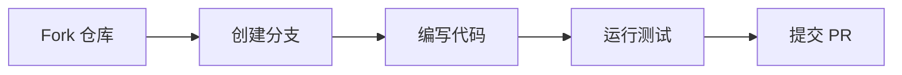

# 贡献指南

感谢你对 DL-Hub 的关注！以下是参与贡献的完整流程。

## 先选择正确入口

- 可复现的代码、文档、打包或运行问题：使用 [Bug 报告表单](https://github.com/skygazer42/DL-Hub/issues/new?template=bug_report.yml)。
- 新课程或实质扩展：使用 [Lesson 提案表单](https://github.com/skygazer42/DL-Hub/issues/new?template=lesson_proposal.yml)。
- Model Zoo 等级、源码证据或机制缺口：使用 [保真度审计表单](https://github.com/skygazer42/DL-Hub/issues/new?template=model_fidelity.yml)。
- 安全漏洞或疑似漏洞：不要公开建 Issue；按 [安全政策](https://github.com/skygazer42/DL-Hub/security/policy) 使用可用的 GitHub 私密报告入口，或联系仓库已公开的维护邮箱。

Issue、PR、日志和截图都不应包含访问令牌、私有数据、个人信息或未脱敏本地路径。
来源不明的 checkpoint 不要加载或公开上传；旧 checkpoint 的 unrestricted pickle 兼容开关只用于完全可信的文件。

---

## 贡献流程



### 1. Fork 与克隆

```bash
git clone https://github.com/<your-username>/DL-Hub.git
cd DL-Hub
# 先按安装指南安装适配平台的 PyTorch，再安装完整开发环境
python -m pip install -e ".[all,dev,docs]"
```

### 2. 创建分支

```bash
git checkout -b feat/your-feature-name
```

!!! info "分支命名"

    - 新功能：`feat/<description>`
    - 修复：`fix/<description>`
    - 文档：`docs/<description>`
    - 测试：`test/<description>`

### 3. 编写代码

遵循下面的代码规范编写你的改动。

### 4. 运行测试

```bash
make verify              # 快速仓库门禁（包含 Zoo 离线导入）
make lesson-entrypoints  # 修改 lesson 入口或 CLI 时运行 339 个 --help
make test                # 完整 pytest
make smoke               # 涉及训练链路时运行精选离线案例
make docs                # 涉及文档时严格构建站点
```

`make lesson-entrypoints` 通常约需 4–7 分钟，使用 CPU、离线环境变量及隔离的临时
cwd/缓存/输出目录；它不阻断 socket，也不替代训练 smoke。

### 5. 提交 PR

将你的分支推送到 GitHub 并创建 Pull Request，描述改动内容和目的。

---

## 代码风格

| 工具 | 用途 |
|------|------|
| **black** | 代码格式化 |
| **isort** | 导入排序 |
| **ruff** | Lint 检查 |

```bash
# 一键格式化
make format

# 检查但不修改
make lint      # Ruff
make contract  # 课程与文档契约
```

### 跨平台文本与资源卫生

根目录的 `.editorconfig` 约定新编辑的文本使用 UTF-8、LF 和末尾换行；Python 使用
4 空格缩进，Markdown 与 YAML 使用 2 空格缩进。支持 EditorConfig 的编辑器会自动读取，
Windows 贡献者无需为本仓库修改全局 `core.autocrlf`。

`.gitattributes` 会让 Git 对源码、配置和文档使用 LF，并将图片、PDF、压缩包、模型权重与
序列化数组明确视为二进制，避免文本归一化损坏资源。不要在功能 PR 中夹带全仓编码或
换行转换，只整理本次实际修改的文本文件。

少量 `optimization/` 下的历史 MATLAB 文件包含 GBK 注释，已按精确路径豁免自动编码和
换行处理。编辑这些文件时应保留原始字节；如需迁移到 UTF-8，请使用独立 PR 并验证
MATLAB/Octave 行为及 diff，而不是由编辑器静默转换。

---

## 新 Lesson 要求

添加新的课程 lesson 时，必须包含以下文件：

| 文件 | 要求 |
|------|------|
| `model.py` | 模型定义，纯 `nn.Module` |
| `data.py` | 数据加载，必须提供显式 fake 或内置 synthetic 离线路径 |
| `train.py` | 训练入口，使用 `dlhub/` 脚手架 |
| `README.md` | 课程文档，包含原理、架构、运行方式 |

!!! warning "离线测试必须通过"

    每个 lesson 必须能在无网络、纯 CPU 环境下运行：可选真实数据集的课程提供
    `--dataset fake`，其余课程直接使用内置数据。`make contract` 会检查入口和文档参数，
    新增训练链路还应补充针对性的 pytest。

### 验证层级不能互相替代

- `make contract` 证明入口、核心 CLI、文档命令和离线数据约定满足静态契约。
- `make smoke` 证明精选课程的最短 CPU 链路可运行。
- 针对性 pytest 证明本次新增机制的关键行为真实生效。
- benchmark 声明还必须记录数据版本、训练预算、评估协议、权重和结果。

synthetic/fake 数据、随机输入前向或 smoke 通过不能单独证明论文 benchmark 复现。

---

## Model Zoo 保真度贡献

修改论文名入口、共享基线或保真度台账时，必须分别列出已实现机制、缺失机制、源码路径和
最小行为证据。`baseline-alias` 表示当前实现委托给通用 baseline，**不是论文机制复现**；
仅改类名、复制文件或增加注册 ID 不能提升等级。

```bash
python scripts/model_fidelity.py --show <audit-key>
make fidelity
# 再运行能证明关键机制参与计算的 targeted pytest
```

等级定义与升级条件见 [实现契约](../implementation-contract.md) 和
[Model Zoo 保真度审计](../zoo/fidelity.md)。

---

## 代码约定

- **Python 版本**：3.10+
- **类型注解**：所有函数签名使用 type annotations
- **注释**：最少化注释，代码自文档化优先
- **文档字符串**：公开 API 使用 docstring

### 使用 dlhub/ 脚手架

```python
from dlhub.device import resolve_device
from dlhub.paths import build_run_paths
from dlhub.seed import set_seed

# 固定随机种子
set_seed(42)

# 自动设备选择
device_info = resolve_device("auto")

# 获取输出目录
paths = build_run_paths(track="vision", lesson="lesson_01", run_name="baseline")
```

---

## Make 命令速查

| 命令 | 功能 |
|------|------|
| `make lint` | 运行 Ruff 静态检查 |
| `make format` | 自动运行 isort、Black 和 Ruff 修复 |
| `make verify` | Lint + lesson/stats/Zoo/narrative/fidelity 仓库门禁（含 Zoo 离线导入） |
| `make contract` | 检查课程入口、核心 CLI、文档命令和精选 Smoke 覆盖 |
| `make stats` | 检查 README 与文档生成统计块是否匹配仓库 |
| `make lesson-entrypoints` | 隔离运行全部 339 个 lesson 的 `--help` 入口（通常约 4–7 分钟） |
| `make test` | 运行 pytest 完整测试套件 |
| `make check` | 运行 `verify` 和完整 pytest |
| `make smoke` | 运行覆盖 8 个 track 的精选离线冒烟测试 |
| `make docs` | 使用 strict 模式构建 MkDocs |
| `make package` | 构建并校验 wheel/sdist 元数据 |
| `make package-smoke` | 隔离验证 wheel，并从 sdist 重建后在第二个临时 venv 中安装验证 |
| `make release-check` | 依次执行完整测试、文档、打包和隔离安装检查 |

发布边界、CI 版本矩阵和构建产物说明见[发布检查](release.md)。
