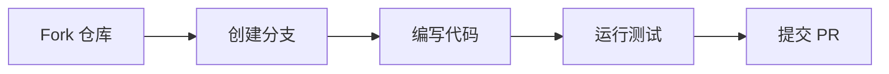

# 贡献指南

感谢你对 DL-Hub 的关注！以下是参与贡献的完整流程。

---

## 贡献流程



### 1. Fork 与克隆

```bash
git clone https://github.com/<your-username>/DL-Hub.git
cd DL-Hub
pip install -r requirements-dev.txt
```

### 2. 创建分支

```bash
git checkout -b feat/your-feature-name
```

!!! info "分支命名"

    - 新功能：`feat/<description>`
    - 修复：`fix/<description>`
    - 文档：`docs/<description>`
    - 测试：`test/<description>`

### 3. 编写代码

遵循下面的代码规范编写你的改动。

### 4. 运行测试

```bash
make lint      # 代码检查
make format    # 自动格式化
make test      # 运行完整测试套件
make smoke     # 冒烟测试
```

### 5. 提交 PR

将你的分支推送到 GitHub 并创建 Pull Request，描述改动内容和目的。

---

## 代码风格

| 工具 | 用途 |
|------|------|
| **black** | 代码格式化 |
| **isort** | 导入排序 |
| **ruff** | Lint 检查 |

```bash
# 一键格式化
make format

# 检查但不修改
make lint
```

---

## 新 Lesson 要求

添加新的课程 lesson 时，必须包含以下文件：

| 文件 | 要求 |
|------|------|
| `model.py` | 模型定义，纯 `nn.Module` |
| `data.py` | 数据加载，**必须支持** `--dataset fake` |
| `train.py` | 训练入口，使用 `dlhub/` 脚手架 |
| `README.md` | 课程文档，包含原理、架构、运行方式 |

!!! warning "离线测试必须通过"

    每个 lesson 的 `--dataset fake` 模式必须能在无网络、无 GPU 的环境下正常运行。
    CI 会自动验证此项。

---

## 代码约定

- **Python 版本**：3.10+
- **类型注解**：所有函数签名使用 type annotations
- **注释**：最少化注释，代码自文档化优先
- **文档字符串**：公开 API 使用 docstring

### 使用 dlhub/ 脚手架

```python
from dlhub.seed import seed_everything
from dlhub.device import auto_device
from dlhub.paths import get_output_dir

# 固定随机种子
seed_everything(42)

# 自动设备选择
device = auto_device()

# 获取输出目录
output_dir = get_output_dir("vision", "lesson_01", run_name="baseline")
```

---

## Make 命令速查

| 命令 | 功能 |
|------|------|
| `make lint` | 运行 ruff + black --check + isort --check |
| `make format` | 自动格式化（black + isort） |
| `make test` | 运行 pytest 完整测试套件 |
| `make smoke` | 冒烟测试所有 lesson 的 fake 模式 |
