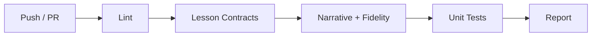

# 测试指南

DL-Hub 使用静态契约、精选 smoke、针对性 pytest 和完整 CI 四层验证。
默认从改动能证明的最小范围开始；测试数量不是目标，结论与改动范围匹配才是目标。

完整分层定义见 [实现契约](../implementation-contract.md)。

---

## 运行测试

### 日常改动：先做静态验证

```bash
# lint + lesson contract + 命名叙事 + Model Zoo 保真度元数据
make verify
```

这些检查不训练模型。随后只运行与修改文件直接相关的测试：

```bash
# 单个测试文件
pytest -q tests/test_kmeans.py

# 单个关键行为
pytest -q tests/test_kmeans.py::test_kmeans_clusters_separable_points
```

### 何时扩大范围

- 改动训练链路：运行对应 lesson 的 smoke 或短训练测试。
- 改动共享底层模块：运行该模块测试和受影响的代表性 track 测试。
- 改动注册表/发现逻辑：运行对应 Zoo、统计或 lesson contract 测试。
- 发布前或 CI：运行 `pytest -q` / `make test` 完整套件。

### 查看测试覆盖率

```bash
pytest --cov=dlhub --cov=ml_algorithms --cov-report=term-missing
```

---

## 冒烟测试

精选冒烟测试从 8 个 track 各取代表性课程，验证离线 CPU 训练链路和核心依赖。
它不是 339 个课程的全量训练；全量入口与文档参数由静态课程契约检查覆盖。

```bash
# 运行全局冒烟测试
python scripts/smoke_check.py

# 或通过 Make
make smoke

# 查看精选覆盖清单
python scripts/smoke_check.py --list

# 检查全部 lesson 的静态契约
make contract
```

!!! tip "冒烟测试的意义"

    冒烟测试确保：

    - 8 个学习 track 都至少有一个代表性案例
    - 代表性模型的前向传播和短训练链路正常
    - 输出配置、指标和检查点能够落盘
    - 不依赖外部数据下载或 GPU

---

## 编写测试

### 为新 Lesson 编写测试

不要因为新增一个目录就机械复制三套测试。先判断现有 contract 和 curated smoke 是否已经覆盖；
只有存在新的行为边界、计算机制或回归风险时才增加针对性测试。例如：

```python
# tests/test_vision_lesson_XX.py
import torch


def test_conditioning_changes_prediction():
    """验证本课新增的条件机制真实参与计算。"""
    from tracks.vision.lesson_XX.model import MyModel

    model = MyModel()
    x = torch.randn(2, 3, 32, 32)
    condition_a = torch.zeros(2, 8)
    condition_b = torch.ones(2, 8)
    assert not torch.allclose(model(x, condition_a), model(x, condition_b))
```

形状、CLI 和离线入口如果已由共享测试或静态 contract 保证，不在每个 lesson 重复断言。

### 测试文件命名

```text
tests/
├── test_linear_models.py       # ML 算法测试
├── test_kmeans.py              # ML 算法测试
├── test_optimizers.py          # 优化器测试
├── test_vision_lesson_01.py    # 课程冒烟测试
├── test_detection_zoo.py       # Zoo CLI 测试
└── ...
```

!!! note "命名约定"

    - ML 算法测试：`test_<algorithm_name>.py`
    - 课程测试：`test_<track>_lesson_<XX>.py`
    - Zoo 测试：`test_<zoo_name>.py`
    - 工具测试：`test_<tool_name>.py`

---

## CI 集成

DL-Hub 使用 **GitHub Actions** 进行持续集成。

### CI 流水线



### CI 检查项

| 检查 | 命令 | 说明 |
|------|------|------|
| Lint | `make lint` | Ruff 静态检查 |
| Lesson Contracts | `make contract` | 全量入口、核心 CLI、文档命令与精选 Smoke 覆盖 |
| Narrative | `make narrative` | 命名边界与 lesson 路径一致性 |
| Fidelity | `make fidelity` | Model Zoo 审计元数据与源码证据 |
| Tests | `pytest -q` | 全量单元测试 |

`make smoke` 是本地或发布前的代表性运行验证，目前不在常规 GitHub Actions 中重复执行。

!!! warning "PR 合并前提"

    所有 CI 检查必须通过后 PR 才能合并。
    如果测试失败，请查看 Actions 日志定位问题。
