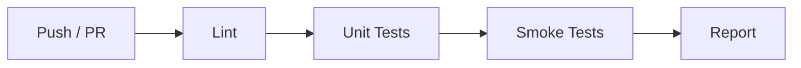

# 测试指南

DL-Hub 使用 **pytest** 作为测试框架，目前拥有 **126+** 个测试文件，
覆盖 ML 算法、优化工具、各赛道 lesson 和 Zoo CLI。

---

## 运行测试

### 完整测试套件

```bash
# 使用 pytest 直接运行
pytest -q

# 或通过 Make
make test
```

### 运行指定测试

```bash
# 运行单个测试文件
pytest tests/test_kmeans.py -v

# 运行匹配名称的测试
pytest -k "test_linear" -v

# 运行指定目录
pytest tests/ -q
```

### 查看测试覆盖率

```bash
pytest --cov=dlhub --cov=ml_algorithms --cov-report=term-missing
```

---

## 冒烟测试

冒烟测试验证每个 lesson 在 `--dataset fake` 模式下能正常运行（无网络、无 GPU）。

```bash
# 运行全局冒烟测试
python scripts/smoke_check.py

# 或通过 Make
make smoke
```

!!! tip "冒烟测试的意义"

    冒烟测试确保：

    - 所有 lesson 的 `data.py` 能生成 fake 数据
    - `model.py` 的前向传播正常工作
    - `train.py` 能完成至少 1 个 epoch
    - 不依赖外部数据下载或 GPU

---

## 编写测试

### 为新 Lesson 编写测试

每个新 lesson 应在 `tests/` 下添加对应的测试文件：

```python
# tests/test_vision_lesson_XX.py
import pytest
import torch


def test_model_forward():
    """模型前向传播测试。"""
    from tracks.vision.lesson_XX.model import MyModel

    model = MyModel()
    x = torch.randn(2, 3, 32, 32)
    out = model(x)
    assert out.shape == (2, 10)


def test_fake_dataset():
    """fake 数据集测试。"""
    from tracks.vision.lesson_XX.data import get_dataloader

    loader = get_dataloader(dataset="fake", batch_size=4)
    batch = next(iter(loader))
    assert batch[0].shape[0] == 4


def test_smoke_train():
    """冒烟训练测试（1 epoch）。"""
    import subprocess
    result = subprocess.run(
        ["python", "-m", "tracks.vision.lesson_XX.train",
         "--dataset", "fake", "--epochs", "1", "--device", "cpu"],
        capture_output=True, text=True
    )
    assert result.returncode == 0
```

### 测试文件命名

```text
tests/
├── test_linear_models.py       # ML 算法测试
├── test_kmeans.py              # ML 算法测试
├── test_optimizers.py          # 优化器测试
├── test_vision_lesson_01.py    # 课程冒烟测试
├── test_detection_zoo.py       # Zoo CLI 测试
└── ...
```

!!! note "命名约定"

    - ML 算法测试：`test_<algorithm_name>.py`
    - 课程测试：`test_<track>_lesson_<XX>.py`
    - Zoo 测试：`test_<zoo_name>.py`
    - 工具测试：`test_<tool_name>.py`

---

## CI 集成

DL-Hub 使用 **GitHub Actions** 进行持续集成。

### CI 流水线



### CI 检查项

| 检查 | 命令 | 说明 |
|------|------|------|
| Lint | `make lint` | black + isort + ruff |
| Tests | `pytest -q` | 全量单元测试 |
| Smoke | `make smoke` | 所有 lesson 的 fake 模式 |

!!! warning "PR 合并前提"

    所有 CI 检查必须通过后 PR 才能合并。
    如果测试失败，请查看 Actions 日志定位问题。
