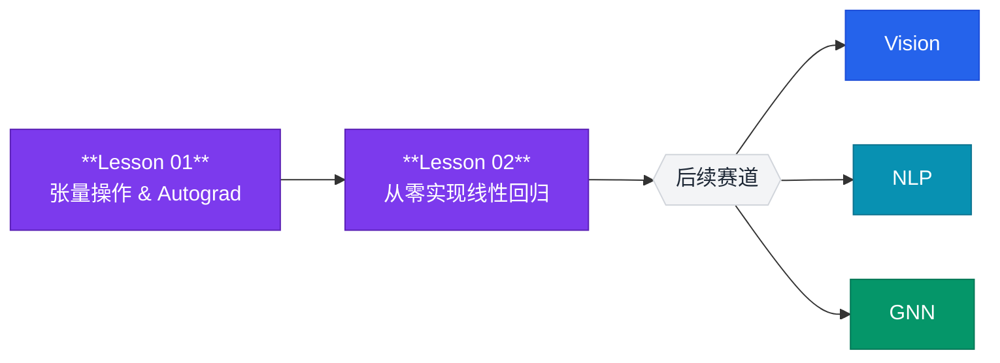

# 基础赛道

!!! abstract "赛道概览"
    **2 个 Lesson** · 预计 2-3 小时 · 张量、自动求导、训练循环入门

    Foundations 是所有后续赛道的基石。你将从零开始掌握 PyTorch 的核心抽象——**张量与计算图**，并手写一个完整的线性回归训练循环。

---

## 学习路径



---

## 先修知识

| 领域 | 要求 | 建议资源 |
|:-----|:-----|:---------|
| Python | 基础语法、函数、类 | [Python 官方教程](https://docs.python.org/3/tutorial/) |
| 线性代数 | 向量、矩阵乘法、转置 | 3Blue1Brown *Essence of Linear Algebra* |
| 微积分 | 偏导数、链式法则（了解即可） | Khan Academy *Multivariable Calculus* |

---

## 课程列表

| 序号 | 项目 | 代码文档 | 核心概念 |
|:----:|:-----|:---------|:---------|
| 01 | **张量操作 & Autograd 机制** | [`lesson_01_tensors`](https://github.com/skygazer42/DL-Hub/tree/main/tracks/foundations/lesson_01_tensors/) | `torch.Tensor`, `backward()`, 计算图 |
| 02 | **从零实现线性回归** | [`lesson_02_linear_regression`](https://github.com/skygazer42/DL-Hub/tree/main/tracks/foundations/lesson_02_linear_regression_autograd/) | 梯度下降, 损失函数, 参数更新 |

---

### Lesson 01 — 张量操作 & Autograd 机制

!!! info "学习目标"
    - 理解 `torch.Tensor` 的创建、索引、广播和运算
    - 掌握 `requires_grad=True` 与 `backward()` 自动求导机制
    - 理解计算图（Computational Graph）的构建与释放

**核心知识点：**

- **张量创建**：`torch.zeros`, `torch.ones`, `torch.randn`, `torch.arange`
- **张量运算**：逐元素运算、矩阵乘法 (`@`, `torch.matmul`)、广播规则
- **Autograd 机制**：`requires_grad`, `grad_fn`, `backward()`, `torch.no_grad()`
- **计算图**：动态图 vs 静态图，叶子节点与中间节点

```bash
# 运行 Lesson 01（内置张量演示，无需数据集）
python -m tracks.foundations.lesson_01_tensors.run
```

---

### Lesson 02 — 从零实现线性回归

!!! info "学习目标"
    - 手写完整的训练循环：前向传播 → 计算损失 → 反向传播 → 参数更新
    - 理解梯度下降（Gradient Descent）的数学原理
    - 掌握损失函数（MSE Loss）和参数更新策略

**核心知识点：**

- **线性模型**：$y = Wx + b$，权重与偏置
- **损失函数**：均方误差 $\mathcal{L} = \frac{1}{N}\sum(y - \hat{y})^2$
- **梯度下降**：$W \leftarrow W - \eta \cdot \frac{\partial \mathcal{L}}{\partial W}$
- **训练循环**：`forward → loss → backward → step → zero_grad`

```bash
# 运行 Lesson 02（离线冒烟模式）
python -m tracks.foundations.lesson_02_linear_regression_autograd.train \
  --epochs 1 \
  --max-train-batches 2 --max-eval-batches 2
```

---

## 验收标准

!!! success "完成 Foundations 后，你应该能够："
    - [x] 创建张量并执行矩阵运算
    - [x] 使用 Autograd 自动计算梯度
    - [x] 独立编写一个完整的训练循环
    - [x] 理解 `loss.backward()` 背后发生了什么
    - [x] 解释为什么需要 `optimizer.zero_grad()`

---

## 下一步

完成 Foundations 后，你可以根据兴趣选择：

| 推荐方向 | 说明 |
|:---------|:-----|
| :arrow_right: [Vision 视觉赛道](vision.md) | 从 LeNet 开始学习卷积神经网络 |
| :arrow_right: [NLP 赛道](nlp.md) | 从词嵌入开始学习文本处理 |
| :arrow_right: [GNN 赛道](gnn.md) | 从图分类开始学习图神经网络 |
