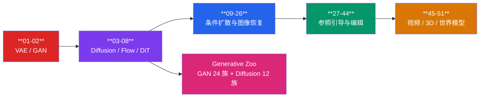
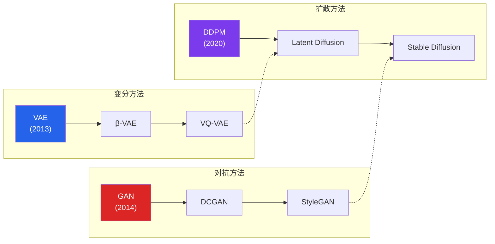

# 生成模型赛道

!!! abstract "赛道概览"
    **51 个 Lesson** · 预计 3-4 周 · VAE / GAN / Diffusion / Flow / DiT 风格最小实现

    Generative 赛道从 **VAE** 和 **GAN** 两大经典范式出发，覆盖 DDPM、Latent Diffusion、Consistency Model、Flow Matching、Rectified Flow、Diffusion Transformer 等现代生成范式，并延伸到条件扩散、图像恢复、reference-guided generation、identity-preserving editing、layout-preserving editing，以及视频扩散、图生视频、Text-to-3D 与世界模型。所有 Lesson 均支持 `--dataset fake` 离线冒烟测试。

---

## 学习路径



---

## 先修知识

| 领域 | 要求 |
|:-----|:-----|
| DL-Hub | 完成 [Vision 视觉赛道](vision.md)（至少 Lesson 01-03） |
| 概率论 | 贝叶斯定理、高斯分布、KL 散度基本概念 |
| 优化 | 理解 min-max 博弈的直觉 |

---

## 课程列表

全部 **51 个 Lesson** 按主题分组如下，从 VAE / GAN / Diffusion / Flow / DiT 基础范式，延伸到条件扩散、参照引导编辑与视频 / 3D 生成。

### 生成范式基础（01-09）

| 序号 | 项目 | 代码文档 | 核心概念 |
|:----:|:-----|:---------|:---------|
| 01 | **VAE 重建 & 生成** | [`vae_mnist`](https://github.com/skygazer42/DL-Hub/tree/main/tracks/generative/lesson_01_vae_mnist/) | 重参数化技巧, KL 散度, ELBO |
| 02 | **GAN 生成** | [`gan_mnist`](https://github.com/skygazer42/DL-Hub/tree/main/tracks/generative/lesson_02_gan_mnist/) | 生成器/判别器对抗, 纳什均衡 |
| 03 | **DDPM 风格扩散** | [`toy_diffusion_mnist`](https://github.com/skygazer42/DL-Hub/tree/main/tracks/generative/lesson_03_toy_diffusion_mnist/) | 噪声预测, 时间步条件, 反向采样 |
| 04 | **Latent Diffusion** | [`toy_latent_diffusion`](https://github.com/skygazer42/DL-Hub/tree/main/tracks/generative/lesson_04_toy_latent_diffusion/) | 潜空间自编码器, 潜变量去噪 |
| 05 | **Consistency Model** | [`toy_consistency_model`](https://github.com/skygazer42/DL-Hub/tree/main/tracks/generative/lesson_05_toy_consistency_model/) | 一步一致性映射, 蒸馏式采样 |
| 06 | **Flow Matching** | [`toy_flow_matching`](https://github.com/skygazer42/DL-Hub/tree/main/tracks/generative/lesson_06_toy_flow_matching/) | 向量场回归, 连续时间输运 |
| 07 | **Rectified Flow** | [`toy_rectified_flow`](https://github.com/skygazer42/DL-Hub/tree/main/tracks/generative/lesson_07_toy_rectified_flow/) | 直线路径输运, 重参数化流场 |
| 08 | **Diffusion Transformer** | [`toy_diffusion_transformer`](https://github.com/skygazer42/DL-Hub/tree/main/tracks/generative/lesson_08_toy_diffusion_transformer/) | Patch Token 去噪, DiT 风格骨干 |
| 09 | **Conditional GAN** | [`toy_conditional_gan`](https://github.com/skygazer42/DL-Hub/tree/main/tracks/generative/lesson_09_toy_conditional_gan/) | 标签条件生成, 条件判别器, 对抗训练 |

### 条件扩散与图像恢复（10-26）

| 序号 | 项目 | 代码文档 | 核心概念 |
|:----:|:-----|:---------|:---------|
| 10 | **Diffusion Image Editing** | [`toy_diffusion_image_editing`](https://github.com/skygazer42/DL-Hub/tree/main/tracks/generative/lesson_10_toy_diffusion_image_editing/) | 源图条件, 编辑掩码, 噪声残差预测 |
| 11 | **ControlNet** | [`toy_controlnet`](https://github.com/skygazer42/DL-Hub/tree/main/tracks/generative/lesson_11_toy_controlnet/) | 结构提示分支, 残差条件控制, 条件去噪 |
| 12 | **Layout-to-Image** | [`toy_layout_to_image`](https://github.com/skygazer42/DL-Hub/tree/main/tracks/generative/lesson_12_toy_layout_to_image/) | 布局框编码, 对象组合渲染, 条件生成 |
| 13 | **Text-to-Image Diffusion** | [`toy_text_to_image_diffusion`](https://github.com/skygazer42/DL-Hub/tree/main/tracks/generative/lesson_13_toy_text_to_image_diffusion/) | 文本条件去噪, 提示嵌入, 合成场景生成 |
| 14 | **Diffusion Inpainting** | [`toy_diffusion_inpainting`](https://github.com/skygazer42/DL-Hub/tree/main/tracks/generative/lesson_14_toy_diffusion_inpainting/) | 掩码条件修复, 上下文重建, 局部内容填充 |
| 15 | **Diffusion Super-Resolution** | [`toy_diffusion_super_resolution`](https://github.com/skygazer42/DL-Hub/tree/main/tracks/generative/lesson_15_toy_diffusion_super_resolution/) | 低分辨率条件去噪, 上采样重建, 细节恢复 |
| 16 | **Diffusion Deblurring** | [`toy_diffusion_deblurring`](https://github.com/skygazer42/DL-Hub/tree/main/tracks/generative/lesson_16_toy_diffusion_deblurring/) | 模糊图条件去噪, 锐化重建, 配对清晰图恢复 |
| 17 | **Diffusion Denoising** | [`toy_diffusion_denoising`](https://github.com/skygazer42/DL-Hub/tree/main/tracks/generative/lesson_17_toy_diffusion_denoising/) | 噪声图条件去噪, 扩散残差预测, 配对干净图恢复 |
| 18 | **Diffusion Deraining** | [`toy_diffusion_deraining`](https://github.com/skygazer42/DL-Hub/tree/main/tracks/generative/lesson_18_toy_diffusion_deraining/) | 雨条纹条件去噪, 配对去雨恢复, 扩散式重建 |
| 19 | **Diffusion Dehazing** | [`toy_diffusion_dehazing`](https://github.com/skygazer42/DL-Hub/tree/main/tracks/generative/lesson_19_toy_diffusion_dehazing/) | 雾化图条件去噪, 配对清晰图恢复, 大气退化建模 |
| 20 | **Diffusion Reflection Removal** | [`toy_diffusion_reflection_removal`](https://github.com/skygazer42/DL-Hub/tree/main/tracks/generative/lesson_20_toy_diffusion_reflection_removal/) | 反光层条件去噪, 透射内容恢复, 配对扩散重建 |
| 21 | **Diffusion Image Fusion** | [`toy_diffusion_image_fusion`](https://github.com/skygazer42/DL-Hub/tree/main/tracks/generative/lesson_21_toy_diffusion_image_fusion/) | 配对多源观测融合, 条件扩散去噪, 互补细节重建 |
| 22 | **Diffusion Style Transfer** | [`toy_diffusion_style_transfer`](https://github.com/skygazer42/DL-Hub/tree/main/tracks/generative/lesson_22_toy_diffusion_style_transfer/) | 内容/风格双条件去噪, 纹理迁移, 配对重建 |
| 23 | **Diffusion Multi-Focus Fusion** | [`toy_diffusion_multi_focus_fusion`](https://github.com/skygazer42/DL-Hub/tree/main/tracks/generative/lesson_23_toy_diffusion_multi_focus_fusion/) | 双焦平面条件去噪, 清晰区域互补融合, 轨迹采样 |
| 24 | **Diffusion Image Synthesis** | [`toy_diffusion_image_synthesis`](https://github.com/skygazer42/DL-Hub/tree/main/tracks/generative/lesson_24_toy_diffusion_image_synthesis/) | 条件场景生成, 结构提示编码, 扩散式图像合成 |
| 25 | **Diffusion Compositional Generation** | [`toy_diffusion_compositional_generation`](https://github.com/skygazer42/DL-Hub/tree/main/tracks/generative/lesson_25_toy_diffusion_compositional_generation/) | 结构/纹理双条件组合, 扩散式图像合成, 条件轨迹采样 |
| 26 | **Diffusion Image Variation** | [`toy_diffusion_image_variation`](https://github.com/skygazer42/DL-Hub/tree/main/tracks/generative/lesson_26_toy_diffusion_image_variation/) | 源图条件变体生成, 风格/布局轻扰动, 扩散重采样 |

### 参照引导与编辑专题（27-44）

| 序号 | 项目 | 代码文档 | 核心概念 |
|:----:|:-----|:---------|:---------|
| 27 | **Diffusion Reference-Guided Generation** | [`toy_diffusion_reference_guided_generation`](https://github.com/skygazer42/DL-Hub/tree/main/tracks/generative/lesson_27_toy_diffusion_reference_guided_generation/) | reference/condition 双条件, 外观参照引导, 轨迹式去噪采样 |
| 28 | **Diffusion Subject-Driven Generation** | [`toy_diffusion_subject_driven_generation`](https://github.com/skygazer42/DL-Hub/tree/main/tracks/generative/lesson_28_toy_diffusion_subject_driven_generation/) | 主体外观保持, guidance 条件控制, subject-consistent 生成 |
| 29 | **Diffusion Multi-Reference Generation** | [`toy_diffusion_multi_reference_generation`](https://github.com/skygazer42/DL-Hub/tree/main/tracks/generative/lesson_29_toy_diffusion_multi_reference_generation/) | 双 reference + 条件图联合去噪, 外观混合控制, 多条件轨迹采样 |
| 30 | **Diffusion Identity-Preserving Editing** | [`toy_diffusion_identity_preserving_editing`](https://github.com/skygazer42/DL-Hub/tree/main/tracks/generative/lesson_30_toy_diffusion_identity_preserving_editing/) | 身份保持编辑, identity/source 双条件, 编辑一致性采样 |
| 31 | **Diffusion Reference Editing** | [`toy_diffusion_reference_editing`](https://github.com/skygazer42/DL-Hub/tree/main/tracks/generative/lesson_31_toy_diffusion_reference_editing/) | source/reference 双条件编辑, 外观借用, reference-conditioned 去噪 |
| 32 | **Diffusion Layout-Preserving Editing** | [`toy_diffusion_layout_preserving_editing`](https://github.com/skygazer42/DL-Hub/tree/main/tracks/generative/lesson_32_toy_diffusion_layout_preserving_editing/) | layout/edit 双条件编辑, 全局结构保持, 局部条件扩散 |
| 33 | **Diffusion Masked Reference Editing** | [`toy_diffusion_masked_reference_editing`](https://github.com/skygazer42/DL-Hub/tree/main/tracks/generative/lesson_33_toy_diffusion_masked_reference_editing/) | source/reference/mask 三条件编辑, 局部外观借用, mask-aware 去噪 |
| 34 | **Diffusion Layout-Reference Fusion** | [`toy_diffusion_layout_reference_fusion`](https://github.com/skygazer42/DL-Hub/tree/main/tracks/generative/lesson_34_toy_diffusion_layout_reference_fusion/) | layout/reference 双条件融合, 结构与纹理解耦, 条件去噪生成 |
| 35 | **Diffusion Box-Mask Editing** | [`toy_diffusion_box_mask_editing`](https://github.com/skygazer42/DL-Hub/tree/main/tracks/generative/lesson_35_toy_diffusion_box_mask_editing/) | source/box-mask 双条件编辑, 矩形局部重写, mask-aware 去噪 |
| 36 | **Diffusion Layout-Subject Fusion** | [`toy_diffusion_layout_subject_fusion`](https://github.com/skygazer42/DL-Hub/tree/main/tracks/generative/lesson_36_toy_diffusion_layout_subject_fusion/) | layout/subject 双条件融合, 结构与主体属性解耦, 条件采样 |
| 37 | **Diffusion Polygon-Mask Editing** | [`toy_diffusion_polygon_mask_editing`](https://github.com/skygazer42/DL-Hub/tree/main/tracks/generative/lesson_37_toy_diffusion_polygon_mask_editing/) | source/polygon-mask 双条件编辑, 多边形局部重写, mask-aware 去噪 |
| 38 | **Diffusion Layout-Attribute Fusion** | [`toy_diffusion_layout_attribute_fusion`](https://github.com/skygazer42/DL-Hub/tree/main/tracks/generative/lesson_38_toy_diffusion_layout_attribute_fusion/) | layout/attribute 双条件融合, 布局与属性解耦, 条件采样 |
| 39 | **Diffusion Scribble-Mask Editing** | [`toy_diffusion_scribble_mask_editing`](https://github.com/skygazer42/DL-Hub/tree/main/tracks/generative/lesson_39_toy_diffusion_scribble_mask_editing/) | source/scribble-mask 双条件编辑, 稀疏涂鸦局部重写, mask-aware 去噪 |
| 40 | **Diffusion Layout-Style Fusion** | [`toy_diffusion_layout_style_fusion`](https://github.com/skygazer42/DL-Hub/tree/main/tracks/generative/lesson_40_toy_diffusion_layout_style_fusion/) | layout/style 双条件融合, 结构与风格解耦, 条件采样 |
| 41 | **Diffusion Stroke-Mask Editing** | [`toy_diffusion_stroke_mask_editing`](https://github.com/skygazer42/DL-Hub/tree/main/tracks/generative/lesson_41_toy_diffusion_stroke_mask_editing/) | source/stroke-mask 双条件编辑, 画笔轨迹局部重写, mask-aware 去噪 |
| 42 | **Diffusion Layout-Palette Fusion** | [`toy_diffusion_layout_palette_fusion`](https://github.com/skygazer42/DL-Hub/tree/main/tracks/generative/lesson_42_toy_diffusion_layout_palette_fusion/) | layout/palette 双条件融合, 结构与配色解耦, 条件采样 |
| 43 | **Diffusion Path-Mask Editing** | [`toy_diffusion_path_mask_editing`](https://github.com/skygazer42/DL-Hub/tree/main/tracks/generative/lesson_43_toy_diffusion_path_mask_editing/) | source/path-mask 双条件编辑, 轨迹路径局部重写, mask-aware 去噪 |
| 44 | **Diffusion Layout-Lighting Fusion** | [`toy_diffusion_layout_lighting_fusion`](https://github.com/skygazer42/DL-Hub/tree/main/tracks/generative/lesson_44_toy_diffusion_layout_lighting_fusion/) | layout/lighting 双条件融合, 结构与光照解耦, 条件采样 |

### 视频 / 3D / 世界模型（45-51）

| 序号 | 项目 | 代码文档 | 核心概念 |
|:----:|:-----|:---------|:---------|
| 45 | **Toy Video Diffusion** | [`toy_video_diffusion`](https://github.com/skygazer42/DL-Hub/tree/main/tracks/generative/lesson_45_toy_video_diffusion/) | 多帧条件去噪, 时间一致性, keyframe + motion conditioning |
| 46 | **Toy Image-to-Video Diffusion** | [`toy_image_to_video_diffusion`](https://github.com/skygazer42/DL-Hub/tree/main/tracks/generative/lesson_46_toy_image_to_video_diffusion/) | 源图条件短视频生成, 首帧约束, motion-conditioned 去噪 |
| 47 | **Toy Text-to-3D** | [`toy_text_to_3d`](https://github.com/skygazer42/DL-Hub/tree/main/tracks/generative/lesson_47_toy_text_to_3d/) | 文本条件三维表示生成, triplane/density 联合监督, mesh token 回归 |
| 48 | **Toy Image-to-3D** | [`toy_image_to_3d`](https://github.com/skygazer42/DL-Hub/tree/main/tracks/generative/lesson_48_toy_image_to_3d/) | 单图三维提升, density/mesh token 重建, image-conditioned 3D lifting |
| 49 | **Toy Text-to-Video** | [`toy_text_to_video`](https://github.com/skygazer42/DL-Hub/tree/main/tracks/generative/lesson_49_toy_text_to_video/) | 文本条件短视频生成, prompt feature 调制, 时序外观变化建模 |
| 50 | **Toy Video-to-Video** | [`toy_video_to_video`](https://github.com/skygazer42/DL-Hub/tree/main/tracks/generative/lesson_50_toy_video_to_video/) | 源视频条件变换, residual/mix 建模, 时序一致视频翻译 |
| 51 | **Toy World Models** | [`toy_world_models`](https://github.com/skygazer42/DL-Hub/tree/main/tracks/generative/lesson_51_toy_world_models/) | 潜在状态转移建模, 观测重建, 短轨迹 rollout 监督 |

```bash
# 冒烟测试 DDPM 风格扩散（Lesson 03）
python -m tracks.generative.lesson_03_toy_diffusion_mnist.train \
  --dataset fake --epochs 1 \
  --max-train-batches 2 --max-eval-batches 2
```

---

## 重点课程精讲

下面两课配有完整的公式推导与技术拆解，适合精读入门。

### Lesson 01 — VAE 重建 & 生成

!!! info "学习目标"
    - 理解变分推断与证据下界（ELBO）
    - 掌握重参数化技巧（Reparameterization Trick）
    - 理解重建损失与 KL 散度正则化的平衡

**核心公式：**

$$
\mathcal{L}_{\text{VAE}} = \underbrace{\mathbb{E}_{q(z|x)}[\log p(x|z)]}_{\text{重建项}} - \underbrace{D_{\text{KL}}(q(z|x) \| p(z))}_{\text{正则化项}}
$$

**关键技术：**

| 概念 | 说明 |
|:-----|:-----|
| **Encoder** | 输入图像 $x$，输出潜在分布参数 $\mu, \sigma$ |
| **重参数化** | $z = \mu + \sigma \cdot \epsilon$，$\epsilon \sim \mathcal{N}(0, I)$，使采样可导 |
| **Decoder** | 从潜在变量 $z$ 重建图像 $\hat{x}$ |
| **ELBO** | Evidence Lower Bound，VAE 优化目标 |

```bash
python -m tracks.generative.lesson_01_vae_mnist.train \
  --dataset fake --epochs 1 \
  --max-train-batches 2 --max-eval-batches 2
```

---

### Lesson 02 — GAN 生成

!!! info "学习目标"
    - 理解生成器（Generator）与判别器（Discriminator）的对抗训练
    - 掌握 GAN 的 min-max 博弈目标
    - 理解训练不稳定性与纳什均衡的关系

**核心公式：**

$$
\min_G \max_D \; \mathbb{E}_{x \sim p_{\text{data}}}[\log D(x)] + \mathbb{E}_{z \sim p_z}[\log(1 - D(G(z)))]
$$

**关键技术：**

| 概念 | 说明 |
|:-----|:-----|
| **Generator** | 从随机噪声 $z$ 生成逼真图像 $G(z)$ |
| **Discriminator** | 判断输入图像是真实还是生成 |
| **对抗训练** | G 和 D 交替优化，互相博弈 |
| **纳什均衡** | 理想状态下 $D(x) = 0.5$，无法区分真假 |

```bash
python -m tracks.generative.lesson_02_gan_mnist.train \
  --dataset fake --epochs 1 \
  --max-train-batches 2 --max-eval-batches 2
```

---

## VAE vs GAN 对比

| 维度 | VAE | GAN |
|:-----|:----|:----|
| **理论基础** | 变分推断 | 博弈论 |
| **训练方式** | 最大化 ELBO | Min-Max 对抗 |
| **生成质量** | 偏模糊，分布覆盖好 | 清晰锐利，可能模式坍塌 |
| **潜在空间** | 连续、可插值 | 无显式后验 |
| **训练稳定性** | 稳定 | 需要精心调参 |
| **评价指标** | ELBO, Reconstruction Loss | FID, IS |

---

## Generative Zoo

!!! note "GAN 24 族 + Diffusion 12 族"
    Generative Zoo 提供了完整的生成模型架构库，从经典 DCGAN 到前沿 Diffusion Models，所有实现均为纯 PyTorch 教学代码。

```bash
# GAN Zoo
python scripts/gan_zoo.py --list
python scripts/gan_zoo.py --search stylegan
python scripts/gan_zoo.py --smoke dlgan:dcgan_tiny

# Diffusion Zoo
python scripts/diffusion_zoo.py --list
python scripts/diffusion_zoo.py --search ddpm
python scripts/diffusion_zoo.py --smoke dldiff:ddpm_tiny
```

??? info "GAN 架构分类（点击展开）"

    | 类别 | 代表架构 | 特点 |
    |:-----|:---------|:-----|
    | **无条件 GAN** | DCGAN, WGAN, WGAN-GP, LSGAN, SNGAN | 基础生成模型 |
    | **条件 GAN** | cGAN, ACGAN, InfoGAN, Pix2Pix | 条件控制生成 |
    | **图像翻译** | CycleGAN, StarGAN, UNIT, MUNIT | 风格迁移与域转换 |
    | **高分辨率** | ProGAN, StyleGAN, StyleGAN2, StyleGAN3 | 渐进式高质量生成 |
    | **轻量级** | LightGAN, FastGAN | 训练高效的生成模型 |

??? info "Diffusion 架构分类（点击展开）"

    | 类别 | 代表架构 | 特点 |
    |:-----|:---------|:-----|
    | **基础扩散** | DDPM, DDIM, Score-SDE | 去噪扩散概率模型 |
    | **条件扩散** | Classifier-Guided, Classifier-Free | 条件引导生成 |
    | **隐空间扩散** | Latent Diffusion, Stable Diffusion | 高效隐空间扩散 |
    | **快速采样** | DPM-Solver, Consistency Models | 减少采样步数 |

---

## 生成模型发展脉络



---

## 下一步

完成 Generative 赛道后，你可以继续：

| 推荐方向 | 说明 |
|:---------|:-----|
| :arrow_right: [LLM 大语言模型赛道](llm.md) | 从生成图像到生成文本 |
| :arrow_right: [Multimodal 多模态赛道](multimodal.md) | 跨模态生成与理解 |
