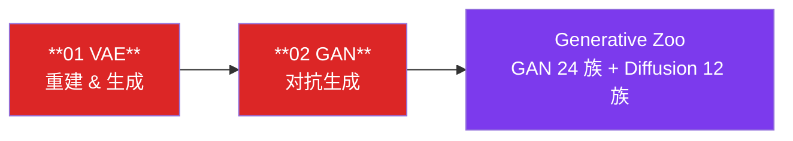
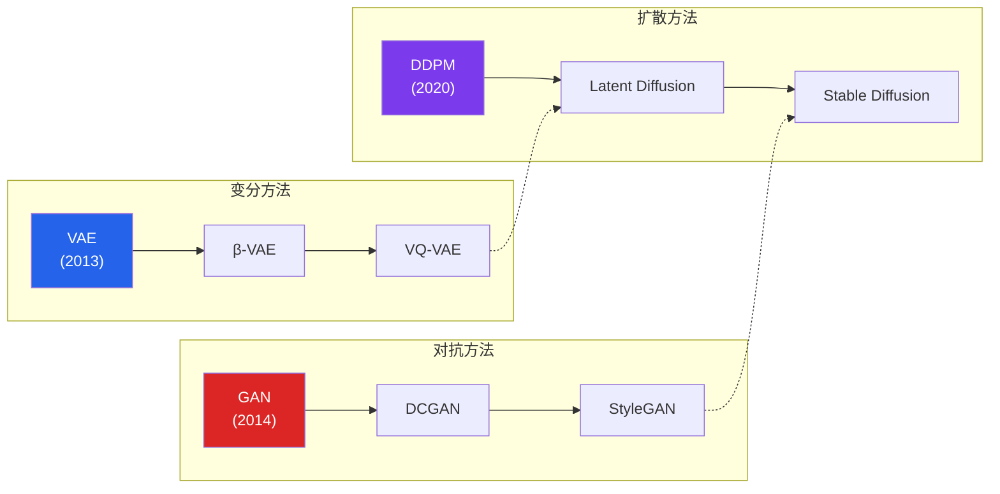

# 生成模型赛道

!!! abstract "赛道概览"
    **2 个 Lesson** · 预计 1-2 天 · VAE 重建与生成 + GAN 对抗训练

    Generative 赛道聚焦深度生成模型的两大经典范式：**变分自编码器（VAE）** 和 **生成对抗网络（GAN）**。两个 Lesson 均在 MNIST 数据集上实现，支持 `--dataset fake` 离线冒烟测试，让你在最短时间内理解生成模型的核心思想。

---

## 学习路径



---

## 先修知识

| 领域 | 要求 |
|:-----|:-----|
| DL-Hub | 完成 [Vision 视觉赛道](vision.md)（至少 Lesson 01-03） |
| 概率论 | 贝叶斯定理、高斯分布、KL 散度基本概念 |
| 优化 | 理解 min-max 博弈的直觉 |

---

## 课程列表

| 序号 | 项目 | 代码文档 | 核心概念 |
|:----:|:-----|:---------|:---------|
| 01 | **VAE 重建 & 生成** | [`vae_mnist`](https://github.com/skygazer42/DL-Hub/tree/main/tracks/generative/lesson_01_vae_mnist/) | 重参数化技巧, KL 散度, ELBO |
| 02 | **GAN 生成** | [`gan_mnist`](https://github.com/skygazer42/DL-Hub/tree/main/tracks/generative/lesson_02_gan_mnist/) | 生成器/判别器对抗, 纳什均衡 |

---

### Lesson 01 — VAE 重建 & 生成

!!! info "学习目标"
    - 理解变分推断与证据下界（ELBO）
    - 掌握重参数化技巧（Reparameterization Trick）
    - 理解重建损失与 KL 散度正则化的平衡

**核心公式：**

$$
\mathcal{L}_{\text{VAE}} = \underbrace{\mathbb{E}_{q(z|x)}[\log p(x|z)]}_{\text{重建项}} - \underbrace{D_{\text{KL}}(q(z|x) \| p(z))}_{\text{正则化项}}
$$

**关键技术：**

| 概念 | 说明 |
|:-----|:-----|
| **Encoder** | 输入图像 $x$，输出潜在分布参数 $\mu, \sigma$ |
| **重参数化** | $z = \mu + \sigma \cdot \epsilon$，$\epsilon \sim \mathcal{N}(0, I)$，使采样可导 |
| **Decoder** | 从潜在变量 $z$ 重建图像 $\hat{x}$ |
| **ELBO** | Evidence Lower Bound，VAE 优化目标 |

```bash
python -m tracks.generative.lesson_01_vae_mnist.train \
  --dataset fake --epochs 1 \
  --max-train-batches 2 --max-eval-batches 2
```

---

### Lesson 02 — GAN 生成

!!! info "学习目标"
    - 理解生成器（Generator）与判别器（Discriminator）的对抗训练
    - 掌握 GAN 的 min-max 博弈目标
    - 理解训练不稳定性与纳什均衡的关系

**核心公式：**

$$
\min_G \max_D \; \mathbb{E}_{x \sim p_{\text{data}}}[\log D(x)] + \mathbb{E}_{z \sim p_z}[\log(1 - D(G(z)))]
$$

**关键技术：**

| 概念 | 说明 |
|:-----|:-----|
| **Generator** | 从随机噪声 $z$ 生成逼真图像 $G(z)$ |
| **Discriminator** | 判断输入图像是真实还是生成 |
| **对抗训练** | G 和 D 交替优化，互相博弈 |
| **纳什均衡** | 理想状态下 $D(x) = 0.5$，无法区分真假 |

```bash
python -m tracks.generative.lesson_02_gan_mnist.train \
  --dataset fake --epochs 1 \
  --max-train-batches 2 --max-eval-batches 2
```

---

## VAE vs GAN 对比

| 维度 | VAE | GAN |
|:-----|:----|:----|
| **理论基础** | 变分推断 | 博弈论 |
| **训练方式** | 最大化 ELBO | Min-Max 对抗 |
| **生成质量** | 偏模糊，分布覆盖好 | 清晰锐利，可能模式坍塌 |
| **潜在空间** | 连续、可插值 | 无显式后验 |
| **训练稳定性** | 稳定 | 需要精心调参 |
| **评价指标** | ELBO, Reconstruction Loss | FID, IS |

---

## Generative Zoo

!!! note "GAN 24 族 + Diffusion 12 族"
    Generative Zoo 提供了完整的生成模型架构库，从经典 DCGAN 到前沿 Diffusion Models，所有实现均为纯 PyTorch 教学代码。

```bash
# GAN Zoo
python scripts/gan_zoo.py --list
python scripts/gan_zoo.py --search stylegan
python scripts/gan_zoo.py --smoke dlgan:dcgan_tiny

# Diffusion Zoo
python scripts/diffusion_zoo.py --list
python scripts/diffusion_zoo.py --search ddpm
python scripts/diffusion_zoo.py --smoke dldiff:ddpm_tiny
```

??? info "GAN 架构分类（点击展开）"

    | 类别 | 代表架构 | 特点 |
    |:-----|:---------|:-----|
    | **无条件 GAN** | DCGAN, WGAN, WGAN-GP, LSGAN, SNGAN | 基础生成模型 |
    | **条件 GAN** | cGAN, ACGAN, InfoGAN, Pix2Pix | 条件控制生成 |
    | **图像翻译** | CycleGAN, StarGAN, UNIT, MUNIT | 风格迁移与域转换 |
    | **高分辨率** | ProGAN, StyleGAN, StyleGAN2, StyleGAN3 | 渐进式高质量生成 |
    | **轻量级** | LightGAN, FastGAN | 训练高效的生成模型 |

??? info "Diffusion 架构分类（点击展开）"

    | 类别 | 代表架构 | 特点 |
    |:-----|:---------|:-----|
    | **基础扩散** | DDPM, DDIM, Score-SDE | 去噪扩散概率模型 |
    | **条件扩散** | Classifier-Guided, Classifier-Free | 条件引导生成 |
    | **隐空间扩散** | Latent Diffusion, Stable Diffusion | 高效隐空间扩散 |
    | **快速采样** | DPM-Solver, Consistency Models | 减少采样步数 |

---

## 生成模型发展脉络



---

## 下一步

完成 Generative 赛道后，你可以继续：

| 推荐方向 | 说明 |
|:---------|:-----|
| :arrow_right: [LLM 大语言模型赛道](llm.md) | 从生成图像到生成文本 |
| :arrow_right: [Multimodal 多模态赛道](multimodal.md) | 跨模态生成与理解 |
