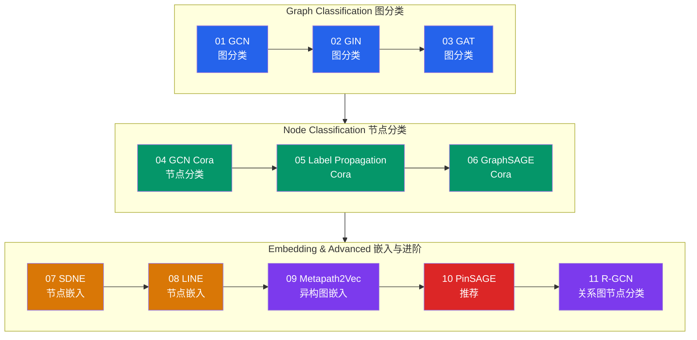
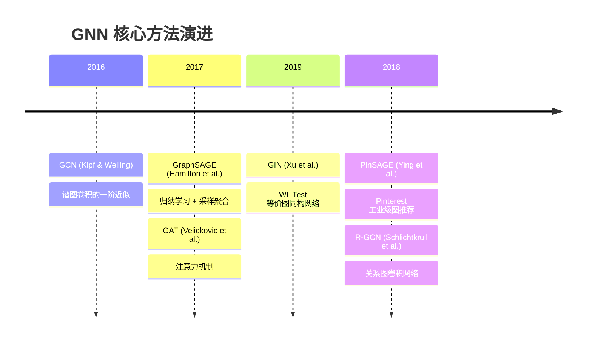

# GNN 赛道

!!! abstract "赛道概览"
    **11 个 Lesson** · 预计 2-3 周 · 图分类、节点分类、图嵌入与异构图推荐

    GNN 赛道是 DL-Hub 主题组织最清晰的赛道之一，从 toy 图分类入门，逐步深入到 Cora 节点分类、图嵌入算法，最终涵盖异构图和工业级图推荐。11 个 Lesson 按三大主题分组，结构清晰。

---

## 学习路径



!!! tip "颜色说明"
    :blue_square: 图分类 · :green_square: 节点分类 · :orange_square: 图嵌入 · :purple_square: 异构图 · :red_square: 推荐系统

---

## 先修知识

| 领域 | 要求 |
|:-----|:-----|
| DL-Hub | 完成 [Foundations 赛道](foundations.md) |
| 图论 | 邻接矩阵、节点度、连通分量等基本概念 |
| 线性代数 | 矩阵乘法、特征值分解（谱方法需要） |

---

## 课程列表

### Graph Classification 图分类

| 序号 | 项目 | 代码文档 | 核心概念 |
|:----:|:-----|:---------|:---------|
| 01 | **GCN 图分类** | [`toy_graph_classification`](https://github.com/skygazer42/DL-Hub/tree/main/tracks/gnn/lesson_01_toy_graph_classification/) | 邻接矩阵, 消息传递 |
| 02 | **GIN 图分类** | [`gin_toy_graph_classification`](https://github.com/skygazer42/DL-Hub/tree/main/tracks/gnn/lesson_02_gin_toy_graph_classification/) | WL Test, 图同构 |
| 03 | **GAT 图分类** | [`gat_toy_graph_classification`](https://github.com/skygazer42/DL-Hub/tree/main/tracks/gnn/lesson_03_gat_toy_graph_classification/) | 注意力系数, 多头注意力 |

!!! info "从 GCN 到 GAT"
    这三个 Lesson 展示了 GNN 消息传递范式的演进：

    - **GCN**：用对称归一化邻接矩阵聚合邻居特征
    - **GIN**：引入 MLP 和求和聚合，达到 WL Test 同构判别能力
    - **GAT**：为不同邻居分配不同注意力权重，实现自适应聚合

---

### Node Classification 节点分类

| 序号 | 项目 | 代码文档 | 核心概念 |
|:----:|:-----|:---------|:---------|
| 04 | **GCN Cora 节点分类** | [`cora_node_classification_gcn`](https://github.com/skygazer42/DL-Hub/tree/main/tracks/gnn/lesson_04_cora_node_classification_gcn/) | 半监督学习, 谱方法 |
| 05 | **Label Propagation Cora** | [`label_propagation_cora`](https://github.com/skygazer42/DL-Hub/tree/main/tracks/gnn/lesson_05_label_propagation_cora/) | 经典基线, 无参数方法 |
| 06 | **GraphSAGE Cora** | [`graphsage_cora`](https://github.com/skygazer42/DL-Hub/tree/main/tracks/gnn/lesson_06_graphsage_cora/) | 采样聚合, 归纳学习 |

!!! info "Cora 数据集系列"
    Cora 是图神经网络领域最经典的引文网络数据集（2708 节点 / 7 类），这三个 Lesson 在同一数据集上对比不同方法：

    - **GCN**：全图谱卷积，转导学习
    - **Label Propagation**：无参数标签传播基线
    - **GraphSAGE**：小批量采样 + 聚合，归纳学习

---

### Embedding & Advanced 嵌入与进阶

| 序号 | 项目 | 代码文档 | 核心概念 |
|:----:|:-----|:---------|:---------|
| 07 | **SDNE 节点嵌入** | [`sdne_karate_embedding`](https://github.com/skygazer42/DL-Hub/tree/main/tracks/gnn/lesson_07_sdne_karate_embedding/) | 自编码器, 一阶/二阶近似 |
| 08 | **LINE 节点嵌入** | [`line_karate_embedding`](https://github.com/skygazer42/DL-Hub/tree/main/tracks/gnn/lesson_08_line_karate_embedding/) | 大规模网络, 边采样 |
| 09 | **Metapath2Vec 异构图嵌入** | [`metapath2vec_toy_hetero_embedding`](https://github.com/skygazer42/DL-Hub/tree/main/tracks/gnn/lesson_09_metapath2vec_toy_hetero_embedding/) | 元路径, 异构随机游走 |
| 10 | **PinSAGE 推荐** | [`pinsage_toy_recommender`](https://github.com/skygazer42/DL-Hub/tree/main/tracks/gnn/lesson_10_pinsage_toy_recommender/) | 随机游走采样, 工业级图推荐 |
| 11 | **R-GCN 关系图节点分类** | [`rgcn_toy_node_classification`](https://github.com/skygazer42/DL-Hub/tree/main/tracks/gnn/lesson_11_rgcn_toy_node_classification/) | 关系特定权重, 知识图谱 |

---

## 运行示例

=== "Lesson 01 — GCN 图分类"

    ```bash
    python -m tracks.gnn.lesson_01_toy_graph_classification.train \
      --dataset fake --epochs 1 \
      --max-train-batches 2 --max-eval-batches 2
    ```

=== "Lesson 04 — GCN Cora"

    ```bash
    python -m tracks.gnn.lesson_04_cora_node_classification_gcn.train \
      --dataset fake --epochs 1 \
      --max-train-batches 2 --max-eval-batches 2
    ```

=== "Lesson 10 — PinSAGE"

    ```bash
    python -m tracks.gnn.lesson_10_pinsage_toy_recommender.train \
      --dataset fake --epochs 1 \
      --max-train-batches 2 --max-eval-batches 2
    ```

=== "Lesson 11 — R-GCN"

    ```bash
    python -m tracks.gnn.lesson_11_rgcn_toy_node_classification.train \
      --dataset fake --epochs 1 \
      --max-train-batches 2 --max-eval-batches 2
    ```

---

## GNN 技术演进



---

## 下一步

完成 GNN 赛道后，你可以继续：

| 推荐方向 | 说明 |
|:---------|:-----|
| :arrow_right: [Point Cloud 点云赛道](pointcloud.md) | 将图结构思想应用于 3D 点云 |
| :arrow_right: [Generative 生成模型赛道](generative.md) | 学习 VAE 和 GAN 生成模型 |
| :arrow_right: [Multimodal 多模态赛道](multimodal.md) | 多模态融合中的图结构应用 |
