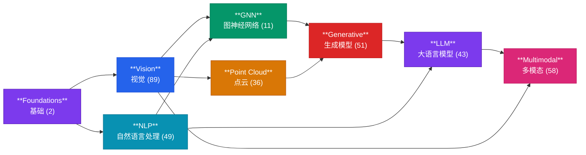

# 学习赛道总览

DL-Hub 将 **339 个 Lesson** 组织为 **8 条学习赛道**，覆盖深度学习从入门到前沿的完整技能树。每条赛道聚焦一个核心领域，由浅入深、环环相扣。

---

## 八大赛道一览



!!! tip "阅读路径建议"
    **Foundations** 是所有赛道的基石，请务必最先完成。之后 Vision 和 NLP 可以并行学习，再逐步推进到 GNN、Point Cloud、Generative、LLM，最终挑战 Multimodal。

---

## 三条学习路线

不知道从哪开始？根据你的可用时间，选择一条适合的路线：

| 路线 | 时间投入 | Lessons | 覆盖内容 |
|:-----|:---------|:--------|:---------|
| :material-run-fast: **Weekend Sprint** | 1-2 天 | 6 lessons | Foundations (2) :arrow_right: Vision 01-02 :arrow_right: Generative 01 :arrow_right: LLM 01 — 快速建立从张量到生成模型的完整直觉 |
| :material-calendar-week: **Two-Week Deep Dive** | 2 周 | 18 lessons | Foundations (2) :arrow_right: Vision (5) :arrow_right: NLP (4) :arrow_right: GNN (3) :arrow_right: Generative (2) :arrow_right: LLM (1) :arrow_right: Point Cloud (1) — 覆盖所有 track 的核心 lesson |
| :material-school: **Full Curriculum** | 6-8 周 | 339 lessons | 按顺序完成全部 8 个赛道的所有 lesson — 系统掌握从经典 ML 到前沿深度学习的完整技能树 |

!!! note "离线冒烟模式"
    所有 lesson 均支持 `--dataset fake` 离线冒烟测试，**无需下载任何数据集，2 分钟即可跑通**。

---

## 赛道总结表

| 赛道 | Lessons | 关键主题 | 先修知识 |
|:-----|:--------|:---------|:---------|
| [**Foundations** 基础](foundations.md) | 2 | `torch.Tensor`, Autograd, 线性回归, 梯度下降 | Python 基础, 线性代数入门 |
| [**Vision** 视觉](vision.md) | 89 | CNN, ViT, Swin, FCOS, UNet, YOLO, MOT | Foundations + 卷积直觉 |
| [**NLP** 自然语言处理](nlp.md) | 49 | Embedding, Transformer, BiLSTM, NER, Seq2Seq, 阅读理解 | Foundations + 文本处理基础 |
| [**GNN** 图神经网络](gnn.md) | 11 | GCN, GIN, GAT, GraphSAGE, PinSAGE, R-GCN | Foundations + 图论基本概念 |
| [**Point Cloud** 点云](pointcloud.md) | 36 | PointNet, DGCNN, PointNet++, 64 架构 Zoo | Vision + 3D 几何直觉 |
| [**Generative** 生成模型](generative.md) | 51 | VAE, GAN, 重参数化, 对抗训练 | Vision + 概率论基础 |
| [**LLM** 大语言模型](llm.md) | 43 | Causal Mask, 自回归解码, Transformer 生成 | NLP + Transformer 机制 |
| [**Multimodal** 多模态](multimodal.md) | 58 | CLIP, BLIP, LLaVA, Grounding, VLM, 时序定位 | Vision + NLP + 注意力机制 |

---

## 快速开始

```bash
# 列出所有可运行的 lesson
python scripts/run_lesson.py --list

# 从 Foundations 第一课开始
python -m tracks.foundations.lesson_01_tensors.train \
  --dataset fake --epochs 1 \
  --max-train-batches 2 --max-eval-batches 2
```

!!! success "推荐顺序"
    **Foundations :arrow_right: Vision :arrow_right: NLP :arrow_right: GNN :arrow_right: Point Cloud :arrow_right: Generative :arrow_right: LLM :arrow_right: Multimodal**

    每个 lesson 都有独立的 README，说明学习目标、先修要求和验收标准。
