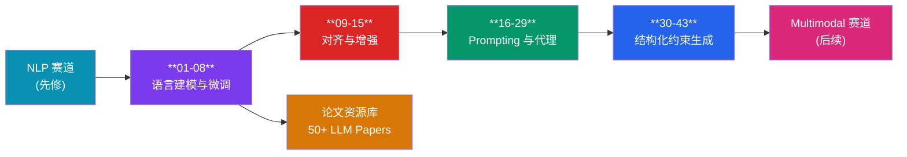
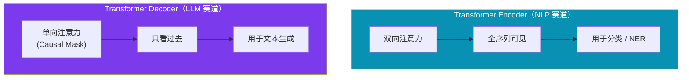
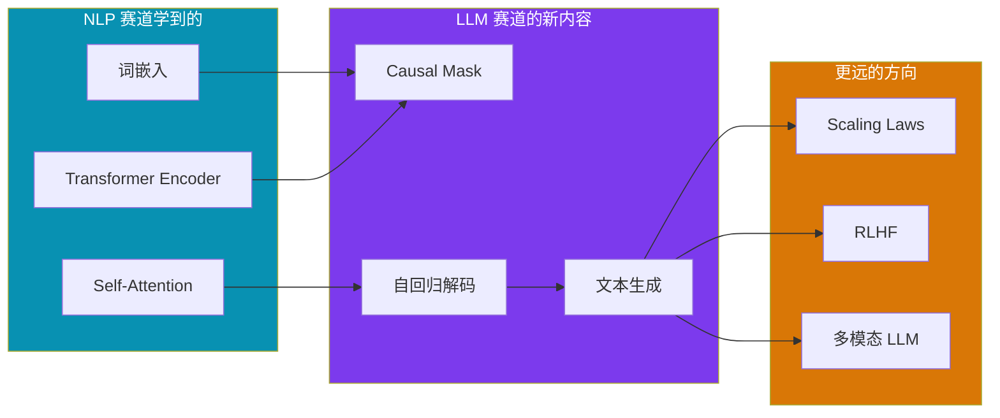

# LLM 赛道

!!! abstract "赛道概览"
    **43 个 Lesson + 50+ 论文资源** · 预计 3-4 周 · 从 Causal LM 到对齐、Prompting 与结构化约束生成

    LLM 赛道从零搭建 **Compact Causal Language Model** 出发，覆盖 chat SFT、instruction tuning、prefix tuning，再到偏好优化（DPO 风格）、奖励建模、RLHF PPO、GRPO、RAG 与工具调用代理，最后以 Prompting 工程（self-refine、ReAct、tree-of-thought 等）和 citation / schema / JSON 等结构化约束生成收尾。配套 `resources/pdfs/llms/` 下的 50+ 篇论文笔记可作为延伸阅读。

---

## 学习路径



---

## 先修知识

| 领域 | 要求 |
|:-----|:-----|
| DL-Hub | 完成 [NLP 赛道](nlp.md)（尤其是 Lesson 02 Transformer Encoder） |
| Transformer | Self-Attention, Multi-Head Attention, Layer Normalization |
| 语言模型 | 自回归分解 $P(x_1, ..., x_n) = \prod P(x_t \| x_{<t})$ 的直觉 |

---

## 课程列表

全部 **43 个 Lesson** 按主题分组如下，从 compact causal LM 与 chat SFT，到偏好优化 / 奖励建模 / RLHF，再到 prompting 工程与结构化约束生成。

### 语言建模与微调基础（01-08）

| 序号 | 项目 | 代码文档 | 核心概念 |
|:----:|:-----|:---------|:---------|
| 01 | **Transformer 文本生成** | [`compact_causal_lm_transformer`](https://github.com/skygazer42/DL-Hub/tree/main/tracks/llm/lesson_01_compact_causal_lm_transformer/) | Causal Mask, 自回归解码 |
| 02 | **Chat 格式监督微调** | [`compact_chat_sft`](https://github.com/skygazer42/DL-Hub/tree/main/tracks/llm/lesson_02_compact_chat_sft/) | Role Token, Assistant-only Loss |
| 03 | **Mamba 风格语言模型** | [`compact_mamba_language_model`](https://github.com/skygazer42/DL-Hub/tree/main/tracks/llm/lesson_03_compact_mamba_language_model/) | 状态空间混合, 线性时序递推 |
| 04 | **指令微调** | [`compact_instruction_tuning`](https://github.com/skygazer42/DL-Hub/tree/main/tracks/llm/lesson_04_compact_instruction_tuning/) | 单轮指令模板, Response-only Loss |
| 05 | **Prefix Tuning** | [`compact_prefix_tuning`](https://github.com/skygazer42/DL-Hub/tree/main/tracks/llm/lesson_05_compact_prefix_tuning/) | 冻结主干, 可训练前缀向量 |
| 06 | **偏好优化** | [`compact_preference_optimization`](https://github.com/skygazer42/DL-Hub/tree/main/tracks/llm/lesson_06_compact_preference_optimization/) | Chosen/Rejected 对比, DPO 风格目标 |
| 07 | **奖励建模** | [`compact_reward_modeling`](https://github.com/skygazer42/DL-Hub/tree/main/tracks/llm/lesson_07_compact_reward_modeling/) | Pairwise Ranking, 标量奖励头 |
| 08 | **Span Corruption** | [`compact_span_corruption`](https://github.com/skygazer42/DL-Hub/tree/main/tracks/llm/lesson_08_compact_span_corruption/) | 连续片段掩码, 去噪解码, 目标 token 监督 |

### 对齐与增强（09-15）

| 序号 | 项目 | 代码文档 | 核心概念 |
|:----:|:-----|:---------|:---------|
| 09 | **RLHF PPO** | [`compact_rlhf_ppo`](https://github.com/skygazer42/DL-Hub/tree/main/tracks/llm/lesson_09_compact_rlhf_ppo/) | 策略比率裁剪, token 奖励, 参考策略约束 |
| 10 | **GRPO Alignment** | [`compact_grpo_alignment`](https://github.com/skygazer42/DL-Hub/tree/main/tracks/llm/lesson_10_compact_grpo_alignment/) | 分组相对偏好, 参考基线, 响应级奖励优化 |
| 11 | **RAG Language Model** | [`compact_rag_language_model`](https://github.com/skygazer42/DL-Hub/tree/main/tracks/llm/lesson_11_compact_rag_language_model/) | 文档检索, 条件解码, 检索增强生成 |
| 12 | **Transformer Interpretability** | [`compact_transformer_interpretability`](https://github.com/skygazer42/DL-Hub/tree/main/tracks/llm/lesson_12_compact_transformer_interpretability/) | 注意力可视化, token saliency, 解释性分析 |
| 13 | **Tool-Calling Agent** | [`compact_tool_calling_agent`](https://github.com/skygazer42/DL-Hub/tree/main/tracks/llm/lesson_13_compact_tool_calling_agent/) | 工具选择, 参数生成, 代理式调用闭环 |
| 14 | **Replaced-Token Detection Transformer** | [`compact_replaced_token_detection_transformer`](https://github.com/skygazer42/DL-Hub/tree/main/tracks/llm/lesson_14_compact_replaced_token_detection_transformer/) | 替换 token 判别, 编码式自监督, token 级二分类 |
| 15 | **LLM Judge** | [`compact_llm_judge`](https://github.com/skygazer42/DL-Hub/tree/main/tracks/llm/lesson_15_compact_llm_judge/) | Prompt-Answer 打分, 候选比较, 标量质量评估 |

### Prompting 与代理（16-29）

| 序号 | 项目 | 代码文档 | 核心概念 |
|:----:|:-----|:---------|:---------|
| 16 | **Multi-Turn Memory Chat SFT** | [`compact_multi_turn_memory_sft`](https://github.com/skygazer42/DL-Hub/tree/main/tracks/llm/lesson_16_compact_multi_turn_memory_sft/) | 多轮对话记忆, 历史拼接监督, assistant-only loss |
| 17 | **Self-Refine Prompting** | [`compact_self_refine_prompting`](https://github.com/skygazer42/DL-Hub/tree/main/tracks/llm/lesson_17_compact_self_refine_prompting/) | 草稿-批评-修订链路, 提示式自改写, 响应重写监督 |
| 18 | **Reflection Memory Agent** | [`compact_reflection_memory_agent`](https://github.com/skygazer42/DL-Hub/tree/main/tracks/llm/lesson_18_compact_reflection_memory_agent/) | 反思写入记忆, 检索式修订, 记忆增强回答 |
| 19 | **Plan-Execute Prompting** | [`compact_plan_execute_prompting`](https://github.com/skygazer42/DL-Hub/tree/main/tracks/llm/lesson_19_compact_plan_execute_prompting/) | 两阶段计划与执行, 提示分解, execute-only 监督 |
| 20 | **ReAct Tool Prompting** | [`compact_react_tool_prompting`](https://github.com/skygazer42/DL-Hub/tree/main/tracks/llm/lesson_20_compact_react_tool_prompting/) | 思考-行动交替, 工具决策轨迹, 响应级监督 |
| 21 | **Tree-of-Thought Prompting** | [`compact_tree_of_thought_prompting`](https://github.com/skygazer42/DL-Hub/tree/main/tracks/llm/lesson_21_compact_tree_of_thought_prompting/) | 多分支推理候选, 路径选择, 终态答案监督 |
| 22 | **Self-Consistency Prompting** | [`compact_self_consistency_prompting`](https://github.com/skygazer42/DL-Hub/tree/main/tracks/llm/lesson_22_compact_self_consistency_prompting/) | 多样候选采样, 投票一致性, 最终答案监督 |
| 23 | **Critic-Rerank Prompting** | [`compact_critic_rerank_prompting`](https://github.com/skygazer42/DL-Hub/tree/main/tracks/llm/lesson_23_compact_critic_rerank_prompting/) | 候选打分重排, critique 标记上下文, 最优响应选择 |
| 24 | **Debate Prompting** | [`compact_debate_prompting`](https://github.com/skygazer42/DL-Hub/tree/main/tracks/llm/lesson_24_compact_debate_prompting/) | 正反论点提示, judge 标记监督, verdict 生成 |
| 25 | **Verifier-Guided Prompting** | [`compact_verifier_guided_prompting`](https://github.com/skygazer42/DL-Hub/tree/main/tracks/llm/lesson_25_compact_verifier_guided_prompting/) | 草稿-验证-修正链路, guide token 监督, 响应纠错 |
| 26 | **Process Supervision Prompting** | [`compact_process_supervision_prompting`](https://github.com/skygazer42/DL-Hub/tree/main/tracks/llm/lesson_26_compact_process_supervision_prompting/) | 草稿-检查-流程监督链路, process token 监督, 响应生成 |
| 27 | **Self-Correction Prompting** | [`compact_self_correction_prompting`](https://github.com/skygazer42/DL-Hub/tree/main/tracks/llm/lesson_27_compact_self_correction_prompting/) | 草稿-批评-自修正链路, corrected span 监督, 自纠错生成 |
| 28 | **Reference-Grounded Prompting** | [`compact_reference_grounded_prompting`](https://github.com/skygazer42/DL-Hub/tree/main/tracks/llm/lesson_28_compact_reference_grounded_prompting/) | 引用证据 span, grounded token 监督, 参考约束生成 |
| 29 | **Constraint-Repair Prompting** | [`compact_constraint_repair_prompting`](https://github.com/skygazer42/DL-Hub/tree/main/tracks/llm/lesson_29_compact_constraint_repair_prompting/) | 约束检查与修复链路, repair token 监督, 受限生成 |

### 结构化约束生成（30-43）

| 序号 | 项目 | 代码文档 | 核心概念 |
|:----:|:-----|:---------|:---------|
| 30 | **Citation-Grounded Prompting** | [`compact_citation_grounded_prompting`](https://github.com/skygazer42/DL-Hub/tree/main/tracks/llm/lesson_30_compact_citation_grounded_prompting/) | 引用 span 拷贝监督, cite token 约束, 证据归因生成 |
| 31 | **Schema-Constrained Prompting** | [`compact_schema_constrained_prompting`](https://github.com/skygazer42/DL-Hub/tree/main/tracks/llm/lesson_31_compact_schema_constrained_prompting/) | schema marker 监督, 结构化字段续写, 约束输出生成 |
| 32 | **JSON-Constrained Prompting** | [`compact_json_constrained_prompting`](https://github.com/skygazer42/DL-Hub/tree/main/tracks/llm/lesson_32_compact_json_constrained_prompting/) | json marker 监督, JSON 字段续写, 约束输出生成 |
| 33 | **Function-Signature Prompting** | [`compact_function_signature_prompting`](https://github.com/skygazer42/DL-Hub/tree/main/tracks/llm/lesson_33_compact_function_signature_prompting/) | call marker 监督, 函数签名续写, 参数槽位约束 |
| 34 | **XML-Constrained Prompting** | [`compact_xml_constrained_prompting`](https://github.com/skygazer42/DL-Hub/tree/main/tracks/llm/lesson_34_compact_xml_constrained_prompting/) | xml marker 监督, XML 片段续写, 结构化输出约束 |
| 35 | **Regex-Constrained Prompting** | [`compact_regex_constrained_prompting`](https://github.com/skygazer42/DL-Hub/tree/main/tracks/llm/lesson_35_compact_regex_constrained_prompting/) | regex marker 监督, 模式匹配字段续写, 约束生成 |
| 36 | **EBNF-Constrained Prompting** | [`compact_ebnf_constrained_prompting`](https://github.com/skygazer42/DL-Hub/tree/main/tracks/llm/lesson_36_compact_ebnf_constrained_prompting/) | ebnf marker 监督, 规则续写, 语法约束生成 |
| 37 | **SQL-Constrained Prompting** | [`compact_sql_constrained_prompting`](https://github.com/skygazer42/DL-Hub/tree/main/tracks/llm/lesson_37_compact_sql_constrained_prompting/) | sql marker 监督, 查询骨架续写, 结构化约束生成 |
| 38 | **YAML-Constrained Prompting** | [`compact_yaml_constrained_prompting`](https://github.com/skygazer42/DL-Hub/tree/main/tracks/llm/lesson_38_compact_yaml_constrained_prompting/) | yaml marker 监督, key-value 行续写, 结构化约束生成 |
| 39 | **CSV-Constrained Prompting** | [`compact_csv_constrained_prompting`](https://github.com/skygazer42/DL-Hub/tree/main/tracks/llm/lesson_39_compact_csv_constrained_prompting/) | csv marker 监督, 表头/行续写, 结构化约束生成 |
| 40 | **TOML-Constrained Prompting** | [`compact_toml_constrained_prompting`](https://github.com/skygazer42/DL-Hub/tree/main/tracks/llm/lesson_40_compact_toml_constrained_prompting/) | toml marker 监督, key=value 续写, 结构化约束生成 |
| 41 | **Markdown-Table Constrained Prompting** | [`compact_markdown_table_constrained_prompting`](https://github.com/skygazer42/DL-Hub/tree/main/tracks/llm/lesson_41_compact_markdown_table_constrained_prompting/) | table marker 监督, header/row 续写, 表格结构约束生成 |
| 42 | **INI-Constrained Prompting** | [`compact_ini_constrained_prompting`](https://github.com/skygazer42/DL-Hub/tree/main/tracks/llm/lesson_42_compact_ini_constrained_prompting/) | ini marker 监督, section/key=value 续写, 配置结构约束生成 |
| 43 | **TSV-Constrained Prompting** | [`compact_tsv_constrained_prompting`](https://github.com/skygazer42/DL-Hub/tree/main/tracks/llm/lesson_43_compact_tsv_constrained_prompting/) | tsv marker 监督, column/value 行续写, 表格结构约束生成 |

```bash
# 冒烟测试 Chat SFT（Lesson 02）
python -m tracks.llm.lesson_02_compact_chat_sft.train \
  --epochs 1 \
  --max-train-batches 2 --max-eval-batches 2
```

---

## 重点课程精讲

### Lesson 01 — Transformer 文本生成

!!! info "学习目标"
    - 理解 Causal (Autoregressive) Language Model 的训练范式
    - 掌握 Causal Mask（下三角掩码）的作用与实现
    - 理解 Teacher Forcing 训练 vs 自回归推理的区别
    - 实现 Greedy / Top-k / Top-p 解码策略

**核心知识点：**

| 概念 | 说明 |
|:-----|:-----|
| **Causal Mask** | 下三角矩阵，确保 token $t$ 只能看到 $x_1, ..., x_{t-1}$ |
| **自回归解码** | 逐 token 生成：每步输出一个 token，拼接后作为下一步输入 |
| **Teacher Forcing** | 训练时使用真实序列作为输入，而非模型自身的输出 |
| **位置编码** | Sinusoidal 或 Learnable Positional Encoding |
| **Token Embedding** | 词汇表到向量空间的映射 |

**Encoder vs Decoder 对比：**



**运行命令：**

```bash
python -m tracks.llm.lesson_01_compact_causal_lm_transformer.train \
  --epochs 1 \
  --max-train-batches 2 --max-eval-batches 2
```

---

## 论文资源库

!!! note "50+ 篇 LLM 相关论文与笔记"
    `resources/pdfs/llms/` 目录下保留了大量 LLM 领域的经典论文和研究笔记，适合在完成实践课程后进行深度阅读。

**推荐阅读顺序：**

| 阶段 | 主题 | 代表论文 |
|:-----|:-----|:---------|
| :material-numeric-1-circle: **基础** | Transformer 原理 | *Attention Is All You Need* (Vaswani et al., 2017) |
| :material-numeric-2-circle: **预训练范式** | 自监督语言模型 | GPT (Radford et al., 2018), BERT (Devlin et al., 2019) |
| :material-numeric-3-circle: **规模化** | 大模型 Scaling Laws | GPT-3 (Brown et al., 2020), PaLM (Chowdhery et al., 2022) |
| :material-numeric-4-circle: **对齐** | RLHF 与指令跟随 | InstructGPT (Ouyang et al., 2022) |
| :material-numeric-5-circle: **综述** | 大模型全景 | *A Survey of Large Language Models* |

---

## 从 NLP 到 LLM 的关键跨越



---

## 下一步

完成 LLM 赛道后，你可以继续：

| 推荐方向 | 说明 |
|:---------|:-----|
| :arrow_right: [Multimodal 多模态赛道](multimodal.md) | 将语言模型与视觉结合，学习 CLIP、LLaVA 等 VLM |
| :material-book-open: **论文阅读** | 深入 `resources/pdfs/llms/` 下的 50+ 篇论文笔记 |
