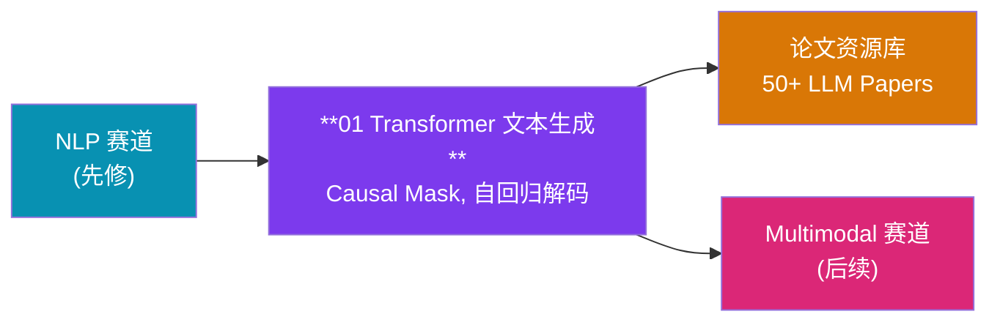
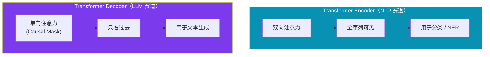
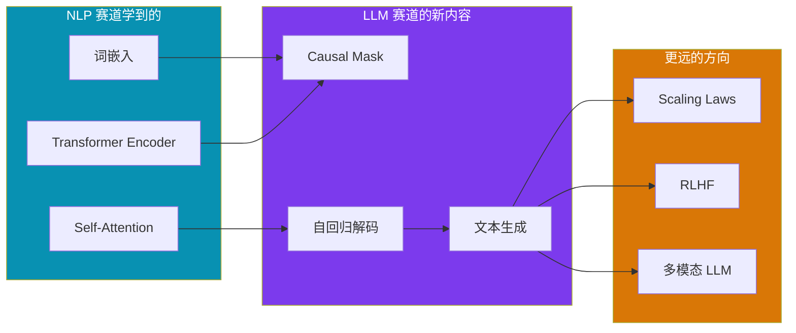

# LLM 赛道

!!! abstract "赛道概览"
    **1 个 Lesson + 50+ 论文资源** · 预计 1-2 天 · Causal Language Model 从零实现

    LLM 赛道聚焦于从零搭建一个 **Toy Causal Language Model**，让你深入理解 Transformer 自回归解码的核心机制：Causal Mask、位置编码、Token 预测与贪心/采样解码策略。配套 `resources/pdfs/llms/` 下的 50+ 篇论文笔记可作为延伸阅读。

---

## 学习路径



---

## 先修知识

| 领域 | 要求 |
|:-----|:-----|
| DL-Hub | 完成 [NLP 赛道](nlp.md)（尤其是 Lesson 02 Transformer Encoder） |
| Transformer | Self-Attention, Multi-Head Attention, Layer Normalization |
| 语言模型 | 自回归分解 $P(x_1, ..., x_n) = \prod P(x_t \| x_{<t})$ 的直觉 |

---

## 课程列表

| 序号 | 项目 | 代码文档 | 核心概念 |
|:----:|:-----|:---------|:---------|
| 01 | **Transformer 文本生成** | [`toy_causal_lm_transformer`](https://github.com/skygazer42/DL-Hub/tree/main/tracks/llm/lesson_01_toy_causal_lm_transformer/) | Causal Mask, 自回归解码 |

---

### Lesson 01 — Transformer 文本生成

!!! info "学习目标"
    - 理解 Causal (Autoregressive) Language Model 的训练范式
    - 掌握 Causal Mask（下三角掩码）的作用与实现
    - 理解 Teacher Forcing 训练 vs 自回归推理的区别
    - 实现 Greedy / Top-k / Top-p 解码策略

**核心知识点：**

| 概念 | 说明 |
|:-----|:-----|
| **Causal Mask** | 下三角矩阵，确保 token $t$ 只能看到 $x_1, ..., x_{t-1}$ |
| **自回归解码** | 逐 token 生成：每步输出一个 token，拼接后作为下一步输入 |
| **Teacher Forcing** | 训练时使用真实序列作为输入，而非模型自身的输出 |
| **位置编码** | Sinusoidal 或 Learnable Positional Encoding |
| **Token Embedding** | 词汇表到向量空间的映射 |

**Encoder vs Decoder 对比：**



**运行命令：**

```bash
python -m tracks.llm.lesson_01_toy_causal_lm_transformer.train \
  --dataset fake --epochs 1 \
  --max-train-batches 2 --max-eval-batches 2
```

---

## 论文资源库

!!! note "50+ 篇 LLM 相关论文与笔记"
    `resources/pdfs/llms/` 目录下保留了大量 LLM 领域的经典论文和研究笔记，适合在完成实践课程后进行深度阅读。

**推荐阅读顺序：**

| 阶段 | 主题 | 代表论文 |
|:-----|:-----|:---------|
| :material-numeric-1-circle: **基础** | Transformer 原理 | *Attention Is All You Need* (Vaswani et al., 2017) |
| :material-numeric-2-circle: **预训练范式** | 自监督语言模型 | GPT (Radford et al., 2018), BERT (Devlin et al., 2019) |
| :material-numeric-3-circle: **规模化** | 大模型 Scaling Laws | GPT-3 (Brown et al., 2020), PaLM (Chowdhery et al., 2022) |
| :material-numeric-4-circle: **对齐** | RLHF 与指令跟随 | InstructGPT (Ouyang et al., 2022) |
| :material-numeric-5-circle: **综述** | 大模型全景 | *A Survey of Large Language Models* |

---

## 从 NLP 到 LLM 的关键跨越



---

## 下一步

完成 LLM 赛道后，你可以继续：

| 推荐方向 | 说明 |
|:---------|:-----|
| :arrow_right: [Multimodal 多模态赛道](multimodal.md) | 将语言模型与视觉结合，学习 CLIP、LLaVA 等 VLM |
| :material-book-open: **论文阅读** | 深入 `resources/pdfs/llms/` 下的 50+ 篇论文笔记 |
