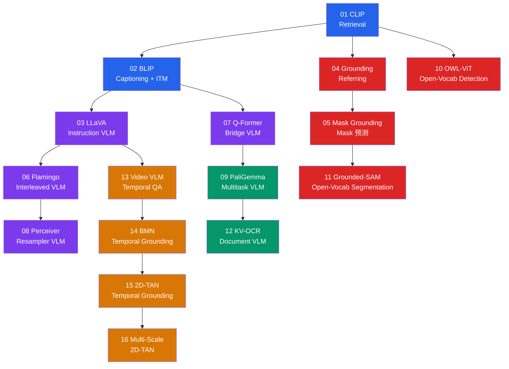
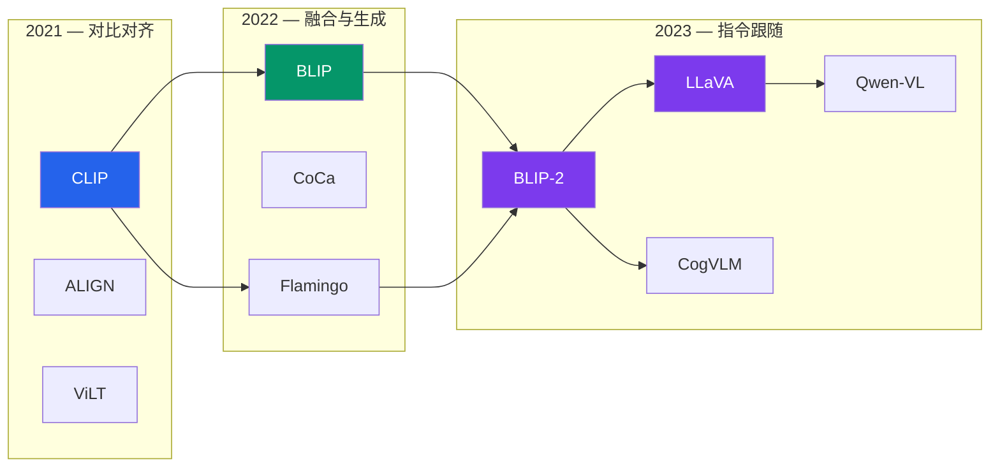

# 多模态赛道

!!! abstract "赛道概览"
    **58 个 Lesson** · 预计 4-6 周 · 从 CLIP 双塔对齐到 LLaVA 指令跟随、开放词汇检测、时序定位与人脸/手部 VLM 推理

    Multimodal 赛道是 DL-Hub 最前沿的方向，覆盖视觉语言模型（VLM）的完整演进脉络。从对比学习（CLIP）出发，经过跨模态融合（BLIP）、视觉指令跟随（LLaVA）、开放词汇检测（OWL-ViT）、文档理解（OCR VLM）、视频时序定位（2D-TAN），再延伸到具身问答、多模态推理、视频检索、音频文本理解、音视融合、HOI、视线估计，以及人物属性识别、人脸身份识别与验证推理、手部姿态与手势推理。配套 **70 个 VLM 架构族**可供深入探索。

---

## 学习路径

下图展示前 16 课（VLM 架构核心）的学习路径；Lesson 17 之后按主题分组，详见下方课程列表。



!!! tip "颜色说明"
    :blue_square: 对齐与融合 · :purple_square: VLM 架构 · :red_square: 检测与分割 · :green_square: 多任务 / 文档 · :orange_square: 视频时序

---

## 先修知识

| 领域 | 要求 |
|:-----|:-----|
| DL-Hub | 完成 [Vision 视觉赛道](vision.md) + [NLP 赛道](nlp.md) |
| 注意力机制 | Self-Attention, Cross-Attention, Multi-Head Attention |
| 对比学习 | InfoNCE Loss 基本直觉 |

---

## 课程列表

全部 **58 个 Lesson** 按主题分组如下，从 CLIP 双塔对齐到人脸 / 手部 VLM 推理，走完现代视觉语言建模核心脉络。

### VLM 架构核心（01-16）

| 序号 | 项目 | 代码文档 | 核心概念 |
|:----:|:-----|:---------|:---------|
| 01 | **CLIP-Style Retrieval** | [`clip_toy_retrieval`](https://github.com/skygazer42/DL-Hub/tree/main/tracks/multimodal/lesson_01_clip_toy_retrieval/) | 对比学习, 双塔编码器 |
| 02 | **BLIP-Lite Captioning + ITM** | [`blip_toy_captioning`](https://github.com/skygazer42/DL-Hub/tree/main/tracks/multimodal/lesson_02_blip_toy_captioning/) | 视觉 token 融合, ITM |
| 03 | **LLaVA-Lite Instruction VLM** | [`llava_toy_instruction_vlm`](https://github.com/skygazer42/DL-Hub/tree/main/tracks/multimodal/lesson_03_llava_toy_instruction_vlm/) | 视觉前缀, 指令跟随 |
| 04 | **Grounding Referring** | [`grounding_toy_refexp`](https://github.com/skygazer42/DL-Hub/tree/main/tracks/multimodal/lesson_04_grounding_toy_refexp/) | 指代表达, Box 回归 |
| 05 | **Mask Grounding** | [`mask_grounding_toy_refexp`](https://github.com/skygazer42/DL-Hub/tree/main/tracks/multimodal/lesson_05_mask_grounding_toy_refexp/) | 文本条件 Mask 预测 |
| 06 | **Flamingo Interleaved VLM** | [`flamingo_toy_interleaved_vlm`](https://github.com/skygazer42/DL-Hub/tree/main/tracks/multimodal/lesson_06_flamingo_toy_interleaved_vlm/) | 交错图文, Few-shot |
| 07 | **Q-Former Bridge VLM** | [`qformer_toy_bridge_vlm`](https://github.com/skygazer42/DL-Hub/tree/main/tracks/multimodal/lesson_07_qformer_toy_bridge_vlm/) | Cross-attention 瓶颈 |
| 08 | **Perceiver Resampler VLM** | [`perceiver_resampler_toy_vlm`](https://github.com/skygazer42/DL-Hub/tree/main/tracks/multimodal/lesson_08_perceiver_resampler_toy_vlm/) | 多视图 token 池化 |
| 09 | **PaliGemma Multitask VLM** | [`paligemma_toy_siglip_decoder_vlm`](https://github.com/skygazer42/DL-Hub/tree/main/tracks/multimodal/lesson_09_paligemma_toy_siglip_decoder_vlm/) | 提示式多任务 |
| 10 | **OWL-ViT Open-Vocab Detection** | [`owlvit_toy_open_vocab_detection`](https://github.com/skygazer42/DL-Hub/tree/main/tracks/multimodal/lesson_10_owlvit_toy_open_vocab_detection/) | 开放词汇检测 |
| 11 | **Grounded-SAM Segmentation** | [`grounded_sam_toy_open_vocab_segmentation`](https://github.com/skygazer42/DL-Hub/tree/main/tracks/multimodal/lesson_11_grounded_sam_toy_open_vocab_segmentation/) | 开放词汇分割 |
| 12 | **Key-Value OCR Document VLM** | [`key_value_ocr_toy_doc_vlm`](https://github.com/skygazer42/DL-Hub/tree/main/tracks/multimodal/lesson_12_key_value_ocr_toy_doc_vlm/) | 文档字段提取 |
| 13 | **Video VLM Temporal QA** | [`video_vlm_toy_temporal_qa`](https://github.com/skygazer42/DL-Hub/tree/main/tracks/multimodal/lesson_13_video_vlm_toy_temporal_qa/) | 短视频 QA |
| 14 | **BMN Temporal Grounding** | [`bmn_toy_temporal_grounding`](https://github.com/skygazer42/DL-Hub/tree/main/tracks/multimodal/lesson_14_bmn_toy_temporal_grounding/) | 时序定位, 边界预测 |
| 15 | **2D-TAN Temporal Grounding** | [`2dtan_toy_temporal_grounding`](https://github.com/skygazer42/DL-Hub/tree/main/tracks/multimodal/lesson_15_2dtan_toy_temporal_grounding/) | 密集时序段图 |
| 16 | **Multi-Scale 2D-TAN** | [`multiscale_2dtan_toy_temporal_grounding`](https://github.com/skygazer42/DL-Hub/tree/main/tracks/multimodal/lesson_16_multiscale_2dtan_toy_temporal_grounding/) | 多尺度时序金字塔 |

### 视频 / 音频跨模态（17-22）

| 序号 | 项目 | 代码文档 | 核心概念 |
|:----:|:-----|:---------|:---------|
| 17 | **Video-Text Retrieval** | [`video_text_retrieval`](https://github.com/skygazer42/DL-Hub/tree/main/tracks/multimodal/lesson_17_video_text_retrieval/) | 视频-文本对比学习, 时序池化 |
| 18 | **Prompt Learning VLM** | [`prompt_learning_vlm`](https://github.com/skygazer42/DL-Hub/tree/main/tracks/multimodal/lesson_18_prompt_learning_vlm/) | Soft Prompt, Frozen Encoder 适配 |
| 19 | **Audio-Text Understanding** | [`audio_text_understanding`](https://github.com/skygazer42/DL-Hub/tree/main/tracks/multimodal/lesson_19_audio_text_understanding/) | 音频文本对齐, 事件描述分类 |
| 20 | **Audio-Visual Learning** | [`audio_visual_learning`](https://github.com/skygazer42/DL-Hub/tree/main/tracks/multimodal/lesson_20_audio_visual_learning/) | 音视融合, 短片段跨模态检索 |
| 21 | **Audio-Grounded Retrieval** | [`audio_grounded_retrieval`](https://github.com/skygazer42/DL-Hub/tree/main/tracks/multimodal/lesson_21_audio_grounded_retrieval/) | 音频查询, 片段检索, 交叉模态对齐 |
| 22 | **Audio-Visual Event Localization** | [`audio_visual_event_localization`](https://github.com/skygazer42/DL-Hub/tree/main/tracks/multimodal/lesson_22_audio_visual_event_localization/) | 文本条件事件定位, 时序显著性 |

### 具身、推理与人物理解（23-34）

| 序号 | 项目 | 代码文档 | 核心概念 |
|:----:|:-----|:---------|:---------|
| 23 | **Embodied Question Answering** | [`embodied_question_answering`](https://github.com/skygazer42/DL-Hub/tree/main/tracks/multimodal/lesson_23_embodied_question_answering/) | 具身场景状态, 导航上下文, 问答推理 |
| 24 | **Multimodal Reasoning** | [`multimodal_reasoning`](https://github.com/skygazer42/DL-Hub/tree/main/tracks/multimodal/lesson_24_multimodal_reasoning/) | 图像证据 + 事实序列, 多模态判别推理 |
| 25 | **Vision-Language Navigation** | [`vision_language_navigation`](https://github.com/skygazer42/DL-Hub/tree/main/tracks/multimodal/lesson_25_vision_language_navigation/) | 视觉观测 + 指令编码, 动作决策, 导航状态融合 |
| 26 | **Image-Text Reranking** | [`image_text_reranking`](https://github.com/skygazer42/DL-Hub/tree/main/tracks/multimodal/lesson_26_image_text_reranking/) | 跨编码器融合, 候选重排, 细粒度图文匹配 |
| 27 | **Scene-Text VLM Recognition** | [`scene_text_vlm_recognition`](https://github.com/skygazer42/DL-Hub/tree/main/tracks/multimodal/lesson_27_scene_text_vlm_recognition/) | 场景文字读取, 图像文字对齐, 短词识别 |
| 28 | **Document VLM Reasoning** | [`document_vlm_reasoning`](https://github.com/skygazer42/DL-Hub/tree/main/tracks/multimodal/lesson_28_document_vlm_reasoning/) | 文档布局理解, OCR 证据聚合, 文档问答 |
| 29 | **Human-Object Interaction Reasoning** | [`human_object_interaction_reasoning`](https://github.com/skygazer42/DL-Hub/tree/main/tracks/multimodal/lesson_29_human_object_interaction_reasoning/) | 人-物区域关系建模, 文本关系查询, 交互判别 |
| 30 | **Vision-Language Gaze Estimation** | [`vision_language_gaze_estimation`](https://github.com/skygazer42/DL-Hub/tree/main/tracks/multimodal/lesson_30_vision_language_gaze_estimation/) | 头部位置条件, 语言上下文, 视线点/热图回归 |
| 31 | **Person Search Attribute Retrieval** | [`person_search_attribute_retrieval`](https://github.com/skygazer42/DL-Hub/tree/main/tracks/multimodal/lesson_31_person_search_attribute_retrieval/) | 人物图像检索, 属性文本查询, 身份感知对齐 |
| 32 | **Video-Text Action Localization** | [`video_text_action_localization`](https://github.com/skygazer42/DL-Hub/tree/main/tracks/multimodal/lesson_32_video_text_action_localization/) | 视频动作区间定位, 文本条件时序建模, 起止边界回归 |
| 33 | **Pedestrian Attribute Recognition** | [`pedestrian_attribute_recognition`](https://github.com/skygazer42/DL-Hub/tree/main/tracks/multimodal/lesson_33_pedestrian_attribute_recognition/) | 行人属性识别, 图像-属性对齐, 多标签判别 |
| 34 | **Video-Text Action Recognition** | [`video_text_action_recognition`](https://github.com/skygazer42/DL-Hub/tree/main/tracks/multimodal/lesson_34_video_text_action_recognition/) | 视频动作识别, 文本标签对齐, clip 级判别 |

### 人脸与手部 VLM 推理（35-58）

| 序号 | 项目 | 代码文档 | 核心概念 |
|:----:|:-----|:---------|:---------|
| 35 | **Face Expression VLM Recognition** | [`face_expression_vlm_recognition`](https://github.com/skygazer42/DL-Hub/tree/main/tracks/multimodal/lesson_35_face_expression_vlm_recognition/) | 人脸表情分类, 情绪标签提示, 轻量图文融合 |
| 36 | **Face Anti-Spoof VLM Reasoning** | [`face_anti_spoof_vlm_reasoning`](https://github.com/skygazer42/DL-Hub/tree/main/tracks/multimodal/lesson_36_face_anti_spoof_vlm_reasoning/) | 真假脸判别, 伪迹提示融合, 多模态真实性推理 |
| 37 | **Face Identity VLM Recognition** | [`face_identity_vlm_recognition`](https://github.com/skygazer42/DL-Hub/tree/main/tracks/multimodal/lesson_37_face_identity_vlm_recognition/) | 人脸身份匹配, identity prompt 对齐, 轻量视觉语言识别 |
| 38 | **Face Verification VLM Reasoning** | [`face_verification_vlm_reasoning`](https://github.com/skygazer42/DL-Hub/tree/main/tracks/multimodal/lesson_38_face_verification_vlm_reasoning/) | 双脸一致性验证, 成对证据融合, 多模态身份推理 |
| 39 | **Face Attribute VLM Reasoning** | [`face_attribute_vlm_reasoning`](https://github.com/skygazer42/DL-Hub/tree/main/tracks/multimodal/lesson_39_face_attribute_vlm_reasoning/) | 人脸属性问答, 属性提示融合, 二元视觉语言推理 |
| 40 | **Face Caption VLM Grounding** | [`face_caption_vlm_grounding`](https://github.com/skygazer42/DL-Hub/tree/main/tracks/multimodal/lesson_40_face_caption_vlm_grounding/) | 人脸描述匹配, caption-grounded 对齐, 图文一致性判别 |
| 41 | **Face Occlusion VLM Reasoning** | [`face_occlusion_vlm_reasoning`](https://github.com/skygazer42/DL-Hub/tree/main/tracks/multimodal/lesson_41_face_occlusion_vlm_reasoning/) | 遮挡轻重判断, 人脸证据与文字提示融合, 比例感知推理 |
| 42 | **Face Region Grounding VLM** | [`face_region_grounding_vlm`](https://github.com/skygazer42/DL-Hub/tree/main/tracks/multimodal/lesson_42_face_region_grounding_vlm/) | 面部区域定位, 文字区域查询, 归一化框回归 |
| 43 | **Face Landmark VLM Reasoning** | [`face_landmark_vlm_reasoning`](https://github.com/skygazer42/DL-Hub/tree/main/tracks/multimodal/lesson_43_face_landmark_vlm_reasoning/) | 面部关键点问答, 图像证据与 landmark 查询融合, 点位回归 |
| 44 | **Face Parsing VLM Reasoning** | [`face_parsing_vlm_reasoning`](https://github.com/skygazer42/DL-Hub/tree/main/tracks/multimodal/lesson_44_face_parsing_vlm_reasoning/) | 面部区域解析推理, 分区提示融合, mask-aware 多模态判别 |
| 45 | **Face Alignment VLM Reasoning** | [`face_alignment_vlm_reasoning`](https://github.com/skygazer42/DL-Hub/tree/main/tracks/multimodal/lesson_45_face_alignment_vlm_reasoning/) | 五点关键点布局回归, query-conditioned 对齐, 视觉语言融合 |
| 46 | **Face Detection VLM Reasoning** | [`face_detection_vlm_reasoning`](https://github.com/skygazer42/DL-Hub/tree/main/tracks/multimodal/lesson_46_face_detection_vlm_reasoning/) | 归一化人脸框回归, query-conditioned 检测, 视觉语言融合 |
| 47 | **Face Retrieval VLM Reasoning** | [`face_retrieval_vlm_reasoning`](https://github.com/skygazer42/DL-Hub/tree/main/tracks/multimodal/lesson_47_face_retrieval_vlm_reasoning/) | 人脸图库检索, identity-aware 图文对齐, top-1 retrieval |
| 48 | **Face Pose VLM Reasoning** | [`face_pose_vlm_reasoning`](https://github.com/skygazer42/DL-Hub/tree/main/tracks/multimodal/lesson_48_face_pose_vlm_reasoning/) | yaw/pitch/roll 回归, pose query 融合, 多模态姿态推理 |
| 49 | **Face Gaze VLM Reasoning** | [`face_gaze_vlm_reasoning`](https://github.com/skygazer42/DL-Hub/tree/main/tracks/multimodal/lesson_49_face_gaze_vlm_reasoning/) | 人脸 gaze 回归, query-conditioned face reasoning, 多模态视线推理 |
| 50 | **Person Pose VLM Reasoning** | [`person_pose_vlm_reasoning`](https://github.com/skygazer42/DL-Hub/tree/main/tracks/multimodal/lesson_50_person_pose_vlm_reasoning/) | 人体 pose 因子回归, pose query 融合, 多模态姿态推理 |
| 51 | **Hand Pose VLM Reasoning** | [`hand_pose_vlm_reasoning`](https://github.com/skygazer42/DL-Hub/tree/main/tracks/multimodal/lesson_51_hand_pose_vlm_reasoning/) | 十点手部关键点回归, hand pose query 融合, 多模态手部姿态推理 |
| 52 | **Gesture VLM Reasoning** | [`gesture_vlm_reasoning`](https://github.com/skygazer42/DL-Hub/tree/main/tracks/multimodal/lesson_52_gesture_vlm_reasoning/) | 手势类别判别, gesture query 融合, 多模态手势推理 |
| 53 | **Finger Count VLM Reasoning** | [`finger_count_vlm_reasoning`](https://github.com/skygazer42/DL-Hub/tree/main/tracks/multimodal/lesson_53_finger_count_vlm_reasoning/) | 0-5 手指数分类, finger-count query 融合, 多模态手部推理 |
| 54 | **Handedness VLM Reasoning** | [`handedness_vlm_reasoning`](https://github.com/skygazer42/DL-Hub/tree/main/tracks/multimodal/lesson_54_handedness_vlm_reasoning/) | left/right 分类, handedness query 融合, 多模态手部推理 |
| 55 | **Palm Orientation VLM Reasoning** | [`palm_orientation_vlm_reasoning`](https://github.com/skygazer42/DL-Hub/tree/main/tracks/multimodal/lesson_55_palm_orientation_vlm_reasoning/) | 掌心朝向分类, palm-orientation query 融合, 多模态手部推理 |
| 56 | **Sign Digit VLM Reasoning** | [`sign_digit_vlm_reasoning`](https://github.com/skygazer42/DL-Hub/tree/main/tracks/multimodal/lesson_56_sign_digit_vlm_reasoning/) | 0-9 手势数字分类, sign-digit query 融合, 多模态手部推理 |
| 57 | **Finger Spread VLM Reasoning** | [`finger_spread_vlm_reasoning`](https://github.com/skygazer42/DL-Hub/tree/main/tracks/multimodal/lesson_57_finger_spread_vlm_reasoning/) | 手指张开度标量回归, spread query 融合, 多模态手部推理 |
| 58 | **Thumb Position VLM Reasoning** | [`thumb_position_vlm_reasoning`](https://github.com/skygazer42/DL-Hub/tree/main/tracks/multimodal/lesson_58_thumb_position_vlm_reasoning/) | 拇指高低位置三分类, thumb-position query 融合, 多模态手部推理 |

---

## 运行示例

=== "Lesson 01 — CLIP"

    ```bash
    python -m tracks.multimodal.lesson_01_clip_toy_retrieval.train \
      --device cpu --epochs 1 \
      --max-train-batches 2 --max-eval-batches 1
    ```

=== "Lesson 03 — LLaVA"

    ```bash
    python -m tracks.multimodal.lesson_03_llava_toy_instruction_vlm.train \
      --device cpu --epochs 1 \
      --max-train-batches 2 --max-eval-batches 1
    ```

=== "Lesson 10 — OWL-ViT"

    ```bash
    python -m tracks.multimodal.lesson_10_owlvit_toy_open_vocab_detection.train \
      --device cpu --epochs 1 \
      --max-train-batches 2 --max-eval-batches 1
    ```

=== "Lesson 16 — Multi-Scale 2D-TAN"

    ```bash
    python -m tracks.multimodal.lesson_16_multiscale_2dtan_toy_temporal_grounding.train \
      --device cpu --epochs 1 \
      --max-train-batches 2 --max-eval-batches 1
    ```

---

## VLM 技术演进脉络



---

## VLM Zoo

!!! note "70 个视觉语言模型族"
    VLM Zoo 涵盖从 2021 年 CLIP 到 2025 年最新模型的 **70 个 VLM 架构族**（教学实现 + 时间线），所有实现均为纯 PyTorch 教学代码。

```bash
# 列出所有 VLM 架构
python scripts/vlm_zoo.py --list

# 搜索特定架构
python scripts/vlm_zoo.py --search llava

# 查看时间线
python scripts/vlm_zoo.py --timeline

# 冒烟测试
python scripts/vlm_zoo.py --smoke dlvlm:clip_tiny
```

??? info "VLM Zoo — 70 个视觉语言模型族完整列表（点击展开）"

    | Family | 年份 | 核心创新 |
    |:-------|:----:|:---------|
    | **CLIP** | 2021 | 对比图文预训练 |
    | **ALIGN** | 2021 | 大规模噪声对比学习 |
    | **ViLT** | 2021 | Patch 级视觉语言 Transformer |
    | **SimVLM** | 2021 | 简单视觉语言预训练 |
    | **ALBEF** | 2021 | 先对齐再融合 |
    | **LiT** | 2022 | 锁定图像的文本微调 |
    | **BLIP** | 2022 | 引导式图文预训练 |
    | **CoCa** | 2022 | 对比式描述器 |
    | **OFA** | 2022 | 统一架构、任务、模态 |
    | **Flamingo** | 2022 | 交错图文视觉语言模型 |
    | **PaLI** | 2022 | Pathways 图文模型 |
    | **BLIP-2** | 2023 | Q-Former 桥接视觉与 LLM |
    | **InstructBLIP** | 2023 | 指令微调 BLIP-2 |
    | **LLaVA** | 2023 | 视觉指令微调 |
    | **MiniGPT-4** | 2023 | 投影前缀视觉 LLM |
    | **Kosmos-2** | 2023 | 接地多模态 LLM |
    | **mPLUG-Owl2** | 2023 | 模态自适应模块 |
    | **CogVLM** | 2023 | LLM 层内视觉专家 |
    | **PaLI-X** | 2023 | 缩放版 Pathways 图文模型 |
    | **Qwen-VL** | 2023 | 通义千问视觉语言模型 |
    | **Ferret** | 2023 | 指点式区域感知视觉语言建模 |
    | **Emu2** | 2023 | 多模态生成与理解统一 |
    | **Fuyu** | 2023 | 原生 patch 序列视觉输入 |
    | **IDEFICS2** | 2024 | 开放式多图对话助手 |
    | **InternVL** | 2024 | 多尺度高分辨率视觉编码 |
    | **Phi-3-Vision** | 2024 | 轻量视觉语言推理 |
    | **Janus** | 2024 | 理解与生成统一视觉前端 |
    | **Ovis** | 2024 | 文档/OCR 场景优化的视觉语言助手 |
    | **Cambrian** | 2024 | 多视觉塔融合与蒸馏 |
    | **Molmo** | 2024 | 开放数据配方驱动的多模态助手 |
    | **Video-LLaVA** | 2024 | 视频时序视觉指令跟随 |
    | **DeepSeek-VL** | 2024 | 对话式多模态推理 |
    | **Qwen2-VL** | 2024 | 更强文档与视频理解 |
    | **VILA** | 2024 | 轻量视觉语言助手 |
    | **Omni-VLM** | 2024 | 统一多模态理解接口 |
    | **SEED-VL** | 2024 | 强化检索与生成统一 |
    | **MiniCPM-V** | 2024 | 轻量端侧视觉语言模型 |
    | **Eagle-VLM** | 2024 | Agent 风格多模态响应 |
    | **Phi-4-MM** | 2025 | 轻量多模态推理升级 |
    | **XComposer2** | 2025 | 细粒度图文编辑与理解 |
    | **LLaVA-Next** | 2025 | 更强多图与视频理解 |
    | **IDEFICS3** | 2025 | 多图对话新一代接口 |
    | **Kimi-VL** | 2025 | 长上下文多模态助手 |
    | **Stem-VL** | 2025 | 结构化多模态推理原型 |
    | **Moondream2** | 2025 | 小型端侧视觉问答助手 |
    | **Granite-Vision** | 2025 | 企业文档与图表理解 |
    | **OLMOCR** | 2025 | 文档 OCR 专项视觉语言模型 |
    | **InternLM-XComposer** | 2025 | 多模态写作与编辑助手 |
    | **MobileVLM** | 2025 | 轻量移动端多模态模型 |
    | **MiniCPM-O** | 2025 | 端侧开放式多模态模型 |
    | **Kosmos-2.5** | 2025 | 文档理解与 OCR 增强 |
    | **ChartVLM** | 2025 | 图表理解与数据问答 |
    | **DocOwl2** | 2025 | 文档问答与版面理解 |
    | **Grounded-VLM** | 2025 | 定位增强的视觉语言推理 |
    | **MetaVLM** | 2025 | 元学习式视觉语言适配 |
    | **Evo-VL** | 2025 | 进化式多模态推理 |
    | **Agent-VL** | 2025 | 面向工具调用的多模态代理 |
    | **Video-Qwen-VL** | 2025 | 视频增强版通义视觉语言模型 |
    | **SigLIP-VLM** | 2025 | SigLIP 风格对齐与生成统一 |
    | **OCRVLM** | 2025 | 文档 OCR 专项多模态助手 |
    | **Science-VLM** | 2025 | 科学图表与实验图像理解 |
    | **WebVLM** | 2025 | 网页截图与界面理解 |
    | **MixVLM** | 2025 | 多路视觉编码混合融合 |
    | **EdgeVLM** | 2025 | 端侧轻量多模态推理 |
    | **InternVL2** | 2024 | 多尺度多模态升级版 |
    | **XGen-MM** | 2024 | 指令跟随多模态模型 |
    | **Aria** | 2024 | 端到端视觉对话助手 |
    | **LLaMA-Vision** | 2024 | LLaMA 系视觉扩展 |
    | **Bunny** | 2024 | 小型视觉指令模型 |
    | **Rabbit-VLM** | 2025 | Agent 风格多模态交互 |

    > 完整列表与变体见 `python scripts/vlm_zoo.py --list`

---

## 多模态任务分类

| 任务类型 | 对应 Lesson | 输入 | 输出 |
|:---------|:------------|:-----|:-----|
| **图文检索** | 01 CLIP | 图像 + 文本 | 相似度排名 |
| **图像描述** | 02 BLIP | 图像 | 文本描述 |
| **视觉问答** | 03 LLaVA, 09 PaliGemma | 图像 + 问题 | 文本回答 |
| **目标定位** | 04-05 Grounding | 图像 + 文本 | Box / Mask |
| **开放词汇检测** | 10 OWL-ViT | 图像 + 类别文本 | 检测框 |
| **开放词汇分割** | 11 Grounded-SAM | 图像 + 文本 | 分割掩码 |
| **文档理解** | 12 KV-OCR | 文档图像 | 键值对 |
| **视频 QA** | 13 Video VLM | 视频帧 + 问题 | 文本回答 |
| **时序定位** | 14-16 BMN/2D-TAN, 32 Action Localization | 视频 + 文本 | 时间段 |
| **视频检索与识别** | 17 Video-Text Retrieval, 34 Action Recognition | 视频 + 文本 | 相似度排名 / 类别 |
| **音频跨模态** | 19-22 Audio-Text / Audio-Visual | 音频 + 文本/视频 | 对齐 / 事件定位 |
| **具身与导航** | 23 EQA, 25 VLN | 场景观测 + 指令/问题 | 回答 / 动作决策 |
| **多模态推理** | 24 Reasoning, 28-29 Document/HOI | 图像 + 事实/文档/查询 | 判别 / 问答 |
| **人物与属性理解** | 31, 33 Person Search / Attribute | 人物图像 + 属性文本 | 检索 / 多标签 |
| **人脸 / 手部 VLM 推理** | 35-58 Face & Hand Reasoning | 人脸/手部图像 + 查询 | 分类 / 回归 / 定位 |

---

## 下一步

!!! success "恭喜！"
    完成 Multimodal 赛道意味着你已经走完了 DL-Hub 全部 8 条学习赛道的核心内容。以下是一些进阶方向：

| 方向 | 说明 |
|:-----|:-----|
| :material-flask: **Model Zoo 探索** | 深入 [VLM Zoo](../zoo/vlm-zoo.md) 的 70 个架构族，对比不同设计范式 |
| :material-book-open: **论文阅读** | 阅读 `resources/pdfs/llms/` 下的 50+ 篇论文 |
| :material-code-tags: **贡献新 Lesson** | 参考 [贡献指南](../developer/contributing.md) 提交 PR |
| :material-refresh: **回顾复习** | 回到 [赛道总览](index.md) 制定复习计划 |
