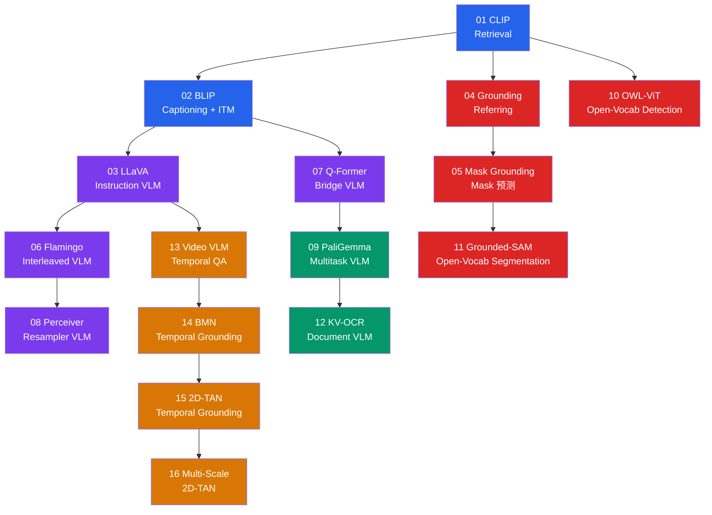
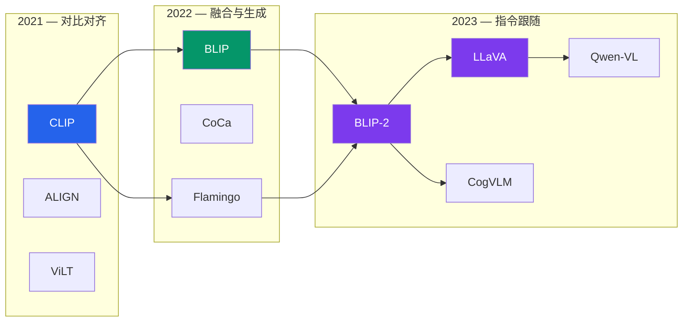

# 多模态赛道

!!! abstract "赛道概览"
    **16 个 Lesson** · 预计 3-4 周 · 从 CLIP 双塔对齐到 LLaVA 指令跟随，再到开放词汇检测与时序定位

    Multimodal 赛道是 DL-Hub 最前沿的方向，覆盖视觉语言模型（VLM）的完整演进脉络。从对比学习（CLIP）出发，经过跨模态融合（BLIP）、视觉指令跟随（LLaVA）、开放词汇检测（OWL-ViT）、文档理解（OCR VLM）到视频时序定位（2D-TAN）。配套 **20 个 VLM 架构族**可供深入探索。

---

## 学习路径



!!! tip "颜色说明"
    :blue_square: 对齐与融合 · :purple_square: VLM 架构 · :red_square: 检测与分割 · :green_square: 多任务 / 文档 · :orange_square: 视频时序

---

## 先修知识

| 领域 | 要求 |
|:-----|:-----|
| DL-Hub | 完成 [Vision 视觉赛道](vision.md) + [NLP 赛道](nlp.md) |
| 注意力机制 | Self-Attention, Cross-Attention, Multi-Head Attention |
| 对比学习 | InfoNCE Loss 基本直觉 |

---

## 课程列表

| 序号 | 项目 | 代码文档 | 核心概念 |
|:----:|:-----|:---------|:---------|
| 01 | **CLIP-Style Retrieval** | [`clip_toy_retrieval`](https://github.com/skygazer42/DL-Hub/tree/main/tracks/multimodal/lesson_01_clip_toy_retrieval/) | 对比学习, 双塔编码器 |
| 02 | **BLIP-Lite Captioning + ITM** | [`blip_toy_captioning`](https://github.com/skygazer42/DL-Hub/tree/main/tracks/multimodal/lesson_02_blip_toy_captioning/) | 视觉 token 融合, ITM |
| 03 | **LLaVA-Lite Instruction VLM** | [`llava_toy_instruction_vlm`](https://github.com/skygazer42/DL-Hub/tree/main/tracks/multimodal/lesson_03_llava_toy_instruction_vlm/) | 视觉前缀, 指令跟随 |
| 04 | **Grounding Referring** | [`grounding_toy_refexp`](https://github.com/skygazer42/DL-Hub/tree/main/tracks/multimodal/lesson_04_grounding_toy_refexp/) | 指代表达, Box 回归 |
| 05 | **Mask Grounding** | [`mask_grounding_toy_refexp`](https://github.com/skygazer42/DL-Hub/tree/main/tracks/multimodal/lesson_05_mask_grounding_toy_refexp/) | 文本条件 Mask 预测 |
| 06 | **Flamingo Interleaved VLM** | [`flamingo_toy_interleaved_vlm`](https://github.com/skygazer42/DL-Hub/tree/main/tracks/multimodal/lesson_06_flamingo_toy_interleaved_vlm/) | 交错图文, Few-shot |
| 07 | **Q-Former Bridge VLM** | [`qformer_toy_bridge_vlm`](https://github.com/skygazer42/DL-Hub/tree/main/tracks/multimodal/lesson_07_qformer_toy_bridge_vlm/) | Cross-attention 瓶颈 |
| 08 | **Perceiver Resampler VLM** | [`perceiver_resampler_toy_vlm`](https://github.com/skygazer42/DL-Hub/tree/main/tracks/multimodal/lesson_08_perceiver_resampler_toy_vlm/) | 多视图 token 池化 |
| 09 | **PaliGemma Multitask VLM** | [`paligemma_toy_siglip_decoder_vlm`](https://github.com/skygazer42/DL-Hub/tree/main/tracks/multimodal/lesson_09_paligemma_toy_siglip_decoder_vlm/) | 提示式多任务 |
| 10 | **OWL-ViT Open-Vocab Detection** | [`owlvit_toy_open_vocab_detection`](https://github.com/skygazer42/DL-Hub/tree/main/tracks/multimodal/lesson_10_owlvit_toy_open_vocab_detection/) | 开放词汇检测 |
| 11 | **Grounded-SAM Segmentation** | [`grounded_sam_toy_open_vocab_segmentation`](https://github.com/skygazer42/DL-Hub/tree/main/tracks/multimodal/lesson_11_grounded_sam_toy_open_vocab_segmentation/) | 开放词汇分割 |
| 12 | **Key-Value OCR Document VLM** | [`key_value_ocr_toy_doc_vlm`](https://github.com/skygazer42/DL-Hub/tree/main/tracks/multimodal/lesson_12_key_value_ocr_toy_doc_vlm/) | 文档字段提取 |
| 13 | **Video VLM Temporal QA** | [`video_vlm_toy_temporal_qa`](https://github.com/skygazer42/DL-Hub/tree/main/tracks/multimodal/lesson_13_video_vlm_toy_temporal_qa/) | 短视频 QA |
| 14 | **BMN Temporal Grounding** | [`bmn_toy_temporal_grounding`](https://github.com/skygazer42/DL-Hub/tree/main/tracks/multimodal/lesson_14_bmn_toy_temporal_grounding/) | 时序定位, 边界预测 |
| 15 | **2D-TAN Temporal Grounding** | [`2dtan_toy_temporal_grounding`](https://github.com/skygazer42/DL-Hub/tree/main/tracks/multimodal/lesson_15_2dtan_toy_temporal_grounding/) | 密集时序段图 |
| 16 | **Multi-Scale 2D-TAN** | [`multiscale_2dtan_toy_temporal_grounding`](https://github.com/skygazer42/DL-Hub/tree/main/tracks/multimodal/lesson_16_multiscale_2dtan_toy_temporal_grounding/) | 多尺度时序金字塔 |

---

## 运行示例

=== "Lesson 01 — CLIP"

    ```bash
    python -m tracks.multimodal.lesson_01_clip_toy_retrieval.train \
      --device cpu --epochs 1 \
      --max-train-batches 2 --max-eval-batches 1
    ```

=== "Lesson 03 — LLaVA"

    ```bash
    python -m tracks.multimodal.lesson_03_llava_toy_instruction_vlm.train \
      --device cpu --epochs 1 \
      --max-train-batches 2 --max-eval-batches 1
    ```

=== "Lesson 10 — OWL-ViT"

    ```bash
    python -m tracks.multimodal.lesson_10_owlvit_toy_open_vocab_detection.train \
      --device cpu --epochs 1 \
      --max-train-batches 2 --max-eval-batches 1
    ```

=== "Lesson 16 — Multi-Scale 2D-TAN"

    ```bash
    python -m tracks.multimodal.lesson_16_multiscale_2dtan_toy_temporal_grounding.train \
      --device cpu --epochs 1 \
      --max-train-batches 2 --max-eval-batches 1
    ```

---

## VLM 技术演进脉络



---

## VLM Zoo

!!! note "20 个视觉语言模型族"
    VLM Zoo 涵盖从 2021 年 CLIP 到 2023 年 Qwen-VL 的 **20 个 VLM 架构族**，所有实现均为纯 PyTorch 教学代码。

```bash
# 列出所有 VLM 架构
python scripts/vlm_zoo.py --list

# 搜索特定架构
python scripts/vlm_zoo.py --search llava

# 查看时间线
python scripts/vlm_zoo.py --timeline

# 冒烟测试
python scripts/vlm_zoo.py --smoke dlvlm:clip_tiny
```

??? info "VLM Zoo — 20 个视觉语言模型族完整列表（点击展开）"

    | Family | 年份 | 核心创新 |
    |:-------|:----:|:---------|
    | **CLIP** | 2021 | 对比图文预训练，双塔编码器对齐视觉与语言表示 |
    | **ALIGN** | 2021 | 大规模噪声对比学习，使用 10 亿级噪声图文对 |
    | **ViLT** | 2021 | Patch 级视觉语言 Transformer，去除 CNN 特征提取 |
    | **SimVLM** | 2021 | 简单视觉语言预训练，前缀语言建模 |
    | **ALBEF** | 2021 | 先对齐再融合，动量蒸馏 |
    | **LiT** | 2022 | 锁定图像 Encoder 的文本微调 |
    | **BLIP** | 2022 | 引导式图文预训练，噪声标题过滤 |
    | **CoCa** | 2022 | 对比式描述器，统一对比和生成目标 |
    | **OFA** | 2022 | 统一架构、任务、模态的通用框架 |
    | **Flamingo** | 2022 | 交错图文视觉语言模型，Few-shot 能力 |
    | **PaLI** | 2022 | Pathways 图文模型，大规模多语言 |
    | **BLIP-2** | 2023 | Q-Former 桥接视觉与 LLM，两阶段预训练 |
    | **InstructBLIP** | 2023 | 指令微调 BLIP-2，提升指令跟随能力 |
    | **LLaVA** | 2023 | 视觉指令微调，线性投影连接视觉与语言 |
    | **MiniGPT-4** | 2023 | 投影前缀视觉 LLM，对齐视觉特征到语言空间 |
    | **Kosmos-2** | 2023 | 接地多模态 LLM，支持 Grounding 输出 |
    | **mPLUG-Owl2** | 2023 | 模态自适应模块，动态融合视觉与语言 |
    | **CogVLM** | 2023 | LLM 层内视觉专家，深度视觉语言融合 |
    | **PaLI-X** | 2023 | 缩放版 Pathways 图文模型，55B 参数 |
    | **Qwen-VL** | 2023 | 通义千问视觉语言模型，多任务多分辨率 |

---

## 多模态任务分类

| 任务类型 | 对应 Lesson | 输入 | 输出 |
|:---------|:------------|:-----|:-----|
| **图文检索** | 01 CLIP | 图像 + 文本 | 相似度排名 |
| **图像描述** | 02 BLIP | 图像 | 文本描述 |
| **视觉问答** | 03 LLaVA, 09 PaliGemma | 图像 + 问题 | 文本回答 |
| **目标定位** | 04-05 Grounding | 图像 + 文本 | Box / Mask |
| **开放词汇检测** | 10 OWL-ViT | 图像 + 类别文本 | 检测框 |
| **开放词汇分割** | 11 Grounded-SAM | 图像 + 文本 | 分割掩码 |
| **文档理解** | 12 KV-OCR | 文档图像 | 键值对 |
| **视频 QA** | 13 Video VLM | 视频帧 + 问题 | 文本回答 |
| **时序定位** | 14-16 BMN/2D-TAN | 视频 + 文本 | 时间段 |

---

## 下一步

!!! success "恭喜！"
    完成 Multimodal 赛道意味着你已经走完了 DL-Hub 全部 8 条学习赛道的核心内容。以下是一些进阶方向：

| 方向 | 说明 |
|:-----|:-----|
| :material-flask: **Model Zoo 探索** | 深入 [VLM Zoo](../zoo/vlm-zoo.md) 的 20 个架构族，对比不同设计范式 |
| :material-book-open: **论文阅读** | 阅读 `resources/pdfs/llms/` 下的 50+ 篇论文 |
| :material-code-tags: **贡献新 Lesson** | 参考 [贡献指南](../developer/contributing.md) 提交 PR |
| :material-refresh: **回顾复习** | 回到 [赛道总览](index.md) 制定复习计划 |
