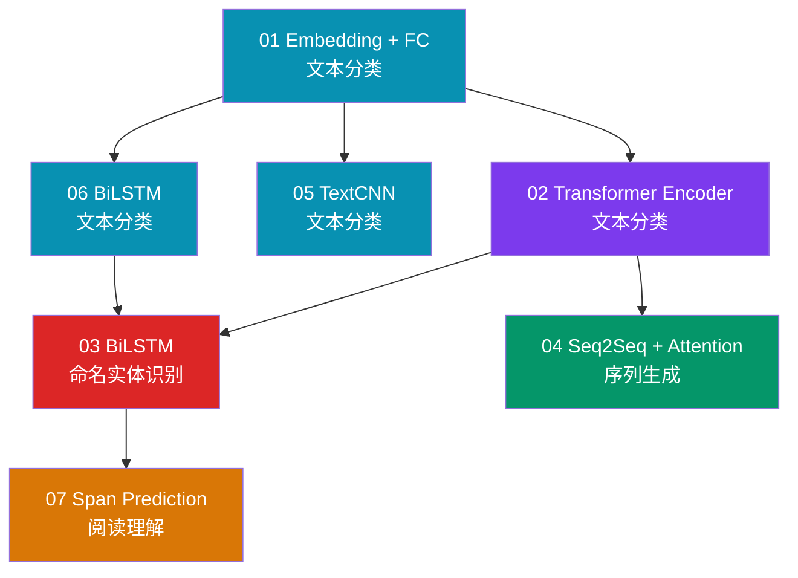
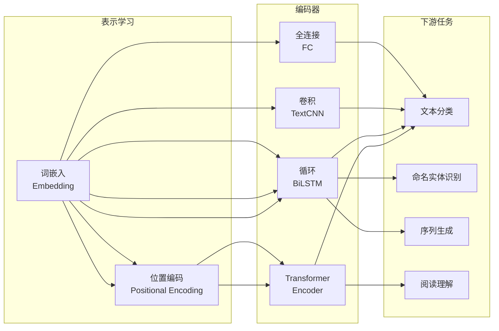

# NLP 赛道

!!! abstract "赛道概览"
    **49 个 Lesson** · 预计 3-4 周 · 从 compact 文本分类到 Transformer、NER、阅读理解与对话系统

    NLP 赛道从最基础的词嵌入 + 全连接分类开始，逐步引入 Transformer Encoder、BiLSTM、Seq2Seq + Attention 与阅读理解，再延伸到文本匹配、摘要生成、prompt tuning、few-shot、自监督语言建模，最后以 21 课的 task-oriented dialog 专题收尾。配套 **814 种 NLP 架构**可供探索。

---

## 学习路径

下图展示前 7 课的核心学习路径；Lesson 08 之后按主题分组，详见下方课程列表。



!!! tip "颜色说明"
    :material-square: 蓝 — 分类 · :purple_square: Transformer · :red_square: 序列标注 · :green_square: 序列生成 · :orange_square: 阅读理解

---

## 先修知识

| 领域 | 要求 |
|:-----|:-----|
| DL-Hub | 完成 [Foundations 赛道](foundations.md) |
| 文本处理 | 分词、词汇表构建、Padding 基本概念 |
| 数学 | Softmax、交叉熵损失（分类任务通用） |

---

## 课程列表

全部 **49 个 Lesson** 按主题分组如下；每个 lesson 都有可运行的 `train.py`，课程说明由本页与目录内 README 共同维护。

### 基础与表示学习（01-15）

| 序号 | 项目 | 代码文档 | 核心概念 |
|:----:|:-----|:---------|:---------|
| 01 | **Embedding + FC 文本分类** | [`compact_text_classification`](https://github.com/skygazer42/DL-Hub/tree/main/tracks/nlp/lesson_01_compact_text_classification/) | 词嵌入, 词袋 |
| 02 | **Transformer Encoder 文本分类** | [`compact_text_classification_transformer`](https://github.com/skygazer42/DL-Hub/tree/main/tracks/nlp/lesson_02_compact_text_classification_transformer/) | Self-Attention, 位置编码 |
| 03 | **BiLSTM 命名实体识别** | [`compact_ner_bilstm`](https://github.com/skygazer42/DL-Hub/tree/main/tracks/nlp/lesson_03_compact_ner_bilstm/) | 序列标注, BIO 标签 |
| 04 | **Seq2Seq + Attention 序列生成** | [`compact_seq2seq_attention_generation`](https://github.com/skygazer42/DL-Hub/tree/main/tracks/nlp/lesson_04_compact_seq2seq_attention_generation/) | Encoder-Decoder, Bahdanau Attention |
| 05 | **TextCNN 文本分类** | [`compact_text_classification_textcnn`](https://github.com/skygazer42/DL-Hub/tree/main/tracks/nlp/lesson_05_compact_text_classification_textcnn/) | 多尺度卷积核, 文本特征 |
| 06 | **BiLSTM 文本分类** | [`compact_text_classification_bilstm`](https://github.com/skygazer42/DL-Hub/tree/main/tracks/nlp/lesson_06_compact_text_classification_bilstm/) | 双向 LSTM, 隐藏状态 |
| 07 | **Span Prediction 阅读理解** | [`reading_comprehension`](https://github.com/skygazer42/DL-Hub/tree/main/tracks/nlp/lesson_07_reading_comprehension/) | SQuAD 风格, Start/End Logits |
| 08 | **双塔文本匹配** | [`compact_text_matching_biencoder`](https://github.com/skygazer42/DL-Hub/tree/main/tracks/nlp/lesson_08_compact_text_matching_biencoder/) | 双塔编码器, 相似度检索 |
| 09 | **Transformer 摘要生成** | [`compact_transformer_summarization`](https://github.com/skygazer42/DL-Hub/tree/main/tracks/nlp/lesson_09_compact_transformer_summarization/) | Encoder-Decoder, Teacher Forcing |
| 10 | **Prompt Tuning 文本分类** | [`compact_prompt_tuning_classifier`](https://github.com/skygazer42/DL-Hub/tree/main/tracks/nlp/lesson_10_compact_prompt_tuning_classifier/) | Soft Prompt, Frozen Encoder |
| 11 | **Few-Shot 文本分类** | [`compact_few_shot_text_classification`](https://github.com/skygazer42/DL-Hub/tree/main/tracks/nlp/lesson_11_compact_few_shot_text_classification/) | Episodic Sampling, Prototype 分类 |
| 12 | **In-Context 文本分类** | [`compact_in_context_text_classification`](https://github.com/skygazer42/DL-Hub/tree/main/tracks/nlp/lesson_12_compact_in_context_text_classification/) | Support Set Prompting, 无梯度适配 |
| 13 | **Masked Language Modeling** | [`compact_masked_language_modeling`](https://github.com/skygazer42/DL-Hub/tree/main/tracks/nlp/lesson_13_compact_masked_language_modeling/) | Masked Token 预测, 自监督预训练 |
| 14 | **Contrastive Sentence Embedding** | [`compact_contrastive_sentence_embedding`](https://github.com/skygazer42/DL-Hub/tree/main/tracks/nlp/lesson_14_compact_contrastive_sentence_embedding/) | 双视图增强, NT-Xent 对比学习 |
| 15 | **Cross-Encoder Reranking** | [`compact_cross_encoder_reranking`](https://github.com/skygazer42/DL-Hub/tree/main/tracks/nlp/lesson_15_compact_cross_encoder_reranking/) | Query-Doc 拼接, 成对排序损失 |

### 进阶文本任务（16-28）

| 序号 | 项目 | 代码文档 | 核心概念 |
|:----:|:-----|:---------|:---------|
| 16 | **Text Clustering** | [`compact_text_clustering`](https://github.com/skygazer42/DL-Hub/tree/main/tracks/nlp/lesson_16_compact_text_clustering/) | 原型聚类, 句向量分组, 无标签结构发现 |
| 17 | **Text Anomaly Detection** | [`compact_text_anomaly_detection`](https://github.com/skygazer42/DL-Hub/tree/main/tracks/nlp/lesson_17_compact_text_anomaly_detection/) | 正常模式建模, 距离阈值, 异常得分 |
| 18 | **Topic Modeling** | [`compact_topic_modeling`](https://github.com/skygazer42/DL-Hub/tree/main/tracks/nlp/lesson_18_compact_topic_modeling/) | 主题混合, BoW 重建, 潜在主题发现 |
| 19 | **Distilled Text Classifier** | [`compact_distilled_text_classifier`](https://github.com/skygazer42/DL-Hub/tree/main/tracks/nlp/lesson_19_compact_distilled_text_classifier/) | Teacher-Student 蒸馏, 软目标迁移, 轻量学生模型 |
| 20 | **Adversarial Text Classification** | [`compact_adversarial_text_classification`](https://github.com/skygazer42/DL-Hub/tree/main/tracks/nlp/lesson_20_compact_adversarial_text_classification/) | 对抗替换增强, 干净/扰动双视图分类, 一致性约束 |
| 21 | **Adversarial Example Detection** | [`compact_adversarial_example_detection`](https://github.com/skygazer42/DL-Hub/tree/main/tracks/nlp/lesson_21_compact_adversarial_example_detection/) | 扰动检测, 二分类判别, 语义模板对抗样本识别 |
| 22 | **Weak-Supervision Text Classification** | [`compact_weak_supervision_text_classification`](https://github.com/skygazer42/DL-Hub/tree/main/tracks/nlp/lesson_22_compact_weak_supervision_text_classification/) | 标注函数投票, 软伪标签, 文本与投票融合 |
| 23 | **Sentence Denoising Autoencoder** | [`compact_sentence_denoising_autoencoder`](https://github.com/skygazer42/DL-Hub/tree/main/tracks/nlp/lesson_23_compact_sentence_denoising_autoencoder/) | 句子去噪重建, 序列自编码, 自监督恢复训练 |
| 24 | **Meta Few-Shot Text Classification** | [`compact_meta_few_shot_text_classification`](https://github.com/skygazer42/DL-Hub/tree/main/tracks/nlp/lesson_24_compact_meta_few_shot_text_classification/) | Episodic 元学习, Prototype 适配, 任务级泛化 |
| 25 | **Low-Shot Intent Detection** | [`compact_low_shot_intent_detection`](https://github.com/skygazer42/DL-Hub/tree/main/tracks/nlp/lesson_25_compact_low_shot_intent_detection/) | 少样本意图分类, 小预算监督, 轻量文本编码器 |
| 26 | **Joint Intent + Slot Parsing** | [`compact_joint_intent_slot_parsing`](https://github.com/skygazer42/DL-Hub/tree/main/tracks/nlp/lesson_26_compact_joint_intent_slot_parsing/) | 意图与槽位联合建模, BIO 标注, 任务导向 NLU |
| 27 | **Textual Entailment** | [`compact_textual_entailment`](https://github.com/skygazer42/DL-Hub/tree/main/tracks/nlp/lesson_27_compact_textual_entailment/) | 前提-假设关系判别, 双句编码, 蕴含分类 |
| 28 | **Semantic Textual Similarity** | [`compact_semantic_textual_similarity`](https://github.com/skygazer42/DL-Hub/tree/main/tracks/nlp/lesson_28_compact_semantic_textual_similarity/) | 双句相似度回归, pooled embedding, MAE 评估 |

### 对话系统专题（29-49）

| 序号 | 项目 | 代码文档 | 核心概念 |
|:----:|:-----|:---------|:---------|
| 29 | **Dialog State Tracking** | [`compact_dialog_state_tracking`](https://github.com/skygazer42/DL-Hub/tree/main/tracks/nlp/lesson_29_compact_dialog_state_tracking/) | 多轮对话状态维护, 多槽位分类, joint-goal accuracy |
| 30 | **Dialog Response Selection** | [`compact_dialog_response_selection`](https://github.com/skygazer42/DL-Hub/tree/main/tracks/nlp/lesson_30_compact_dialog_response_selection/) | 上下文-候选响应匹配, 双塔评分, 排序准确率 |
| 31 | **Slot Carryover Prediction** | [`compact_slot_carryover_prediction`](https://github.com/skygazer42/DL-Hub/tree/main/tracks/nlp/lesson_31_compact_slot_carryover_prediction/) | 历史槽位继承判别, 多头二分类, joint carryover accuracy |
| 32 | **Dialog Act Prediction** | [`compact_dialog_act_prediction`](https://github.com/skygazer42/DL-Hub/tree/main/tracks/nlp/lesson_32_compact_dialog_act_prediction/) | 对话行为分类, 轮次语气模式, utterance-level softmax |
| 33 | **Dialog Intent Prediction** | [`compact_dialog_intent_prediction`](https://github.com/skygazer42/DL-Hub/tree/main/tracks/nlp/lesson_33_compact_dialog_intent_prediction/) | 任务导向意图分类, 餐厅/打车场景, pooled embedding 分类 |
| 34 | **Dialog Policy Prediction** | [`compact_dialog_policy_prediction`](https://github.com/skygazer42/DL-Hub/tree/main/tracks/nlp/lesson_34_compact_dialog_policy_prediction/) | 系统动作预测, 状态-动作映射, pooled embedding 策略分类 |
| 35 | **Dialog Domain Prediction** | [`compact_dialog_domain_prediction`](https://github.com/skygazer42/DL-Hub/tree/main/tracks/nlp/lesson_35_compact_dialog_domain_prediction/) | 对话域分类, 餐厅/酒店/打车场景, pooled embedding 分类 |
| 36 | **Dialog Slot Prediction** | [`compact_dialog_slot_prediction`](https://github.com/skygazer42/DL-Hub/tree/main/tracks/nlp/lesson_36_compact_dialog_slot_prediction/) | 多槽位联合分类, cuisine/area/party 预测, pooled embedding 编码 |
| 37 | **Dialog Outcome Prediction** | [`compact_dialog_outcome_prediction`](https://github.com/skygazer42/DL-Hub/tree/main/tracks/nlp/lesson_37_compact_dialog_outcome_prediction/) | resolved/pending/escalated 分类, 对话结果建模, softmax 监督 |
| 38 | **Dialog Satisfaction Prediction** | [`compact_dialog_satisfaction_prediction`](https://github.com/skygazer42/DL-Hub/tree/main/tracks/nlp/lesson_38_compact_dialog_satisfaction_prediction/) | dissatisfied/neutral/satisfied 分类, 满意度建模, softmax 监督 |
| 39 | **Dialog Escalation Risk Prediction** | [`compact_dialog_escalation_risk_prediction`](https://github.com/skygazer42/DL-Hub/tree/main/tracks/nlp/lesson_39_compact_dialog_escalation_risk_prediction/) | low/medium/high 风险分类, 升级风险建模, softmax 监督 |
| 40 | **Dialog Priority Prediction** | [`compact_dialog_priority_prediction`](https://github.com/skygazer42/DL-Hub/tree/main/tracks/nlp/lesson_40_compact_dialog_priority_prediction/) | low/medium/high 优先级分类, 支持工单分流, pooled embedding 监督 |
| 41 | **Dialog Transfer Prediction** | [`compact_dialog_transfer_prediction`](https://github.com/skygazer42/DL-Hub/tree/main/tracks/nlp/lesson_41_compact_dialog_transfer_prediction/) | low/medium/high 转接需求分类, specialist transfer 建模, softmax 监督 |
| 42 | **Dialog Resolution Time Prediction** | [`compact_dialog_resolution_time_prediction`](https://github.com/skygazer42/DL-Hub/tree/main/tracks/nlp/lesson_42_compact_dialog_resolution_time_prediction/) | 预计处理时长分类, timing cue 建模, pooled embedding 监督 |
| 43 | **Dialog Callback Prediction** | [`compact_dialog_callback_prediction`](https://github.com/skygazer42/DL-Hub/tree/main/tracks/nlp/lesson_43_compact_dialog_callback_prediction/) | 是否需要回拨二分类, callback/followup 语义建模, pooled embedding 监督 |
| 44 | **Dialog SLA Breach Prediction** | [`compact_dialog_sla_breach_prediction`](https://github.com/skygazer42/DL-Hub/tree/main/tracks/nlp/lesson_44_compact_dialog_sla_breach_prediction/) | 是否 SLA breach 二分类, sla/minutes 语义建模, pooled embedding 监督 |
| 45 | **Dialog Followup Channel Prediction** | [`compact_dialog_followup_channel_prediction`](https://github.com/skygazer42/DL-Hub/tree/main/tracks/nlp/lesson_45_compact_dialog_followup_channel_prediction/) | email/sms/call 三分类, followup route 建模, pooled embedding 监督 |
| 46 | **Dialog Reopen Prediction** | [`compact_dialog_reopen_prediction`](https://github.com/skygazer42/DL-Hub/tree/main/tracks/nlp/lesson_46_compact_dialog_reopen_prediction/) | 是否 reopen 二分类, unresolved cue 建模, pooled embedding 监督 |
| 47 | **Dialog Resolution Owner Prediction** | [`compact_dialog_resolution_owner_prediction`](https://github.com/skygazer42/DL-Hub/tree/main/tracks/nlp/lesson_47_compact_dialog_resolution_owner_prediction/) | billing/support/operations 三分类, owner cue 建模, pooled embedding 监督 |
| 48 | **Dialog Resolution Action Prediction** | [`compact_dialog_resolution_action_prediction`](https://github.com/skygazer42/DL-Hub/tree/main/tracks/nlp/lesson_48_compact_dialog_resolution_action_prediction/) | close/handoff/followup/resolve/escalate 五分类, resolution action cue 建模, pooled embedding 监督 |
| 49 | **Dialog Owner Handoff Prediction** | [`compact_dialog_owner_handoff_prediction`](https://github.com/skygazer42/DL-Hub/tree/main/tracks/nlp/lesson_49_compact_dialog_owner_handoff_prediction/) | none/billing/support/operations 四分类, owner-queue handoff cue 建模, pooled embedding 监督 |

---

## 核心技术脉络



---

## 运行示例

=== "Lesson 01 — 文本分类"

    ```bash
    python -m tracks.nlp.lesson_01_compact_text_classification.train \
      --epochs 1 \
      --max-train-batches 2 --max-eval-batches 2
    ```

=== "Lesson 02 — Transformer 分类"

    ```bash
    python -m tracks.nlp.lesson_02_compact_text_classification_transformer.train \
      --epochs 1 \
      --max-train-batches 2 --max-eval-batches 2
    ```

=== "Lesson 03 — NER"

    ```bash
    python -m tracks.nlp.lesson_03_compact_ner_bilstm.train \
      --epochs 1 \
      --max-train-batches 2 --max-eval-batches 2
    ```

=== "Lesson 07 — 阅读理解"

    ```bash
    python -m tracks.nlp.lesson_07_reading_comprehension.train \
      --epochs 1 \
      --max-train-batches 2 --max-eval-batches 2
    ```

---

## NLP Architecture Zoo

!!! note "814 个本地构建配置"
    NLP Zoo 提供 **49 个方法注册组 / 814 个注册 ID**，用于定位 Transformer、RNN、CNN、MLP
    等教学入口；注册组不自动等于独立论文实现，具体机制等级以
    [Model Zoo 保真度审计](../zoo/fidelity.md)为准。

```bash
# 列出所有可用架构
python scripts/nlp_zoo.py --list

# 搜索特定架构
python scripts/nlp_zoo.py --search bert

# 冒烟测试
python scripts/nlp_zoo.py --smoke bert_base
```

??? info "NLP 架构分类详情（点击展开）"

    | 类别 | 代表架构 | 特点 |
    |:-----|:---------|:-----|
    | **Transformer** | BERT, GPT, T5, ALBERT, DistilBERT, Longformer, BigBird | 主流预训练语言模型 |
    | **高效 Transformer** | Performer, Nystromformer, FNet, Synthesizer, Linformer | 线性复杂度注意力 |
    | **RNN 系列** | LSTM, GRU, BiLSTM, BiGRU, IndRNN, SRU, QRNN | 经典序列建模 |
    | **CNN 系列** | TextCNN, InceptionCNN, DPCNN, VDCNN, ResConv | 文本的卷积特征提取 |
    | **MLP 系列** | gMLP, ResMLP, MLP-Mixer | 全连接替代注意力 |
    | **轻量级** | FastText, WaveNet, TCN | 推理高效的文本模型 |

---

## 下一步

完成 NLP 赛道后，你可以继续：

| 推荐方向 | 说明 |
|:---------|:-----|
| :arrow_right: [LLM 大语言模型赛道](llm.md) | 从 NLP 迈向自回归大语言模型 |
| :arrow_right: [GNN 图神经网络赛道](gnn.md) | 将序列建模扩展到图结构数据 |
| :arrow_right: [Multimodal 多模态赛道](multimodal.md) | 结合视觉与语言的跨模态学习 |
