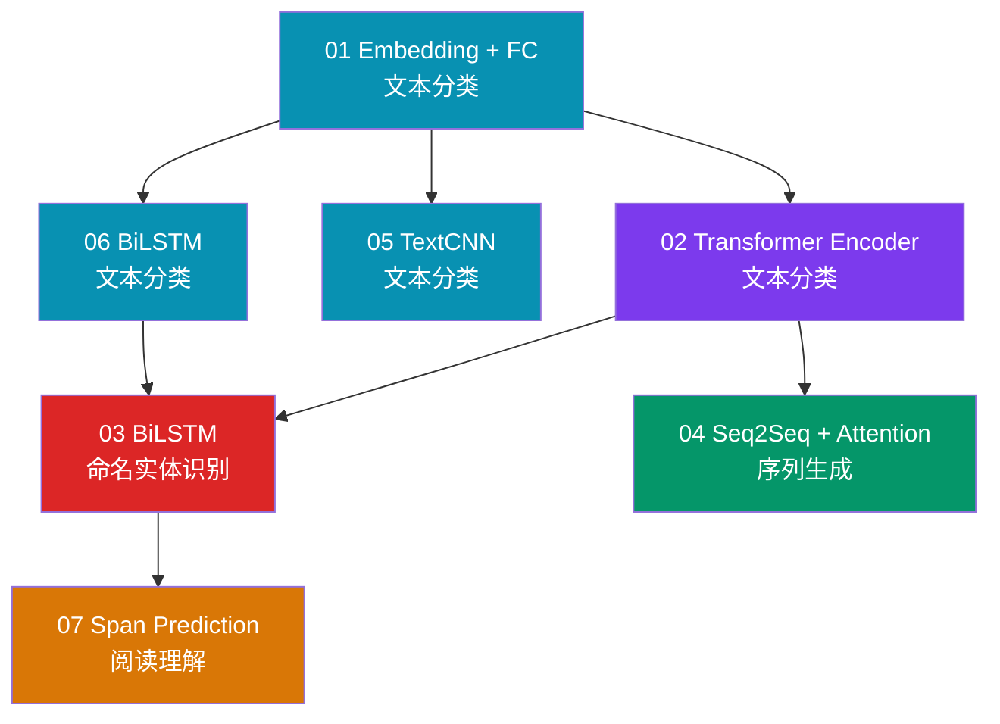
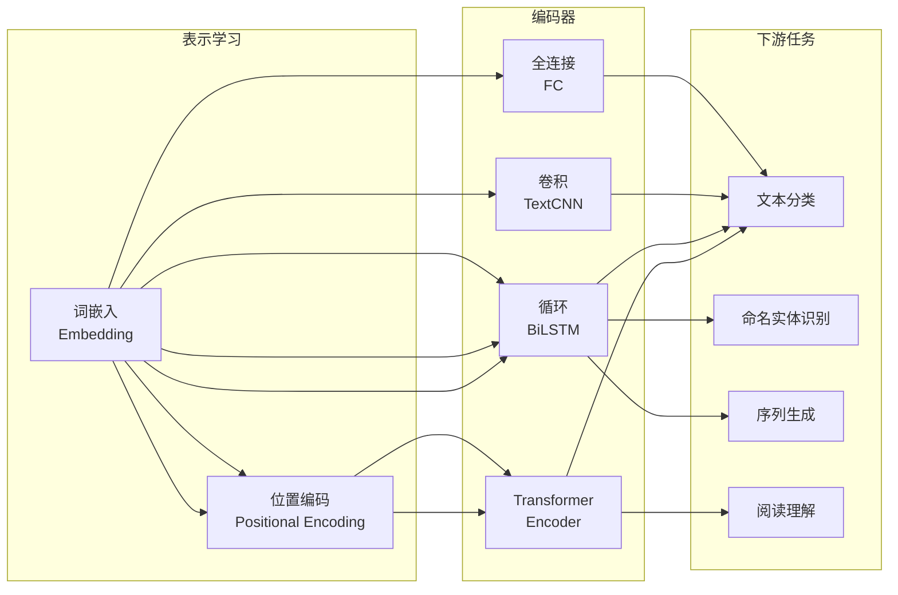

# NLP 赛道

!!! abstract "赛道概览"
    **7 个 Lesson** · 预计 1-2 周 · 从 toy 文本分类到 Transformer、NER、阅读理解

    NLP 赛道从最基础的词嵌入 + 全连接分类开始，逐步引入 Transformer Encoder、BiLSTM、Seq2Seq + Attention，最终完成 SQuAD 风格的阅读理解任务。配套 **813 种 NLP 架构**可供探索。

---

## 学习路径



!!! tip "颜色说明"
    :material-square: 蓝 — 分类 · :purple_square: Transformer · :red_square: 序列标注 · :green_square: 序列生成 · :orange_square: 阅读理解

---

## 先修知识

| 领域 | 要求 |
|:-----|:-----|
| DL-Hub | 完成 [Foundations 赛道](foundations.md) |
| 文本处理 | 分词、词汇表构建、Padding 基本概念 |
| 数学 | Softmax、交叉熵损失（分类任务通用） |

---

## 课程列表

| 序号 | 项目 | 代码文档 | 核心概念 |
|:----:|:-----|:---------|:---------|
| 01 | **Embedding + FC 文本分类** | [`toy_text_classification`](https://github.com/skygazer42/DL-Hub/tree/main/tracks/nlp/lesson_01_toy_text_classification/) | 词嵌入, 词袋 |
| 02 | **Transformer Encoder 文本分类** | [`toy_text_classification_transformer`](https://github.com/skygazer42/DL-Hub/tree/main/tracks/nlp/lesson_02_toy_text_classification_transformer/) | Self-Attention, 位置编码 |
| 03 | **BiLSTM 命名实体识别** | [`toy_ner_bilstm`](https://github.com/skygazer42/DL-Hub/tree/main/tracks/nlp/lesson_03_toy_ner_bilstm/) | 序列标注, BIO 标签 |
| 04 | **Seq2Seq + Attention 序列生成** | [`toy_seq2seq_attention_generation`](https://github.com/skygazer42/DL-Hub/tree/main/tracks/nlp/lesson_04_toy_seq2seq_attention_generation/) | Encoder-Decoder, Bahdanau Attention |
| 05 | **TextCNN 文本分类** | [`toy_text_classification_textcnn`](https://github.com/skygazer42/DL-Hub/tree/main/tracks/nlp/lesson_05_toy_text_classification_textcnn/) | 多尺度卷积核, 文本特征 |
| 06 | **BiLSTM 文本分类** | [`toy_text_classification_bilstm`](https://github.com/skygazer42/DL-Hub/tree/main/tracks/nlp/lesson_06_toy_text_classification_bilstm/) | 双向 LSTM, 隐藏状态 |
| 07 | **Span Prediction 阅读理解** | [`reading_comprehension`](https://github.com/skygazer42/DL-Hub/tree/main/tracks/nlp/lesson_07_reading_comprehension/) | SQuAD 风格, Start/End Logits |

---

## 核心技术脉络



---

## 运行示例

=== "Lesson 01 — 文本分类"

    ```bash
    python -m tracks.nlp.lesson_01_toy_text_classification.train \
      --dataset fake --epochs 1 \
      --max-train-batches 2 --max-eval-batches 2
    ```

=== "Lesson 02 — Transformer 分类"

    ```bash
    python -m tracks.nlp.lesson_02_toy_text_classification_transformer.train \
      --dataset fake --epochs 1 \
      --max-train-batches 2 --max-eval-batches 2
    ```

=== "Lesson 03 — NER"

    ```bash
    python -m tracks.nlp.lesson_03_toy_ner_bilstm.train \
      --dataset fake --epochs 1 \
      --max-train-batches 2 --max-eval-batches 2
    ```

=== "Lesson 07 — 阅读理解"

    ```bash
    python -m tracks.nlp.lesson_07_reading_comprehension.train \
      --dataset fake --epochs 1 \
      --max-train-batches 2 --max-eval-batches 2
    ```

---

## NLP Architecture Zoo

!!! note "814 架构可供探索"
    NLP Zoo 包含 **49 个算法族 / 814 个架构 ID**，涵盖 Transformer、RNN、CNN、MLP 等多种文本编码器，所有实现均为纯 PyTorch 本地代码。

```bash
# 列出所有可用架构
python scripts/nlp_zoo.py --list

# 搜索特定架构
python scripts/nlp_zoo.py --search bert

# 冒烟测试
python scripts/nlp_zoo.py --smoke bert_base
```

??? info "NLP 架构分类详情（点击展开）"

    | 类别 | 代表架构 | 特点 |
    |:-----|:---------|:-----|
    | **Transformer** | BERT, GPT, T5, ALBERT, DistilBERT, Longformer, BigBird | 主流预训练语言模型 |
    | **高效 Transformer** | Performer, Nystromformer, FNet, Synthesizer, Linformer | 线性复杂度注意力 |
    | **RNN 系列** | LSTM, GRU, BiLSTM, BiGRU, IndRNN, SRU, QRNN | 经典序列建模 |
    | **CNN 系列** | TextCNN, InceptionCNN, DPCNN, VDCNN, ResConv | 文本的卷积特征提取 |
    | **MLP 系列** | gMLP, ResMLP, MLP-Mixer | 全连接替代注意力 |
    | **轻量级** | FastText, WaveNet, TCN | 推理高效的文本模型 |

---

## 下一步

完成 NLP 赛道后，你可以继续：

| 推荐方向 | 说明 |
|:---------|:-----|
| :arrow_right: [LLM 大语言模型赛道](llm.md) | 从 NLP 迈向自回归大语言模型 |
| :arrow_right: [GNN 图神经网络赛道](gnn.md) | 将序列建模扩展到图结构数据 |
| :arrow_right: [Multimodal 多模态赛道](multimodal.md) | 结合视觉与语言的跨模态学习 |
