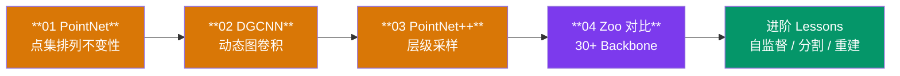
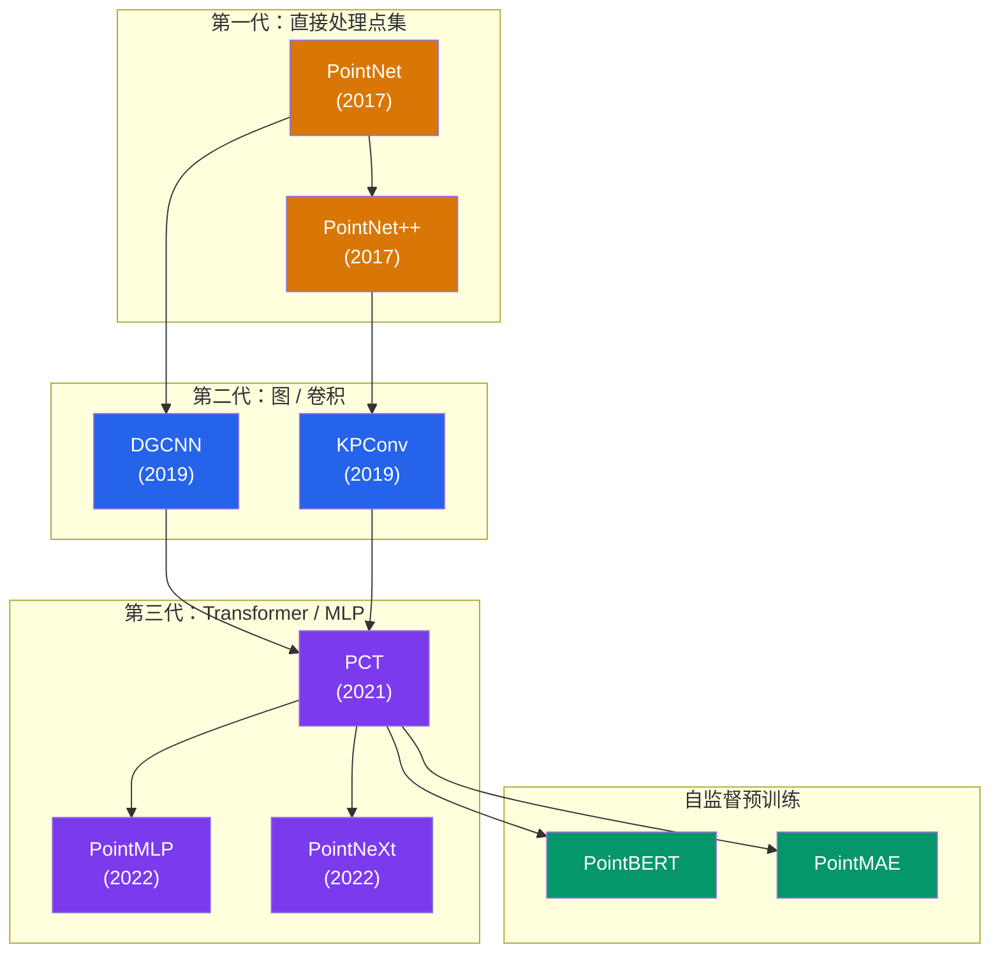

# 点云赛道

!!! abstract "赛道概览"
    **23 个 Lesson**（4 个核心 + 19 个进阶） · 预计 2-3 周 · PointNet、DGCNN、PointNet++ 与 64 架构 Zoo

    Point Cloud 赛道从最经典的 PointNet 出发，逐步引入图卷积（DGCNN）和层级采样（PointNet++），最后通过 30+ Backbone Zoo 统一对比各类 3D 点云架构。赛道还包含自监督学习等进阶内容，共计 23 个 Lesson。

---

## 学习路径



---

## 先修知识

| 领域 | 要求 |
|:-----|:-----|
| DL-Hub | 完成 [Vision 视觉赛道](vision.md) |
| 3D 几何 | 点云表示、3D 坐标系、刚体变换基本直觉 |
| 数学 | 最远点采样（FPS）、K-NN 搜索概念 |

---

## 核心课程列表

| 序号 | 项目 | 代码文档 | 核心概念 |
|:----:|:-----|:---------|:---------|
| 01 | **PointNet 点云分类** | [`pointnet_toy_classification`](https://github.com/skygazer42/DL-Hub/tree/main/tracks/pointcloud/lesson_01_pointnet_toy_classification/) | 点集排列不变性, T-Net |
| 02 | **DGCNN 点云分类** | [`dgcnn_toy_classification`](https://github.com/skygazer42/DL-Hub/tree/main/tracks/pointcloud/lesson_02_dgcnn_toy_classification/) | 动态图, EdgeConv |
| 03 | **PointNet++ 点云分类** | [`pointnet2_toy_classification`](https://github.com/skygazer42/DL-Hub/tree/main/tracks/pointcloud/lesson_03_pointnet2_toy_classification/) | 层级采样, Set Abstraction |
| 04 | **30+ Backbone Zoo 对比** | [`pointcloud_zoo_toy_classification`](https://github.com/skygazer42/DL-Hub/tree/main/tracks/pointcloud/lesson_04_pointcloud_zoo_toy_classification/) | 统一接口, Backbone 对比 |

!!! note "23 个 Lesson 总计"
    除上述 4 个核心 Lesson 外，Point Cloud 赛道还包含 **19 个进阶 Lesson**，涵盖自监督点云预训练（15 种方法）、部件分割、场景分割、点云重建等主题，共计 23 个 Lesson。

---

## 核心技术对比

| 方法 | 输入处理 | 聚合方式 | 关键创新 |
|:-----|:---------|:---------|:---------|
| **PointNet** | 逐点 MLP | 全局 Max Pooling | 排列不变性 + T-Net 对齐 |
| **DGCNN** | 动态 K-NN 图 | EdgeConv | 每层重建图，捕获局部几何 |
| **PointNet++** | FPS + Ball Query | 多尺度 Set Abstraction | 层级特征学习，局部到全局 |

---

## 运行示例

=== "Lesson 01 — PointNet"

    ```bash
    python -m tracks.pointcloud.lesson_01_pointnet_toy_classification.train \
      --dataset fake --epochs 1 \
      --max-train-batches 2 --max-eval-batches 2
    ```

=== "Lesson 02 — DGCNN"

    ```bash
    python -m tracks.pointcloud.lesson_02_dgcnn_toy_classification.train \
      --dataset fake --epochs 1 \
      --max-train-batches 2 --max-eval-batches 2
    ```

=== "Lesson 03 — PointNet++"

    ```bash
    python -m tracks.pointcloud.lesson_03_pointnet2_toy_classification.train \
      --dataset fake --epochs 1 \
      --max-train-batches 2 --max-eval-batches 2
    ```

=== "Lesson 04 — Zoo 对比"

    ```bash
    # 使用 PointNet backbone
    python -m tracks.pointcloud.lesson_04_pointcloud_zoo_toy_classification.train \
      --arch pointnet --dataset fake --epochs 1

    # 使用 DGCNN backbone
    python -m tracks.pointcloud.lesson_04_pointcloud_zoo_toy_classification.train \
      --arch dgcnn --dataset fake --epochs 1

    # 使用 PCT backbone
    python -m tracks.pointcloud.lesson_04_pointcloud_zoo_toy_classification.train \
      --arch pct --dataset fake --epochs 1
    ```

---

## Point Cloud Backbone Zoo

!!! note "64 架构可供切换"
    Point Cloud Zoo 包含 **30 个算法族 / 64 个架构 ID**，涵盖点集模型、图模型、MLP 模型、Transformer 和卷积模型。

```bash
# 列出所有可用架构
python scripts/pointcloud_zoo.py --list

# 搜索特定架构
python scripts/pointcloud_zoo.py --search pct

# 冒烟测试
python scripts/pointcloud_zoo.py --smoke pointnet
```

??? info "Point Cloud 架构分类详情（点击展开）"

    | 类别 | 架构 | 特点 |
    |:-----|:-----|:-----|
    | **Set Models** | PointNet, PointNet++, DeepSets | 基于点集的直接处理 |
    | **Graph Models** | DGCNN, PointGAT, PointGCN, PointWeb | 基于图结构的消息传递 |
    | **MLP Models** | PointMLP, PointMixer, PointNeXt | 纯 MLP 建模几何关系 |
    | **Transformer** | PCT, Point Transformer, PointBERT, PointMAE | 自注意力捕获全局依赖 |
    | **Conv Models** | KPConv, PointCNN, PointConv, ShellNet | 3D 空间卷积操作 |
    | **Extra** | CurveNet, GDANet, PAConv, PVCNN, RandLANet, RSCNN, SpiderCNN 等 | 其他创新结构 |

---

## 3D 点云处理发展脉络



---

## 下一步

完成 Point Cloud 赛道后，你可以继续：

| 推荐方向 | 说明 |
|:---------|:-----|
| :arrow_right: [Generative 生成模型赛道](generative.md) | 学习 VAE 和 GAN 生成模型 |
| :arrow_right: [Multimodal 多模态赛道](multimodal.md) | 将 3D 理解与语言结合的跨模态学习 |
