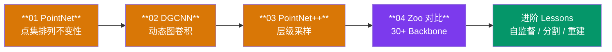
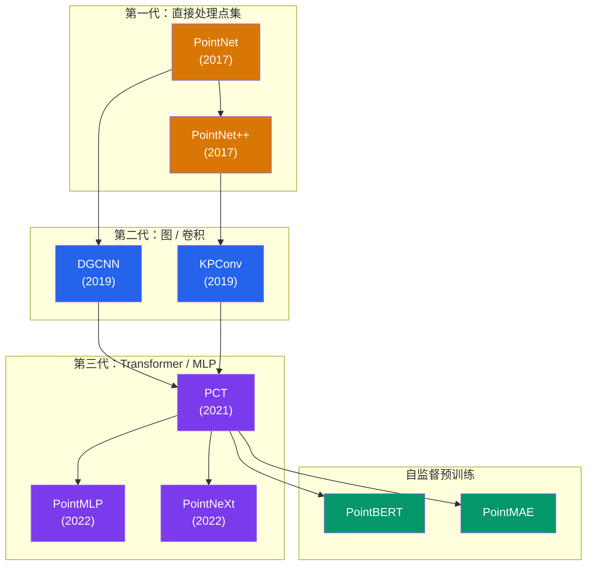

# 点云赛道

!!! abstract "赛道概览"
    **36 个 Lesson**（4 个核心 + 32 个进阶） · 预计 3-4 周 · PointNet、DGCNN、PointNet++ 与 64 注册 ID Zoo

    Point Cloud 赛道从最经典的 PointNet 出发，逐步引入图卷积（DGCNN）和层级采样（PointNet++），并通过 30+ Backbone Zoo 统一对比各类 3D 点云架构。进阶内容涵盖部件分割、点云重建、15 种自监督预训练方法，以及补全、场景流、3D 检测/分割/跟踪、开放词表理解、预测与异常检测等 3D 感知任务，共计 36 个 Lesson。

---

## 学习路径



---

## 先修知识

| 领域 | 要求 |
|:-----|:-----|
| DL-Hub | 完成 [Vision 视觉赛道](vision.md) |
| 3D 几何 | 点云表示、3D 坐标系、刚体变换基本直觉 |
| 数学 | 最远点采样（FPS）、K-NN 搜索概念 |

---

## 课程列表

全部 **36 个 Lesson** 按主题分组如下：4 个核心分类课、4 个分割/重建课、15 个自监督预训练课，以及 13 个 3D 感知进阶课。

### 核心分类（01-04）

| 序号 | 项目 | 代码文档 | 核心概念 |
|:----:|:-----|:---------|:---------|
| 01 | **PointNet 点云分类** | [`pointnet_compact_classification`](https://github.com/skygazer42/DL-Hub/tree/main/tracks/pointcloud/lesson_01_pointnet_compact_classification/) | 点集排列不变性, T-Net |
| 02 | **DGCNN 点云分类** | [`dgcnn_compact_classification`](https://github.com/skygazer42/DL-Hub/tree/main/tracks/pointcloud/lesson_02_dgcnn_compact_classification/) | 动态图, EdgeConv |
| 03 | **PointNet++ 点云分类** | [`pointnet2_compact_classification`](https://github.com/skygazer42/DL-Hub/tree/main/tracks/pointcloud/lesson_03_pointnet2_compact_classification/) | 层级采样, Set Abstraction |
| 04 | **30+ Backbone Zoo 对比** | [`pointcloud_zoo_compact_classification`](https://github.com/skygazer42/DL-Hub/tree/main/tracks/pointcloud/lesson_04_pointcloud_zoo_compact_classification/) | 统一接口, Backbone 对比 |

### 部件分割与重建（05-08）

| 序号 | 项目 | 代码文档 | 核心概念 |
|:----:|:-----|:---------|:---------|
| 05 | **PointNet 部件分割** | [`pointnet_compact_partseg`](https://github.com/skygazer42/DL-Hub/tree/main/tracks/pointcloud/lesson_05_pointnet_compact_partseg/) | per-point 分割头, 部件标签, compact 点云 |
| 06 | **DGCNN 部件分割** | [`dgcnn_compact_partseg`](https://github.com/skygazer42/DL-Hub/tree/main/tracks/pointcloud/lesson_06_dgcnn_compact_partseg/) | EdgeConv 逐点特征, 部件分割 |
| 07 | **PointNet 点云重建** | [`pointnet_compact_reconstruction`](https://github.com/skygazer42/DL-Hub/tree/main/tracks/pointcloud/lesson_07_pointnet_compact_reconstruction/) | AutoEncoder, Chamfer Distance |
| 08 | **部件分割 Zoo 对比** | [`pointcloud_partseg_zoo_compact`](https://github.com/skygazer42/DL-Hub/tree/main/tracks/pointcloud/lesson_08_pointcloud_partseg_zoo_compact/) | 统一分割接口, 多 Backbone 对比 |

### 自监督预训练（09-23）

| 序号 | 项目 | 代码文档 | 核心概念 |
|:----:|:-----|:---------|:---------|
| 09 | **自监督 SimCLR** | [`pointcloud_selfsupervised_simclr`](https://github.com/skygazer42/DL-Hub/tree/main/tracks/pointcloud/lesson_09_pointcloud_selfsupervised_simclr/) | 双视图增强, NT-Xent 对比学习 |
| 10 | **自监督 PointMAE** | [`pointcloud_selfsupervised_pointmae`](https://github.com/skygazer42/DL-Hub/tree/main/tracks/pointcloud/lesson_10_pointcloud_selfsupervised_pointmae/) | Mask Patch 重建, MAE 风格预训练 |
| 11 | **自监督 BYOL** | [`pointcloud_selfsupervised_byol`](https://github.com/skygazer42/DL-Hub/tree/main/tracks/pointcloud/lesson_11_pointcloud_selfsupervised_byol/) | Online/Target 网络, 无负样本自蒸馏 |
| 12 | **自监督 VICReg** | [`pointcloud_selfsupervised_vicreg`](https://github.com/skygazer42/DL-Hub/tree/main/tracks/pointcloud/lesson_12_pointcloud_selfsupervised_vicreg/) | 方差-不变性-协方差正则 |
| 13 | **SSL Linear Probe / Fine-tune** | [`pointcloud_ssl_linear_probe`](https://github.com/skygazer42/DL-Hub/tree/main/tracks/pointcloud/lesson_13_pointcloud_ssl_linear_probe/) | 冻结特征评估, 线性探针, 微调对比 |
| 14 | **自监督 MoCo v2** | [`pointcloud_selfsupervised_moco`](https://github.com/skygazer42/DL-Hub/tree/main/tracks/pointcloud/lesson_14_pointcloud_selfsupervised_moco/) | 动量编码器, 负样本队列 |
| 15 | **自监督 SimSiam** | [`pointcloud_selfsupervised_simsiam`](https://github.com/skygazer42/DL-Hub/tree/main/tracks/pointcloud/lesson_15_pointcloud_selfsupervised_simsiam/) | Stop-gradient, 孪生网络 |
| 16 | **自监督 SwAV** | [`pointcloud_selfsupervised_swav`](https://github.com/skygazer42/DL-Hub/tree/main/tracks/pointcloud/lesson_16_pointcloud_selfsupervised_swav/) | 在线聚类, 原型交换预测 |
| 17 | **自监督 Barlow Twins** | [`pointcloud_selfsupervised_barlowtwins`](https://github.com/skygazer42/DL-Hub/tree/main/tracks/pointcloud/lesson_17_pointcloud_selfsupervised_barlowtwins/) | 互相关矩阵去冗余 |
| 18 | **自监督 DINO** | [`pointcloud_selfsupervised_dino`](https://github.com/skygazer42/DL-Hub/tree/main/tracks/pointcloud/lesson_18_pointcloud_selfsupervised_dino/) | 自蒸馏, Teacher Centering |
| 19 | **自监督 DINOv2** | [`pointcloud_selfsupervised_dinov2`](https://github.com/skygazer42/DL-Hub/tree/main/tracks/pointcloud/lesson_19_pointcloud_selfsupervised_dinov2/) | iBOT 风格 Masked 蒸馏 |
| 20 | **自监督 I-JEPA** | [`pointcloud_selfsupervised_ijepa`](https://github.com/skygazer42/DL-Hub/tree/main/tracks/pointcloud/lesson_20_pointcloud_selfsupervised_ijepa/) | 潜空间预测, Context/Target 块 |
| 21 | **自监督 MSN** | [`pointcloud_selfsupervised_msn`](https://github.com/skygazer42/DL-Hub/tree/main/tracks/pointcloud/lesson_21_pointcloud_selfsupervised_msn/) | Masked Siamese, 原型匹配 |
| 22 | **自监督 data2vec** | [`pointcloud_selfsupervised_data2vec`](https://github.com/skygazer42/DL-Hub/tree/main/tracks/pointcloud/lesson_22_pointcloud_selfsupervised_data2vec/) | 目标表征回归, EMA Teacher |
| 23 | **自监督 ReSSL** | [`pointcloud_selfsupervised_ressl`](https://github.com/skygazer42/DL-Hub/tree/main/tracks/pointcloud/lesson_23_pointcloud_selfsupervised_ressl/) | 关系一致性蒸馏 |

### 3D 感知进阶（24-36）

| 序号 | 项目 | 代码文档 | 核心概念 |
|:----:|:-----|:---------|:---------|
| 24 | **点云补全** | [`compact_pointcloud_completion`](https://github.com/skygazer42/DL-Hub/tree/main/tracks/pointcloud/lesson_24_compact_pointcloud_completion/) | partial-to-complete 重建, Chamfer distance, PointNet AE |
| 25 | **点云场景流** | [`compact_scene_flow_estimation`](https://github.com/skygazer42/DL-Hub/tree/main/tracks/pointcloud/lesson_25_compact_scene_flow_estimation/) | 双帧点云运动回归, per-point flow, 合成形变场 |
| 26 | **Compact Gaussian Splatting** | [`compact_gaussian_splatting`](https://github.com/skygazer42/DL-Hub/tree/main/tracks/pointcloud/lesson_26_compact_gaussian_splatting/) | 点到高斯参数映射, 可微 splat 渲染, 图像监督 |
| 27 | **3D 目标检测** | [`compact_3d_object_detection`](https://github.com/skygazer42/DL-Hub/tree/main/tracks/pointcloud/lesson_27_compact_3d_object_detection/) | 点云到 3D box 回归, 类别预测, 检测损失 |
| 28 | **3D 语义分割** | [`compact_3d_semantic_segmentation`](https://github.com/skygazer42/DL-Hub/tree/main/tracks/pointcloud/lesson_28_compact_3d_semantic_segmentation/) | per-point 类别预测, PointNet 风格聚合, CE 监督 |
| 29 | **3D 实例分割** | [`compact_3d_instance_segmentation`](https://github.com/skygazer42/DL-Hub/tree/main/tracks/pointcloud/lesson_29_compact_3d_instance_segmentation/) | 实例 ID 预测, 点级聚类监督, per-point logits |
| 30 | **3D 目标跟踪** | [`compact_3d_object_tracking`](https://github.com/skygazer42/DL-Hub/tree/main/tracks/pointcloud/lesson_30_compact_3d_object_tracking/) | 跨帧轨迹状态回归, 目标关联, 时序点云监督 |
| 31 | **Open-Vocabulary 3D** | [`compact_open_vocabulary_3d`](https://github.com/skygazer42/DL-Hub/tree/main/tracks/pointcloud/lesson_31_compact_open_vocabulary_3d/) | 文本条件 3D 识别/grounding, 对齐损失, 语言引导定位 |
| 32 | **点云预测** | [`compact_pointcloud_forecasting`](https://github.com/skygazer42/DL-Hub/tree/main/tracks/pointcloud/lesson_32_compact_pointcloud_forecasting/) | 历史点云到未来轨迹预测, 时序建模, 多步回归 |
| 33 | **点云异常检测** | [`compact_pointcloud_anomaly_detection`](https://github.com/skygazer42/DL-Hub/tree/main/tracks/pointcloud/lesson_33_compact_pointcloud_anomaly_detection/) | 重建残差 + 异常得分, 点级/全局监督, 异常判别 |
| 34 | **点云上采样** | [`compact_pointcloud_upsampling`](https://github.com/skygazer42/DL-Hub/tree/main/tracks/pointcloud/lesson_34_compact_pointcloud_upsampling/) | sparse-to-dense 点集恢复, 上采样倍率建模, Chamfer 监督 |
| 35 | **三维形状对应** | [`compact_shape_correspondence_3d`](https://github.com/skygazer42/DL-Hub/tree/main/tracks/pointcloud/lesson_35_compact_shape_correspondence_3d/) | source/target 对应学习, per-point matching, correspondence loss |
| 36 | **点云配准** | [`compact_pointcloud_registration`](https://github.com/skygazer42/DL-Hub/tree/main/tracks/pointcloud/lesson_36_compact_pointcloud_registration/) | source/target 刚体对齐, pose6d 回归, registration loss |

---

## 核心技术对比

| 方法 | 输入处理 | 聚合方式 | 关键创新 |
|:-----|:---------|:---------|:---------|
| **PointNet** | 逐点 MLP | 全局 Max Pooling | 排列不变性 + T-Net 对齐 |
| **DGCNN** | 动态 K-NN 图 | EdgeConv | 每层重建图，捕获局部几何 |
| **PointNet++** | FPS + Ball Query | 多尺度 Set Abstraction | 层级特征学习，局部到全局 |

---

## 运行示例

=== "Lesson 01 — PointNet"

    ```bash
    python -m tracks.pointcloud.lesson_01_pointnet_compact_classification.train \
      --epochs 1 \
      --max-train-batches 2 --max-eval-batches 2
    ```

=== "Lesson 02 — DGCNN"

    ```bash
    python -m tracks.pointcloud.lesson_02_dgcnn_compact_classification.train \
      --epochs 1 \
      --max-train-batches 2 --max-eval-batches 2
    ```

=== "Lesson 03 — PointNet++"

    ```bash
    python -m tracks.pointcloud.lesson_03_pointnet2_compact_classification.train \
      --epochs 1 \
      --max-train-batches 2 --max-eval-batches 2
    ```

=== "Lesson 04 — Zoo 对比"

    ```bash
    # 使用 PointNet backbone
    python -m tracks.pointcloud.lesson_04_pointcloud_zoo_compact_classification.train \
      --arch pointnet --epochs 1

    # 使用 DGCNN backbone
    python -m tracks.pointcloud.lesson_04_pointcloud_zoo_compact_classification.train \
      --arch dgcnn --epochs 1

    # 使用 PCT backbone
    python -m tracks.pointcloud.lesson_04_pointcloud_zoo_compact_classification.train \
      --arch pct --epochs 1
    ```

---

## Point Cloud Backbone Zoo

!!! note "64 个本地构建配置"
    Point Cloud Zoo 提供 **30 个方法注册组 / 64 个注册 ID**，用于定位点集、图、MLP、
    Transformer 和卷积方法；是否保留标签对应机制以
    [Model Zoo 保真度审计](../zoo/fidelity.md)为准。

```bash
# 列出所有可用架构
python scripts/pointcloud_zoo.py --list

# 搜索特定架构
python scripts/pointcloud_zoo.py --search pct

# 冒烟测试
python scripts/pointcloud_zoo.py --smoke pointnet
```

??? info "Point Cloud 架构分类详情（点击展开）"

    | 类别 | 架构 | 特点 |
    |:-----|:-----|:-----|
    | **Set Models** | PointNet, PointNet++, DeepSets | 基于点集的直接处理 |
    | **Graph Models** | DGCNN, PointGAT, PointGCN, PointWeb | 基于图结构的消息传递 |
    | **MLP Models** | PointMLP, PointMixer, PointNeXt | 纯 MLP 建模几何关系 |
    | **Transformer** | PCT, Point Transformer, PointBERT, PointMAE | 自注意力捕获全局依赖 |
    | **Conv Models** | KPConv, PointCNN, PointConv, ShellNet | 3D 空间卷积操作 |
    | **Extra** | CurveNet, GDANet, PAConv, PVCNN, RandLANet, RSCNN, SpiderCNN 等 | 其他创新结构 |

---

## 3D 点云处理发展脉络



---

## 下一步

完成 Point Cloud 赛道后，你可以继续：

| 推荐方向 | 说明 |
|:---------|:-----|
| :arrow_right: [Generative 生成模型赛道](generative.md) | 学习 VAE 和 GAN 生成模型 |
| :arrow_right: [Multimodal 多模态赛道](multimodal.md) | 将 3D 理解与语言结合的跨模态学习 |
