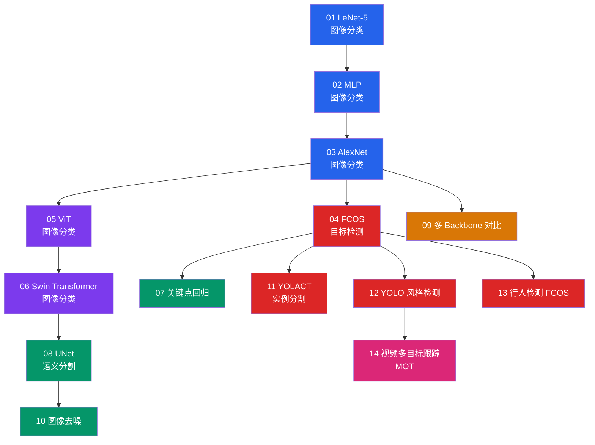

# 视觉赛道

!!! abstract "赛道概览"
    **89 个 Lesson** · 预计 4-6 周 · 从 MNIST 入门到检测、分割、风格迁移、超分辨率、人脸/手部分析与视频理解

    Vision 赛道是 DL-Hub 内容最丰富的方向之一，覆盖图像分类、目标检测、语义分割、实例分割、关键点回归、图像去噪、多目标跟踪，并延伸到风格迁移、超分辨率、人群计数、深度估计、车道理解、图像去雨/去雾、图像检索/匹配/拼接、细粒度识别、小样本学习、人脸/人体/手部分析与视频任务。配套 **791 种 Backbone 架构 ID** 可供切换实验。

---

## 学习路径

下图展示前 14 课的核心学习路径；Lesson 15 之后按主题分组，详见下方课程列表。



!!! tip "颜色说明"
    :blue_square: 分类 · :red_square: 检测 · :purple_square: Transformer · :green_square: 分割/回归 · :orange_square: Backbone · :pink_square: 视频

---

## 先修知识

| 领域 | 要求 |
|:-----|:-----|
| DL-Hub | 完成 [Foundations 赛道](foundations.md) |
| 数学 | 卷积运算直觉、池化操作 |
| 框架 | 理解 `torch.nn.Module`、`DataLoader` |

---

## 课程列表

全部 **89 个 Lesson** 按主题分组如下，每个 lesson 目录均含独立 README 与可运行的 `train.py`，支持 `--dataset fake` 离线冒烟测试。

### 核心基础（01-14）：分类 / 检测 / 分割 / 跟踪

| 序号 | 项目 | 代码文档 | 核心概念 |
|:----:|:-----|:---------|:---------|
| 01 | **LeNet-5 图像分类** | [`mnist_lenet`](https://github.com/skygazer42/DL-Hub/tree/main/tracks/vision/lesson_01_mnist_lenet/) | 卷积层, 池化, 全连接 |
| 02 | **MLP 图像分类** | [`mnist_mlp`](https://github.com/skygazer42/DL-Hub/tree/main/tracks/vision/lesson_02_mnist_mlp/) | 多层感知机, Flatten |
| 03 | **AlexNet 图像分类** | [`mnist_alexnet`](https://github.com/skygazer42/DL-Hub/tree/main/tracks/vision/lesson_03_mnist_alexnet/) | 深层卷积网络, Dropout |
| 04 | **FCOS 目标检测** | [`synthetic_detection_fcos`](https://github.com/skygazer42/DL-Hub/tree/main/tracks/vision/lesson_04_synthetic_detection_fcos/) | Anchor-free, FPN, 回归头 |
| 05 | **ViT 图像分类** | [`vit_toy_classification`](https://github.com/skygazer42/DL-Hub/tree/main/tracks/vision/lesson_05_vit_toy_classification/) | Patch Embedding, Self-Attention |
| 06 | **Swin Transformer 图像分类** | [`swin_toy_classification`](https://github.com/skygazer42/DL-Hub/tree/main/tracks/vision/lesson_06_swin_toy_classification/) | Window Attention, Shifted Window |
| 07 | **关键点回归** | [`toy_keypoint_regression`](https://github.com/skygazer42/DL-Hub/tree/main/tracks/vision/lesson_07_toy_keypoint_regression/) | 坐标回归, Heatmap |
| 08 | **UNet 语义分割** | [`synthetic_segmentation_unet`](https://github.com/skygazer42/DL-Hub/tree/main/tracks/vision/lesson_08_synthetic_segmentation_unet/) | Encoder-Decoder, Skip Connection |
| 09 | **多 Backbone 对比** | [`cnn_backbones_toy_classification`](https://github.com/skygazer42/DL-Hub/tree/main/tracks/vision/lesson_09_cnn_backbones_toy_classification/) | 统一接口, 特征提取 |
| 10 | **图像去噪（多模型）** | [`synthetic_denoising`](https://github.com/skygazer42/DL-Hub/tree/main/tracks/vision/lesson_10_synthetic_denoising/) | 合成噪声建模, 去噪回归 |
| 11 | **YOLACT 实例分割** | [`synthetic_instance_segmentation_yolact`](https://github.com/skygazer42/DL-Hub/tree/main/tracks/vision/lesson_11_synthetic_instance_segmentation_yolact/) | Prototype + Coefficients |
| 12 | **YOLO 风格目标检测** | [`synthetic_detection_yolo`](https://github.com/skygazer42/DL-Hub/tree/main/tracks/vision/lesson_12_synthetic_detection_yolo/) | Grid/Objectness + BBox |
| 13 | **行人检测（FCOS）** | [`synthetic_pedestrian_detection_fcos`](https://github.com/skygazer42/DL-Hub/tree/main/tracks/vision/lesson_13_synthetic_pedestrian_detection_fcos/) | Anchor-free 检测头 |
| 14 | **视频多目标跟踪（MOT）** | [`video_mot_basics`](https://github.com/skygazer42/DL-Hub/tree/main/tracks/vision/lesson_14_video_mot_basics/) | 多目标轨迹预测, Presence + IoU |

### 图像恢复与场景理解（15-31）

| 序号 | 项目 | 代码文档 | 核心概念 |
|:----:|:-----|:---------|:---------|
| 15 | **Gatys 风格迁移** | [`neural_style_transfer_gatys`](https://github.com/skygazer42/DL-Hub/tree/main/tracks/vision/lesson_15_neural_style_transfer_gatys/) | 优化式风格损失, 内容/风格分离 |
| 16 | **CycleGAN 风格翻译** | [`style_transfer_translation_cyclegan`](https://github.com/skygazer42/DL-Hub/tree/main/tracks/vision/lesson_16_style_transfer_translation_cyclegan/) | 无配对图像翻译, 循环一致性 |
| 17 | **合成超分辨率** | [`synthetic_super_resolution`](https://github.com/skygazer42/DL-Hub/tree/main/tracks/vision/lesson_17_synthetic_super_resolution/) | 配对重建, PSNR, 局部细节恢复 |
| 18 | **合成人群计数** | [`synthetic_crowd_counting`](https://github.com/skygazer42/DL-Hub/tree/main/tracks/vision/lesson_18_synthetic_crowd_counting/) | 密度图回归, 总人数估计 |
| 19 | **合成单目深度估计** | [`synthetic_monocular_depth_estimation`](https://github.com/skygazer42/DL-Hub/tree/main/tracks/vision/lesson_19_synthetic_monocular_depth_estimation/) | 稠密深度回归, 层次遮挡 |
| 20 | **合成车道线检测** | [`synthetic_lane_detection`](https://github.com/skygazer42/DL-Hub/tree/main/tracks/vision/lesson_20_synthetic_lane_detection/) | Heatmap 回归, 车道点序列 |
| 21 | **合成车道拓扑估计** | [`synthetic_lane_topology_estimation`](https://github.com/skygazer42/DL-Hub/tree/main/tracks/vision/lesson_21_synthetic_lane_topology_estimation/) | 车道图连接关系, 邻接矩阵预测 |
| 22 | **合成道路场景理解** | [`synthetic_road_scene_understanding`](https://github.com/skygazer42/DL-Hub/tree/main/tracks/vision/lesson_22_synthetic_road_scene_understanding/) | 车道槽位, 目标查询, 场景类别融合 |
| 23 | **合成图像去雾** | [`synthetic_image_dehazing`](https://github.com/skygazer42/DL-Hub/tree/main/tracks/vision/lesson_23_synthetic_image_dehazing/) | 大气散射, Transmission 估计, 配对恢复 |
| 24 | **合成反光去除** | [`synthetic_reflection_removal`](https://github.com/skygazer42/DL-Hub/tree/main/tracks/vision/lesson_24_synthetic_reflection_removal/) | 反光层混合建模, 透射恢复, 配对重建 |
| 25 | **合成图像融合** | [`synthetic_image_fusion`](https://github.com/skygazer42/DL-Hub/tree/main/tracks/vision/lesson_25_synthetic_image_fusion/) | 多源图像融合, 权重图预测, 细节保持 |
| 26 | **合成文本检测** | [`synthetic_text_detection`](https://github.com/skygazer42/DL-Hub/tree/main/tracks/vision/lesson_26_synthetic_text_detection/) | 文本区域热图, 框回归, 可变长度单词合成 |
| 27 | **合成边缘检测** | [`synthetic_edge_detection`](https://github.com/skygazer42/DL-Hub/tree/main/tracks/vision/lesson_27_synthetic_edge_detection/) | 边缘图监督, 梯度特征融合, 稀疏结构预测 |
| 28 | **合成显著性目标检测** | [`synthetic_salient_object_detection`](https://github.com/skygazer42/DL-Hub/tree/main/tracks/vision/lesson_28_synthetic_salient_object_detection/) | 显著区域分割, 前景突出建模, clutter 场景抑制 |
| 29 | **合成伪装物体检测** | [`synthetic_camouflaged_object_detection`](https://github.com/skygazer42/DL-Hub/tree/main/tracks/vision/lesson_29_synthetic_camouflaged_object_detection/) | 低对比隐藏目标恢复, 纹理混淆建模, 细粒度边界分离 |
| 30 | **合成显著性目标框检测** | [`synthetic_salient_object_detection_boxes`](https://github.com/skygazer42/DL-Hub/tree/main/tracks/vision/lesson_30_synthetic_salient_object_detection_boxes/) | 显著目标框回归, 中心/尺度归一化, IoU 驱动定位 |
| 31 | **合成交互式分割** | [`synthetic_interactive_segmentation`](https://github.com/skygazer42/DL-Hub/tree/main/tracks/vision/lesson_31_synthetic_interactive_segmentation/) | 点击提示编码, 交互式掩码细化, 用户引导分割 |

### 人脸 / 人体 / 手部分析（32-59）

| 序号 | 项目 | 代码文档 | 核心概念 |
|:----:|:-----|:---------|:---------|
| 32 | **合成人脸关键点检测** | [`synthetic_face_landmark_detection`](https://github.com/skygazer42/DL-Hub/tree/main/tracks/vision/lesson_32_synthetic_face_landmark_detection/) | 五点关键点回归, 合成人脸渲染, 像素 L2 误差 |
| 33 | **合成人脸活体检测** | [`synthetic_face_liveness_detection`](https://github.com/skygazer42/DL-Hub/tree/main/tracks/vision/lesson_33_synthetic_face_liveness_detection/) | 活体/欺骗二分类, 纹理伪迹建模, 展示攻击模拟 |
| 34 | **合成车牌识别** | [`synthetic_license_plate_recognition`](https://github.com/skygazer42/DL-Hub/tree/main/tracks/vision/lesson_34_synthetic_license_plate_recognition/) | 固定长度序列识别, 视觉槽位读码, 精确串匹配 |
| 35 | **合成 6D 姿态估计** | [`synthetic_6d_pose_estimation`](https://github.com/skygazer42/DL-Hub/tree/main/tracks/vision/lesson_35_synthetic_6d_pose_estimation/) | 6D 旋转表示, 平移回归, 合成物体视角建模 |
| 36 | **合成文本识别** | [`synthetic_text_recognition`](https://github.com/skygazer42/DL-Hub/tree/main/tracks/vision/lesson_36_synthetic_text_recognition/) | OCR 序列识别, 合成字形渲染, 固定长度字符读码 |
| 37 | **合成人脸解析** | [`synthetic_face_parsing`](https://github.com/skygazer42/DL-Hub/tree/main/tracks/vision/lesson_37_synthetic_face_parsing/) | 粗粒度人脸区域分割, 多类 mask 预测, mIoU 验证 |
| 38 | **合成人脸检测** | [`synthetic_face_detection`](https://github.com/skygazer42/DL-Hub/tree/main/tracks/vision/lesson_38_synthetic_face_detection/) | 单脸框回归, 目标存在监督, IoU 度量 |
| 39 | **合成人脸对齐** | [`synthetic_face_alignment`](https://github.com/skygazer42/DL-Hub/tree/main/tracks/vision/lesson_39_synthetic_face_alignment/) | canonical 五点布局回归, 姿态扰动归一化, 像素 L2 误差 |
| 40 | **合成人脸属性识别** | [`synthetic_face_attribute_recognition`](https://github.com/skygazer42/DL-Hub/tree/main/tracks/vision/lesson_40_synthetic_face_attribute_recognition/) | 笑容/眼镜/胡须多标签识别, 合成人脸属性渲染, exact-match 准确率 |
| 41 | **合成人脸遮挡估计** | [`synthetic_face_occlusion_estimation`](https://github.com/skygazer42/DL-Hub/tree/main/tracks/vision/lesson_41_synthetic_face_occlusion_estimation/) | 遮挡比例回归, 合成遮挡覆盖建模, MAE 评估 |
| 42 | **合成人脸表情识别** | [`synthetic_face_expression_recognition`](https://github.com/skygazer42/DL-Hub/tree/main/tracks/vision/lesson_42_synthetic_face_expression_recognition/) | 四类表情分类, 合成人脸肌肉形变, softmax 准确率 |
| 43 | **合成 Deepfake 检测** | [`synthetic_deepfake_detection`](https://github.com/skygazer42/DL-Hub/tree/main/tracks/vision/lesson_43_synthetic_deepfake_detection/) | 真假脸二分类, 融合缝合与过平滑伪迹, 深度伪造检测 |
| 44 | **合成人脸验证** | [`synthetic_face_verification`](https://github.com/skygazer42/DL-Hub/tree/main/tracks/vision/lesson_44_synthetic_face_verification/) | 双脸同一人判别, 成对特征差异建模, verification accuracy |
| 45 | **合成人脸识别** | [`synthetic_face_identification`](https://github.com/skygazer42/DL-Hub/tree/main/tracks/vision/lesson_45_synthetic_face_identification/) | 五类身份分类, 合成人脸身份模板, softmax 准确率 |
| 46 | **合成人脸检索** | [`synthetic_face_retrieval`](https://github.com/skygazer42/DL-Hub/tree/main/tracks/vision/lesson_46_synthetic_face_retrieval/) | triplet 风格嵌入学习, 最近邻检索, top-1 retrieval |
| 47 | **合成人脸姿态估计** | [`synthetic_face_pose_estimation`](https://github.com/skygazer42/DL-Hub/tree/main/tracks/vision/lesson_47_synthetic_face_pose_estimation/) | yaw/pitch/roll 回归, 归一化头姿向量, MAE 评估 |
| 48 | **合成视线估计** | [`synthetic_gaze_estimation`](https://github.com/skygazer42/DL-Hub/tree/main/tracks/vision/lesson_48_synthetic_gaze_estimation/) | 归一化 gaze x/y 回归, 瞳孔位移建模, L1 评估 |
| 49 | **合成人体姿态估计** | [`synthetic_human_pose_estimation`](https://github.com/skygazer42/DL-Hub/tree/main/tracks/vision/lesson_49_synthetic_human_pose_estimation/) | 关键点坐标回归, 棒人骨架渲染, pose L1 评估 |
| 50 | **合成手部姿态估计** | [`synthetic_hand_pose_estimation`](https://github.com/skygazer42/DL-Hub/tree/main/tracks/vision/lesson_50_synthetic_hand_pose_estimation/) | 十点手部关键点回归, 手部骨架渲染, pose L2 评估 |
| 51 | **合成手势识别** | [`synthetic_gesture_recognition`](https://github.com/skygazer42/DL-Hub/tree/main/tracks/vision/lesson_51_synthetic_gesture_recognition/) | 棒人手势分类, 四类姿态模式, softmax 准确率 |
| 52 | **合成手指计数估计** | [`synthetic_finger_count_estimation`](https://github.com/skygazer42/DL-Hub/tree/main/tracks/vision/lesson_52_synthetic_finger_count_estimation/) | 0-5 手指计数分类, 合成掌心与手指渲染, softmax 准确率 |
| 53 | **合成左右手分类** | [`synthetic_handedness_classification`](https://github.com/skygazer42/DL-Hub/tree/main/tracks/vision/lesson_53_synthetic_handedness_classification/) | 左右手二分类, 拇指侧显式建模, softmax 准确率 |
| 54 | **合成掌心朝向估计** | [`synthetic_palm_orientation_estimation`](https://github.com/skygazer42/DL-Hub/tree/main/tracks/vision/lesson_54_synthetic_palm_orientation_estimation/) | 掌心朝向标量回归, 旋转掌形渲染, MAE 评估 |
| 55 | **合成手势数字分类** | [`synthetic_sign_digit_classification`](https://github.com/skygazer42/DL-Hub/tree/main/tracks/vision/lesson_55_synthetic_sign_digit_classification/) | 0-9 手势数字分类, 合成手部标记渲染, softmax 准确率 |
| 56 | **合成手指张开度估计** | [`synthetic_finger_spread_estimation`](https://github.com/skygazer42/DL-Hub/tree/main/tracks/vision/lesson_56_synthetic_finger_spread_estimation/) | 手指张开度标量回归, 合成手部轮廓渲染, MAE 评估 |
| 57 | **合成拇指位置分类** | [`synthetic_thumb_position_classification`](https://github.com/skygazer42/DL-Hub/tree/main/tracks/vision/lesson_57_synthetic_thumb_position_classification/) | 拇指位置分类, 合成手部姿态模式, softmax 准确率 |
| 58 | **合成手指弯曲度估计** | [`synthetic_finger_curvature_estimation`](https://github.com/skygazer42/DL-Hub/tree/main/tracks/vision/lesson_58_synthetic_finger_curvature_estimation/) | 手指弯曲度标量回归, 合成指尖弯折渲染, MAE 评估 |
| 59 | **合成拇指接触分类** | [`synthetic_thumb_contact_classification`](https://github.com/skygazer42/DL-Hub/tree/main/tracks/vision/lesson_59_synthetic_thumb_contact_classification/) | 拇指是否接触掌心二分类, 合成接触桥建模, softmax 准确率 |

### 恢复、检索与小样本（60-65）

| 序号 | 项目 | 代码文档 | 核心概念 |
|:----:|:-----|:---------|:---------|
| 60 | **合成图像去雨** | [`synthetic_image_deraining`](https://github.com/skygazer42/DL-Hub/tree/main/tracks/vision/lesson_60_synthetic_image_deraining/) | 雨条纹退化建模, 配对清晰恢复, 图像回归 |
| 61 | **合成图像检索** | [`synthetic_image_retrieval`](https://github.com/skygazer42/DL-Hub/tree/main/tracks/vision/lesson_61_synthetic_image_retrieval/) | 嵌入学习, 最近邻检索, top-1 retrieval |
| 62 | **合成图像匹配** | [`synthetic_image_matching`](https://github.com/skygazer42/DL-Hub/tree/main/tracks/vision/lesson_62_synthetic_image_matching/) | 成对匹配判别, 共享编码器, 二分类 |
| 63 | **合成图像拼接** | [`synthetic_image_stitching`](https://github.com/skygazer42/DL-Hub/tree/main/tracks/vision/lesson_63_synthetic_image_stitching/) | 重叠视图融合, 全景重建, 图像回归 |
| 64 | **合成细粒度识别** | [`synthetic_fine_grained_recognition`](https://github.com/skygazer42/DL-Hub/tree/main/tracks/vision/lesson_64_synthetic_fine_grained_recognition/) | 细微纹理差异建模, 相似类区分, softmax 准确率 |
| 65 | **合成小样本识别** | [`synthetic_few_shot_recognition`](https://github.com/skygazer42/DL-Hub/tree/main/tracks/vision/lesson_65_synthetic_few_shot_recognition/) | episodic 训练, prototype 分类, support/query 推理 |

### 视频理解（66-75）

| 序号 | 项目 | 代码文档 | 核心概念 |
|:----:|:-----|:---------|:---------|
| 66 | **合成视频目标检测** | [`synthetic_video_object_detection`](https://github.com/skygazer42/DL-Hub/tree/main/tracks/vision/lesson_66_synthetic_video_object_detection/) | 时序目标框回归, 目标存在监督, 多头检测损失 |
| 67 | **合成视频稳像** | [`synthetic_video_stabilization`](https://github.com/skygazer42/DL-Hub/tree/main/tracks/vision/lesson_67_synthetic_video_stabilization/) | 抖动序列到稳像序列恢复, 时序回归, 重建损失 |
| 68 | **合成视频插帧** | [`synthetic_video_frame_interpolation`](https://github.com/skygazer42/DL-Hub/tree/main/tracks/vision/lesson_68_synthetic_video_frame_interpolation/) | 中间帧重建, 时序连续性建模, L1/L2 回归 |
| 69 | **合成视频修复** | [`synthetic_video_restoration`](https://github.com/skygazer42/DL-Hub/tree/main/tracks/vision/lesson_69_synthetic_video_restoration/) | 退化序列恢复, 去噪去模糊建模, 配对重建 |
| 70 | **合成视频理解** | [`synthetic_video_understanding`](https://github.com/skygazer42/DL-Hub/tree/main/tracks/vision/lesson_70_synthetic_video_understanding/) | 时序事件模式分类, 3D 编码, softmax 准确率 |
| 71 | **合成视频摘要** | [`synthetic_video_summarization`](https://github.com/skygazer42/DL-Hub/tree/main/tracks/vision/lesson_71_synthetic_video_summarization/) | 帧级重要性估计, 时序评分, 关键帧学习 |
| 72 | **合成视频增强** | [`synthetic_video_enhancement`](https://github.com/skygazer42/DL-Hub/tree/main/tracks/vision/lesson_72_synthetic_video_enhancement/) | 低质序列增强, 时序重建, PSNR 指标 |
| 73 | **合成视频目标分割** | [`synthetic_video_object_segmentation`](https://github.com/skygazer42/DL-Hub/tree/main/tracks/vision/lesson_73_synthetic_video_object_segmentation/) | 时序前景 mask 预测, 二值分割监督, IoU 评估 |
| 74 | **合成视频实例分割** | [`synthetic_video_instance_segmentation`](https://github.com/skygazer42/DL-Hub/tree/main/tracks/vision/lesson_74_synthetic_video_instance_segmentation/) | 多实例时序 mask 预测, slot 分离, BCE 优化 |
| 75 | **合成视频抠像** | [`synthetic_video_matting`](https://github.com/skygazer42/DL-Hub/tree/main/tracks/vision/lesson_75_synthetic_video_matting/) | 时序 alpha matte 估计, 前景边界细化, 回归损失 |

### 进阶专题（76-89）

| 序号 | 项目 | 代码文档 | 核心概念 |
|:----:|:-----|:---------|:---------|
| 76 | **合成图像去天气** | [`synthetic_image_deweathering`](https://github.com/skygazer42/DL-Hub/tree/main/tracks/vision/lesson_76_synthetic_image_deweathering/) | 混合天气残差恢复, 清晰图/天气层联合监督, 配对重建 |
| 77 | **合成透明体深度估计** | [`synthetic_transparent_depth_estimation`](https://github.com/skygazer42/DL-Hub/tree/main/tracks/vision/lesson_77_synthetic_transparent_depth_estimation/) | 透明区域深度 + transparency mask 联合预测, 稠密回归 |
| 78 | **合成图像重照明** | [`synthetic_image_relighting`](https://github.com/skygazer42/DL-Hub/tree/main/tracks/vision/lesson_78_synthetic_image_relighting/) | 光照条件编码, target illumination 重建, 配对 relighting |
| 79 | **合成透明物体分割** | [`synthetic_transparent_object_segmentation`](https://github.com/skygazer42/DL-Hub/tree/main/tracks/vision/lesson_79_synthetic_transparent_object_segmentation/) | 透明区域 mask 预测, 边界辅助监督, 折射背景建模 |
| 80 | **合成事件相机理解** | [`synthetic_event_camera_understanding`](https://github.com/skygazer42/DL-Hub/tree/main/tracks/vision/lesson_80_synthetic_event_camera_understanding/) | 事件体素编码, polarity/motion 联合建模, 稠密理解监督 |
| 81 | **合成阴影检测** | [`synthetic_shadow_detection`](https://github.com/skygazer42/DL-Hub/tree/main/tracks/vision/lesson_81_synthetic_shadow_detection/) | 阴影 mask 预测, illumination-aware 恢复, shadow boundary 建模 |
| 82 | **合成布局生成** | [`synthetic_layout_generation`](https://github.com/skygazer42/DL-Hub/tree/main/tracks/vision/lesson_82_synthetic_layout_generation/) | 对象集合到布局框生成, relation-aware 编码, 布局回归 |
| 83 | **合成全景分割** | [`synthetic_panoptic_segmentation`](https://github.com/skygazer42/DL-Hub/tree/main/tracks/vision/lesson_83_synthetic_panoptic_segmentation/) | semantic + instance 联合预测, thing/stuff 一体建模, panoptic supervision |
| 84 | **合成医学图像分割** | [`synthetic_medical_segmentation`](https://github.com/skygazer42/DL-Hub/tree/main/tracks/vision/lesson_84_synthetic_medical_segmentation/) | 病灶区域 mask 预测, 多尺度编码解码, 医学样式切片监督 |
| 85 | **合成场景文本检测识别一体化** | [`synthetic_scene_text_spotting`](https://github.com/skygazer42/DL-Hub/tree/main/tracks/vision/lesson_85_synthetic_scene_text_spotting/) | 文本热图定位, 字符序列解码, spotting 联合训练 |
| 86 | **合成协同分割** | [`synthetic_co_segmentation`](https://github.com/skygazer42/DL-Hub/tree/main/tracks/vision/lesson_86_synthetic_co_segmentation/) | 图组共享前景恢复, group prototype 聚合, mask 监督 |
| 87 | **合成行为识别** | [`synthetic_action_recognition`](https://github.com/skygazer42/DL-Hub/tree/main/tracks/vision/lesson_87_synthetic_action_recognition/) | 短视频动作分类, 时序卷积聚合, clip 级监督 |
| 88 | **合成 Re-ID** | [`synthetic_reid`](https://github.com/skygazer42/DL-Hub/tree/main/tracks/vision/lesson_88_synthetic_reid/) | 身份嵌入学习, gallery top-1 检索, CE + triplet 联合监督 |
| 89 | **合成异常检测** | [`synthetic_anomaly_detection`](https://github.com/skygazer42/DL-Hub/tree/main/tracks/vision/lesson_89_synthetic_anomaly_detection/) | 异常得分预测, 正常/异常外观偏差建模, anomaly supervision |

---

## 运行示例

=== "Lesson 01 — LeNet-5"

    ```bash
    python -m tracks.vision.lesson_01_mnist_lenet.train \
      --dataset fake --epochs 1 \
      --max-train-batches 2 --max-eval-batches 2
    ```

=== "Lesson 05 — ViT"

    ```bash
    python -m tracks.vision.lesson_05_vit_toy_classification.train \
      --dataset fake --epochs 1 \
      --max-train-batches 2 --max-eval-batches 2
    ```

=== "Lesson 09 — Backbone Zoo"

    ```bash
    python -m tracks.vision.lesson_09_cnn_backbones_toy_classification.train \
      --arch resnet18 --dataset fake --epochs 1 \
      --max-train-batches 2 --max-eval-batches 2
    ```

=== "Lesson 14 — MOT"

    ```bash
    python -m tracks.vision.lesson_14_video_mot_basics.train \
      --dataset fake --epochs 1 \
      --max-train-batches 2 --max-eval-batches 2
    ```

---

## Vision Backbone Zoo

!!! note "791 架构可供切换"
    Vision Zoo 包含 **220 个模块 / 791 个架构 ID**，所有 backbone 均为纯 PyTorch 本地实现，支持通过 `--arch` 参数一行切换。

```bash
# 列出所有可用架构
python scripts/vision_zoo.py --list

# 搜索特定架构
python scripts/vision_zoo.py --search convnext

# 冒烟测试
python scripts/vision_zoo.py --smoke resnet50
```

??? info "Backbone 分类详情（点击展开）"

    | 类别 | 代表架构 | 特点 |
    |:-----|:---------|:-----|
    | **经典 CNN** | AlexNet, VGG, GoogLeNet, ResNet, DenseNet, SqueezeNet | 计算机视觉基石，结构清晰 |
    | **高效网络** | MobileNet v1-v4, EfficientNet, GhostNet v1/v2, ShuffleNet, MNASNet, FBNet, MicroNet | 面向移动端部署 |
    | **注意力 CNN** | SENet, CBAM, BAM, ECA-Net, SK-Net, CoordAtt, SimAM, Triplet Attention | 通道/空间注意力增强 |
    | **现代 CNN** | ConvNeXt v1/v2, RepVGG, RepLKNet, InceptionNeXt, HorNet, FocalNet, SLaK | 吸收 Transformer 思想的现代卷积 |
    | **Vision Transformer** | ViT, DeiT, DeiT3, BEiT, EVA, CaiT, CrossViT, Swin v2, CSwin, MAE-ViT | 纯 Transformer 视觉模型 |
    | **高效 Transformer** | EfficientViT, TinyViT, EdgeViT, LightViT, FastViT, FasterViT, SwiftFormer | 轻量化视觉 Transformer |
    | **MLP 系列** | MLP-Mixer, gMLP, ResMLP, FNet, CycleMLP, AS-MLP, WaveMLP, MorphMLP | 全连接替代注意力 |
    | **Hybrid** | CoAtNet, MobileFormer, ConvFormer, Uniformer, CMT, MaxViT, MobileViT v1-v3 | CNN + Transformer 混合 |
    | **特殊结构** | CapsNet, ScatterNet, FractalNet, HighwayNet, HRNet, NAS 系列 | 非主流但有启发性的架构 |

---

## 下一步

完成 Vision 赛道后，你可以继续：

| 推荐方向 | 说明 |
|:---------|:-----|
| :arrow_right: [Point Cloud 点云赛道](pointcloud.md) | 将视觉能力扩展到 3D 点云世界 |
| :arrow_right: [Generative 生成模型赛道](generative.md) | 学习 VAE 和 GAN 图像生成 |
| :arrow_right: [Multimodal 多模态赛道](multimodal.md) | 结合视觉与语言的跨模态学习 |
