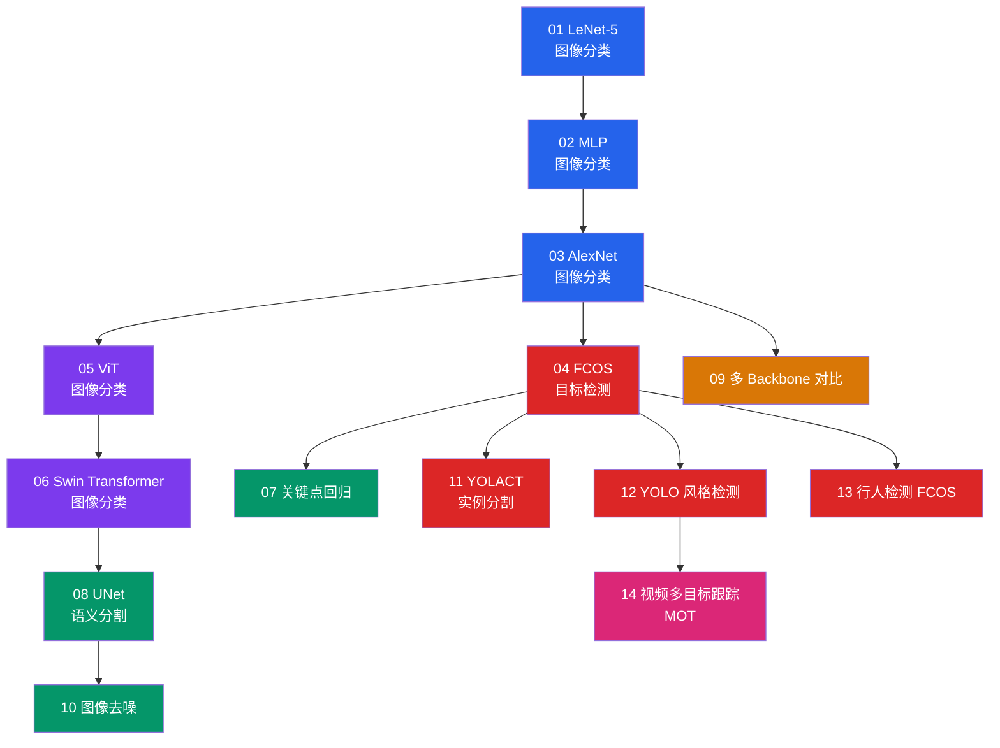

# 视觉赛道

!!! abstract "赛道概览"
    **14 个 Lesson** · 预计 2-3 周 · 从 MNIST 入门到目标检测、语义分割、Vision Transformer

    Vision 赛道是 DL-Hub 内容最丰富的方向之一，覆盖图像分类、目标检测、语义分割、实例分割、关键点回归、图像去噪和多目标跟踪。配套 **736 种 Backbone 架构**可供切换实验。

---

## 学习路径



!!! tip "颜色说明"
    :blue_square: 分类 · :red_square: 检测 · :purple_square: Transformer · :green_square: 分割/回归 · :orange_square: Backbone · :pink_square: 视频

---

## 先修知识

| 领域 | 要求 |
|:-----|:-----|
| DL-Hub | 完成 [Foundations 赛道](foundations.md) |
| 数学 | 卷积运算直觉、池化操作 |
| 框架 | 理解 `torch.nn.Module`、`DataLoader` |

---

## 课程列表

| 序号 | 项目 | 代码文档 | 核心概念 |
|:----:|:-----|:---------|:---------|
| 01 | **LeNet-5 图像分类** | [`mnist_lenet`](https://github.com/skygazer42/DL-Hub/tree/main/tracks/vision/lesson_01_mnist_lenet/) | 卷积层, 池化, 全连接 |
| 02 | **MLP 图像分类** | [`mnist_mlp`](https://github.com/skygazer42/DL-Hub/tree/main/tracks/vision/lesson_02_mnist_mlp/) | 多层感知机, Flatten |
| 03 | **AlexNet 图像分类** | [`mnist_alexnet`](https://github.com/skygazer42/DL-Hub/tree/main/tracks/vision/lesson_03_mnist_alexnet/) | 深层卷积网络, Dropout |
| 04 | **FCOS 目标检测** | [`synthetic_detection_fcos`](https://github.com/skygazer42/DL-Hub/tree/main/tracks/vision/lesson_04_synthetic_detection_fcos/) | Anchor-free, FPN, 回归头 |
| 05 | **ViT 图像分类** | [`vit_toy_classification`](https://github.com/skygazer42/DL-Hub/tree/main/tracks/vision/lesson_05_vit_toy_classification/) | Patch Embedding, Self-Attention |
| 06 | **Swin Transformer 图像分类** | [`swin_toy_classification`](https://github.com/skygazer42/DL-Hub/tree/main/tracks/vision/lesson_06_swin_toy_classification/) | Window Attention, Shifted Window |
| 07 | **关键点回归** | [`toy_keypoint_regression`](https://github.com/skygazer42/DL-Hub/tree/main/tracks/vision/lesson_07_toy_keypoint_regression/) | 坐标回归, Heatmap |
| 08 | **UNet 语义分割** | [`synthetic_segmentation_unet`](https://github.com/skygazer42/DL-Hub/tree/main/tracks/vision/lesson_08_synthetic_segmentation_unet/) | Encoder-Decoder, Skip Connection |
| 09 | **多 Backbone 对比** | [`cnn_backbones_toy_classification`](https://github.com/skygazer42/DL-Hub/tree/main/tracks/vision/lesson_09_cnn_backbones_toy_classification/) | 统一接口, 特征提取 |
| 10 | **图像去噪（多模型）** | [`synthetic_denoising`](https://github.com/skygazer42/DL-Hub/tree/main/tracks/vision/lesson_10_synthetic_denoising/) | 合成噪声建模, 去噪回归 |
| 11 | **YOLACT 实例分割** | [`synthetic_instance_segmentation_yolact`](https://github.com/skygazer42/DL-Hub/tree/main/tracks/vision/lesson_11_synthetic_instance_segmentation_yolact/) | Prototype + Coefficients |
| 12 | **YOLO 风格目标检测** | [`synthetic_detection_yolo`](https://github.com/skygazer42/DL-Hub/tree/main/tracks/vision/lesson_12_synthetic_detection_yolo/) | Grid/Objectness + BBox |
| 13 | **行人检测（FCOS）** | [`synthetic_pedestrian_detection_fcos`](https://github.com/skygazer42/DL-Hub/tree/main/tracks/vision/lesson_13_synthetic_pedestrian_detection_fcos/) | Anchor-free 检测头 |
| 14 | **视频多目标跟踪（MOT）** | [`video_mot_basics`](https://github.com/skygazer42/DL-Hub/tree/main/tracks/vision/lesson_14_video_mot_basics/) | 多目标轨迹预测, Presence + IoU |

---

## 运行示例

=== "Lesson 01 — LeNet-5"

    ```bash
    python -m tracks.vision.lesson_01_mnist_lenet.train \
      --dataset fake --epochs 1 \
      --max-train-batches 2 --max-eval-batches 2
    ```

=== "Lesson 05 — ViT"

    ```bash
    python -m tracks.vision.lesson_05_vit_toy_classification.train \
      --dataset fake --epochs 1 \
      --max-train-batches 2 --max-eval-batches 2
    ```

=== "Lesson 09 — Backbone Zoo"

    ```bash
    python -m tracks.vision.lesson_09_cnn_backbones_toy_classification.train \
      --arch resnet18 --dataset fake --epochs 1 \
      --max-train-batches 2 --max-eval-batches 2
    ```

=== "Lesson 14 — MOT"

    ```bash
    python -m tracks.vision.lesson_14_video_mot_basics.train \
      --dataset fake --epochs 1 \
      --max-train-batches 2 --max-eval-batches 2
    ```

---

## Vision Backbone Zoo

!!! note "791 架构可供切换"
    Vision Zoo 包含 **208 个算法族 / 791 个架构 ID**，所有 backbone 均为纯 PyTorch 本地实现，支持通过 `--arch` 参数一行切换。

```bash
# 列出所有可用架构
python scripts/vision_zoo.py --list

# 搜索特定架构
python scripts/vision_zoo.py --search convnext

# 冒烟测试
python scripts/vision_zoo.py --smoke resnet50
```

??? info "Backbone 分类详情（点击展开）"

    | 类别 | 代表架构 | 特点 |
    |:-----|:---------|:-----|
    | **经典 CNN** | AlexNet, VGG, GoogLeNet, ResNet, DenseNet, SqueezeNet | 计算机视觉基石，结构清晰 |
    | **高效网络** | MobileNet v1-v4, EfficientNet, GhostNet v1/v2, ShuffleNet, MNASNet, FBNet, MicroNet | 面向移动端部署 |
    | **注意力 CNN** | SENet, CBAM, BAM, ECA-Net, SK-Net, CoordAtt, SimAM, Triplet Attention | 通道/空间注意力增强 |
    | **现代 CNN** | ConvNeXt v1/v2, RepVGG, RepLKNet, InceptionNeXt, HorNet, FocalNet, SLaK | 吸收 Transformer 思想的现代卷积 |
    | **Vision Transformer** | ViT, DeiT, DeiT3, BEiT, EVA, CaiT, CrossViT, Swin v2, CSwin, MAE-ViT | 纯 Transformer 视觉模型 |
    | **高效 Transformer** | EfficientViT, TinyViT, EdgeViT, LightViT, FastViT, FasterViT, SwiftFormer | 轻量化视觉 Transformer |
    | **MLP 系列** | MLP-Mixer, gMLP, ResMLP, FNet, CycleMLP, AS-MLP, WaveMLP, MorphMLP | 全连接替代注意力 |
    | **Hybrid** | CoAtNet, MobileFormer, ConvFormer, Uniformer, CMT, MaxViT, MobileViT v1-v3 | CNN + Transformer 混合 |
    | **特殊结构** | CapsNet, ScatterNet, FractalNet, HighwayNet, HRNet, NAS 系列 | 非主流但有启发性的架构 |

---

## 下一步

完成 Vision 赛道后，你可以继续：

| 推荐方向 | 说明 |
|:---------|:-----|
| :arrow_right: [Point Cloud 点云赛道](pointcloud.md) | 将视觉能力扩展到 3D 点云世界 |
| :arrow_right: [Generative 生成模型赛道](generative.md) | 学习 VAE 和 GAN 图像生成 |
| :arrow_right: [Multimodal 多模态赛道](multimodal.md) | 结合视觉与语言的跨模态学习 |
