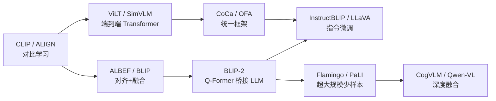

# VLM Zoo

> **70 个方法注册组 / 210 个注册 ID** --- 索引 2021-2025 年视觉语言方法时间线，每个标签有
> `tiny/small/base` 三档构建配置；不代表 70 个独立论文架构。

!!! warning "12 个代表路径为 compact；58 个标签仍是 baseline-alias"

    公共核心现已接收真实图像与 Token，并实现 dual encoder、single stream、cross-attention
    fusion 和 query-token bridge 四条计算路径；12 个直接对应这些机制的代表入口列为 `compact`。
    其余 58 个标签仍只映射到共享 mode/flag，不能视作命名论文模型复现。下表“标签所指创新”
    描述原方法，不表示共享实现已经包含全部机制；具体状态以
    [保真度审计](fidelity.md)和[baseline 清单](baseline-inventory.json)为准。

---

## CLI 快速上手

```bash
# 列出全部 210 个 VLM 注册 ID（`vlm:` 前缀）
python scripts/vlm_zoo.py --list

# 模糊搜索
python scripts/vlm_zoo.py --search llava

# 按年份查看演进时间线
python scripts/vlm_zoo.py --timeline

# 前向契约检查（`--smoke` 为兼容选项名）
python scripts/vlm_zoo.py --smoke vlm:clip_tiny
```

---

## 核心 20 个方法标签（2021-2023 演进主线）

| # | 方法标签 | 年份 | 标签所指创新 |
|:--|:------|:-----|:---------|
| 1 | CLIP | 2021 | 对比学习对齐 Image-Text，零样本迁移能力开创性突破 |
| 2 | ALIGN | 2021 | 大规模噪声 Image-Text 对训练，Dual Encoder 简洁架构 |
| 3 | ViLT | 2021 | 去除 Region Feature / CNN，纯 Transformer 处理视觉-语言 |
| 4 | SimVLM | 2021 | 简化 VLM 预训练，前缀语言模型 (PrefixLM) 统一目标 |
| 5 | ALBEF | 2021 | Align Before Fuse --- 先对齐再融合，动量蒸馏去噪 |
| 6 | LiT | 2022 | Locked-image Tuning --- 冻结预训练视觉编码器，仅训练文本侧 |
| 7 | BLIP | 2022 | Bootstrapping Language-Image Pre-training + CapFilt 噪声过滤 |
| 8 | CoCa | 2022 | Contrastive Captioners --- 对比学习 + 生成式 Caption 联合训练 |
| 9 | OFA | 2022 | 统一 Seq2Seq 框架，多模态多任务一个模型 |
| 10 | Flamingo | 2022 | 少样本多模态学习，Perceiver Resampler + Gated Cross-Attention |
| 11 | PaLI | 2022 | Pathways Language and Image，超大规模多语言多模态模型 |
| 12 | BLIP-2 | 2023 | Q-Former 桥接冻结视觉编码器与冻结 LLM，训练效率飞跃 |
| 13 | InstructBLIP | 2023 | 指令微调 BLIP-2，多任务指令跟随能力 |
| 14 | LLaVA | 2023 | Visual Instruction Tuning --- MLP 投影 + LLM 指令微调 |
| 15 | MiniGPT-4 | 2023 | 一层线性投影对齐视觉编码器与 Vicuna LLM |
| 16 | Kosmos-2 | 2023 | Grounded Multimodal LLM --- 文本生成 + 目标定位联合 |
| 17 | mPLUG-Owl2 | 2023 | Modality-Adaptive Module 实现多模态协作 |
| 18 | CogVLM | 2023 | Visual Expert Module 注入 LLM 每一层，深度视觉融合 |
| 19 | PaLI-X | 2023 | Scaling up PaLI 至 55B，多任务多语言 SOTA |
| 20 | Qwen-VL | 2023 | 高分辨率视觉编码 + 多粒度文本理解，中英双语 |

---

## 2024-2025 扩展方法标签

在上述 20 个核心标签之外，Zoo 还收录 50 个 2024-2025 年方法标签，覆盖文档理解 / OCR、
图表与科学图像、网页与界面理解、视频、多模态代理和端侧推理等时间线方向。

> 完整列表与变体见 `python scripts/vlm_zoo.py --list`，按年份浏览用 `--timeline`。

---

## 演进脉络



---

## 方法标签分类

### 对比学习 (Contrastive Learning)

以 Image-Text 对比损失为核心的双塔模型。

| 方法标签 | 论文视觉编码器 | 论文文本编码器 | 标签所指特点 |
|:------|:----------|:----------|:-----|
| CLIP | ViT / ResNet | Transformer | 零样本迁移基线 |
| ALIGN | EfficientNet | BERT | 18 亿噪声数据训练 |
| LiT | ViT (冻结) | Transformer (可训练) | 仅微调文本侧 |

### 对齐 + 融合 (Align & Fuse)

先对齐表示空间，再通过 Cross-Attention 深度融合。

| 方法标签 | 论文核心机制 | 标签所指特点 |
|:------|:---------|:-----|
| ALBEF | Momentum Distillation | 动量蒸馏 + ITC/ITM/MLM |
| BLIP | CapFilt | 噪声 Caption 自动过滤 |
| CoCa | Contrastive + Captioning | 双目标联合优化 |

### 桥接 LLM (Bridge to LLM)

将预训练视觉编码器与冻结 LLM 高效连接。

| 方法标签 | 论文桥接方式 | 论文 LLM |
|:------|:---------|:----|
| BLIP-2 | Q-Former | OPT / FlanT5 |
| Flamingo | Perceiver Resampler | Chinchilla |
| LLaVA | MLP Projection | LLaMA / Vicuna |
| MiniGPT-4 | Linear Projection | Vicuna |

### 指令微调 (Instruction Tuning)

通过多任务指令数据增强模型的跟随能力。

| 方法标签 | 论文基座 | 论文关键数据 |
|:------|:-----|:---------|
| InstructBLIP | BLIP-2 | 多任务指令数据集 |
| LLaVA | LLaMA | GPT-4 生成的视觉指令数据 |
| Qwen-VL | Qwen | 多粒度中英指令数据 |

---

## 用法示例

```bash
# 构建并前向验证任意注册标签的任意配置
python scripts/vlm_zoo.py --smoke vlm:clip_tiny
python scripts/vlm_zoo.py --smoke vlm:agent_vl_tiny
```
